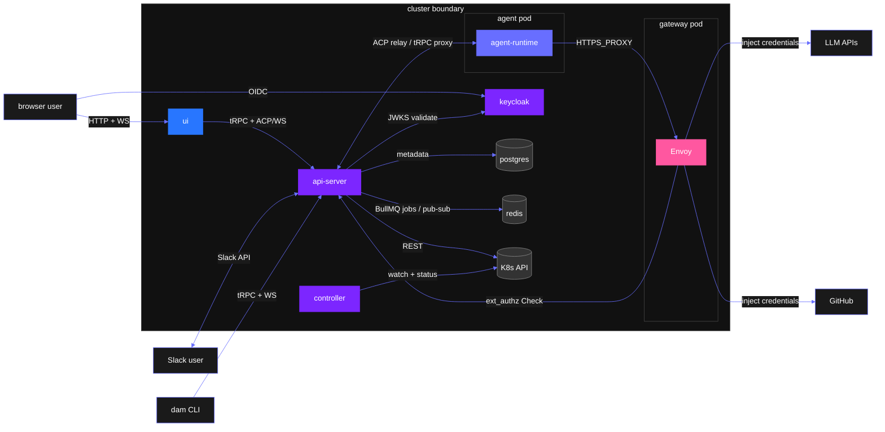

  <picture>
    <source media="(prefers-color-scheme: dark)" srcset="docs/assets/dam-logo-custom.png" />
    <source media="(prefers-color-scheme: light)" srcset="docs/assets/dam-logo-custom.png" />
    
  </picture>

<h3 align="center">
The platform for AI-powered research.   <a href="https://ibm.biz/dam-docs"><strong>Read the docs</strong></a>.
</h3>

---

## DAM combines research tools with AI infrastructure to enable immediate, impactful results. 

IBM's teams have proven the efficacy of implementing AI tools for research, from building ["agent factories" for hardware optimization](https://arxiv.org/abs/2603.25719) to developing [evolutionary frameworks to find quantum error correction codes](https://research.ibm.com/blog/ai-for-qec). **DAM packages all the tools research teams need to access those benefits in minutes, avoiding the lift of building bespoke tooling**.

- **🔬 Evolve code.** Experiments are scaffolded nativley from a library of re-usable loop templates, patterns and techniques proven to deliver results. 

- **☁️ Runs in the cloud.** Workloads execute continuously, executing even when you're away, accesiable via a Web UI, CLI, or Slack integration.

- **🔐 Secure sandboxes.** Each agent runs in an isolated container with all access routed through a policy-enforced gateway. Agents connect to tools without exposing credentials to the runtime.

- **👥 Built for teams.** Collaborate in Slack, share artifacts, and contribute to shared findings.

- **🧠 Knowledgeable decisions.** Memory sources such as LLM Wikis on-the-fly MCP servers ensure agents start smart and experiments can capture and learn from their findings.

- **⏱️ Scheduled workflows.** Beyond agentic loops, workflows can run on a deterministic timers for tasks such as daily code reviews, nightly audits, codebase health monitoring.

- **🔧 Constantly growing.** DAM is always updating to meet our researchers' needs. If there's a feature, framework, or workflow you'd like to see included, [let us know](https://ibm.enterprise.slack.com/archives/C0B3F03NB24).

## Architecture

The cluster boundary is the trust boundary. Browsers, Slack users, and the CLI all reach the platform through the **[api-server](docs/architecture/platform-topology.md)**, which brokers sessions, relays the [ACP WebSocket protocol](docs/architecture/connections.md) to agent pods, and enforces identity via Keycloak. The **[controller](docs/architecture/agent-lifecycle.md)** watches Kubernetes and drives the agent [create → wake → trigger → hibernate → delete](docs/architecture/agent-lifecycle.md) lifecycle, including [compute budget enforcement](docs/architecture/budgets.md). Each agent pod is paired with a **[gateway pod](docs/architecture/security-and-credentials.md)** running Envoy: all outbound LLM and GitHub traffic is forced through it via `HTTPS_PROXY`, where credentials are injected from K8s Secrets — the agent pod carries no upstream tokens of its own. Agent [skills](docs/architecture/skills.md), [experiments](docs/architecture/experiments.md), [artifacts](docs/architecture/artifact-library.md), and [channels](docs/architecture/channels.md) (Slack, Telegram) are first-class subsystems built on this foundation. Full architecture detail lives in [`docs/architecture.md`](docs/architecture.md).
