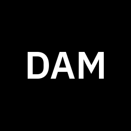

<p align="center">
  <picture>
    <source media="(prefers-color-scheme: dark)" srcset="docs/assets/dam-light.svg" />
    <source media="(prefers-color-scheme: light)" srcset="docs/assets/dam-dark.svg" />
    
  </picture>
</p>

<h3 align="center">
  Run agent harnesses like Claude Code headless in the cloud.
</h3>

<p align="center">
  <a href="https://ibm.biz/dam-docs"><strong>Documentation</strong></a>
  ·
  <a href="https://ibm.biz/dam-agents"><strong>Launch DAM</strong></a>
  ·
  <a href="https://ibm.biz/dam-waitlist"><strong>Join the Waitlist</strong></a>
</p>

---

## Why DAM?

- **☁️ Runs in the cloud.** Agents keep running after you close your laptop or go offline.
- **🔐 Zero trust credentials.** Connect agents to your tools without exposing credentials to the runtime.
- **👥 Built for teams.** Collaborate with shared agents in Slack using your own accounts and permissions.
- **⏱️ Autonomous execution.** Run agents on schedules for reviews, audits, monitoring, reporting, and recurring tasks.

---

## Ways to Use DAM

| Mode | Description |
|---|---|
| **Web UI** | Browser-based chat, terminal streaming, logs, and native agent TUI access |
| **CLI** | Create, manage, and attach to agents directly from your terminal |
| **Slack** | Interact with agents collaboratively through Slack threads |
| **Schedules** | Trigger autonomous agent runs on recurring timers |

---

## Supported Agent Harnesses

| Harness | Description |
|---|---|
| **Claude Code** | General-purpose coding, debugging, refactoring, and review |
| **Pi Agent** | Multi-model coding across GPT-4, Gemini, Mistral, and more |
| **Bob** | IBM's general-purpose AI shell with tenant scoping |
| **Codex** | OpenAI-powered coding with compatible endpoints |

Bring your own harness — any runtime compatible with [ACP](https://agentclientprotocol.com/get-started/introduction) can run on DAM.

---

## Get Started

Head to [ibm.biz/dam-agents](https://ibm.biz/dam-agents), create an instance from a template, and start chatting. See the [documentation](https://ibm.biz/dam-docs) for quickstarts, core concepts, integration guides, and use cases.

---

<details>
<summary><strong>Developing DAM locally</strong></summary>

For contributors working on the DAM platform itself.

### Prerequisites

- [mise](https://mise.jdx.dev)
- Docker-compatible runtime (Docker Desktop, Rancher Desktop, etc.)
- macOS or Linux

### Local Setup

```sh
git clone https://github.com/dam-agents/dam && cd dam

mise install
mise run cluster:install
````

Open [localhost:4444](http://localhost:4444) and log in with:

```txt
username: dev
password: dev
```

Create an instance from a template and start chatting with your agent.

See [work process](docs/guidelines/work-process.md) for the contributor workflow.

</details>
