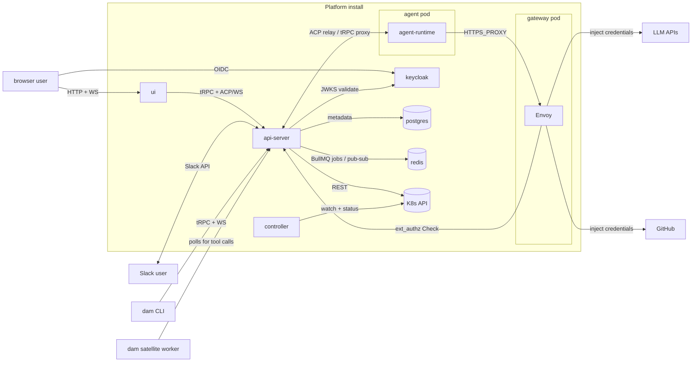

# Architecture

Last verified: 2026-09-24

## System context

The cluster boundary is the trust boundary. Browsers and Slack users reach Platform through the api-server; LLM and GitHub traffic from the agent always exits through the paired gateway pod, where Envoy injects credentials from K8s Secrets mounted on the gateway only. The agent pod's NetworkPolicy admits no path to TCP 80/443 other than the paired gateway, so credential injection is enforced by Kubernetes — not by the agent honoring `HTTPS_PROXY`. The agent pod has no service-account credentials and no upstream tokens of its own.

## Subsystems

- [platform-topology](architecture/platform-topology.md) — the long-lived components (controller, api-server, agent-runtime, ui, and the VM runner), the protocols between them, and the K8s resource model.
- [vm-runner](architecture/vm-runner.md) — the `vm` Backend's per-owner machine host; its [image cache](architecture/vm-image-cache.md).
- [agent-images](architecture/agent-images.md) — what agents run in: a `mise oci` Debian base; one environment per harness.
- [agent-lifecycle](architecture/agent-lifecycle.md) — create → wake → trigger → hibernate → delete.
- [schedules](architecture/schedules.md) — recurring work on an Agent: arming and firing occurrences, the Precheck that declines a fire before any model wakes, and the Session each fire opens.
- [budgets](architecture/budgets.md) — per-user ceiling on concurrently reserved compute, enforced by the controller at the 0→1 scale transition; UserBudget CRs for privileged users.
- [persistence](architecture/persistence.md) — the storage substrates (Postgres, custom resources, per-Agent PVC, the VM runner volume) and what survives each lifecycle event.
- [security-and-credentials](architecture/security-and-credentials.md) — Keycloak identity, Envoy credential gateway, K8s-Secret credential storage, ext_authz HITL, network boundary.
- [channels](architecture/channels.md) — Slack and Telegram adapters inside the api-server, bindings, ambient mode, identity linking.
- [channel-turns](architecture/channel-turns.md) — a channel message becoming an agent turn: inbound relay, outbound tools, the liveness watch, delivery recovery.
- [public-agent-page](architecture/public-agent-page.md) — the one unauthenticated surface, reached from the Slack Agent Footer: a conversion page that names a channel-bound Agent and its owner, rather than a dead end.
- [cli](architecture/cli.md) — `dam` command-line client, an npm-distributed Node package that points at a configured Platform deployment.
- [satellites](architecture/satellites.md) — MCP servers on machines outside the cluster: a polled queue, tools re-exposed to the agent scoped by machine, and the jobs it starts against them.
- [skills](architecture/skills.md) — the skills catalog: connectable git-based skill sources, per-Agent install records, reusable named selections a user carries between agents, publish back as a PR.
- [agent-skills](architecture/agent-skills.md) — the pod-local half: which skill files sit on one agent, the provenance verdict each carries, and the agent-runtime surface that mutates them behind Envoy credential injection.
- [starter-kits](architecture/starter-kits.md) — a proven way of working applied to a new agent — its connections, channels, schedules and onboarding step — read from git-hosted catalogs, never from cluster state.
- [connections](architecture/connections.md) — unified Connection / Contribution model: templates, grants, credentials, and which rail each Contribution kind takes.
- [runtime delivery](architecture/runtime-delivery.md) — runtime channel between api-server and agent-runtime, transactional outbox + worker delivery, one-shot events, agent-side driver model.
- [harness configuration](architecture/harness-config.md) — the Config panel's model/mode/config defaults: how one choice reaches the harness's own file, where the model list is discovered, and what renders while the agent is stopped.
- [experiments](architecture/experiments.md) — driver-authored loop scripts observed live: a declared skeleton, a trace of scored spans, and versioned script artifacts. No GUI today; created over the API.
- [knowledge-bases](architecture/knowledge-bases.md) — agents marked as knowledge bases that bootstrap their own knowledge tooling from a one-shot install instruction and are worked with through chat.
- [home-feed](architecture/home-feed.md) — what Home shows since you last looked: a per-owner attention record kept server-side, so hibernated agents still report.
- [artifact-library](architecture/artifact-library.md) — agents and users publish work products into an owner-scoped library and share them by link — with anyone, or with a named list of viewers who sign in.
- [case-studies](architecture/case-studies.md) — agents write sanitized weekly accounts of their own use case: the skill that produces them, and the edition store the owner releases them from.
- [features](architecture/features.md) — per-user experimental-feature flags: server-stored, default off, gating pre-release surfaces (progressive disclosure, not authorization).
- [usage-tracking](architecture/usage-tracking.md) — append-only activity log in Postgres, SQL views as the read interface, HMAC-pseudonymized identifiers, inspector-role gating.
- [agent-telemetry](architecture/agent-telemetry.md) — the user-facing read path over raw agent traces and log records — what an agent actually did in an exchange — scoped to the agents you own.
- [metrics](architecture/metrics.md) — the user-facing spend read path behind the global and per-agent Usage surfaces: how much the agents you own have spent.
- [logging](architecture/logging.md) — Pino structured logging to stdout, and the real-identity security audit trail built on it (the forensic counterpart to pseudonymized usage-tracking).
- [observability](architecture/observability.md) — the optional, bundled agent-telemetry backend: an OTLP collector writing OpenTelemetry signals into a columnar store with an exploration UI, gated by the mesh rather than ingestion tokens.
- [supply-chain](security/supply-chain.md) — how each external dependency type is scanned for CVEs and defended against supply-chain attacks.
- [code](security/code.md) — CodeQL SAST and pre-commit hardening.
- [secrets](security/secrets.md) — GitHub secret storage, scanning, and push protection.
- [gaps](security/gaps.md) — known security gaps tracked as future work.

## Strategy

Higher-level documents that frame *what* Platform is trying to be, separate from how the current system is built:

- [Multiplayer model](strategy/multi-player.md) — what's private to each user, what's shared via channels, and what's install-wide plumbing.
- [Security model](strategy/security-model.md) — the three structural risks of running AI agents, and which ones Platform addresses today.

