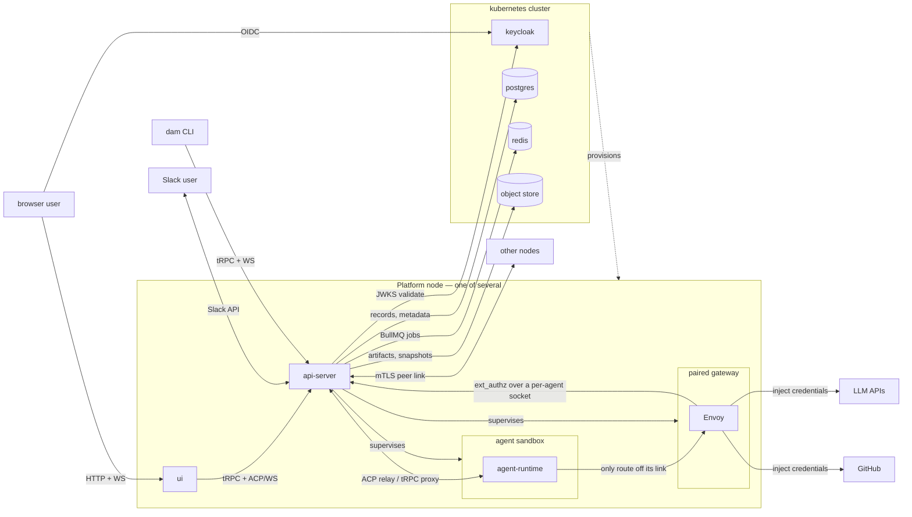

# Architecture

Last verified: 2026-09-13

## System context

Platform is a **handful of nodes**: each a machine running one api-server that
supervises the agents placed on it, in gVisor sandboxes, directly. Shared
services live in a Kubernetes cluster that no agent reaches and that also
provisions the node VMs — Kubernetes orchestrates nodes, never agents. A
scheduler on one node places each agent; a request for an agent held elsewhere
is forwarded over a peer link, so the install answers as one. Browsers and
Slack users reach Platform through whichever node they land on; LLM and GitHub
traffic from an agent always exits through its paired gateway, where Envoy
injects credentials readable only by that gateway.

Egress isolation is **topological**: a sandbox's network namespace holds one
point-to-point link and no default route, so its paired gateway is the only
address it can name. Credential injection is enforced by the kernel's routing
table, not by the agent honoring `HTTPS_PROXY`. The sandbox holds no
credential of its own, and the control-plane sockets it reaches the api-server
through are named per agent and readable only by its gateway.

## Subsystems

Each page is the authoritative, self-contained description of its subsystem — what it looks like today and why it is shaped that way.

- [platform-topology](architecture/platform-topology.md) — the long-lived components (api-server, agent-runtime, gateway, ui), the protocols between them, and the node's resource model.
- [nodes](architecture/nodes.md) — registration and liveness, the scheduler placing agents onto nodes, cordoning, the peer link, and workspaces that follow the agent.
- [agent-lifecycle](architecture/agent-lifecycle.md) — create → wake → trigger → hibernate → delete; per-schedule sessions.
- [budgets](architecture/budgets.md) — per-user ceiling on concurrently reserved compute, enforced when a sandbox starts; per-user overrides for privileged users.
- [persistence](architecture/persistence.md) — the substrates (Postgres and the object store in the cluster, the per-agent directory on a node) and what survives each lifecycle event.
- [security-and-credentials](architecture/security-and-credentials.md) — Keycloak identity, the paired Envoy credential gateway, install-wide credential storage, ext_authz HITL, the sandbox network boundary.
- [channels](architecture/channels.md) — Slack and Telegram adapters inside the api-server, inbound relay, outbound MCP tool, identity linking.
- [public-agent-page](architecture/public-agent-page.md) — the one unauthenticated app-origin surface, reached from the Slack Agent Footer: names a channel-bound Agent and its owner off a Postgres projection, one generic page for everything else.
- [cli](architecture/cli.md) — `dam` command-line client, an npm-distributed Node package that points at a configured Platform deployment.
- [skills](architecture/skills.md) — the skills catalog: connectable git-based skill sources, per-Agent install records, reusable named selections a user carries between agents, publish back as a PR.
- [agent-skills](architecture/agent-skills.md) — the sandbox-local half: which skill files sit on one agent, the provenance verdict each carries, and the agent-runtime surface that mutates them behind Envoy credential injection.
- [connections](architecture/connections.md) — unified Connection / Contribution model: templates, grants, credentials, and which rail each Contribution kind takes.
- [runtime delivery](architecture/runtime-delivery.md) — runtime channel between api-server and agent-runtime, transactional outbox + worker delivery, one-shot events, agent-side driver model.
- [harness configuration](architecture/harness-config.md) — the Config panel's model/mode/config defaults: how one choice reaches the harness's own file, where the model list is discovered, and what renders while the agent is stopped.
- [experiments](architecture/experiments.md) — driver-authored Python loop scripts observed live: declared skeleton + trace of scored spans, versioned script artifacts, dashboard-artifact live view. GUI surfaces hidden pending a rethink; created over the API.
- [knowledge-bases](architecture/knowledge-bases.md) — agents marked as knowledge bases that bootstrap their own knowledge tooling from a one-shot install instruction and are worked with through chat.
- [artifact-library](architecture/artifact-library.md) — agents and users publish artifacts (HTML/JSX/markdown/code/files) into an owner-scoped library and share them by link — to anyone, or to a named list of viewers who sign in — across a dedicated share host and content host, with folders, a retention date, and versions.
- [case-studies](architecture/case-studies.md) — the agent-case-study skill and the edition store behind it: agents write sanitized weekly accounts of their own use case, submitted as owner-only pending editions that the owner releases to inspector-gated read surfaces.
- [features](architecture/features.md) — per-user experimental-feature flags: server-stored, default off, gating pre-release surfaces (progressive disclosure, not authorization).
- [usage-tracking](architecture/usage-tracking.md) — append-only activity log in Postgres, SQL views as the read interface, HMAC-pseudonymized identifiers, inspector-role gating.
- [metrics](architecture/metrics.md) — the user-facing spend read path: owner-scoped tRPC reads over the telemetry store backing the global and per-agent Usage surfaces, failing closed when the backend is disabled.
- [logging](architecture/logging.md) — Pino structured logging to stdout, and the real-identity security audit trail built on it (the forensic counterpart to pseudonymized usage-tracking).
- [observability](architecture/observability.md) — the optional, bundled agent-telemetry backend: an OTLP collector writing OpenTelemetry signals into a columnar store with an exploration UI, reachable only from the node rather than gated by ingestion tokens.
- [supply-chain](security/supply-chain.md) — how each external dependency type is scanned for CVEs and defended against supply-chain attacks.
- [code](security/code.md) — CodeQL SAST and pre-commit hardening.
- [secrets](security/secrets.md) — GitHub secret storage, scanning, and push protection.
- [gaps](security/gaps.md) — known security gaps tracked as future work.

## Strategy

Higher-level documents that frame *what* Platform is trying to be, separate from how the current system is built:

- [Multiplayer model](strategy/multi-player.md) — what's private to each user, what's shared via channels, and what's install-wide plumbing.
- [Security model](strategy/security-model.md) — the three structural risks of running AI agents, and which ones Platform addresses today.

