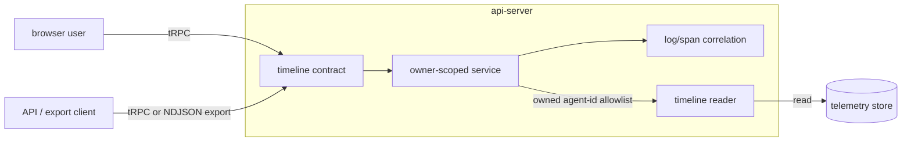

# Agent Timeline (trace and log read path)

Last verified: 2026-09-14

## Overview

The **agent timeline** is the user-facing read path over the raw signals an agent
produced: the **Telemetry Traces** it emitted, the **Telemetry Spans** inside each one, and
the **Telemetry Log Records** those spans carry. It answers *what did my agent actually do,
and where did the time and money go inside one turn* — the structural counterpart to
[metrics](metrics.md), which answers *how much have my agents spent*.

Both read the columnar telemetry store that [observability](observability.md) fills, and
both scope every read to the agents the caller owns. They are separate subsystems because
they answer different questions and hold **opposite invariants on emptiness**: an empty
spend read would misreport a bill as zero, so metrics fails closed; an empty timeline read
is a legitimate answer — this agent produced no telemetry in this window — so the timeline
reports availability as a value and never turns "nothing happened" into an error.

The subsystem is the **api-server's** responsibility end to end. It is a thin owner-scoped
reader in front of the telemetry store; the controller and agent-runtime do not participate.

## What a trace is here

A **Telemetry Trace** is every record sharing one trace identifier, across *both* the span
table and the log table. It is deliberately not "the spans of a trace": the harness's span
export is a beta surface whose shape moves between releases, while its per-call log records
have carried a trace identifier since the spend read path was built. Defining the unit
across both tables means the surface degrades rather than disappears — with no spans, a
trace is still a correlated, time-ordered set of records for one turn.

For the Claude Code rail a trace corresponds to **one turn**: a root interaction span per
prompt, with model-call and tool spans beneath it, and a subagent's work nesting under the
tool span that spawned it. A Session is therefore *many* traces, correlated by the session
attribute the spans carry — which is what the surface filters on when narrowing to a
Session. Other rails differ, and the read path assumes none of this: it groups by trace
identifier and names the root by whatever span has no parent.

## Correlating a log record to the call it describes

The purpose of the surface is to show, on the bar for a model call, what that call cost.
Two facts make that harder than it looks, and together they decide the design:

- The **cost is only on the log record**. A model-call span carries token counts; the
  per-call currency figure exists on the record alone, so the two must be joined for a
  waterfall to show spend at all.
- The record's own span identifier points at the **enclosing** span — the turn, or the tool
  being run — not at the model call. The harness creates the call span but never makes it
  the active one, so a record emitted during the call names its parent instead.

The join therefore prefers a **request identifier** the harness stamps identically on the
record and on the call span. Attachment resolves in three steps and every step renders:
by request identifier onto the exact call; failing that, by the record's own span
identifier onto its enclosing span; failing that, to the trace itself, positioned on the
timeline by its timestamp. **Which step was used travels in the response**, so a consumer
can tell an exact attachment from an approximate one instead of trusting a position it
cannot verify. The fold happens in the service layer, above the store and below the
contract, so the API and the UI see one correlated tree and the rule has one place to be
tested.

## Ownership scoping

Every read is gated on the trusted, gateway-stamped owner attribution attribute and
nothing else — never the service name, which carries the agent's Template, and never an
owner field inside a record body, which is present on platform records that carry no owner
scoping of their own. Scope resolves in the service layer, above the store: the service
turns the caller's owned agents into an allowlist and hands the reader ids alone. Naming an
agent the caller does not own yields an empty allowlist, and an empty allowlist returns no
rows without issuing a query. The owned set is the same live-plus-historical union
[metrics](metrics.md#ownership-scoping) resolves, so a deleted agent's telemetry stays
readable for as long as the store retains it.

**Only agent-attributed records are served.** The platform's own components emit spans onto
the same traces — the gateway hop and the api-server work behind a model request — and
those records carry no owner attribution. They are excluded, so a trace shows what the
agent did and not what the platform did around it. Two reasons, either sufficient: a record
without owner attribution is not provably platform-produced, and the unattributed set also
holds the platform's operational log stream, which carries real identities that owner
scoping never governed. Serving the platform side of a trace is a later step that depends
on provenance being positively established at ingest rather than inferred from an absence.

A trace with no records the caller owns is reported as **not found** rather than refused,
so the surface never confirms the existence of a trace the caller cannot read.

## Reading the store

The reader is the only component in this subsystem that speaks to the telemetry store; it
shares the store connection with the spend reader rather than opening its own. Every read
is **bounded by a window in the contract**, capped at the store's retention, because the
span table is ordered for service-and-name scans rather than trace lookups — an unbounded
lookup by trace identifier leans entirely on a probabilistic index whose cost grows with
the whole retention. Opening one trace narrows the window further from the start time the
listing already returned. Beyond the window, each query carries execution-time and
rows-read ceilings and **fails rather than truncating silently**, since a short answer
rendered as complete is the failure worth designing against. Where a cap does bind, the
response says so and the surface reports it.

Spend per trace is read from the log side and merged with the span side in the service, so
neither query has to span two tables.

## Contract

Three owner-scoped reads, all query-only, all narrowing to a single owned agent on request
and to a Session within it. The field-level shapes live in the contract package
[`packages/api-server-api/`](../../packages/api-server-api/).

- **Traces** — the listing for an agent over a window: each trace's root name, when it
  started, how long it took, how many spans and errors it holds, which Sessions it touched,
  and what it cost.
- **Trace** — one trace in full: its spans, its log records, and the resolved attachment
  between them.
- **Log records** — a flat read across traces, filtered by Session, by event, or by a text
  match over the record and its attributes; the way to answer *what did my agent do* without
  starting from a trace.

Every read answers either an availability failure or a result, never an error for an empty
window — see the emptiness invariant above.

### Bulk export

A separate authenticated route streams the same owner-scoped records as newline-delimited
JSON, one object per line, for spans or for log records over a window. It exists because
the point of the subsystem is that a user can take their agents' telemetry elsewhere, and a
typed query response is the wrong shape for that. It is bounded by a row cap and says so in
the response when the cap binds.

## Progressive disclosure

The in-product surface is **scoped to a Session and lives beside the conversation**, in the
chat view's docked panel, reached from the Session's own menu. That placement follows from
what the surface answers: *what did this piece of work do*, asked while looking at the work.
An agent-wide browser over every Session is a different question and is not built — the
export covers the cross-Session case for now.

The panel is revealed by an experimental feature ([features](features.md)); the procedures
themselves stay open to any authenticated owner. The flag is disclosure, not authorization —
the raw view is deliberately structural, and the designed diagnostic experience it feeds is
separate work. The API and the export are therefore usable before the panel is revealed.

## Disabled backend

The telemetry store is optional and off by default. With no store configured the service is
wired to an **unavailable** variant that reports its unavailability as a value with a
reason, rather than throwing. This is the deliberate inverse of the spend path's
fail-closed posture, for the reason given in the overview, and it also serves the
programmatic consumer, which needs to record "telemetry is not measured on this install"
and carry on. Both variants are chosen once at composition time.

## Trust story

Inherited whole from the export path: **attribution is unforgeable, content is
self-reported**. The owner attribution every query filters on is stamped by the agent's
paired gateway and sanitized at ingest, so an agent can pollute only its own telemetry. The
records themselves — durations, span names, token and cost counters — are what the agent
exported, and this path reports them without independent verification. See
[observability — trusted attribution](observability.md#trusted-attribution) for the
mechanism and its current limits.

One consequence is worth stating plainly because this surface makes it visible for the
first time: an agent bound to a Channel is driven by whoever the messenger admits, and
those turns are attributed to the agent's owner. The owner therefore reads structural
detail — tool names, call sequencing, timings — about work a third party asked for.
Message content is not exported and so is not shown, but the behaviour is.
