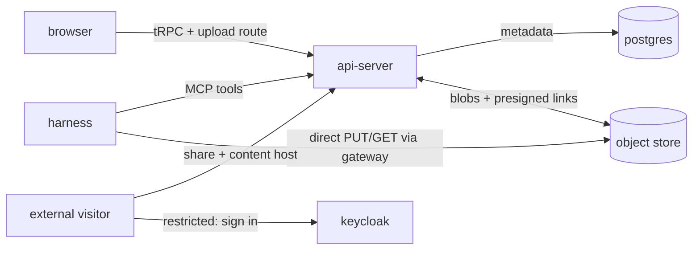

# Artifact library

Last verified: 2026-09-03

## Overview

The **Artifact Library** is where agents and users publish work products —
HTML pages, React/JSX components, markdown, code, plain text, and binary
files — organize them into **Folders**, and share them with people outside
the platform. An **Artifact** is owner-scoped like every other resource, is
attributed to the Agent that published it (or to the user, for manual
uploads), and outlives both the sandbox and the agent that produced it.
Publishing a new revision keeps the same identity and share link and appends
to a per-artifact **version history** viewers can flip through. The history
holds every version including the current one — creation writes the first row,
each revision writes its own — and a version records the session that
produced it when one is known, which is how the Home feed shows an artifact on
the card of the session that made it. The session becomes known after the
fact: the platform's artifact tools mark their results, the agent-runtime
spots the marker in the session's ACP stream — frames it already proxies,
each carrying its session id — and reports the touch over its runtime
channel. The write is scoped to the calling agent's own artifacts and never
overwrites another session's attribution, so a failure anywhere leaves a
version unattributed rather than misattributed. Terminal sessions bypass ACP
and stay unattributed. Concurrent revision publishes are
detected — one wins, the other is refused with a conflict and leaves no
partial version behind.

An artifact's **kind is settled when it is created** and no revision can move
it — neither by declaring one nor by renaming into another extension. The
share link outlives every revision, so a mutable kind would let a URL vetted
while it served inert text later serve executing HTML or JSX to the same
audience; publishing executable content is fine, silently changing what an
already-shared link *does* is not. It also keeps a version history coherent,
since every version renders through the artifact's one kind. Title and file
name stay editable, and both describe the whole artifact rather than one
revision: the history snapshots bytes, so a past version downloads under the
artifact's current name.

The design is a port of a proven external tool (the "slop" artifact vault)
onto platform rails: content bytes live in the S3-compatible object store
([persistence](persistence.md)), metadata lives in Postgres, the agent-facing
surface is the per-agent platform MCP server, and by-link serving happens on
two dedicated hosts — a **share host** for the pages and a **content host** for
the framed artifact itself.

## Sharing model

**Visibility** is one field with three values, and the share link — a URL on
the share host keyed by an unguessable random **slug** — is the same for the
two that have one, so switching between them never changes the link.

- An artifact is **private** by default: visible in-app only, no link.
- **Restricted** opens the link to a named group. The owner keeps a **viewer
  allowlist** of email addresses — emails, not user ids, because a listed
  person may exist only in the identity provider and never have signed in to
  the platform. A visitor is asked to sign in with the platform's identity
  provider; the artifact renders when the verified email from that sign-in
  matches a listed one (normalised once, at the boundary: trimmed and
  lowercased), or when the visitor is the owner. Anyone else lands on a plain
  no-access page naming the email they signed in with and offering to switch
  account; it shows neither the title nor the owner. Here the slug only
  *locates* the artifact — the share session authorizes. Only a person sets
  restricted, in the Share dialog: agent tools offer private and public, and
  refuse any sharing change on an artifact that is already restricted, so an
  agent can neither widen a restricted link nor edit who is on it.
- **Public** opens the link to anyone. For a public artifact the slug is the
  *entire* access control: there is no account, token, or password on the
  public side — whoever holds the link may view, and guarding the link is the
  sharer's responsibility (deliberately: a second factor sent alongside a
  leaked link leaks with it).
- An optional **retention** date bounds the *artifact's* lifetime — it schedules
  permanent deletion, not link expiry, and applies regardless of visibility (a
  private artifact is deleted the same way; storage lifecycle is a separate
  concern from sharing). On the public side, a past-due link answers "gone"
  (with a distinct "scheduled for deletion" page during a grace window in which
  the owner can still restore it by choosing a new date); once the grace window
  passes, a background sweep hard-deletes the content.
- A folder has a public page of its own, listing only the *public* artifacts
  inside it — restricted ones never appear there, since the page itself has no
  viewer; a folder with nothing public is indistinguishable from a nonexistent
  one.
- Each successful share-page render increments a per-artifact **view count**,
  surfaced in-app as a cheap reach signal.

## The share host — trust boundary

User-generated content is never served from the app origin. Two dedicated
by-link hosts (separate subdomains, both mandatory, wired through the cluster
ingress and configured via Helm) carry it:

- The **share host** serves *only* the by-link surfaces — share pages and
  their source download, folder pages, the share sign-in routes, and the
  read-only knowledge-base MCP endpoint — never an app route.
- The **content host** serves *only* the framed artifact document and its raw
  bytes. It has no cookie, no sign-in, and no page of its own, so there is
  nothing on that origin for artifact code to act as.

The api-server host-gates every request before any app route or auth
middleware: requests for the share host go to a self-contained share-host app
— the artifact viewer, share sign-in, plus the read-only
[knowledge-base MCP endpoint](knowledge-bases.md#sharing) under `/mcp/kb` —
requests for the content host go to the content app, and everything else
falls through to the platform surface. The app origin shares nothing with
either by-link origin — no cookie, no token — so a malicious artifact cannot
reach Keycloak tokens, the tRPC surface, or app cookies, because none of them
exist on its origin.

**Share session.** A restricted artifact needs a viewer identity on the share
host, and that identity is deliberately not the app's. The share host signs
the visitor in through a second, dedicated public Keycloak client
(authorization code with PKCE, asking only for the email scope, see
[identity](security-and-credentials.md#identity)). Its redirect is pinned to
the share host's callback and its tokens carry no api audience, so a token
minted for it is useless against the api-server. The code is redeemed
server-side and no token ever reaches the browser: the browser holds an opaque
session id in an `HttpOnly` cookie scoped to the share origin, pointing at a
Redis-held session that carries the subject, the email and whether the
provider verified it, and a fixed lifetime. Signing out ends both that session
and the identity provider's, so "switch account" on the no-access page really
switches. Every restricted response is marked private and uncacheable so no
shared cache replays it to the next visitor.

**The artifact frame.** A share page is two documents from two origins. The
outer page, on the share host, is platform chrome (title banner, version
navigation, source download); the inner document is the user content, loaded
from the content host in an iframe. The browser's same-origin rule is the
boundary: artifact code runs as the content origin, so it can neither read the
share session cookie nor call the share host as the signed-in viewer. The
sandbox attribute stays as a second layer but is no longer what holds the
line. The content host agrees to be framed only by the share origin, and
serves raw bytes under a sandbox directive so a document opened directly
cannot run either.

The content host cannot see the share session, so a restricted frame carries
a **render token**: minted by the share page for exactly one artifact and
version after the viewer passed, valid for one minute, redeemed by the
content host on the document and on its raw bytes. It is a short-lived,
single-purpose grant — not a session and not an identity; after its minute a
pasted frame address answers unauthorized. A public frame needs no token, and
the source download on the share host never does: it is gated by the share
session like the page itself.

Rendering is entirely client-side — the server never compiles or sanitizes
user content, it only wraps it:

- **HTML** renders as authored (links retargeted to open new tabs).
- **JSX** is transformed in the visitor's browser (babel-standalone) with
  dependencies resolved from public CDNs via an import map pinned to the
  versions Claude-style artifacts expect (react, recharts, d3, three, …).
- **Markdown** renders client-side through a sanitizer; **code and text**
  render as highlighted source.
- **Images** preview inline; other binaries get a download page. Raw bytes
  are served inline only for images — everything else is download-only, so
  no user-controlled document can execute on either by-link origin *outside*
  the frame.

The viewer sends conservative headers (no-referrer, nosniff, framing pinned
to the share origin) but deliberately no restrictive content CSP: the
dedicated content origin plus the sandbox attribute are the actual
isolation.

Blob bytes relay through the api-server with constant memory: raw views
stream store → response without ever buffering the object (the store is
deliberately never exposed to the public side — no presigned links leave
this origin), page renders buffer only size-capped text sources (anything
bigger falls back to the download card), and the public folder listing is
bounded. What remains on the api-server per public view is bounded work: a
small HTML wrapper, an indexed slug lookup, and pass-through bandwidth.

The viewer runs inside the api-server process — a deliberate, accepted
trade-off for now rather than an oversight: origin isolation is real, but
the event loop and DB pool are shared with the control plane. The viewer
keeps its dependency surface minimal (metadata reads, blob reads) exactly
so it can move into its own deployment when sustained public traffic
warrants it; it lives in the api-server today because the planned
agent-calling bridge for interactive artifacts needs the relay machinery
that already lives there.

## Publishing and download paths

- **Agents** publish through artifact tools on the per-agent platform MCP
  server (the same in-pod outbound surface as channels, skills, and
  schedules). Small text content travels inline; anything bigger takes
  the **direct-transfer** path: the tool
  mints a short-lived presigned upload link, the harness PUTs bytes straight
  to the store through its paired gateway, and the create call references the
  completed upload. The platform verifies the upload (existence, size cap)
  before the artifact row lands, and an upload reference outside the caller's
  own staging namespace reads as unknown. Attribution is the mesh-verified
  agent identity — a harness cannot publish as another agent, and the
  owner-scoped service means it can only ever touch its owner's library.
  Reads mirror this: small text content returns inline, and a download tool
  mints a short-lived presigned link — signed for the same agent-dialed
  store authority — that the harness GETs straight into its sandbox (any
  kind or size, current or a past version), so work products published from
  one sandbox are consumable in another without transiting the conversation.
- **Users** publish from the Artifacts page in the UI: bytes go through an
  authenticated upload route on the app origin (avoiding browser↔store CORS),
  then the same create call. Downloads answer with a presigned direct link
  when the store has a browser-reachable endpoint, a relayed blob otherwise.

## UI surfaces

- **Artifacts** is a top-level destination in the navigation rail: the whole
  library grouped by folder, with search, upload, folder management, sharing
  controls, a separate delete-after (retention) control, and in-app previews
  that reuse the chat file-viewer stack (markdown prose, highlighted code,
  inline images). Retention is reached from the artifact's own menu rather than
  the sharing dialog, and stays available whatever the artifact's visibility —
  it governs deletion, not the link. Folder membership is mutable and
  advisory: any artifact can be filed into any folder, moved to another, or
  taken out again from the library itself, so organising a library is not tied
  to the moment each artifact was published. Nothing reads membership as a
  claim about provenance — an [experiment](experiments.md) lineage folder is an
  ordinary destination, and what a run produced is recorded by the experiment
  rather than by where the artifact sits.
- Each sandbox's home view gains an **Artifacts section** listing what that
  agent published, with the same actions.
- The Home feed's session cards carry **artifact chips** — what the session
  touched since the card was last dismissed, opening the preview dialog in
  place.
- The chat view carries the same library twice over: an **Artifacts section**
  in the session sidebar, scoped to the sandbox's agent and offering the same
  per-artifact actions, and a **docked preview** beside the conversation that
  renders the selected artifact and follows new versions as they are
  published. Deleting the artifact a preview is showing closes that preview.

## Lifecycle and cleanup

Deleting an artifact removes the metadata row and all version rows in one
transaction, then deletes the blobs best-effort — a failed blob delete can
leave an orphaned (unreachable) object in the store, never a dangling row.
The database enforces the composition with foreign keys: version rows cascade
with their artifact, and folder deletion detaches its artifacts. Deleting a
folder ungroups its artifacts (their share state is untouched).
The **retention sweep** runs as a scheduled platform periodic job (its own
queue and worker lane) — one execution per period across replicas, with the
tick itself idempotent —
and permanently removes artifacts — private ones included — whose retention
date passed more than the grace window ago. Agent deletion does
**not** touch artifacts — attribution simply points at a name that no longer
resolves.

## Domain events

Every mutation raises a domain event on the in-process bus. They are advisory
and non-durable: nothing here is the system of record, and no artifact event
reaches the security audit trail.

Two different consumers read them, and the split matters because the same
moment can produce both:

- **Live updates.** Create, update, delete, and folder changes exist so an open
  browser refreshes without polling. They fire on every mutation, including
  ones no person asked for — the retention sweep deletes artifacts on a timer
  and raises a delete like any other.
- **Usage.** Publish, share, view, and delete are recorded as
  [Activity Events](usage-tracking.md). Share is raised only on the transition
  *out of* private — into public or restricted alike — so neither extending
  retention, moving between the two shared states, nor revoking a link counts
  as sharing. A view is what places an opening in time — the artifact's own
  counter is a lifetime total that cannot say when, or whether the link was
  opened at all after some date.

  Only the person-driven ones are recorded. An event carries an actor exactly
  when a person caused it, and the usage subscriber ignores anything without
  one, so the timer sweep's deletes never reach the activity log even though
  they raise the same event. That rule is what keeps machine activity out of
  every number on this page.

A publish carries the producing agent, and whether a person or an agent filed
it is the question worth asking of this feature — so the two are distinguished
rather than merged. Artifacts the platform writes for its own bookkeeping
(an experiment's dashboard, script clone, or results snapshot) are marked
internal by the caller and raise no publish at all: they are machinery, and
counting them would report the platform's own writes as user activity.

## Where the code lives

- Contract (types, schemas, tRPC router): [`packages/api-server-api/src/modules/artifact-library/`](../../packages/api-server-api/src/modules/artifact-library/)
- Implementation (service, repository, share and content apps, share sign-in, render tokens, renderer, MCP tools, sweeper): [`packages/api-server/src/modules/artifact-library/`](../../packages/api-server/src/modules/artifact-library/)
- Blob storage port it consumes: [`packages/api-server/src/modules/artifacts/`](../../packages/api-server/src/modules/artifacts/)
- UI destination: [`packages/ui/src/modules/artifacts/`](../../packages/ui/src/modules/artifacts/)
- Share and content host wiring (ingress rules, env, share Keycloak client): [`deploy/helm/platform/`](../../deploy/helm/platform/)
