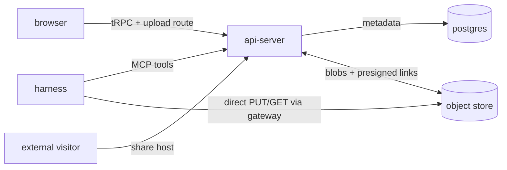

# Artifact library

Last verified: 2026-08-17

## Overview

The **Artifact Library** is where agents and users publish work products —
HTML pages, React/JSX components, markdown, code, plain text, and binary
files — organize them into **Folders**, and share them with people outside
the platform. An **Artifact** is owner-scoped like every other resource, is
attributed to the Agent that published it (or to the user, for manual
uploads), and outlives both the sandbox and the agent that produced it.
Publishing a new revision keeps the same identity and share link and appends
to a per-artifact **version history** viewers can flip through.

An artifact's **kind is settled when it is created** and no revision can move
it — neither by declaring one nor by renaming into another extension. The
share link outlives every revision, so a mutable kind would let a URL vetted
while it served inert text later serve executing HTML or JSX to the same
audience; publishing executable content is fine, silently changing what an
already-shared link *does* is not. It also keeps a version history coherent,
since every version renders through the artifact's one kind. Title and file
name stay editable, and both describe the whole artifact rather than one
revision: the history snapshots bytes, so a past version downloads under the
artifact's current name.

The design is a port of a proven external tool (the "slop" artifact vault)
onto platform rails: content bytes live in the S3-compatible object store
([persistence](persistence.md)), metadata lives in Postgres, the agent-facing
surface is the per-agent platform MCP server, and public serving happens on a
dedicated **share host**.

## Sharing model

- An artifact is **private** by default: visible in-app only.
- Making it **public** activates its share link — a URL on the share host
  keyed by an unguessable random **slug**. The slug is the *entire* access
  control: there is no account, token, or password on the public side —
  whoever holds the link may view, and guarding the link is the sharer's
  responsibility (deliberately: a second factor sent alongside a leaked link
  leaks with it).
- An optional **expiry** bounds the *artifact's* lifetime — it is a retention
  setting, not just a link setting, and applies regardless of visibility (a
  private artifact with an expiry is deleted the same way; storage lifecycle
  is a separate concern from sharing). On the public side, an expired link
  answers "gone" (with a distinct "recently expired" page during a grace
  window in which the owner can still renew); once the grace window passes, a
  background sweep hard-deletes the content.
- A folder has a public page of its own, listing only the *shared* artifacts
  inside it; a folder with nothing shared is indistinguishable from a
  nonexistent one.
- Each successful public render increments a per-artifact **view count**,
  surfaced in-app as a cheap reach signal.

## The share host — trust boundary

User-generated content is never served from the app origin. A dedicated
**share host** (a separate subdomain, mandatory, wired through the cluster
ingress and configured via Helm) serves *only* shared artifacts and folder
pages. The api-server host-gates every request before any app route or auth
middleware: requests for the share host are dispatched to a self-contained
public viewer app; everything else falls through to the platform surface.
The two origins therefore never share cookies or tokens — a malicious
artifact cannot reach Keycloak tokens, the tRPC surface, or app cookies,
because none of them exist on its origin.

Within a share page, the artifact renders inside a sandboxed iframe: the
outer page is platform chrome (title banner, version navigation, source
download) and the inner document is the user content. Rendering is entirely
client-side — the server never compiles or sanitizes user content, it only
wraps it:

- **HTML** renders as authored (links retargeted to open new tabs).
- **JSX** is transformed in the visitor's browser (babel-standalone) with
  dependencies resolved from public CDNs via an import map pinned to the
  versions Claude-style artifacts expect (react, recharts, d3, three, …).
- **Markdown** renders client-side through a sanitizer; **code and text**
  render as highlighted source.
- **Images** preview inline; other binaries get a download page. Raw bytes
  are served inline only for images — everything else is download-only, so
  no user-controlled document can execute on the share origin *outside* the
  sandbox.

The viewer sends conservative headers (no-referrer, nosniff, framing pinned
to self) but deliberately no restrictive content CSP: a `srcdoc` iframe
inherits the parent CSP, and the sandbox attribute plus the dedicated origin
are the actual isolation.

Blob bytes relay through the api-server with constant memory: raw views
stream store → response without ever buffering the object (the store is
deliberately never exposed to the public side — no presigned links leave
this origin), page renders buffer only size-capped text sources (anything
bigger falls back to the download card), and the public folder listing is
bounded. What remains on the api-server per public view is bounded work: a
small HTML wrapper, an indexed slug lookup, and pass-through bandwidth.

The viewer runs inside the api-server process — a deliberate, accepted
trade-off for now rather than an oversight: origin isolation is real, but
the event loop and DB pool are shared with the control plane. The viewer
keeps its dependency surface minimal (metadata reads, blob reads) exactly
so it can move into its own deployment when sustained public traffic
warrants it; it lives in the api-server today because the planned
agent-calling bridge for interactive artifacts needs the relay machinery
that already lives there.

## Publishing and download paths

- **Agents** publish through artifact tools on the per-agent platform MCP
  server (the same in-pod outbound surface as channels, skills, and
  schedules). Small text content travels inline; anything bigger takes
  the **direct-transfer** path: the tool
  mints a short-lived presigned upload link, the harness PUTs bytes straight
  to the store through its paired gateway, and the create call references the
  completed upload. The platform verifies the upload (existence, size cap)
  before the artifact row lands, and an upload reference outside the caller's
  own staging namespace reads as unknown. Attribution is the mesh-verified
  agent identity — a harness cannot publish as another agent, and the
  owner-scoped service means it can only ever touch its owner's library.
  Reads mirror this: small text content returns inline, and a download tool
  mints a short-lived presigned link — signed for the same agent-dialed
  store authority — that the harness GETs straight into its sandbox (any
  kind or size, current or a past version), so work products published from
  one sandbox are consumable in another without transiting the conversation.
- **Users** publish from the Artifacts page in the UI: bytes go through an
  authenticated upload route on the app origin (avoiding browser↔store CORS),
  then the same create call. Downloads answer with a presigned direct link
  when the store has a browser-reachable endpoint, a relayed blob otherwise.

## UI surfaces

- **Artifacts** is a top-level destination in the navigation rail: the whole
  library grouped by folder, with search, upload, folder management, sharing
  controls, and in-app previews that reuse the chat file-viewer stack
  (markdown prose, highlighted code, inline images).
- Each sandbox's home view gains an **Artifacts section** listing what that
  agent published, with the same actions.
- The chat view carries the same library twice over: an **Artifacts section**
  in the session sidebar, scoped to the sandbox's agent and offering the same
  per-artifact actions, and a **docked preview** beside the conversation that
  renders the selected artifact and follows new versions as they are
  published. Deleting the artifact a preview is showing closes that preview.

## Lifecycle and cleanup

Deleting an artifact removes the metadata row and all version rows in one
transaction, then deletes the blobs best-effort — a failed blob delete can
leave an orphaned (unreachable) object in the store, never a dangling row.
The database enforces the composition with foreign keys: version rows cascade
with their artifact, and folder deletion detaches its artifacts. Deleting a
folder ungroups its artifacts (their share state is untouched).
The **expiry sweep** runs as a scheduled platform periodic job (its own
queue and worker lane) — one execution per period across replicas, with the
tick itself idempotent —
and permanently removes artifacts — private ones included — whose expiry
passed more than the grace window ago. Agent deletion does
**not** touch artifacts — attribution simply points at a name that no longer
resolves.

## Domain events

Every mutation raises a domain event on the in-process bus. They are advisory
and non-durable: nothing here is the system of record, and no artifact event
reaches the security audit trail.

Two different consumers read them, and the split matters because the same
moment can produce both:

- **Live updates.** Create, update, delete, and folder changes exist so an open
  browser refreshes without polling. They fire on every mutation, including
  ones no person asked for — the expiry sweep deletes artifacts on a timer and
  raises a delete like any other.
- **Usage.** Publish, share, view, and delete are recorded as
  [Activity Events](usage-tracking.md). Share is raised only on the transition
  *into* public, so neither extending an expiry nor revoking a link counts as
  sharing. A view is what places an opening in time — the artifact's own
  counter is a lifetime total that cannot say when, or whether the link was
  opened at all after some date.

  Only the person-driven ones are recorded. An event carries an actor exactly
  when a person caused it, and the usage subscriber ignores anything without
  one, so the timer sweep's deletes never reach the activity log even though
  they raise the same event. That rule is what keeps machine activity out of
  every number on this page.

A publish carries the producing agent, and whether a person or an agent filed
it is the question worth asking of this feature — so the two are distinguished
rather than merged. Artifacts the platform writes for its own bookkeeping
(an experiment's dashboard, script clone, or results snapshot) are marked
internal by the caller and raise no publish at all: they are machinery, and
counting them would report the platform's own writes as user activity.

## Where the code lives

- Contract (types, schemas, tRPC router): [`packages/api-server-api/src/modules/artifact-library/`](../../packages/api-server-api/src/modules/artifact-library/)
- Implementation (service, repository, viewer app, renderer, MCP tools, sweeper): [`packages/api-server/src/modules/artifact-library/`](../../packages/api-server/src/modules/artifact-library/)
- Blob storage port it consumes: [`packages/api-server/src/modules/artifacts/`](../../packages/api-server/src/modules/artifacts/)
- UI destination: [`packages/ui/src/modules/artifacts/`](../../packages/ui/src/modules/artifacts/)
- Share host wiring (ingress rule, env): [`deploy/helm/platform/`](../../deploy/helm/platform/)
