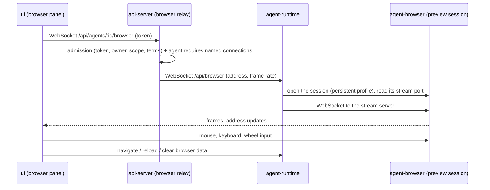

# Browser panel

Last verified: 2026-10-06

## Overview

The **Browser Panel** lets a user see and use a web app their agent runs — a dev server, a quick HTTP server, a whole nested platform — from a panel beside the chat, without SSH port-forwarding. It is experimental: it shows only to a user with the addressed-credential-injection flag ([features](features.md)), and only on an agent that requires named connections ([connections](connections.md#addressing-a-connection)).

The app never runs in the user's browser. A Chromium **inside the agent's sandbox** loads it, and the panel shows that browser's viewport as a stream of frames and sends the user's mouse and keys back. The user's browser only ever draws pixels and runs the platform's own code.

## Why a remote browser

Whatever an agent serves is untrusted: the agent runs arbitrary code and can be steered by anything it reads. Served into the user's browser, that code would need an origin of its own — on the app's origin it could act as the user against the API — and a separate origin per agent and port, or one agent's app could read another's storage. That takes wildcard DNS and certificates the platform's installs do not have, plus routing for each new host. Rendering in the sandbox needs none of it, and the terminal relay already carries trusted-code-rendered bytes the same way.

It also removes the framing problems: nothing is framed, so an app that forbids framing (the platform's own UI) renders, and an app's sign-in redirects stay inside the sandbox, where its own identity provider is reachable on loopback.

The cost is fidelity: frames are compressed images, and each input takes one round trip before its effect shows. The panel measures that round trip on the user's clock — input to the next frame — and shows it with the frame rate and the stream's bandwidth.

## The stream

The shared browser runs headed, in kiosk mode, on a virtual display in the sandbox with a minimal window manager — the image's full Chromium, launched by `platform-browser` for the panel and the agent alike. A panel whose browser decodes H.264 gets **video**: agent-runtime captures the page's region of that display with ffmpeg at a steady 30 frames a second and encodes it for low latency, so a still page costs almost nothing, motion a fraction of the JPEG stream, and a page never sits stale behind the encoder. The page's offset on the display, below the bar Chrome for Testing draws, is measured by matching a screenshot against the capture. A resize restarts the encoder with a fresh keyframe, and a viewer that falls behind skips frames until one. Otherwise — no decoder, a decoder error, an image without the display — the panel gets the **JPEG** stream agent-browser's screencast produces:

- **Sharpness and coordinates.** The viewport follows the size of the panel in the focused tab, at a pixel ratio of one, whatever the user's zoom or screen, so a pixel in the agent's screenshot is the CSS pixel its mouse commands take. Frames are JPEG at a quality chosen for legible text. A still page sends nothing; motion is where the bandwidth goes.
- **Flow control (JPEG).** The panel acknowledges each frame once it is drawn, and the stream sends the next only then, always the newest. A slow link or a busy browser drops frames rather than queueing them, so latency stays flat instead of growing behind a backlog.
- **Wire shape.** agent-browser sends frames as JSON with the image in base64; agent-runtime re-sends each as one binary message, a small header and the raw JPEG, so the user's browser neither downloads the base64 nor decodes it. Pointer moves are coalesced to one per display frame on the way in.

## The path

- **The relay** is one more agent relay beside chat, terminal and SSH, with the same admission ([cli](cli.md)) and one more gate: an agent whose gateway injects credentials into unnamed requests is refused. The user may open any web address — a loopback dev server, or an external page to sign in — so with ambient injection the user would be browsing as the agent's accounts. With named connections only, unaddressed browser traffic carries no credential of the agent's.
- **agent-runtime** drives the image's agent-browser tool rather than Chromium directly: agent-browser already streams a session's viewport and accepts input over a local WebSocket. agent-runtime pipes that stream and handles the panel's own control messages — navigate, reload, clear browser data — as agent-browser commands. Only http and https addresses open. The panel sends its size, and the browser's viewport follows it, so the page lays out at the size the user sees. A reconnect without an address reattaches without reloading the page.
- **The session is shared with the agent.** The panel always shows agent-browser's `preview` session, so the agent can look at and drive what the user sees, and the user can watch the agent test its own work. The base image's agent instructions name that session, the one exception to an agent keeping a browser session of its own.

## The agent opens a page

An agent shows the user a page with one command its image ships, `platform-browser open <address>`, taught by a `platform-browser` skill. It points the shared session at the address — an open panel shows it at once — and prints a link in the `platform://browser` scheme for the agent to paste into its reply. Any other subcommand is an agent-browser command on that session, so the agent acts in the user's browser while the user watches; closing it is refused, since the panel is attached to it. The chat renders that link as a button, as it renders an artifact link; clicking it opens the panel and navigates there. The link carries when the command ran; a link from the last two minutes — in the agent's reply or in the command's own output — opens the panel there by itself, once, so the user need not click, while a conversation opened later opens nothing. The button is inert where the panel is not offered. Nothing about the link is trusted: it carries only an address, which must be http or https, and the click is the user's.

## Sign-ins and lifetime

The `preview` session keeps a browser profile in the agent's home, so sign-ins survive hibernation and a closed panel. The agent can use them — the panel says so once — and "Clear browser data" closes the browser and deletes the profile. "Restart browser" force-stops a browser that stopped answering — its daemon and the Chromium on the panel's profile, nothing else — and the panel's reconnect launches a fresh one on the same profile. Every browser command has a short deadline and runs in its own process group, killed whole when the deadline passes, so a stuck page cannot pile commands up.

An open panel keeps the agent awake the way an open chat does: it counts towards the agent's open connections, not towards runtime work. Only the user's input stamps last activity; frames never do, so a forgotten panel does not refresh the idle clock by itself. A hidden tab drops the stream to one frame a second.

agent-runtime closes the browser ten minutes after the last viewer leaves. It does not know whether the agent is still using the session in that window — agent-browser reports no last-use time — so an agent mid-way through its own browser work can lose the window; its next agent-browser command launches the session again, with the same profile, since the agent instructions name both. A running Chromium never keeps the agent awake on its own.

## Limits

- A page can still name one of the agent's connections on purpose — through its path prefix or token placeholder — and have its credential injected, as the agent's own code can. That needs the connection's id and is accepted, not guarded.
- Only images that ship agent-browser and its Chromium can serve the panel.
- Opening in a new tab, clipboard, file transfer and sharing beyond the owner are not built.
