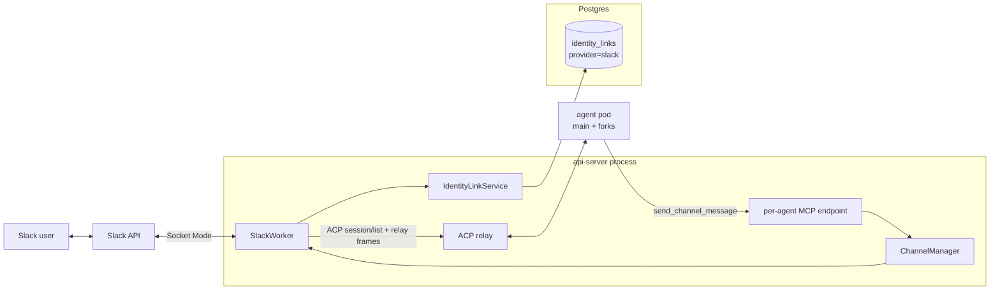
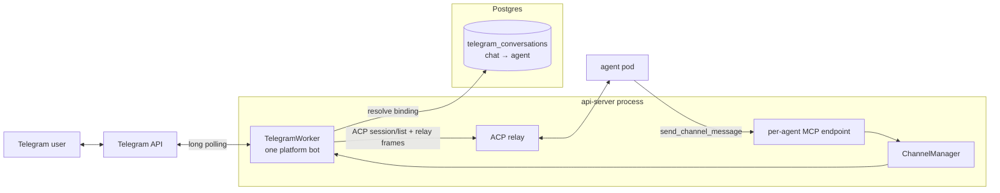

# Channels

Last verified: 2026-07-24

## Overview

A **channel** is a messenger surface (Slack, Telegram) that lets users drive an Agent from outside the UI. Channels are pluggable adapters that live inside the api-server process — no separate Deployment, no sidecar in the agent pod. Each adapter (the _worker_) owns its inbound socket, its outbound API, and its thread-to-session bookkeeping; a `ChannelManager` service composes the workers and reacts to lifecycle events on the in-process event bus.

Channel bindings are **1:1 with Agent**: a Slack conversation may be bound to at most one Agent globally, and an Agent has at most one Slack binding — Agent delete or Slack disconnect releases it. A Slack "conversation" is any surface the bot is party to: a public/private **channel**, a **group DM**, or a **1:1 DM**. The binding key is the conversation id in every case, so DMs and group DMs reuse the channel binding mechanics wholesale — same table, same resolution, same in-chat bind flow.

Channels split along a structural axis that has real consequences for secrets and identity:

- **Platform channel** — one app serves the whole install. The operator configures it once via Helm values; per-Agent config is just _which conversation this Agent listens to_. Both messengers are platform channels today. On Slack, identity linking ties messenger users to Keycloak subs at the workspace level.
- Telegram's variant: there is no workspace to anchor per-user identity in, so a Telegram _conversation_ binds to exactly one Agent — the owner consents by completing an in-chat `/login` plus a web agent-picker flow — and anyone in the bound chat may drive that Agent.

### Access modes

A Slack binding carries an **access mode**, chosen at bind time (UI form or CLI flag) and fixed for the binding's lifetime — switching modes is a deliberate disconnect + reconnect, never a side effect of re-connecting; a connect that requests a different mode for an existing binding is rejected with that instruction. The binding record stores only the non-default mode; an absent mode means person-scoped.

- **Person-scoped** (default) — the identity-linked model described throughout this page: Slack users link their platform identity, the per-Agent allowed-users gate admits repliers, owner turns relay to the main pod, and foreign-replier turns fork under the replier's own credentials.
- **Shared** — the binding itself is the authorization: anyone the messenger admits to the channel drives the Agent. No identity link, no allow-list. Every shared turn relays single-track to the main agent pod under the Agent's own credentials; the **binding owner's** Terms-of-Use acceptance gates each turn (the terms bind the party whose credentials run it, not the member who typed); the security log records each allow with basis _place_ and the sender's Slack user id; and the prompt text is speaker-labelled with the sender's Slack mention, so a multi-speaker session stays attributable inside the conversation itself.

Telegram is structurally shared-only — with no workspace to anchor per-user identity, consent attaches to the conversation and everyone in the bound chat drives the Agent. Shared Slack bindings deliberately mirror those semantics.

#### Ambient mode (shared bindings only)

A shared Slack binding can additionally run in **ambient mode**: the agent reads along with the whole channel conversation and decides for itself when to chime in — answering a question it can answer, picking up a task someone described, flagging a clear mistake — staying silent otherwise. Mentions keep the addressed-turn treatment unchanged; ambient only adds a second, quieter inbound path.

Unlike the access mode, ambient is **mutable** and **off by default** on every connect path — the in-chat `/platform bind`, the UI form, and the CLI flag all leave it off, and the binding owner opts a channel in explicitly. Ambient has the agent read every message in the channel, so keeping that broader exposure a deliberate opt-in is the safe default. It can be flipped later — a same-mode re-connect updates it in place, and an in-chat ambient command (allowed for the binder or the agent's owner, the unbind authorization) is the in-channel dial. Every enable/disable is recorded in the security log, and that audit record is authoritative. The change is deliberately **not** announced in the channel — not on a connect, a re-connect, or the in-chat dial: whoever made it sees it confirmed on their own surface (the UI, the CLI, or the ephemeral slash-command reply for the in-chat command), and the channel's members get no ambient status post.

Ambient turns are deliberately unobtrusive on the platform's side: the platform posts no acknowledgment reaction and no wake notices, and failures are logged and evented but never posted — nobody summoned the agent. Acknowledgement instead comes from the agent itself: when a message is worth engaging, the ambient frame has it open with a fitting emoji reaction (via the `react` tool) — a quiet, notifies-no-one signal that it has picked the message up, chosen to suit the message rather than a rote mark. The agent declines by calling the `no_reply_needed` tool (or simply ending its turn without posting) — the same explicit-reply contract that governs mention turns, re-stated on every prompt since ambient and mention-driven turns interleave in the same sessions. The frame also announces how the agent appears in the channel — the install's bot identity from the brand config — so a message that calls the bot by name is answered like a mention; the agent's own persona and name come from its workspace setup, never from the relay. Each relayed message is still security-logged as a place-basis allow (marked as ambient-triggered), and the binding owner's Terms-of-Use acceptance gates ambient turns like any shared turn — silently.

Inbound traffic and outbound traffic take different paths. Inbound is push from the messenger into the api-server worker, which routes the message to the agent pod over ACP. Outbound is pull initiated by the agent: the harness calls a tool on the api-server's per-Agent MCP endpoint, and the api-server delegates to the right worker.

Two cross-cutting concerns are owned elsewhere and only summarized here:

- **Foreign replier fork** (person-scoped Slack bindings). Slack's two-tier access (channel membership + per-Agent allowed users) admits multiple authorized users into one thread. Owner replies relay to the main pod; replies from any other authorized user fork into a per-turn paired pod set — a fork agent Job and a fork gateway Pod, each with its own NetworkPolicy — whose gateway mounts the replier's K8s credential Secrets. The pair spec, the foreign-credential selection, and the shared-PVC mechanics are covered on [security-and-credentials](security-and-credentials.md). Channels just see "main pod or fork pod" at the relay step.
- **Thread-session binding.** A thread maps to one resumable session, so the agent gets real conversational continuity. The binding is the session's own `_meta.platform.threadTs`, resolved by listing sessions over ACP and matching — there is no server-side session store.

## Topology

Both adapters share the same shape inside the api-server — a worker that owns the messenger socket, the `ChannelManager` that supervises lifecycle, the ACP relay for inbound, and the per-Agent MCP endpoint for outbound. The interesting parts are where the two diverge: Slack hangs off a workspace-wide identity link table; Telegram hangs off the `telegram_conversations` binding table (conversation → Agent). Both messengers' tokens come from Helm values.

### Slack — platform channel



Bot and App-Level Tokens come from Helm values and live in api-server env — no per-Agent Secret. Resolving the channel's binding yields the Agent, the binding owner, and the access mode. On person-scoped bindings the workspace-wide identity-link table backs the `/platform login` flow, and the relay path branches between the main pod and a per-turn fork pod by replier identity ([security-and-credentials](security-and-credentials.md)); on shared bindings the relay is single-track to the main pod.

### Telegram — platform channel



The bot token comes from Helm values and lives in api-server env, like the Slack tokens. A conversation binds to exactly one Agent in `telegram_conversations` (the conversation id is the primary key); the single bot polls for the whole install and resolves each inbound message to its chat's binding. The relay path is single-track — the main pod handles every turn, no foreign-replier fork (there is no per-user identity to fork under).

## Adapters

Both workers implement the same internal contract — `start`, `stop`, `stopAll`, `listConversations`, `postMessage` — keyed by agent id. The differences are transport, identity model, and where the bot token comes from.

### Slack — platform channel

- **Transport.** Socket Mode, one workspace-level WebSocket from the api-server to Slack, opened unconditionally at boot so slash commands, mentions and DMs work in chats that have no binding yet (mirroring the Telegram client). The api-server has no inbound network access requirement; events arrive over the socket the api-server itself opened. Slack caps Socket Mode at ten concurrent connections per app, which is the install-level scale ceiling for Slack.
- **Token provenance.** App-Level Token (`xapp-…`) and Bot Token come from Helm values, set at install time. Not stored per-Agent.
- **Identity linking** (person-scoped bindings). A `/platform login` slash command starts a Keycloak OAuth flow; on callback the api-server stores `slack_user_id ↔ keycloak_sub`. All subsequent interactions require a linked identity; unlinked users get an ephemeral prompt to log in. The link table is the source of truth for "who is this Slack user in Platform terms." Shared bindings never consult it.
- **In-chat binding** (creates a shared binding). Beyond the platform UI and CLI, a channel can be bound from inside Slack, mirroring Telegram: anyone runs `/platform bind`, authenticates through the same Keycloak OAuth flow, and picks one of _their own_ Agents on a web picker — the binding lends that Agent, under its own credentials, to the whole channel. The binding is created ambient-off; an in-chat ambient command reports and flips the binding's ambient mode afterward under the same binder-or-owner authorization as unbind. There is no admin gate (unlike Telegram's group-admin check); the ownership check on the picked Agent is the control, and the bind also links the initiator's identity so they can later release it. A bind never overrides an existing one — an already-bound channel is refused until it is unbound. `/platform unbind` releases the binding and is allowed for the binder or the Agent's owner; the owner can also disconnect from the platform UI/CLI as an escape hatch.
- **DMs and group DMs** reuse the in-chat bind verbatim — the conversation id (`D…` for a 1:1 DM, an `mpim` id for a group DM) is the binding key, so `/platform bind` connects one of the binder's own Agents to the DM or group, shared-mode, exactly as it binds a channel. Only the _trigger_ differs: a bound **1:1 DM** relays every plain message, because every DM message is addressed to the bot — no `@mention`, and the prompt isn't speaker-labelled (a single human). A bound **group DM** stays mention-driven like a channel. A message into an _unbound_ DM or group is declined with an ephemeral pointing at `/platform bind` — the DM surface must be turned on for the app first (`app_home.messages_tab_enabled`), or Slack refuses to send at all. An Agent may only be bound to one Slack conversation at a time (channel _or_ DM _or_ group), the same 1:1 constraint that governs channels.
- **Access control.** Decided by the binding's access mode. Person-scoped: two tiers — channel membership is the coarse gate (users must be in the Slack channel to see the bot's interactions); per-Agent allowed users is the fine gate (each Agent optionally declares the subs that may _trigger_ work; non-listed users in the channel still see responses but cannot drive a session). Combined with foreign-replier forking, this lets a thread have multiple authorized drivers whose actions land under their own identities. Shared: channel membership is the only per-person gate, and Slack owns it — the platform never resolves who is typing; binding the channel is the consent that lends the Agent to the channel.
- **Agent resolution.** A conversation binds to at most one Agent globally, so a mention (channel, group DM) or a plain 1:1-DM message resolves to exactly one Agent by conversation id; an addressed message in an unbound conversation is refused with an ephemeral.
- **Message intake.** The gateway subscribes to plain messages on three surfaces and pre-filters them all the same way: bot posts (including the agent's own replies, preventing loops), message edits and joins, and bot-mentions (those arrive on the mention path) never reach the worker. Surface then decides the route: **channel/group** messages feed ambient mode (relayed only when the binding is shared with ambient on; everything else drops silently); **1:1 DM** (`message.im`) messages feed the bound-DM relay (no mention needed); **group DM** (`mpim`) plain messages are ignored — group DMs are mention-driven, so they arrive via `app_mention`. This requires the Slack app to subscribe to `message.channels`/`message.groups`/`message.im` with the matching history scopes and to enable the App Home messages tab ([`deploy/slack-app-manifest.yaml`](../../deploy/slack-app-manifest.yaml)).

### Telegram — platform channel

- **Transport.** Long-poll `getUpdates` — one client for the install, started unconditionally at boot so `/login` works in chats that have no binding yet.
- **Token provenance.** The operator creates one bot via `@BotFather` and sets the token in Helm values; it reaches the api-server as env. No per-Agent Secrets, no token at rest in Postgres.
- **Identity model — there is none per user.** Telegram has no workspace to anchor a user-to-Keycloak link against, so consent attaches to the _conversation_: someone sends `/login` (in groups, only chat admins, verified via `getChatMember`; `/start` counts as login intent too, so deep links and the Start button work), the bot replies with a Keycloak OAuth link, and after authenticating the user lands on the UI's agent picker listing _their own_ Agents. The binding records conversation id, agent id, and the owner's sub as `authorized_by`, and the bot posts a confirmation in the chat. The chat's members never authenticate. `/logout` unbinds, and the owner can also disconnect a bound chat from the web UI — the bot posts a farewell note in the chat before the binding is released. Unbound groups stay silent so the bot does not spam every chat it has been added to.
- **Lifecycle.** There is none per Agent — bindings are rows, not runtime state. Agent deletion clears the Agent's rows via the channel-cleanup saga.

Slack keeps per-Agent worker registration via `SlackConnected` / `SlackDisconnected` / `AgentDeleted` events on the rxjs bus; bootstrap on api-server startup opens the Slack socket and starts the Telegram client, then walks the Slack channel bindings to restore the per-Agent registrations.

## Inbound — channel message to ACP session

```mermaid
sequenceDiagram
  autonumber
  participant U as Channel user
  participant M as Messenger API
  participant W as Worker<br/>(Slack/Telegram)
  participant API as api-server relay
  participant POD as agent pod<br/>(main or fork)

  U->>M: post message in thread
  M-->>W: event delivery<br/>(Socket Mode / long-poll)
  W->>W: identity / auth checks
  W->>API: ACP session/list
  API-->>W: sessions + _meta.platform<br/>(wakes pod if hibernated)
  alt a session's _meta.platform.threadTs matches
    W->>API: ACP session/prompt<br/>(resume matched sessionId)
  else first message in thread
    W->>API: ACP session/new<br/>(_meta.platform: type, threadTs)
    API-->>W: sessionId
    W->>API: ACP session/prompt<br/>(thread history as context)
  end
  API->>POD: relay frames<br/>(wake if hibernated)
  POD->>API: reply / react tool call<br/>(outbound MCP, see below)
  API->>W: reply(threadTs, text) / react
  W->>M: post reply in thread
  M-->>U: reply visible
  Note over POD,W: plain assistant text is not posted;<br/>the agent must call a tool
```

A few observations the diagram glosses over:

- **Identity gates differ per adapter and mode.** On person-scoped Slack bindings the worker runs the linked-identity check, the per-Agent allowed-users check, and the owner-vs-foreign decision (the latter selects whether the relay targets the main pod or a fork Job). On shared Slack bindings the gates collapse to the binding check plus the binding owner's Terms-of-Use acceptance — no sender identity is resolved. Telegram behaves like shared Slack: it resolves the chat's binding and checks the binding owner's terms acceptance; there is no foreign fork because there is no per-user identity to fork under.
- **Wake is implicit.** The relay step is the same `ACP relay → wake-if-hibernated → forward` path used by the UI. Channels do not call lifecycle endpoints directly; routing an ACP frame is what wakes the pod ([agent-lifecycle](agent-lifecycle.md), §Wake).
- **Wake failures are surfaced in human terms.** A cold start announces itself to the Slack sender (requester-only notice); a wake that misses its budget while the pods are still progressing posts a still-starting note and waits one more window before answering, so a healthy-but-slow start never loses the turn. A hard failure (pod crash, bad image, reconcile error) replies with copy derived from the classified wake-failure cause — never the internal error string, and never raw controller messages. Telegram replies with the same copy on wake failures (no early notice, no extended wait).
- **The agent posts by calling a tool — plain assistant text is never delivered.** A Slack turn's reply reaches the channel only when the agent calls one of its outbound tools (`reply`, `react`, `no_reply_needed`; see [Outbound](#outbound--agent-to-channel)), mirroring how Telegram already works. The relay hands the message to the pod and waits for the turn to finish, but the assistant's generated text is discarded — nothing is auto-posted. The prompt carries a per-turn contract stating this and naming the thread and triggering message the tools target by default, so a well-behaved agent replies into the right thread without tracking ids.
- **A working status is the one thing the platform presents on the agent's behalf.** On mention/fork turns a per-turn _presenter_ drives Slack's assistant-status surface ("is thinking…", the current tool's title as it changes, "is waking…" during a cold start — deduped and throttled, and cleared on every turn-exit path). Thought/tool notifications reach it through a narrow `onUpdate` on the ACP prompt call (raw ACP `session/update` frames projected to a small worker-owned union; assistant text is ignored). The status uses `assistant.threads.setStatus` (covered by `chat:write`) and degrades to nothing where the workspace can't show it. Ambient turns present no status — nobody summoned the agent. System notices (wake failures, a still-starting note, fork errors) are separate direct posts, not agent content.
- **Resume vs. new is decided by the ACP session list.** The original Slack design treated every message as a new session; today the binding lives on the session itself: the worker lists sessions over ACP and resumes the one whose `_meta.platform.threadTs` matches. If `unstable_resumeSession` fails (PVC lost, session expired), the worker falls back to creating a new session with thread history injected from the messenger API — degrading to pre-feature behavior for that thread, no regression.
- **`threadKey` is adapter-specific.** Slack uses `thread_ts`; Telegram uses the conversation id (chat id + optional forum topic). It is carried on the session as `_meta.platform.threadTs` and matched in-process against the ACP session list; there is no longer a DB uniqueness guard, so two concurrent first messages in a brand-new thread can mint two sessions for the same key.
- **Injected history is attributed per Agent (Slack).** When a fresh session injects thread/channel history, each prior message is labelled by author. Because the single install-wide bot posts for every Agent, a bot message's Slack user id cannot tell Agents apart — so the worker parses the Agent id out of each message's footer link and labels the line: the reading Agent's own posts become `you (this agent)`, another Agent's posts are named, and humans keep their Slack id. A short legend explaining the prefixes is prepended whenever the injected history contains any Agent-authored line. This is what lets an Agent that reaches into a channel bound to a different Agent stay distinguishable when that other Agent later reads the channel. Resumed sessions are not re-injected, so a foreign Agent's mid-thread post is only seen on the next fresh injection.
- **Ambient routing: one session per thread, plus one per channel.** On an ambient binding, a thread reply relays into that thread's own session — the same key a mention there would resume. Top-level channel messages instead share a single rolling **ambient session** per channel (a synthetic key in the same thread-key slot, un-collidable with real thread keys), so the agent genuinely follows the channel rather than starting cold per message. Top-level ambient traffic is serialized per channel and coalesced — messages arriving while a turn is in flight flush as one multi-message prompt — so a busy channel never races concurrent prompts into the shared session. When the agent chimes in, the reply is threaded under the triggering message; the follow-up conversation in that thread then runs as an ordinary thread session, with thread-history injection carrying the context across.
- **Turn relays emit `ChannelTurnRelayed`.** Both Slack and Telegram workers emit a `ChannelTurnRelayed` event on the in-process bus after the ACP turn finishes, carrying `channel`, `agentId`, `actorSub` (the relaying user's Keycloak `sub` on person-scoped Slack turns; `null` on shared Slack and Telegram turns, where no platform identity is resolved — those turns instead carry `externalActorId`, the messenger-native id of the sender), and `outcome` (`"success" | "failure"`). Failed turns additionally carry a low-cardinality failure reason (the classified wake-failure cause, a fork failure, or a generic relay error), which the audit trail and usage records project — so failed turns are diagnosable from the log store after the fact. The usage subsystem consumes this for activity tracking ([usage-tracking](usage-tracking.md)); the forks subsystem also subscribes to drive paired-pod teardown on Slack.

## Outbound — agent to channel

Outbound is initiated by the agent process. The harness calls a tool on the api-server's per-Agent MCP endpoint, the endpoint authenticates the call, and the channel manager routes the message back through the right worker.

```mermaid
sequenceDiagram
  autonumber
  participant H as Harness<br/>(in agent pod)
  participant MCP as api-server<br/>MCP endpoint
  participant K as K8s API
  participant CM as ChannelManager
  participant W as Worker
  participant M as Messenger API

  H->>MCP: POST /api/agents/{id}/mcp<br/>tool: send_channel_message
  MCP->>K: resolve source pod IP → agent label
  K-->>MCP: agent + owner
  MCP->>MCP: verify caller IP belongs to {id};<br/>caller.owner == agent.owner
  alt verification fails
    MCP-->>H: 401 / 404
  else verified
    MCP->>CM: postMessage(agentId, channel, text, chatId?)
    CM->>W: postMessage(agentId, text, chatId?)
    W->>M: post (top-level or threaded)
    M-->>W: ack / error
    W-->>CM: { ok } | { error }
    CM-->>MCP: result
    MCP-->>H: tool result
  end
```

What the agent sees:

- **Cross-channel tools** are registered on the per-Agent MCP server: `describe_channel` returns the reachable chats for a given channel type, and `send_channel_message` posts text to a chat. The agent picks the channel by argument (`slack` or `telegram`); `chatId` addresses a specific chat. Omitting `chatId` resolves per channel type: Telegram posts to the worker's last-active thread (error if none); Slack posts to the channel bound to the Agent. `send_channel_message` is a **new top-level post** — for proactive or cross-channel messages, not turn replies.
- **Slack turn tools** — `reply` and `react` — are how a Slack agent answers the turn it is handling. `reply` posts into the current thread; `react` adds an emoji reaction (a Slack short name) to the triggering message — a quiet acknowledgement that notifies no one. Each defaults to the turn's thread and triggering message (remembered per Agent as the most recent inbound turn) so the agent needn't pass ids, though the prompt injects them for robustness. These are Slack-specific and reject when the Agent has no Slack channel connected; Telegram replies stay on `send_channel_message`. `react` needs the `reactions:write` scope.
- **`no_reply_needed` is cross-channel.** Both messengers instruct the agent to call it to end a turn deliberately silent — a group message not meant for it, or one already handled — rather than leaving undelivered text. It is a pure signal: it posts nothing and touches no channel, so it is the one turn tool that is not Slack-specific. On Slack it also replaces the old ambient decline token; on Telegram it makes the previously-implicit "just don't reply" an explicit action.
- **Slack reach is the bot's own membership.** A bound Agent may post beyond its bound channel: any workspace channel the (install-wide) bot is a member of is a valid `chatId`, and a Slack user id opens a direct message with that person. `describe_channel` lists the bound channel first, then the other bot-member channels with their `#names` (degrading to the bound channel alone if discovery fails, e.g. on an app missing the read scopes). Membership is verified at send time — posting to a channel the bot is not in is refused with a pointer at `/invite` (private channels are invisible to the bot until invited, so they refuse as not-found, with the same pointer). The bound channel itself short-circuits every check, so it keeps working regardless of app scopes. Every outbound post is made by the bot and footed with the Agent's name rendered as a link to its UI page, with the Agent id carried in the link URL: a human sees who is speaking, and — because one install-wide bot posts for every Agent — the api-server recovers the author from that footer when the message later surfaces in another Agent's injected history (see Inbound). The Slack workspace (who invites the bot where) is the reach boundary, and the app's granted scopes are the ceiling. This applies to both access modes — the mode governs who may drive the Agent inbound, not what the Agent does outbound. Telegram has no analogue: its outbound targets stay the conversations bound to the Agent.
- **Tools are always registered.** Calls are rejected at invocation time when no channel is connected for the Agent — no dynamic tool list, no per-session toggle. The binding is also the gate for the widened Slack reach: an unbound Agent cannot post anywhere, even though the workspace bot exists.
- **Bidirectional channel.** If a channel is connected to an Agent, every session on that Agent can post — interactive sessions and scheduled sessions alike. There is no per-session outbound flag.

Why the dedicated MCP endpoint:

- **Network isolation.** The MCP port is the only api-server port the agent's NetworkPolicy admits. The agent cannot reach the admin API (tRPC, OAuth, agent management) — only this one endpoint.
- **Auth without an admin login.** Caller identity is derived from the source pod IP, mapped to a `platform.ai/agent` label via the api-server's `podIpResolver` cache. The agent does not present a Bearer token — a compromised harness can't claim to be a different Agent because the kernel-verified source IP is the source of truth. Owner match (caller.owner == agent.owner) is the second check.
- **Direct path to channel infra.** The MCP endpoint dispatches into the same `ChannelManager.postMessage` that workers use internally — no agent-runtime round-trip, no second relay hop.

### Threading model

Outbound posts are **fire-and-forget at the thread level**. The agent posts a top-level message; the worker does not store any `threadTs → sessionId` mapping for proactive posts. If a user replies to the resulting thread, the inbound path treats it as a new mention — a fresh session. Continuity from the originating session does not carry over. This is the deliberate trade-off: keep outbound simple and stateless at the cost of session bridging on Slack-side replies.

The two messengers diverge slightly on what a top-level post means:

- **Slack:** the worker posts to the resolved target (bound channel by default) with no `thread_ts`, producing a new top-level message. A reply from a Slack user is routed by the _reply conversation's own_ binding — in the posting Agent's bound conversation it reaches that Agent; in a conversation bound to a different Agent it drives that other Agent; in unbound conversations it reaches no Agent. An Agent-initiated DM is a plain outbound post: it lands in the person's DM regardless of any binding, but it does not itself bind the DM — for the person's replies to reach the Agent, the DM must be bound (via `/platform bind`), the same as any other conversation.
- **Telegram:** there is no thread primitive in DMs and only weak threading in groups. The worker posts to the chat id; if the agent's prompt was triggered by a previous message in the same chat, that chat is still the conversation.

## Per-Agent vs. platform channel

Both messengers are platform channels: install-wide credentials from Helm and a conversation→Agent binding table, differing mainly in where the binding is gestured — Slack from the UI/CLI (person-scoped or shared) or an in-chat `/platform bind` (shared), Telegram from an in-chat `/login` plus the web agent picker. Future channels (WhatsApp Business, Discord, SMS) follow the same pattern — the Telegram flow is the template for messengers without a workspace identity to anchor per-user links against.

## Persistence touchpoints

Channels touch two stores; the substrate details live on [persistence](persistence.md):

- **Identity-link and binding tables (Postgres).** `identity_links` keyed on `(provider, external_user_id)` mapping to `keycloak_sub` — Slack's person-scoped bindings populate it today, but the `provider` column makes the table reusable for any future workspace channel. Slack bindings live in the channel rows owned by the agents module, keyed on the `slackChannelId` — a channel, group DM, or 1:1 DM conversation id, undifferentiated; each binding carries its access mode (absent = person-scoped) and, on shared bindings, the ambient flag (absent = off). `telegram_conversations` records the conversation→Agent binding for Telegram (plus the binding owner's sub). Different shapes by design — Slack has a workspace, Telegram does not. Both messengers' tokens live in api-server env from Helm values; there are no channel Secrets in k8s.

Channels do **not** participate in the Agent ConfigMap spec/status split. An earlier design kept channel config in the Agent ConfigMap; that was superseded: channel routing metadata lives in Postgres, secrets in k8s Secrets, Agent ConfigMaps stay channel-free.
