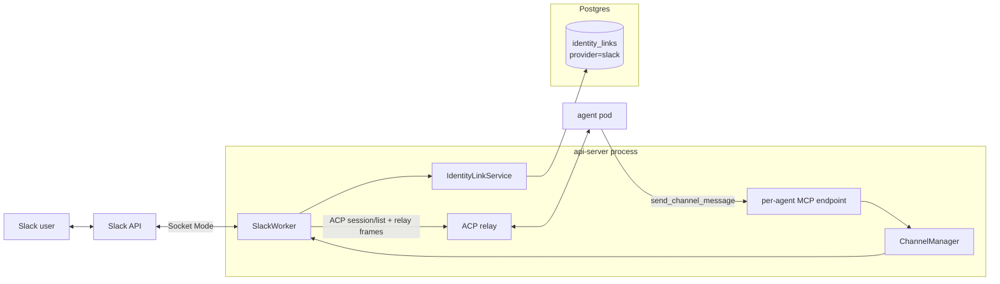
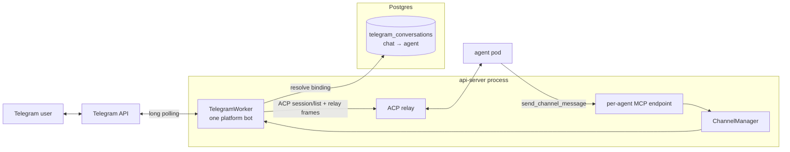

# Channels

Last verified: 2026-08-14

## Overview

A **channel** is a messenger surface (Slack, Telegram) that lets users drive an Agent from outside the UI. Channels are pluggable adapters that live inside the api-server process — no separate Deployment, no sidecar in the agent pod. Each adapter (the _worker_) owns its inbound socket, its outbound API, and its thread-to-session bookkeeping; a `ChannelManager` service composes the workers and reacts to lifecycle events on the in-process event bus.

The workers are **single-holder across the deployment**: both transports admit one consumer per install, and a worker's turn bookkeeping lives in its process. One replica runs them, elected by a Redis lease; the rest run none, and take over within a lease TTL if it dies. Inbound therefore always reaches the worker holding the turn state. Outbound doesn't — an agent's reply lands wherever its gateway is pinned — so a non-leader marshals the call to the leader over the Redis bus. Channel throughput is thus one replica's, below Slack's own ten-connection ceiling.

Channels are a **standard Agent surface**, not a pre-release one: every Agent exposes it, with no per-user opt-in in front of it. What can be bound there is the install's own decision — a worker exists only where its token is configured — and an install with no messenger says so on the surface rather than withdrawing it. Slack as a *Connection* is a separate surface; a channel needs nothing from it ([connections](connections.md)).

A binding is **place-scoped, not agent-scoped**: a Slack conversation may be bound to at most one Agent globally, but an Agent may hold **several bindings at once** — the same Agent, and so the same workspace, memory and skills, reachable from many conversations without duplicating it. Agent delete releases all of them; a disconnect names the one to release. A binding **is** its conversation, so nothing moves one: reaching an Agent from somewhere else is a connect of that conversation and a release of this one, each its own deliberate act on its own conversation. No surface offers a compound that could release a binding and then fail to replace it. A Slack "conversation" is any surface the bot is party to: a public/private **channel**, a **group DM**, or a **1:1 DM**. The binding key is the conversation id in every case, so DMs and group DMs reuse the channel binding mechanics wholesale — same table, same resolution, same in-chat bind flow.

Multiple bindings share the Agent but never each other's conversations: routing is by conversation id both ways, and every session key is qualified by the conversation it belongs to, so a thread — and a channel's read-along flow — stays inside the channel it happened in.

Channels split along a structural axis that has real consequences for secrets and identity:

- **Platform channel** — one app serves the whole install. The operator configures it once via Helm values; per-Agent config is just _which conversation this Agent listens to_. Both messengers are platform channels today. On Slack, identity linking ties messenger users to Keycloak subs at the workspace level.
- Telegram's variant: there is no workspace to anchor per-user identity in, so a Telegram _conversation_ binds to exactly one Agent — the owner consents by completing an in-chat `/platform bind` plus a web agent-picker flow — and anyone in the bound chat may drive that Agent.

### Shared access — the one model

The binding itself is the authorization: anyone the messenger admits to the conversation drives the Agent under the Agent's own credentials. There is no per-person access mode, no identity link required to drive a turn, and no allow-list. Every turn relays single-track to the main agent pod; the **binding owner's** Terms-of-Use acceptance gates each turn (the terms bind the party whose credentials run it, not the member who typed); the security log records each allow with basis _place_ and the sender's Slack user id; and the prompt text is speaker-labelled with the sender's Slack mention, so a multi-speaker session stays attributable inside the conversation itself.

Telegram is structurally identical — with no workspace to anchor per-user identity, consent attaches to the conversation and everyone in the bound chat drives the Agent.

#### Ambient mode

A Slack binding can additionally run in **ambient mode**: the agent reads along with the whole channel conversation and decides for itself when to chime in — answering a question it can answer, picking up a task someone described, flagging a clear mistake — staying silent otherwise. Mentions keep the addressed-turn treatment unchanged; ambient only adds a second, quieter inbound path.

Ambient is **mutable** and **off by default** on every connect path — the in-chat `/platform bind`, the UI form, and the CLI flag all leave it off, and the binding owner opts a channel in explicitly. Ambient has the agent read every message in the channel, so keeping that broader exposure a deliberate opt-in is the safe default. It can be flipped later — a re-connect updates it in place, and an in-chat ambient command (allowed for the binder or the agent's owner, the unbind authorization) is the in-channel dial. Every enable/disable is recorded in the security log, and that audit record is authoritative. The change is deliberately **not** announced in the channel — not on a connect, a re-connect, or the in-chat dial: whoever made it sees it confirmed on their own surface (the UI, the CLI, or the ephemeral slash-command reply for the in-chat command), and the channel's members get no ambient status post.

Ambient turns are deliberately unobtrusive on the platform's side: the platform posts no acknowledgment reaction and no wake notices, and failures are logged and evented but never posted — nobody summoned the agent. Acknowledgement instead comes from the agent itself: when a message is worth engaging, the ambient frame has it open with a fitting emoji reaction (via the `react` tool) — a quiet, notifies-no-one signal that it has picked the message up, chosen to suit the message rather than a rote mark. The agent declines by calling the `no_reply_needed` tool (or simply ending its turn without posting) — the same explicit-reply contract that governs mention turns, re-stated on every prompt since ambient and mention-driven turns interleave in the same sessions. The frame also announces how the agent appears in the channel — the install's bot identity from the brand config — so a message that calls the bot by name is answered like a mention; the agent's own persona and name come from its workspace setup, never from the relay. Each relayed message is still security-logged as a place-basis allow (marked as ambient-triggered), and the binding owner's Terms-of-Use acceptance gates ambient turns like any shared turn — silently.

Inbound traffic and outbound traffic take different paths. Inbound is push from the messenger into the api-server worker, which routes the message to the agent pod over ACP. Outbound is pull initiated by the agent: the harness calls a tool on the api-server's per-Agent MCP endpoint, and the api-server delegates to the right worker.

One cross-cutting concern is owned elsewhere and only summarized here:

- **Thread-session binding.** A thread maps to one resumable session, so the agent gets real conversational continuity. The binding is the session's own `_meta.platform.threadTs`, resolved by listing sessions over ACP and matching — there is no server-side session store.

## Topology

Both adapters share the same shape inside the api-server — a worker that owns the messenger socket, the `ChannelManager` that supervises lifecycle, the ACP relay for inbound, and the per-Agent MCP endpoint for outbound. The interesting parts are where the two diverge: Slack hangs off a workspace-wide identity link table; Telegram hangs off the `telegram_conversations` binding table (conversation → Agent). Both messengers' tokens come from Helm values.

### Slack — platform channel



Bot and App-Level Tokens come from Helm values and live in api-server env — no per-Agent Secret. Resolving the channel's binding yields the Agent and the binding owner; the relay is single-track to the main pod. The workspace-wide identity-link table backs the `/platform login` flow, which authorizes the in-chat bind, unbind, and ambient commands — never who may drive a turn.

### Telegram — platform channel



The bot token comes from Helm values and lives in api-server env, like the Slack tokens. A conversation binds to exactly one Agent in `telegram_conversations` (the conversation id is the primary key); the single bot polls for the whole install and resolves each inbound message to its chat's binding. The relay path is single-track — the main pod handles every turn.

## Adapters

Both workers implement the same internal contract — `start`, `stop`, `stopAll`, `listConversations`, `postMessage` — keyed by agent id. The differences are transport, identity model, and where the bot token comes from.

### Slack — platform channel

- **Transport.** Socket Mode, one workspace-level WebSocket to Slack, opened by the lease-holding replica at boot so slash commands, mentions and DMs work in chats that have no binding yet (mirroring the Telegram client). The api-server has no inbound network access requirement; events arrive over the socket the api-server itself opened. Slack caps Socket Mode at ten concurrent connections per app, which is the install-level scale ceiling for Slack.
- **Token provenance.** App-Level Token (`xapp-…`) and Bot Token come from Helm values, set at install time. Not stored per-Agent.
- **Identity linking.** A `/platform login` slash command starts a Keycloak OAuth flow; on callback the api-server stores `slack_user_id ↔ keycloak_sub`. The link table is the source of truth for "who is this Slack user in Platform terms" — consulted only to authorize the in-chat `bind`, `unbind`, and `ambient` commands, never to admit a turn. `login`/`logout` stay working but are not listed in the bare-`/platform` usage help (which advertises only `bind`, `unbind`, and `ambient`); the flows that need a linked identity still point users at `/platform login` in context.
- **In-chat binding.** Beyond the platform UI and CLI, a channel can be bound from inside Slack, mirroring Telegram: anyone runs `/platform bind`, authenticates through the same Keycloak OAuth flow, and picks one of _their own_ Agents on a web picker — the binding lends that Agent, under its own credentials, to the whole channel, exactly like every binding. The binding is created ambient-off; an in-chat ambient command reports and flips the binding's ambient mode afterward under the same binder-or-owner authorization as unbind. There is no admin gate (unlike Telegram's group-admin check); the ownership check on the picked Agent is the control, and the bind also links the initiator's identity so they can later release it. A bind never overrides an existing one — an already-bound channel is refused until it is unbound. `/platform unbind` releases the binding and is allowed for the binder or the Agent's owner; the owner can also disconnect from the platform UI/CLI as an escape hatch.
- **DMs and group DMs** reuse the in-chat bind verbatim — the conversation id (`D…` for a 1:1 DM, an `mpim` id for a group DM) is the binding key, so `/platform bind` connects one of the binder's own Agents to the DM or group, exactly as it binds a channel. Only the _trigger_ differs: a bound **1:1 DM** relays every plain message, because every DM message is addressed to the bot — no `@mention`, and the prompt isn't speaker-labelled (a single human). A bound **group DM** stays mention-driven like a channel. A message into an _unbound_ DM or group is declined with an ephemeral pointing at `/platform bind` — the DM surface must be turned on for the app first (`app_home.messages_tab_enabled`), or Slack refuses to send at all. Channels, DMs and groups mix freely in an Agent's binding set; each is just another conversation id.
- **Access control.** Channel membership is the only per-person gate, and Slack owns it — the platform never resolves who is typing; binding the channel is the consent that lends the Agent to the channel.
- **Agent resolution.** A conversation binds to at most one Agent globally, so a mention (channel, group DM) or a plain 1:1-DM message resolves to exactly one Agent by conversation id; an addressed message in an unbound conversation is refused with an ephemeral.
- **Message intake.** The gateway subscribes to plain messages on three surfaces and pre-filters them all the same way: bot posts (including the agent's own replies, preventing loops), message edits and joins, and bot-mentions (those arrive on the mention path) never reach the worker. Surface then decides the route: **channel/group** messages feed ambient mode (relayed only when the binding has ambient on; everything else drops silently); **1:1 DM** (`message.im`) messages feed the bound-DM relay (no mention needed); **group DM** (`mpim`) plain messages are ignored — group DMs are mention-driven, so they arrive via `app_mention`. This requires the Slack app to subscribe to `message.channels`/`message.groups`/`message.im` with the matching history scopes and to enable the App Home messages tab ([`deploy/slack-app-manifest.yaml`](../../deploy/slack-app-manifest.yaml)).

### Telegram — platform channel

- **Transport.** Long-poll `getUpdates` — one client for the install, started by the lease-holding replica at boot (the Bot API admits no second consumer) so `/platform bind` works in chats that have no binding yet.
- **Token provenance.** The operator creates one bot via `@BotFather` and sets the token in Helm values; it reaches the api-server as env. No per-Agent Secrets, no token at rest in Postgres.
- **Identity model — there is none per user.** Telegram has no workspace to anchor a user-to-Keycloak link against, so consent attaches to the _conversation_: someone sends `/platform bind` (in groups, only chat admins, verified via `getChatMember`; `/start` counts as bind intent too, so deep links and the Start button work), the bot replies with a Keycloak OAuth link, and after authenticating the user lands on the UI's agent picker listing _their own_ Agents. The binding records conversation id, agent id, and the owner's sub as `authorized_by`, and the bot posts a confirmation in the chat. The chat's members never authenticate. `/platform unbind` releases the binding, and the owner can also disconnect a bound chat from the web UI — the bot posts a farewell note in the chat before the binding is released. Unbound groups stay silent so the bot does not spam every chat it has been added to. The command surface is deliberately the same subcommand form Slack uses — `/platform bind` and `/platform unbind`, with a bare `/platform` printing the two commands; `/start` (Telegram's mandatory deep-link and Start-button command) also triggers a bind.
- **Lifecycle.** There is none per Agent — bindings are rows, not runtime state. Agent deletion clears the Agent's rows via the channel-cleanup saga.

Slack keeps per-Agent worker registration via `SlackConnected` / `SlackDisconnected` / `AgentDeleted` events on the rxjs bus. Because that bus is in-process, those events are acted on only where the workers run — a bind served by another replica reaches the worker through the binding rows, which every path re-reads. Bootstrap runs when a replica takes the channel lease: it opens the Slack socket, starts the Telegram client, then walks the bindings to restore the per-Agent registrations.

## Inbound — channel message to ACP session

```mermaid
sequenceDiagram
  autonumber
  participant U as Channel user
  participant M as Messenger API
  participant W as Worker<br/>(Slack/Telegram)
  participant API as api-server relay
  participant POD as agent pod

  U->>M: post message in thread
  M-->>W: event delivery<br/>(Socket Mode / long-poll)
  W->>W: identity / auth checks
  W->>API: ACP session/list
  API-->>W: sessions + _meta.platform<br/>(wakes pod if hibernated)
  alt a session's _meta.platform.threadTs matches
    W->>API: ACP session/prompt<br/>(resume matched sessionId)
  else first message in thread
    W->>API: ACP session/new<br/>(_meta.platform: type, threadTs)
    API-->>W: sessionId
    W->>API: ACP session/prompt<br/>(thread history as context)
  end
  API->>POD: relay frames<br/>(wake if hibernated)
  POD->>API: reply / react tool call<br/>(outbound MCP, see below)
  API->>W: reply(threadTs, text) / react
  W->>M: post reply in thread
  M-->>U: reply visible
  Note over POD,W: plain assistant text is not posted;<br/>the agent must call a tool
```

A few observations the diagram glosses over:

- **The gates are the binding check plus the binding owner's Terms-of-Use acceptance** — no sender identity is resolved. Both messengers behave identically here. An unallowed host is refused, not held ([egress](security-and-credentials.md)).
- **An undecodable attachment is withheld, not forwarded.** An inbound image becomes prompt content only when its bytes are a format the harness decodes: the sniffed type outranks the messenger's label, and a label claiming no format is still sniffed. Handed anything else, a harness substitutes an internal error for the picture and the agent reports that as its answer. So what was withheld is named to the sender — separating a format nothing decodes from a download that returned a page instead of the file, the shape a missing permission takes — and to the agent in its prompt, so it never answers blind about a picture it did not receive.
- **Wake is implicit.** The relay step is the same `ACP relay → wake-if-hibernated → forward` path used by the UI. Channels do not call lifecycle endpoints directly; routing an ACP frame is what wakes the pod ([agent-lifecycle](agent-lifecycle.md), §Wake).
- **Wake failures are surfaced in human terms.** A cold start announces itself to the Slack sender (requester-only notice); a wake that misses its budget while the pods are still progressing posts a still-starting note and waits one more window before answering, so a healthy-but-slow start never loses the turn. A hard failure (pod crash, bad image, a wedged gateway, reconcile error) replies with copy derived from the classified wake-failure cause — never the internal error string, and never raw controller messages; a cause the platform is itself repairing still invites a retry. Telegram replies with the same copy on wake failures (no early notice, no extended wait).
- **The agent posts by calling a tool — plain assistant text is never delivered.** A Slack turn's reply reaches the channel only when the agent calls one of its outbound tools (`reply`, `react`, `no_reply_needed`; see [Outbound](#outbound--agent-to-channel)), mirroring how Telegram already works. The relay hands the message to the pod and waits for the turn to finish, but the assistant's generated text is discarded — nothing is auto-posted. The prompt carries a per-turn contract stating this and naming the thread and triggering message the tools target by default, so a well-behaved agent replies into the right thread without tracking ids. It also states the message's send time in readable UTC, whether the conversation is a DM or a shared channel/group, and a permalink when Slack can resolve one.
- **The contract speaks for its own message.** A session continued in the UI carries this text with it, so the contract scopes itself to its own message and says what an unframed one means: not from Slack, answered where it arrived, reaching Slack on request ([platform-topology](platform-topology.md), §ui).
- **A working status is the one thing the platform presents on the agent's behalf.** On mention turns a per-turn _presenter_ drives Slack's assistant-status surface ("is thinking…", the current tool's title as it changes, "is waking…" during a cold start — deduped and throttled, and cleared on every turn-exit path). Thought/tool notifications reach it through a narrow `onUpdate` on the ACP prompt call (raw ACP `session/update` frames projected to a small worker-owned union; assistant text is ignored). The status uses `assistant.threads.setStatus` (covered by `chat:write`) and degrades to nothing where the workspace can't show it. Ambient turns present no status — nobody summoned the agent. System notices (wake failures, a still-starting note) are separate direct posts, not agent content.
- **Resume vs. new is decided by the ACP session list.** The original Slack design treated every message as a new session; today the binding lives on the session itself: the worker lists sessions over ACP and resumes the one whose `_meta.platform.threadTs` matches. If `unstable_resumeSession` fails (PVC lost, session expired), the worker falls back to creating a new session with thread history injected from the messenger API — degrading to pre-feature behavior for that thread, no regression.
- **`threadKey` is adapter-specific.** Slack pairs the conversation id with the `thread_ts`; Telegram uses the conversation id (chat id + optional forum topic). Slack's pairing is what isolates an Agent's bindings from each other: a `thread_ts` is only unique within its conversation, so a bare one would let a thread in one channel resume a same-timestamp thread's session in another. The key is carried on the session as `_meta.platform.threadTs` and matched in-process against the ACP session list; there is no DB uniqueness guard — Slack instead serializes turns per (agent, thread key) across the session match and the prompt: concurrent first messages in a new thread can't mint duplicate sessions, and a mention can't race a second prompt into a session a read-along turn drives — the runtime resolves the collision by dropping a queued prompt whose relay connection tears down.
- **Injected history is attributed per Agent (Slack).** When a fresh session injects thread/channel history, each prior message is labelled by author. Because the single install-wide bot posts for every Agent, a bot message's Slack user id cannot tell Agents apart — so the worker parses the Agent id out of each message's footer link and labels the line: the reading Agent's own posts become `you (this agent)`, another Agent's posts are named, and humans keep their Slack id (which the Agent can resolve to a person — see [Outbound](#outbound--agent-to-channel)). A short legend explaining the prefixes is prepended whenever the injected history contains any Agent-authored line. This lets an Agent reaching into a channel bound to a different Agent stay distinguishable when that Agent later reads the channel. Each line also carries a readable UTC send time and an "(edited)" marker when Slack reports the message changed since posted.
- **Ambient routing: one session per thread, plus one per channel.** On an ambient binding, a thread reply relays into that thread's own session — the same key a mention there would resume. Top-level messages share a single rolling **ambient session** per channel (a synthetic, uncollidable key in the same slot), so the agent follows the channel rather than starting cold per message. **All** ambient traffic is serialized per session and coalesced: messages arriving while that session's turn is in flight flush as one multi-message prompt, each session draining on its own queue — a thread keyed by its `thread_ts`, the channel's top-level flow by its rolling key — so sessions run concurrently while a burst within one avoids the prompt-queue collision `threadKey` describes. A coalesced multi-message prompt tags each message with its own ts: a thread batch still answers into its one thread, but a top-level batch has no single triggering message — each batched message registers as its own reply target; an id-less `reply` refuses, threading under the tagged message rather than the newest one. When the agent chimes in, the reply threads under the message it answers; the follow-up conversation runs as an ordinary thread session, with history injection carrying context across.
- **Turn relays emit `ChannelTurnRelayed`.** Both Slack and Telegram workers emit a `ChannelTurnRelayed` event on the in-process bus after the ACP turn finishes, carrying `channel`, `agentId`, `actorSub` (always `null` on channel turns — no platform identity is resolved; attribution instead rides `externalActorId`, the messenger-native id of the sender), and `outcome` (`"success" | "failure"`). Failed turns additionally carry a low-cardinality failure reason (the classified wake-failure cause or a generic relay error), which the audit trail and usage records project — so failed turns are diagnosable from the log store after the fact. The usage subsystem consumes this for activity tracking ([usage-tracking](usage-tracking.md)).

## Outbound — agent to channel

Outbound is initiated by the agent process. The harness calls a tool on the api-server's per-Agent MCP endpoint, the endpoint authenticates the call, and the channel manager routes the message back through the right worker.

```mermaid
sequenceDiagram
  autonumber
  participant H as Harness<br/>(in agent pod)
  participant MCP as api-server<br/>MCP endpoint
  participant K as K8s API
  participant CM as ChannelManager
  participant W as Worker
  participant M as Messenger API

  H->>MCP: POST /api/agents/{id}/mcp<br/>tool: send_channel_message
  MCP->>K: resolve source pod IP → agent label
  K-->>MCP: agent + owner
  MCP->>MCP: verify caller IP belongs to {id};<br/>caller.owner == agent.owner
  alt verification fails
    MCP-->>H: 401 / 404
  else verified
    MCP->>CM: postMessage(agentId, channel, text, chatId?)
    CM->>W: postMessage(agentId, text, chatId?)
    W->>M: post (top-level or threaded)
    M-->>W: ack / error
    W-->>CM: { ok } | { error }
    CM-->>MCP: result
    MCP-->>H: tool result
  end
```

What the agent sees:

- **Cross-channel tools** are registered on the per-Agent MCP server: `describe_channel` returns the reachable chats for a given channel type, and `send_channel_message` posts text to a chat. The agent picks the channel by argument (`slack` or `telegram`); `chatId` addresses a specific chat. Omitting `chatId` resolves per channel type: Telegram posts to the worker's last-active thread (error if none); Slack posts to the Agent's bound conversation while it has exactly one, and otherwise refuses and names the candidates rather than picking one. `send_channel_message` is a **new top-level post** — for proactive or cross-channel messages, not turn replies.
- **The agent meets people as ids, and resolves them itself.** A messenger names a person only by their user id — in speaker labels, injected history, and mentions inside message text — so `describe_channel_users` turns ids into people: handle, name, title, pronouns, email, time zone, and status, as disclosed. A malformed id costs its own entry, not the batch; a looked-up profile (or confirmed miss) is cached briefly. The lookup posts nothing, is gated by the binding, and is logged by the ids asked about, never the profiles. Slack-only: Telegram has no workspace directory. The per-turn contract and injected-history legend point at it — unless the tool isn't registered, per the scopes model below, in which case neither mentions it.
- **Reactions are otherwise invisible; `describe_message_reactions` is how an agent asks.** The tool takes a chat (default: the turn's own conversation, else the bound one) and message ts (default: the turn's message), returns each reaction's emoji, count, and reacting user ids plus the chat/message it resolved to, or an error if not found. Never cached, unlike the user directory: a reaction tally is live state — the point of asking (e.g. a scheduled agent checking a signup thread) is the current count. Gated by the binding; the security log records the resolved chat/message and tally, never who reacted. Slack only.
- **Slack turn tools** — `reply` and `react` — are how a Slack agent answers the turn it is handling. `reply` posts into the thread being answered; `react` adds an emoji reaction to the triggering message, a quiet acknowledgement that notifies no one. A reply may additionally ask to surface in the channel (Slack's native "also send to channel"), off by default, for threads that have scrolled out of sight. The per-turn prompt injects the ids these target, so a well-behaved agent always names the thread it is answering; omitting them is a convenience the worker resolves against that Agent's turns currently in flight. A single Agent pod multiplexes every thread over one harness process and one outbound MCP identity, so an id-less call carries nothing to tell concurrent turns apart. Where the candidates disagree on the target the worker **refuses and asks for the injected id** rather than guess — posting one thread's reply into another is the failure worth preventing. Resolution deliberately still counts turns whose relay recently failed: a transport-level settlement says nothing about the pod, which may be executing the prompt long after the worker saw it fail. A call targeting a turn posts into that turn's own conversation, not whatever the Agent is bound to at call time, so a mid-turn rebind cannot redirect an in-flight reply. These are Slack-specific and reject when the Agent has no Slack channel connected; Telegram replies stay on `send_channel_message`.
- **`no_reply_needed` is cross-channel.** Both messengers instruct the agent to call it to end a turn deliberately silent — a group message not meant for it, or one already handled — rather than leaving undelivered text. It is a pure signal: it posts nothing and touches no channel, so it is the one turn tool that is not Slack-specific. On Slack it also replaces the old ambient decline token; on Telegram it makes the previously-implicit "just don't reply" an explicit action.
- **Slack reach is the bot's own membership.** A bound Agent may post beyond its bound conversations: any workspace channel the (install-wide) bot is a member of is a valid `chatId`, and a Slack user id opens a direct message with that person. `describe_channel` lists the Agent's bound conversations first, then the other bot-member channels with their `#names` (degrading to the bound ones alone if discovery fails, e.g. on an app missing the read scopes). Membership is verified at send time — posting to a channel the bot is not in is refused with a pointer at `/invite` (private channels are invisible to the bot until invited, so they refuse as not-found, with the same pointer). A bound conversation short-circuits every check, so it keeps working regardless of app scopes. Every outbound post is made by the bot and footed with the Agent's name linked into the UI, carrying the Agent id and — on a turn's reply — the session that turn ran on, so a reader can pick that conversation up in the UI where only its owner may open it ([platform-topology](platform-topology.md), §ui). A human sees who is speaking, and — because one install-wide bot posts for every Agent — the api-server recovers the author from that footer (older ones included) when the message later surfaces in another Agent's injected history (see Inbound). The Slack workspace (who invites the bot where) is the reach boundary, and the app's granted scopes are the ceiling. The binding governs who may drive the Agent inbound, not what the Agent does outbound. Telegram has no analogue: its outbound targets stay the conversations bound to the Agent.
- **Tools are always registered, with two exceptions.** Calls are rejected at invocation time when no channel is connected for the Agent — no dynamic tool list, no per-session toggle. `describe_channel_users` and `describe_message_reactions` are gated before that: each drops from the tool list when Slack's granted scopes are confirmed to lack, respectively, `users:read` or `reactions:read` (see [Slack scopes: required vs. optional](#slack-scopes-required-vs-optional)) — a missing binding is per-Agent and temporary, a missing scope is install-wide and permanent.
- **Bidirectional channel.** If a channel is connected to an Agent, every session on that Agent can post — interactive sessions and scheduled sessions alike. There is no per-session outbound flag.

### Slack scopes: required vs. optional

Bot scopes in [`deploy/slack-app-manifest.yaml`](../../deploy/slack-app-manifest.yaml) split into two tiers. **Required** scopes back core turn handling (inbound delivery, posting, the working status); nothing works without them. **Optional** scopes back individual affordances that must degrade rather than take anything else down when the workspace withholds them.

A withheld scope has no symptom of its own — the capability it backs behaves as though it were broken — so at startup the granted set is checked against what the running features need and any gap is reported with what it costs. A scope added to the manifest later never reaches an app already installed.

Which of two strategies an optional scope gets follows from what its absence means:

- **Degrade to a smaller result**, when a partial answer is still useful: attempted reactively, with a missing-scope failure caught and turned into a narrower result rather than an outright failure. `describe_channel` without the channel-list scopes still returns the bound conversations; a user profile without `users:read.email` still resolves, minus its `email` field.
- **Omit the capability entirely**, when no partial answer is possible: checked proactively, not per call. The platform asks Slack once what's granted and caches it for the process's lifetime (a real change means reinstalling, which restarts the process anyway); on a confirmed miss, the affordance drops out of the tool list — and out of any prompt text pointing at it — rather than staying registered to fail forever. `describe_channel_users` takes this path on a missing `users:read`; `describe_message_reactions` takes it on a missing `reactions:read` — both fail outright without their scope, so there's no narrower result to fall back to. An unreachable bot or unanswered check counts as _unknown_, never _missing_, and fails open, so a transient hiccup never hides a working capability.

Why the dedicated MCP endpoint:

- **Network isolation.** The MCP port is the only api-server port the agent's NetworkPolicy admits. The agent cannot reach the admin API (tRPC, OAuth, agent management) — only this one endpoint.
- **Auth without an admin login.** Caller identity is derived from the source pod IP, mapped to a `platform.ai/agent` label via the api-server's `podIpResolver` cache. The agent does not present a Bearer token — a compromised harness can't claim to be a different Agent because the kernel-verified source IP is the source of truth. Owner match (caller.owner == agent.owner) is the second check.
- **Direct path to channel infra.** The MCP endpoint dispatches into the same `ChannelManager.postMessage` that workers use internally — no agent-runtime round-trip, no second relay hop.

### Threading model

Outbound posts are **fire-and-forget at the thread level**. The agent posts a top-level message; the worker does not store any `threadTs → sessionId` mapping for proactive posts. If a user replies to the resulting thread, the inbound path treats it as a new mention — a fresh session. Continuity from the originating session does not carry over. This is the deliberate trade-off: keep outbound simple and stateless at the cost of session bridging on Slack-side replies.

The two messengers diverge slightly on what a top-level post means:

- **Slack:** the worker posts to the resolved target (the sole bound conversation by default) with no `thread_ts`, producing a new top-level message. A reply from a Slack user is routed by the _reply conversation's own_ binding — in the posting Agent's bound conversation it reaches that Agent; in a conversation bound to a different Agent it drives that other Agent; in unbound conversations it reaches no Agent. An Agent-initiated DM is a plain outbound post: it lands in the person's DM regardless of any binding, but it does not itself bind the DM — for the person's replies to reach the Agent, the DM must be bound (via `/platform bind`), the same as any other conversation.
- **Telegram:** there is no thread primitive in DMs and only weak threading in groups. The worker posts to the chat id; if the agent's prompt was triggered by a previous message in the same chat, that chat is still the conversation.

## Per-Agent vs. platform channel

Both messengers are platform channels: install-wide credentials from Helm and a conversation→Agent binding table, differing mainly in where the binding is gestured — Slack from the UI/CLI or an in-chat `/platform bind`, Telegram from an in-chat `/platform bind` plus the web agent picker. Both expose the same in-chat command surface — `/platform bind` and `/platform unbind`. Future channels (WhatsApp Business, Discord, SMS) follow the same pattern — the Telegram flow is the template for messengers without a workspace identity to anchor per-user links against.

## Persistence touchpoints

Channels touch two stores; the substrate details live on [persistence](persistence.md):

- **Identity-link and binding tables (Postgres).** `identity_links` keyed on `(provider, external_user_id)` mapping to `keycloak_sub` — populated by Slack's `/platform login` (which authorizes the in-chat bind/unbind/ambient commands); the `provider` column makes the table reusable for any future workspace channel. Slack bindings live in the channel rows owned by the agents module — one row per bound conversation, so an Agent's several bindings are several rows. The row's identity is the `slackChannelId` (a channel, group DM, or 1:1 DM conversation id, undifferentiated), unique install-wide: that index is what enforces one Agent per conversation. Each binding carries the ambient flag (absent = off). `telegram_conversations` records the conversation→Agent binding for Telegram (plus the binding owner's sub). Different shapes by design — Slack has a workspace, Telegram does not. Both messengers' tokens live in api-server env from Helm values; there are no channel Secrets in k8s.

Channels do **not** participate in the Agent ConfigMap spec/status split. An earlier design kept channel config in the Agent ConfigMap; that was superseded: channel routing metadata lives in Postgres, secrets in k8s Secrets, Agent ConfigMaps stay channel-free.
