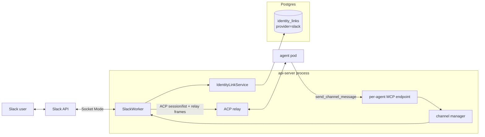
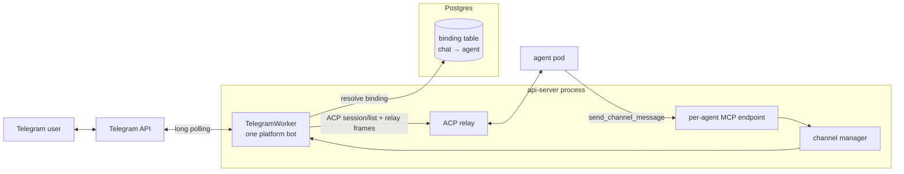

# Channels

Last verified: 2026-09-15

## Overview

A **channel** is a messenger surface (Slack, Telegram) that lets users drive an Agent from outside the UI. Channels are pluggable adapters that live inside the api-server process — no separate Deployment, no sidecar in the agent pod. Each adapter (the _worker_) owns its inbound socket, its outbound API, and its thread-to-session bookkeeping; a channel manager composes the workers and reacts to lifecycle events on the in-process event bus.

The workers are **single-holder across the deployment**: both transports admit one consumer per install, and a worker's turn bookkeeping lives in its process. One replica runs them, elected on a Kubernetes Lease; the rest run none, and take over within a lease TTL if it dies. Inbound therefore always reaches the worker holding the turn state. Outbound doesn't — a reply lands on whichever replica served the MCP call — so a non-leader marshals it to the leader over the Redis bus. Channel throughput is thus one replica's, below Slack's own ten-connection ceiling.

Channels are a **standard Agent surface**, not a pre-release one: every Agent exposes it, with no per-user opt-in in front of it. What can be bound there is the install's own decision — a worker exists only where its token is configured — and an install with no messenger says so on the surface rather than withdrawing it. Slack as a *Connection* is a separate surface; a channel needs nothing from it ([connections](connections.md)).

Bindings are **many-to-many**: an Agent may hold several at once — the same workspace, memory and skills reachable from many conversations without duplicating it — and a Slack conversation may hold several Agents, so a project channel reaches every Agent its team relies on. What a binding cannot be is doubled: one Agent connects to one conversation once. Agent delete releases all of that Agent's; a disconnect names the one to release. A binding **is** its (Agent, conversation) pair, so nothing moves one: reaching an Agent from somewhere else is a connect there and a release here, each its own deliberate act. No surface offers a compound that could release a binding and then fail to replace it. A Slack "conversation" is any surface the bot is party to: a public/private **channel**, a **group DM**, or a **1:1 DM**. The binding key is the conversation id in every case, so DMs and group DMs reuse the channel binding mechanics wholesale.

Because one install-wide bot serves every Agent, a bare `@bot` cannot say which Agent is meant. So a conversation carries at most one **default Agent** — the first connected, and the one a bare mention reaches — while a mention opening with an Agent's name reaches that Agent. Which Agent holds it can be changed, in-chat. A name matching nobody is not an address at all: it falls through to the default as ordinary prose. A name matching *several* Agents also falls through, but carries the unresolved name forward, so the default can say it could not tell them apart. Releasing the default leaves the conversation with **none** — nothing is promoted, since that would hand the load to an owner who never accepted it. Unnamed mentions are then refused, naming the connected Agents and how to set one; named mentions still work. A single-Agent conversation therefore behaves exactly as it always did, and nothing about the default surfaces until a second Agent joins.

Multiple bindings share the Agent but never each other's conversations: routing is by conversation id both ways, and every session key is qualified by the conversation it belongs to, so a thread — and a channel's read-along flow — stays inside the channel it happened in.

Channels split along a structural axis that has real consequences for secrets and identity:

- **Platform channel** — one app serves the whole install. The operator configures it once via Helm values; per-Agent config is just _which conversation this Agent listens to_. Both messengers are platform channels today. On Slack, identity linking ties messenger users to Keycloak subs at the workspace level.
- Telegram's variant: there is no workspace to anchor per-user identity in, so a Telegram _conversation_ binds to exactly one Agent — the owner consents by completing an in-chat `/bind` plus a web agent-picker flow — and anyone in the bound chat may drive that Agent.

### Shared access — the one model

The binding itself is the authorization: anyone the messenger admits to the conversation drives the Agent under the Agent's own credentials. There is no per-person access mode, no identity link required to drive a turn, and no allow-list. Every turn relays single-track to the main agent pod; the **binding owner's** Terms-of-Use acceptance gates each turn (the terms bind the party whose credentials run it, not the member who typed); the security log records each allow with basis _place_ and the sender's Slack user id; and the prompt text is speaker-labelled with the sender's Slack mention, so a multi-speaker session stays attributable inside the conversation itself.

Telegram is structurally identical — with no workspace to anchor per-user identity, consent attaches to the conversation and everyone in the bound chat drives the Agent.

#### Ambient mode

A Slack binding can additionally run in **ambient mode**: the agent reads along with the whole channel conversation and decides for itself when to chime in. It is a property of the **binding**, not the conversation, so one Agent can read along where another only answers mentions — answering a question it can answer, picking up a task someone described, flagging a clear mistake — staying silent otherwise. Mentions keep the addressed-turn treatment unchanged; ambient only adds a second, quieter inbound path.

Ambient is **mutable** and **off by default** on every connect path — the in-chat `/platform bind`, the UI form, and the CLI flag all leave it off, and the binding owner opts a channel in explicitly. Ambient has the agent read every message in the channel, so keeping that broader exposure a deliberate opt-in is the safe default. It can be flipped later — a re-connect updates it in place, and an in-chat ambient command (allowed for the binder or the agent's owner, the unbind authorization) is the in-channel dial. Every enable/disable is recorded in the security log, and that audit record is authoritative. The change is deliberately **not** announced in the channel — not on a connect, a re-connect, or the in-chat dial: whoever made it sees it confirmed on their own surface (the UI, the CLI, or the ephemeral slash-command reply for the in-chat command), and the channel's members get no ambient status post.

Where several Agents read along in one channel, they take each message **one at a time**, each starting only once the one before it finished. Running them concurrently would have them talk over each other; in sequence, a later Agent is handed what the ones before it said — it has no other way to know — so it builds on that or stays silent rather than repeating it. The **default Agent goes first** where it reads along, being the conversation's primary; the rest follow **shuffled**, freshly per message — past the default there is nothing to rank them by, and a stable order would quietly hand one Agent every second look. The cost is deliberate: a channel with several read-along Agents spends that many turns per message, which is why ambient stays a per-Agent opt-in.

Ambient turns are deliberately unobtrusive on the platform's side: the platform posts no acknowledgment reaction and no wake notices, and failures are logged and evented but never posted — nobody summoned the agent, and a turn dropped after the wait is recovered by catch-up on the next one. Acknowledgement instead comes from the agent itself: when a message is worth engaging, the ambient frame has it open with a fitting emoji reaction — a quiet, notifies-no-one signal that it has picked the message up, chosen to suit the message rather than a rote mark. The agent declines explicitly, or by ending its turn without posting. The frame also announces how the agent appears in the channel — the install's bot name and Slack id, and the agent name its posts are signed with — so a message that calls it by any of them is answered like a mention; the persona behind that name comes from the agent's workspace setup, never from the relay. Each relayed message is still security-logged as a place-basis allow (marked as ambient-triggered), and the binding owner's Terms-of-Use acceptance gates ambient turns like any shared turn — silently.

Inbound traffic and outbound traffic take different paths. Inbound is push from the messenger into the api-server worker, which routes the message to the agent pod over ACP. Outbound is pull initiated by the agent: the harness calls a tool on the api-server's per-Agent MCP endpoint, and the api-server delegates to the right worker.

One cross-cutting concern is owned elsewhere and only summarized here:

- **Thread-session binding.** A thread maps to one resumable session, so the agent gets real conversational continuity. The binding is carried on the session itself, resolved by listing sessions over ACP and matching — there is no server-side session store.

## Topology

Both adapters share the same shape inside the api-server — a worker that owns the messenger socket, the channel manager that supervises lifecycle, the ACP relay for inbound, and the per-Agent MCP endpoint for outbound. The interesting parts are where the two diverge: Slack hangs off a workspace-wide identity link table; Telegram hangs off its own binding table (conversation → Agent). Telegram's token comes from Helm values; Slack's app-level token does too, but a Slack bot token is per workspace.

### Slack — platform channel

The App-Level Token comes from Helm values and lives in api-server env; a Bot Token is per workspace and lives in a K8s Secret — neither is per-Agent. Resolving the channel's binding yields the Agent and the binding owner; the relay is single-track to the main pod. The workspace-wide identity-link table backs the `/platform login` flow, which authorizes the in-chat bind, unbind, ambient and default commands — never who may drive a turn.

### Telegram — platform channel

The bot token comes from Helm values and lives in api-server env, like the Slack tokens. A conversation binds to exactly one Agent in its binding table (the conversation id is the primary key); the single bot polls for the whole install and resolves each inbound message to its chat's binding. The relay path is single-track — the main pod handles every turn.

## Adapters

Both workers implement the same internal contract — start and stop, list conversations, post a message — keyed by agent id. The differences are transport, identity model, and where the bot token comes from.

### Slack — platform channel

- **Transport.** Socket Mode, one workspace-level WebSocket to Slack, opened by the lease-holding replica at boot so slash commands, mentions and DMs work in chats that have no binding yet (mirroring the Telegram client). The api-server has no inbound network access requirement; events arrive over the socket the api-server itself opened. Slack caps Socket Mode at ten concurrent connections per app, which is the install-level scale ceiling for Slack.
- **Token provenance.** The App-Level Token (`xapp-…`) is app-scoped: it comes from Helm values and stays singular, so one Socket Mode connection serves every installed workspace. A **Bot Token is per workspace**, because Slack scopes one to one workspace. Slack hands it over by copy-paste for the app's own workspace alone; every other workspace completes Slack's install handshake, and the token that mints lands in a K8s Secret with a row pointing at it — no credential in Postgres. Neither token is per-Agent.
- **Which workspace a call acts for is carried, never guessed.** Every binding, bound conversation and turn names its workspace, and an outbound call takes the workspace of the conversation it acts for. A call that cannot name one is refused rather than sent to a default. The **empty string means the install's original workspace** — the one the operator's Helm token belongs to, and what every binding made before the platform could install itself anywhere else already is. That is what lets an install that never runs the handshake behave exactly as it always did, with nothing to backfill and nothing asked of Slack at startup.
- **Re-install, not uninstall, is the lifecycle event.** A workspace re-authorizes to pick up scopes added to the manifest later; the handshake rewrites the same Secret in place, and bindings and identity links key on conversation and user id so they are untouched. A credential Slack rejects is **marked**, never cleaned up, and re-authorizing clears the mark. Nothing is deleted.
- **Identity linking.** A `/platform login` slash command starts a Keycloak OAuth flow; on callback the api-server stores `slack_user_id ↔ keycloak_sub`. The link table is the source of truth for "who is this Slack user in Platform terms" — consulted only to authorize the in-chat `bind`, `unbind`, `ambient` and `default` commands, never to admit a turn. `login`/`logout` stay working but are not listed in the bare-`/platform` usage help (which advertises the other four); the flows that need a linked identity still point users at `/platform login` in context.
- **In-chat binding.** Beyond the platform UI and CLI, a channel can be bound from inside Slack, mirroring Telegram: anyone runs `/platform bind`, authenticates through the same Keycloak OAuth flow, and picks one of _their own_ Agents on a web picker — the binding lends that Agent, under its own credentials, to the whole channel, exactly like every binding. The binding is created ambient-off; an in-chat ambient command reports and flips the binding's ambient mode afterward under the same binder-or-owner authorization as unbind. There is no admin gate (unlike Telegram's group-admin check); the ownership check on the picked Agent is the control, and the bind also links the initiator's identity so they can later release it. A bind never overrides an existing one — it adds an Agent to the conversation, and only the same Agent twice is refused. The commands take the Agent's name where more than one is connected, refusing and listing candidates rather than guessing. Changing the default is **in-chat only** — choosing well means seeing who else is connected, and only the channel shows that — and only its Agent's **owner** may take it, since the default absorbs every unnamed mention and that load runs on their credentials. The owner can also disconnect from the platform UI/CLI as an escape hatch.
- **DMs and group DMs** reuse the in-chat bind verbatim — the conversation id (`D…` for a 1:1 DM, an `mpim` id for a group DM) is the binding key, so `/platform bind` connects one of the binder's own Agents to the DM or group, exactly as it binds a channel. Only the _trigger_ differs: a bound **1:1 DM** relays every plain message, because every DM message is addressed to the bot — no `@mention`, and the prompt isn't speaker-labelled (a single human). A bound **group DM** stays mention-driven like a channel. A message into an _unbound_ DM or group is declined with an ephemeral pointing at `/platform bind` — the app's DM surface must be turned on first, or Slack refuses to send at all. Channels, DMs and groups mix freely in an Agent's binding set; each is just another conversation id.
- **Access control.** Channel membership is the only per-person gate, and Slack owns it — the platform never resolves who is typing; binding the channel is the consent that lends the Agent to the channel.
- **Agent resolution.** A mention (channel, group DM) or a plain 1:1-DM message resolves to exactly one Agent: the one whose name opens the message, else the conversation's default. Name matching is over the Agents connected to that conversation only, whole-name and case-insensitive, longest name first — Agent names are not unique, so a name matching two of them resolves to the default rather than a guess. An addressed message in an unconnected conversation is refused with an ephemeral.
- **Message intake.** The gateway subscribes to plain messages on three surfaces and pre-filters them all the same way: bot posts (including the agent's own replies, preventing loops), message edits and joins, and bot-mentions (those arrive on the mention path) never reach the worker. Surface then decides the route: **channel/group** messages feed ambient mode (relayed only when the binding has ambient on; everything else drops silently); **1:1 DM** messages feed the bound-DM relay (no mention needed); **group DM** plain messages are ignored — group DMs are mention-driven, so they arrive on the mention path. This requires the Slack app to subscribe to plain messages on all three surfaces with the matching history scopes, and to enable the App Home messages tab ([`etc/slack/app-manifest.yaml`](../../etc/slack/app-manifest.yaml)).

### Slack scopes: required vs. optional

Bot scopes in [`etc/slack/app-manifest.yaml`](../../etc/slack/app-manifest.yaml) split into two tiers. **Required** scopes back core turn handling (inbound delivery, posting, the working status); nothing works without them. The working status also needs the Agents & AI Apps feature declared — Slack grants its scope only with it. **Optional** scopes back individual affordances that must degrade rather than take anything else down when the workspace withholds them.

A withheld scope has no symptom of its own — the capability it backs behaves as though it were broken — so at startup the granted set is checked against what the running features need and any gap is reported with what it costs. A scope added to the manifest later never reaches an app already installed, which is what a **re-install** is for; granted sets therefore differ between workspaces, and each is read against the workspace the call acts for.

Which of two strategies an optional scope gets follows from what its absence means:

- **Degrade to a smaller result**, when a partial answer is still useful: attempted reactively, with a missing-scope failure caught and turned into a narrower result rather than an outright failure. `describe_channel` without the channel-list scopes still returns the bound conversations; a user profile without `users:read.email` still resolves, minus its `email` field.
- **Omit the capability entirely**, when no partial answer is possible: checked once proactively, not per call, and the affordance drops out of the tool list rather than staying registered to fail forever. **No Slack capability takes this path.** It is the tool list that would have to carry the verdict, and a tool list is per Agent while a grant is per workspace — so with several installed there is always a partial answer to give, and the rule above selects the first strategy for every one of them.

Either way an unreachable bot or unanswered check counts as _unknown_, never _missing_, and fails open, so a transient hiccup never hides a working capability.

### Telegram — platform channel

- **Transport.** Long-poll `getUpdates` — one client for the install, started by the lease-holding replica at boot (the Bot API admits no second consumer) so `/bind` works in chats that have no binding yet. The same boot step advertises the command list to the Bot API, which is what makes the commands offered when someone types `/`.
- **Token provenance.** The operator creates one bot via `@BotFather` and sets the token in Helm values; it reaches the api-server as env. No per-Agent Secrets, no token at rest in Postgres.
- **Identity model — there is none per user.** Telegram has no workspace to anchor a user-to-Keycloak link against, so consent attaches to the _conversation_: someone sends `/bind` (in groups, only chat admins; `/start` counts as bind intent too, so deep links and the Start button work), the bot replies with a Keycloak OAuth link, and after authenticating the user lands on the UI's agent picker listing _their own_ Agents. The bot posts a confirmation in the chat. The chat's members never authenticate. `/unbind` releases the binding, and the owner can also disconnect a bound chat from the web UI — the bot posts a farewell note in the chat before the binding is released. Unbound groups stay silent so the bot does not spam every chat it has been added to. The command surface is bare — `/bind`, `/unbind`, `/start` — not Slack's brand-prefixed form: a Telegram command is already scoped to the bot it reaches.
- **Lifecycle.** There is none per Agent — bindings are rows, not runtime state. Agent deletion clears the Agent's rows, on any deletion path.

Slack keeps per-Agent worker registration via `SlackConnected` / `SlackDisconnected` / `AgentDeleted` events on the rxjs bus, which is in-process, so they act only where the workers run — a bind served by another replica reaches the worker through the binding rows, which every path re-reads. Bootstrap runs when a replica takes the api-server lease: transports start independently, so one outage does not stop the others, and a failed one retries on a timer. It then walks the bindings to restore the registrations.

## Turn lifecycle

A channel message becoming an agent turn — the inbound relay into an ACP session, the outbound tools a turn answers with, the liveness watch on a running relay, and the recovery of an undelivered answer — is its own subsystem page: [channel-turns](channel-turns.md).

## Per-Agent vs. platform channel

Both messengers are platform channels: install-wide credentials from Helm and a conversation→Agent binding table, differing mainly in where the binding is gestured — Slack from the UI/CLI or an in-chat `/platform bind`, Telegram from an in-chat `/bind` plus the web agent picker. The verbs match; the spelling follows each messenger — Slack prefixes its registered slash command, Telegram uses bare ones. Future channels (WhatsApp Business, Discord, SMS) follow the same pattern — the Telegram flow is the template for messengers without a workspace identity to anchor per-user links against.

## Persistence touchpoints

Channels touch three stores; the substrate details live on [persistence](persistence.md):

- **Identity-link and binding tables (Postgres).** A binding **is** its (Agent, conversation) pair, so an Agent cannot connect to one conversation twice while several Agents may share it, and a conversation with **no** default is a state the store permits and the routing handles. An identity link ties a messenger user to a platform identity, populated by Slack's `/platform login` — which is what authorizes the in-chat bind/unbind/ambient/default commands. Table shapes and indexes: [persistence](persistence.md). Telegram's token and Slack's app-level token live in api-server env from Helm values; a Slack workspace's bot token is a K8s Secret, which its install row points at.

- **The Agent's workspace (per-Agent PVC).** A Slack attachment lands there for the agent to open, so a channel speaker writes to persistent state ([persistence](persistence.md)).

Channels do **not** participate in the Agent ConfigMap spec/status split: channel routing metadata lives in Postgres, secrets in k8s Secrets, Agent ConfigMaps stay channel-free.
