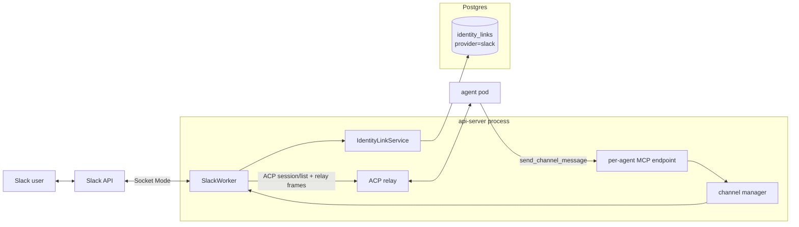
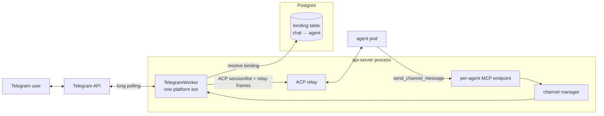

# Channels

Last verified: 2026-09-04

## Overview

A **channel** is a messenger surface (Slack, Telegram) that lets users drive an Agent from outside the UI. Channels are pluggable adapters that live inside the api-server process — no separate Deployment, no sidecar in the agent pod. Each adapter (the _worker_) owns its inbound socket, its outbound API, and its thread-to-session bookkeeping; a channel manager composes the workers and reacts to lifecycle events on the in-process event bus.

The workers are **single-holder across the deployment**: both transports admit one consumer per install, and a worker's turn bookkeeping lives in its process. One replica runs them, elected on a Kubernetes Lease; the rest run none, and take over within a lease TTL if it dies. Inbound therefore always reaches the worker holding the turn state. Outbound doesn't — a reply lands on whichever replica served the MCP call — so a non-leader marshals it to the leader over the Redis bus. Channel throughput is thus one replica's, below Slack's own ten-connection ceiling.

Channels are a **standard Agent surface**, not a pre-release one: every Agent exposes it, with no per-user opt-in in front of it. What can be bound there is the install's own decision — a worker exists only where its token is configured — and an install with no messenger says so on the surface rather than withdrawing it. Slack as a *Connection* is a separate surface; a channel needs nothing from it ([connections](connections.md)).

Bindings are **many-to-many**: an Agent may hold several at once — the same workspace, memory and skills reachable from many conversations without duplicating it — and a Slack conversation may hold several Agents, so a project channel reaches every Agent its team relies on. What a binding cannot be is doubled: one Agent connects to one conversation once. Agent delete releases all of that Agent's; a disconnect names the one to release. A binding **is** its (Agent, conversation) pair, so nothing moves one: reaching an Agent from somewhere else is a connect there and a release here, each its own deliberate act. No surface offers a compound that could release a binding and then fail to replace it. A Slack "conversation" is any surface the bot is party to: a public/private **channel**, a **group DM**, or a **1:1 DM**. The binding key is the conversation id in every case, so DMs and group DMs reuse the channel binding mechanics wholesale — same table, same resolution, same in-chat bind flow.

Because one install-wide bot serves every Agent, a bare `@bot` cannot say which Agent is meant. So a conversation carries at most one **default Agent** — the first connected, and the one a bare mention reaches — while a mention opening with an Agent's name reaches that Agent. Which Agent holds it can be changed, in-chat. A name matching nobody is not an address at all: it falls through to the default as ordinary prose. A name matching *several* Agents also falls through, but carries the unresolved name forward, so the default can say it could not tell them apart. Releasing the default leaves the conversation with **none** — nothing is promoted, since that would hand the load to an owner who never accepted it. Unnamed mentions are then refused, naming the connected Agents and how to set one; named mentions still work. A single-Agent conversation therefore behaves exactly as it always did, and nothing about the default surfaces until a second Agent joins.

Multiple bindings share the Agent but never each other's conversations: routing is by conversation id both ways, and every session key is qualified by the conversation it belongs to, so a thread — and a channel's read-along flow — stays inside the channel it happened in.

Channels split along a structural axis that has real consequences for secrets and identity:

- **Platform channel** — one app serves the whole install. The operator configures it once via Helm values; per-Agent config is just _which conversation this Agent listens to_. Both messengers are platform channels today. On Slack, identity linking ties messenger users to Keycloak subs at the workspace level.
- Telegram's variant: there is no workspace to anchor per-user identity in, so a Telegram _conversation_ binds to exactly one Agent — the owner consents by completing an in-chat `/platform bind` plus a web agent-picker flow — and anyone in the bound chat may drive that Agent.

### Shared access — the one model

The binding itself is the authorization: anyone the messenger admits to the conversation drives the Agent under the Agent's own credentials. There is no per-person access mode, no identity link required to drive a turn, and no allow-list. Every turn relays single-track to the main agent pod; the **binding owner's** Terms-of-Use acceptance gates each turn (the terms bind the party whose credentials run it, not the member who typed); the security log records each allow with basis _place_ and the sender's Slack user id; and the prompt text is speaker-labelled with the sender's Slack mention, so a multi-speaker session stays attributable inside the conversation itself.

Telegram is structurally identical — with no workspace to anchor per-user identity, consent attaches to the conversation and everyone in the bound chat drives the Agent.

#### Ambient mode

A Slack binding can additionally run in **ambient mode**: the agent reads along with the whole channel conversation and decides for itself when to chime in. It is a property of the **binding**, not the conversation, so one Agent can read along where another only answers mentions — answering a question it can answer, picking up a task someone described, flagging a clear mistake — staying silent otherwise. Mentions keep the addressed-turn treatment unchanged; ambient only adds a second, quieter inbound path.

Ambient is **mutable** and **off by default** on every connect path — the in-chat `/platform bind`, the UI form, and the CLI flag all leave it off, and the binding owner opts a channel in explicitly. Ambient has the agent read every message in the channel, so keeping that broader exposure a deliberate opt-in is the safe default. It can be flipped later — a re-connect updates it in place, and an in-chat ambient command (allowed for the binder or the agent's owner, the unbind authorization) is the in-channel dial. Every enable/disable is recorded in the security log, and that audit record is authoritative. The change is deliberately **not** announced in the channel — not on a connect, a re-connect, or the in-chat dial: whoever made it sees it confirmed on their own surface (the UI, the CLI, or the ephemeral slash-command reply for the in-chat command), and the channel's members get no ambient status post.

Where several Agents read along in one channel, they take each message **one at a time**, each starting only once the one before it finished. Running them concurrently would have them talk over each other; in sequence, a later Agent is handed what the ones before it said — it has no other way to know — so it builds on that or stays silent rather than repeating it. The **default Agent goes first** where it reads along, being the conversation's primary; the rest follow **shuffled**, freshly per message — past the default there is nothing to rank them by, and a stable order would quietly hand one Agent every second look. The cost is deliberate: a channel with several read-along Agents spends that many turns per message, which is why ambient stays a per-Agent opt-in.

Ambient turns are deliberately unobtrusive on the platform's side: the platform posts no acknowledgment reaction and no wake notices, and failures are logged and evented but never posted — nobody summoned the agent. Acknowledgement instead comes from the agent itself: when a message is worth engaging, the ambient frame has it open with a fitting emoji reaction — a quiet, notifies-no-one signal that it has picked the message up, chosen to suit the message rather than a rote mark. The agent declines explicitly, or by ending its turn without posting — the same explicit-reply contract that governs mention turns, re-stated on every prompt since ambient and mention-driven turns interleave in the same sessions. The frame also announces how the agent appears in the channel — the install's bot name and Slack id, and the agent name its posts are signed with — so a message that calls it by any of them is answered like a mention; the persona behind that name comes from the agent's workspace setup, never from the relay. Each relayed message is still security-logged as a place-basis allow (marked as ambient-triggered), and the binding owner's Terms-of-Use acceptance gates ambient turns like any shared turn — silently.

Inbound traffic and outbound traffic take different paths. Inbound is push from the messenger into the api-server worker, which routes the message to the agent pod over ACP. Outbound is pull initiated by the agent: the harness calls a tool on the api-server's per-Agent MCP endpoint, and the api-server delegates to the right worker.

One cross-cutting concern is owned elsewhere and only summarized here:

- **Thread-session binding.** A thread maps to one resumable session, so the agent gets real conversational continuity. The binding is carried on the session itself, resolved by listing sessions over ACP and matching — there is no server-side session store.

## Topology

Both adapters share the same shape inside the api-server — a worker that owns the messenger socket, the channel manager that supervises lifecycle, the ACP relay for inbound, and the per-Agent MCP endpoint for outbound. The interesting parts are where the two diverge: Slack hangs off a workspace-wide identity link table; Telegram hangs off its own binding table (conversation → Agent). Both messengers' tokens come from Helm values.

### Slack — platform channel



Bot and App-Level Tokens come from Helm values and live in api-server env — no per-Agent Secret. Resolving the channel's binding yields the Agent and the binding owner; the relay is single-track to the main pod. The workspace-wide identity-link table backs the `/platform login` flow, which authorizes the in-chat bind, unbind, ambient and default commands — never who may drive a turn.

### Telegram — platform channel



The bot token comes from Helm values and lives in api-server env, like the Slack tokens. A conversation binds to exactly one Agent in its binding table (the conversation id is the primary key); the single bot polls for the whole install and resolves each inbound message to its chat's binding. The relay path is single-track — the main pod handles every turn.

## Adapters

Both workers implement the same internal contract — start and stop, list conversations, post a message — keyed by agent id. The differences are transport, identity model, and where the bot token comes from.

### Slack — platform channel

- **Transport.** Socket Mode, one workspace-level WebSocket to Slack, opened by the lease-holding replica at boot so slash commands, mentions and DMs work in chats that have no binding yet (mirroring the Telegram client). The api-server has no inbound network access requirement; events arrive over the socket the api-server itself opened. Slack caps Socket Mode at ten concurrent connections per app, which is the install-level scale ceiling for Slack.
- **Token provenance.** App-Level Token (`xapp-…`) and Bot Token come from Helm values, set at install time. Not stored per-Agent.
- **Identity linking.** A `/platform login` slash command starts a Keycloak OAuth flow; on callback the api-server stores `slack_user_id ↔ keycloak_sub`. The link table is the source of truth for "who is this Slack user in Platform terms" — consulted only to authorize the in-chat `bind`, `unbind`, `ambient` and `default` commands, never to admit a turn. `login`/`logout` stay working but are not listed in the bare-`/platform` usage help (which advertises the other four); the flows that need a linked identity still point users at `/platform login` in context.
- **In-chat binding.** Beyond the platform UI and CLI, a channel can be bound from inside Slack, mirroring Telegram: anyone runs `/platform bind`, authenticates through the same Keycloak OAuth flow, and picks one of _their own_ Agents on a web picker — the binding lends that Agent, under its own credentials, to the whole channel, exactly like every binding. The binding is created ambient-off; an in-chat ambient command reports and flips the binding's ambient mode afterward under the same binder-or-owner authorization as unbind. There is no admin gate (unlike Telegram's group-admin check); the ownership check on the picked Agent is the control, and the bind also links the initiator's identity so they can later release it. A bind never overrides an existing one — it adds an Agent to the conversation, and only the same Agent twice is refused. The commands take the Agent's name where more than one is connected, refusing and listing candidates rather than guessing. Changing the default is **in-chat only** — choosing well means seeing who else is connected, and only the channel shows that — and only its Agent's **owner** may take it, since the default absorbs every unnamed mention and that load runs on their credentials. The owner can also disconnect from the platform UI/CLI as an escape hatch.
- **DMs and group DMs** reuse the in-chat bind verbatim — the conversation id (`D…` for a 1:1 DM, an `mpim` id for a group DM) is the binding key, so `/platform bind` connects one of the binder's own Agents to the DM or group, exactly as it binds a channel. Only the _trigger_ differs: a bound **1:1 DM** relays every plain message, because every DM message is addressed to the bot — no `@mention`, and the prompt isn't speaker-labelled (a single human). A bound **group DM** stays mention-driven like a channel. A message into an _unbound_ DM or group is declined with an ephemeral pointing at `/platform bind` — the app's DM surface must be turned on first, or Slack refuses to send at all. Channels, DMs and groups mix freely in an Agent's binding set; each is just another conversation id.
- **Access control.** Channel membership is the only per-person gate, and Slack owns it — the platform never resolves who is typing; binding the channel is the consent that lends the Agent to the channel.
- **Agent resolution.** A mention (channel, group DM) or a plain 1:1-DM message resolves to exactly one Agent: the one whose name opens the message, else the conversation's default. Name matching is over the Agents connected to that conversation only, whole-name and case-insensitive, longest name first — Agent names are not unique, so a name matching two of them resolves to the default rather than a guess. An addressed message in an unconnected conversation is refused with an ephemeral.
- **Message intake.** The gateway subscribes to plain messages on three surfaces and pre-filters them all the same way: bot posts (including the agent's own replies, preventing loops), message edits and joins, and bot-mentions (those arrive on the mention path) never reach the worker. Surface then decides the route: **channel/group** messages feed ambient mode (relayed only when the binding has ambient on; everything else drops silently); **1:1 DM** messages feed the bound-DM relay (no mention needed); **group DM** plain messages are ignored — group DMs are mention-driven, so they arrive on the mention path. This requires the Slack app to subscribe to plain messages on all three surfaces with the matching history scopes, and to enable the App Home messages tab ([`deploy/slack-app-manifest.yaml`](../../deploy/slack-app-manifest.yaml)).

### Telegram — platform channel

- **Transport.** Long-poll `getUpdates` — one client for the install, started by the lease-holding replica at boot (the Bot API admits no second consumer) so `/platform bind` works in chats that have no binding yet.
- **Token provenance.** The operator creates one bot via `@BotFather` and sets the token in Helm values; it reaches the api-server as env. No per-Agent Secrets, no token at rest in Postgres.
- **Identity model — there is none per user.** Telegram has no workspace to anchor a user-to-Keycloak link against, so consent attaches to the _conversation_: someone sends `/platform bind` (in groups, only chat admins; `/start` counts as bind intent too, so deep links and the Start button work), the bot replies with a Keycloak OAuth link, and after authenticating the user lands on the UI's agent picker listing _their own_ Agents. The bot posts a confirmation in the chat. The chat's members never authenticate. `/platform unbind` releases the binding, and the owner can also disconnect a bound chat from the web UI — the bot posts a farewell note in the chat before the binding is released. Unbound groups stay silent so the bot does not spam every chat it has been added to. The command surface is deliberately the same subcommand form Slack uses, with a bare `/platform` printing the two commands.
- **Lifecycle.** There is none per Agent — bindings are rows, not runtime state. Agent deletion clears the Agent's rows via the channel-cleanup saga.

Slack keeps per-Agent worker registration via `SlackConnected` / `SlackDisconnected` / `AgentDeleted` events on the rxjs bus, which is in-process, so they act only where the workers run — a bind served by another replica reaches the worker through the binding rows, which every path re-reads. Bootstrap runs when a replica takes the api-server lease: transports start independently, so one outage does not stop the others, and a failed one retries on a timer. It then walks the bindings to restore the registrations.

## Inbound — channel message to ACP session

```mermaid
sequenceDiagram
  autonumber
  participant U as Channel user
  participant M as Messenger API
  participant W as Worker<br/>(Slack/Telegram)
  participant API as api-server relay
  participant POD as agent pod

  U->>M: post message in thread
  M-->>W: event delivery<br/>(Socket Mode / long-poll)
  W->>W: identity / auth checks
  W->>API: ACP session/list
  API-->>W: sessions + platform meta<br/>(wakes pod if hibernated)
  alt a session's thread key matches
    W->>M: Slack only: read after this Agent's last turn
    M-->>W: messages it has not seen
    W->>API: ACP session/prompt<br/>(resume + catch-up)
  else first message in thread
    W->>API: ACP session/new<br/>(platform meta: type, thread)
    API-->>W: sessionId
    W->>API: ACP session/prompt<br/>(thread history as context)
  end
  API->>POD: relay frames<br/>(wake if hibernated)
  POD->>API: reply / react tool call<br/>(outbound MCP, see below)
  API->>W: reply(threadTs, text) / react
  W->>M: post reply in thread
  M-->>U: reply visible
  Note over POD,W: plain assistant text is not posted;<br/>the agent must call a tool
```

A few observations the diagram glosses over:

- **The gates are the binding check plus the binding owner's Terms-of-Use acceptance** — no sender identity is resolved. Both messengers behave identically here. An unallowed host is refused, not held ([egress](security-and-credentials.md)).
- **An attachment is a picture the agent is shown or a file it is handed**, by what the sender sent, not what the bytes are. Slack only: Telegram drops one at its gateway. A picture becomes prompt content only in a format the harness decodes, the sniffed type outranking the messenger's label. Everything else is written into the agent's workspace and linked by absolute path, as a web-UI upload is, whatever its format. Anything withheld — a refusing messenger, a failed write, a size ceiling — is named to the agent, and on an addressed turn to the sender too.
- **Wake is implicit.** The relay step is the same `ACP relay → wake-if-hibernated → forward` path used by the UI. Channels do not call lifecycle endpoints directly; routing an ACP frame is what wakes the pod ([agent-lifecycle](agent-lifecycle.md), §Wake).
- **Wake failures are surfaced in human terms.** A cold start announces itself to the Slack sender (requester-only notice); a wake that misses its budget while the pods are still progressing posts a still-starting note and waits one more window before answering, so a healthy-but-slow start never loses the turn. A hard failure (pod crash, bad image, a wedged gateway, reconcile error) replies with copy derived from the classified wake-failure cause — never the internal error string, and never raw controller messages; a cause the platform is itself repairing still invites a retry. Telegram replies with the same copy on wake failures (no early notice, no extended wait).
- **The agent posts by calling a tool — plain assistant text is never delivered.** A Slack turn's reply reaches the channel only when the agent calls one of its outbound tools (see [Outbound](#outbound--agent-to-channel)), mirroring how Telegram already works. The relay hands the message to the pod and waits for the turn to finish, but the assistant's generated text is discarded — nothing is auto-posted. The prompt carries a per-turn contract stating this and naming the thread and triggering message the tools target by default, so the agent replies into the right thread without tracking ids. It also situates the turn: the bot's identity, when the message was sent, which kind of conversation it is, and a permalink where Slack resolves one. A mention or DM turn is marked addressed, and the contract names the ways people reach an agent — the bot's tag, the agent's signed name, and (only where plain messages reach it) the bot name with no tag.
- **The contract speaks for its own message.** A session continued in the UI carries this text with it, so the contract scopes itself to its own message and says what an unframed one means: not from Slack, answered where it arrived, reaching Slack on request ([platform-topology](platform-topology.md), §ui).
- **A working status is the one thing the platform presents on the agent's behalf.** On mention turns a per-turn _presenter_ drives Slack's assistant-status surface — thinking, the current tool as it changes, waking during a cold start — cleared on every turn-exit path. Thought and tool notifications feed it; assistant text is ignored. The status degrades to nothing where the workspace can't show it. Ambient turns present no status — nobody summoned the agent. System notices (wake failures, a still-starting note) are separate direct posts, not agent content.
- **Resume vs. new is decided by the ACP session list.** The binding lives on the session itself: the worker lists an Agent's sessions over ACP and resumes the one whose thread key matches. A resume that fails (PVC lost, session expired) falls back to a fresh session with thread history injected from the messenger API — no regression, just a colder start.
- **A thread resume is caught up on what it missed, best-effort (Slack).** A thread's session belongs to one Agent, so an Agent sees the thread's history only on its first turn there — and a mention-only binding is never handed a message that does not tag it, so all said in between, by people or by peer Agents, was lost to it. A resuming thread turn therefore also carries what arrived after its own last turn, labelled as above and marked unseen; its own posts stay out, nothing new means no block, and the boundary advances only as far as a read reached. The boundary is in-process: a restart, a handover, or a thread left idle long enough loses it and the Agent's own last post stands in, and where neither survives the turn proceeds without one — best-effort, not a guarantee it saw everything. Excluded: the per-channel ambient session, which is relayed every message, and Telegram.
- **A conversation answers a burst once, one turn at a time.** People write a thought over several messages, so messages for one conversation gather behind a short quiet period and one turn carries them all. A message arriving while a turn runs is **steered** into it where the harness advertises support for that, so the Agent reads it before calling its reply tool; otherwise it becomes the next turn, never a second turn racing the first. Both the batch and the wait are capped. A message carrying attachments is never steered — they reach the Agent through their own turn — and it holds back what follows, so nothing is reordered. Both messengers share the queue, and so does read-along traffic — but a read-along batch is never steered, since it fans out to one turn per reading Agent and there is no single turn to steer into. The queue is per conversation: the thread where there is one, else the chat on Telegram, or the channel on Slack — narrowed to the sender where the Agent was addressed, so two people raising different things stay separate turns.
- **A session key is adapter-specific.** Slack pairs the conversation with the thread; Telegram uses the conversation (chat plus optional forum topic). Slack's pairing is what isolates an Agent's bindings from each other — a thread id is unique only inside its conversation, so a bare one would cross channels. Nothing in a store guards the key: Slack serializes turns per (Agent, session key) across the session match and the prompt, so concurrent first messages cannot mint duplicate sessions.
- **Injected history is attributed per Agent (Slack).** When a fresh session injects thread/channel history, each prior message is labelled by author. Because the single install-wide bot posts for every Agent, a bot message's Slack user id cannot tell Agents apart — so the worker takes the Agent id from each message's [Agent Footer](#the-agent-footer): the reading Agent's own posts are marked as its own, another Agent's are named, and humans keep their Slack id. Names are resolved from those ids rather than read off the footer, so a renamed Agent's older posts carry its **current** name. This lets an Agent reaching into a channel bound to a different Agent stay distinguishable when that Agent later reads the channel. A footer-less bot post is named as the bot itself — unattributable, so never the reader's own.
- **Ambient routing: one session per thread, plus one per channel.** On an ambient binding, a thread reply relays into that thread's own session — the same key a mention there would resume. Top-level messages share a single rolling **ambient session** per channel, so the agent follows the channel rather than starting cold per message. **All** ambient traffic is serialized per session and coalesced under the same rule as addressed traffic (above). A coalesced prompt tags each message with its own ts: a thread batch still answers into its one thread, but a top-level batch has no single triggering message — each batched message registers as its own reply target, and a reply naming none is refused rather than threaded under the newest. When the agent chimes in, the reply threads under the message it answers; the follow-up conversation runs as an ordinary thread session, with history injection carrying context across.
- **Every turn relay is evented.** Both workers announce the finished turn on the in-process bus, naming the messenger, the Agent, and whether it succeeded. It carries no platform identity — channel turns resolve none — so attribution rides the messenger-native id of the sender instead. A failure additionally carries a low-cardinality failure reason (the classified wake-failure cause or a generic relay error), which the audit trail and usage records project — so failed turns are diagnosable from the log store after the fact. The usage subsystem consumes this for activity tracking ([usage-tracking](usage-tracking.md)).

## Outbound — agent to channel

Outbound is initiated by the agent process. The harness calls a tool on the api-server's per-Agent MCP endpoint, the endpoint authenticates the call, and the channel manager routes the message back through the right worker.

What the agent sees:

- **Cross-channel tools.** `describe_channel` reports the chats an Agent can reach; `send_channel_message` makes a **new top-level post** — for proactive or cross-channel messages, never a turn reply. Where a target is ambiguous the worker refuses and names the candidates rather than picking one.
- **The agent meets people as ids, and resolves them itself.** A messenger names a person only by their user id — in speaker labels, injected history, and mentions inside message text — so `describe_channel_users` turns ids into people, as far as the workspace discloses. The lookup posts nothing, is gated by the binding, and is logged by the ids asked about, never the profiles. Slack-only: Telegram has no workspace directory.
- **Reactions are otherwise invisible; `describe_message_reactions` is how an agent asks.** Never cached, unlike the user directory: a tally is live state, and the current count is the point of asking. Gated by the binding; the log records the message and tally, never who reacted. Slack only.
- **Slack turn tools** — `reply`, `react`, and `hand_off_to_agent` — are how an Agent disposes of the turn it is handling. A reply may additionally surface in the channel (Slack's native "also send to channel"), off by default, for threads that have scrolled out of sight. A reply may also carry one file, as `send_channel_message` can; it is uploaded into the same thread after the text, and a failed upload is reported with the text already delivered. A single Agent pod multiplexes every thread over one harness process and one outbound MCP identity, so a call that does not name its target carries nothing to tell concurrent turns apart: where the candidates disagree the worker **refuses and asks for the injected id** rather than guess — posting one thread's reply into another is the failure worth preventing. A call targeting a turn posts into that turn's own conversation, not whatever the Agent is bound to at call time, so a mid-turn rebind cannot redirect an in-flight reply.
- **An Agent can hand its turn to a peer.** In a conversation holding several Agents, `hand_off_to_agent` gives the message to another Agent connected there — the default Agent acting as a router, or an Agent that was named but is the wrong one. The receiving Agent picks it up as its own turn and answers in the thread itself; the handing Agent posts nothing and its turn ends, counted as deliberately disposed of rather than unanswered. A handed-on message **cannot be handed on again**, which is what stops a message circling. The hand-off is refused when the named Agent is not connected there, is the caller itself, or cannot take turns yet; attribution stays with the original human sender, with the hop recorded.
- **`no_reply_needed` is cross-channel.** Both messengers instruct the agent to call it to end a turn deliberately silent, rather than leaving undelivered text. It posts nothing and touches no channel, but it does mark the turn declined — which keeps a sanctioned silence out of the unanswered-turn signal.
- **Slack reach is the bot's own membership.** A bound Agent may post beyond its bound conversations: any workspace channel the install-wide bot belongs to is a valid target, and a Slack user id opens a DM. Membership is verified at send time; a bound conversation short-circuits every check, so it keeps working regardless of app scopes. Every outbound post is made by the bot and footed with an [Agent Footer](#the-agent-footer). The workspace is the reach boundary, granted scopes the ceiling. The binding governs who may drive the Agent inbound, not what the Agent does outbound. Telegram has no analogue: its outbound targets stay the conversations bound to the Agent.
- **Tools are always registered, with two exceptions.** Calls are rejected at invocation time when no channel is connected for the Agent — no dynamic tool list, no per-session toggle. `describe_channel_users` and `describe_message_reactions` are gated before that: each drops from the tool list when Slack's granted scopes are confirmed to lack what it needs (see [Slack scopes: required vs. optional](#slack-scopes-required-vs-optional)) — a missing binding is per-Agent and temporary, a missing scope is install-wide and permanent.
- **Bidirectional channel.** If a channel is connected to an Agent, every session on that Agent can post — interactive and scheduled alike. There is no per-session outbound flag.

### The Agent Footer

Every post the bot makes is footed with an **Agent Footer**: a context block linking to the posting Agent's [Public Agent Page](public-agent-page.md), carrying the Agent id and — on a turn's reply — the session it ran on. Its owner picks that conversation up in the UI, where only they may open it ([platform-topology](platform-topology.md), §ui); everyone else lands on a page naming the Agent rather than a dead end.

The footer has two separable parts and **only one is a contract**. The **Agent id in the URL is the wire format** — parsing it back out is how the api-server recovers the author when a post later surfaces in another Agent's injected history (see [Inbound](#inbound--channel-message-to-acp-session)). The **link label is presentation**: nothing parses it, so product rewords it freely — today the posting Agent's name and the brand, which is what tells two Agents in one conversation apart.

Keeping those apart is an **invariant**, not tidiness. Attribution used to read the Agent's name out of the label, so rewording it into a brand line silently unnamed every Agent in injected history — a copy change breaking a runtime feature, with nothing failing anywhere. Attribution reads the id and resolves a name from it, which is also why the parser still accepts the footer's older link forms (the authenticated chat route and its retired predecessor): history predating the change stays attributable.

### Slack scopes: required vs. optional

Bot scopes in [`deploy/slack-app-manifest.yaml`](../../deploy/slack-app-manifest.yaml) split into two tiers. **Required** scopes back core turn handling (inbound delivery, posting, the working status); nothing works without them. **Optional** scopes back individual affordances that must degrade rather than take anything else down when the workspace withholds them.

A withheld scope has no symptom of its own — the capability it backs behaves as though it were broken — so at startup the granted set is checked against what the running features need and any gap is reported with what it costs. A scope added to the manifest later never reaches an app already installed.

Which of two strategies an optional scope gets follows from what its absence means:

- **Degrade to a smaller result**, when a partial answer is still useful: attempted reactively, with a missing-scope failure caught and turned into a narrower result rather than an outright failure. `describe_channel` without the channel-list scopes still returns the bound conversations; a user profile without `users:read.email` still resolves, minus its `email` field.
- **Omit the capability entirely**, when no partial answer is possible: checked once proactively, not per call. On a confirmed miss the affordance drops out of the tool list — and out of any prompt text pointing at it — rather than staying registered to fail forever. `describe_channel_users` and `describe_message_reactions` take this path, both being useless without their scope. An unreachable bot or unanswered check counts as _unknown_, never _missing_, and fails open, so a transient hiccup never hides a working capability.

Why the dedicated MCP endpoint: it is the only api-server port the agent's NetworkPolicy admits, and it is per-Agent by path with the mesh admitting each Agent's identity to its own path alone — so what stops a compromised harness posting as another Agent is that boundary, not the channel layer ([platform-topology](platform-topology.md), [security-and-credentials](security-and-credentials.md)). What channels adds is directness: the endpoint dispatches into the same posting path the workers use internally, with no agent-runtime round-trip and no second relay hop.

### Threading model

Outbound posts are **fire-and-forget at the thread level**. The agent posts a top-level message; the worker stores no thread-to-session mapping for proactive posts. If a user replies to the resulting thread, the inbound path treats it as a new mention — a fresh session. Continuity from the originating session does not carry over. This is the deliberate trade-off: keep outbound simple and stateless at the cost of session bridging on Slack-side replies.

The two messengers diverge slightly on what a top-level post means:

- **Slack:** the worker posts outside any thread, producing a new top-level message. A reply to it is routed by the _reply conversation's own_ bindings like any inbound message — so it reaches whoever that conversation's routing resolves, which need not be the Agent that posted, and nobody where none is connected. An Agent-initiated DM lands in the person's DM regardless of any binding but does not itself bind it: for their replies to reach the Agent, the DM must be connected like any other conversation.
- **Telegram:** there is no thread primitive in DMs and only weak threading in groups. The worker posts to the chat id; if the agent's prompt was triggered by a previous message in the same chat, that chat is still the conversation.

## Per-Agent vs. platform channel

Both messengers are platform channels: install-wide credentials from Helm and a conversation→Agent binding table, differing mainly in where the binding is gestured — Slack from the UI/CLI or an in-chat `/platform bind`, Telegram from an in-chat `/platform bind` plus the web agent picker. Both expose the same in-chat command surface — `/platform bind` and `/platform unbind`. Future channels (WhatsApp Business, Discord, SMS) follow the same pattern — the Telegram flow is the template for messengers without a workspace identity to anchor per-user links against.

## Persistence touchpoints

Channels touch three stores; the substrate details live on [persistence](persistence.md):

- **Identity-link and binding tables (Postgres).** A binding **is** its (Agent, conversation) pair, so an Agent cannot connect to one conversation twice while several Agents may share it, and a conversation with **no** default is a state the store permits and the routing handles. An identity link ties a messenger user to a platform identity, populated by Slack's `/platform login` — which is what authorizes the in-chat bind/unbind/ambient/default commands. Table shapes and indexes: [persistence](persistence.md). Both messengers' tokens live in api-server env from Helm values; there are no channel Secrets in k8s.

- **The Agent's workspace (per-Agent PVC).** A Slack attachment lands there for the agent to open, so a channel speaker writes to persistent state ([persistence](persistence.md)).

Channels do **not** participate in the Agent ConfigMap spec/status split: channel routing metadata lives in Postgres, secrets in k8s Secrets, Agent ConfigMaps stay channel-free.
