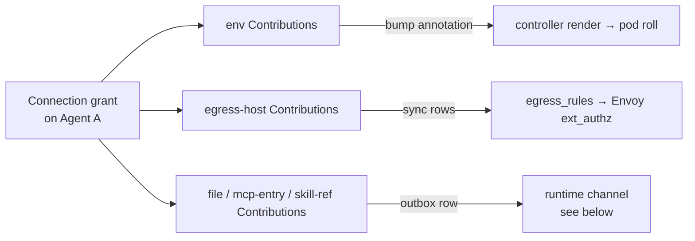
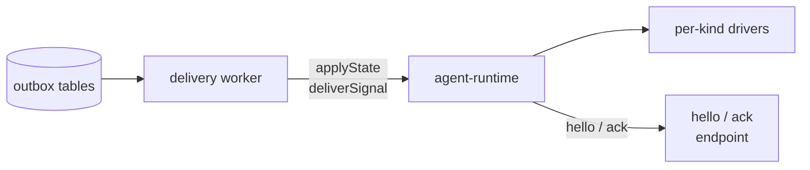
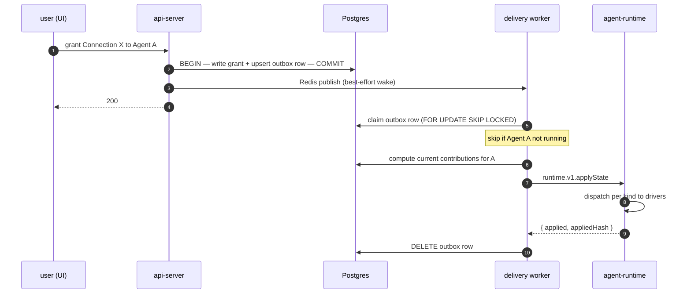
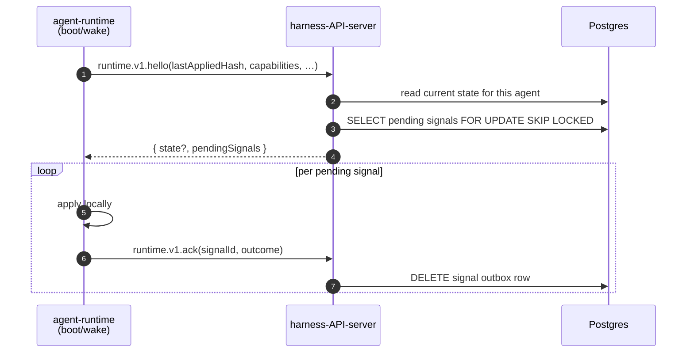

# Connections, Contributions, and the Runtime Channel

Last verified: 2026-05-21

## Motivated by

- [ADR-047 — Connections, Connection Templates, and Contributions: unified configuration model](../adrs/047-connections-and-contributions.md) — the domain shape that replaces the parallel OAuth-app and provider-preset registries
- [ADR-048 — Unified runtime channel](../adrs/048-runtime-channel.md) — the wire protocol between api-server and agent-runtime; supersedes pod-files SSE (ADR-034) and trigger files (ADR-008)
- [ADR-049 — Transactional outbox + worker](../adrs/049-runtime-outbox-worker.md) — how mutations decouple from agent reachability
- [ADR-036 — Redis as a platform primitive](../adrs/036-redis-platform-primitive.md) — the signal-path substrate the worker wakes on
- [ADR-022 — Harness API server](../adrs/022-harness-api-server.md) — the restricted port the agent reaches and where its outbound `hello` lands
- [ADR-040 — Unified secret contributions](../adrs/040-unified-secret-contributions.md) — the `env` Contribution's render-time merge survives unchanged

## Overview

A Connection is everything an agent needs to talk to one external integration — credentials, hosts to reach, config files to author, MCP entries to expose, skills to install. Connection Templates are code-level catalog entries that ship defaults; granting a Connection to an Agent materializes its Contributions into the right destinations.

The subsystem cuts cleanly across three bounded contexts:

- **api-server — Connections context** owns Connection Templates, Connections, grants. Computes per-agent Contribution snapshots. Routes Contributions to the right rail per kind.
- **api-server — Runtime Delivery context** owns the outbox tables, the delivery worker, the `runtime.applyState` and `runtime.deliverSignal` calls into agents, and the `runtime.hello` / `runtime.ack` callbacks from agents.
- **agent-runtime — Runtime Channel context** receives `applyState` and `deliverSignal`, dispatches Contributions to per-kind drivers, reconciles on-disk state to match the snapshot, calls back to `hello` on boot.

A grant of one Connection produces Contributions of several kinds. They don't all travel the same rail:



Two of the three rails were already in place before this subsystem and stay unchanged ([ADR-040](../adrs/040-unified-secret-contributions.md) for envs; [ADR-035](../adrs/035-unified-hitl-ux.md) for egress_rules). The third rail — the runtime channel — is new and is what the rest of this page is about.

The runtime channel itself is two pairs of tRPC routes between api-server and agent-runtime, with the outbox + worker as the delivery substrate:



State changes write to the outbox, the worker reads and dispatches, the agent receives state pushes and signal pushes, and the agent calls back on boot/wake to catch up. Everything else in this subsystem hangs off these two diagrams.

## Concepts

### Connection Template

A code-level catalog entry. Premade templates (GitHub, Anthropic, Spotify, Linear MCP, …) ship with full defaults — auth flow, hosts, scopes, recommended contributions. Custom templates (Custom MCP, Custom OAuth, Custom Header) ship the *shape* but leave the integration's identity for the user to fill in.

Two display-axis attributes drive UI grouping:

| `category` | `isCustom` | Where the user encounters it |
|---|---|---|
| `app` | `false` | Apps section: GitHub, Spotify, Anthropic, OpenAI, Google services, GitHub Enterprise, … |
| `mcp` | `false` | MCP servers section: Linear MCP, Atlassian MCP, … (as added) |
| `mcp` | `true` | Custom Connection → "Add MCP server" |
| `other` | `true` | Custom Connection → "Add OAuth credential" / "Add Header credential" |

Templates are registered in code; adding a new integration is one entry. Schemas validate user input; the template's `build()` function projects inputs into the concrete `auth` + `contributions[]` of the Connection record.

### Connection

A uniform shape — every Connection looks the same regardless of category or auth mode:

```ts
interface Connection {
  id: string;
  ownerId: string;            // K8s sub
  templateId: string;         // which Template this was built from
  name: string;               // user-visible label
  inputs: Record<string, unknown>;   // raw user-typed values, for re-render
  auth: AuthConfig;
  contributions: Contribution[];
}

type AuthConfig =
  | { kind: "oauth"; clientId: string; refreshTokenRef: SecretRef; accessToken: SecretRef; scopes: string[]; ... }
  | { kind: "api-key"; valueRef: SecretRef; injection: { headerName: string; valueFormat: string } }
  | { kind: "header"; valueRef: SecretRef; headerName: string; valueFormat: string }
  | { kind: "none" };
```

The auth field carries credential-acquisition state (tokens, refresh schedules) separately from contributions, because credentials have their own lifecycle.

### Contribution

A typed unit a Connection emits when granted to an Agent. Discriminated union, extensible per [ADR-048's evolution rule](../adrs/048-runtime-channel.md):

```ts
type Contribution =
  | { kind: "env";          name: string; placeholder: string }
  | { kind: "egress-host";  host: string; pathPattern?: string; injection?: HostInjection }
  | { kind: "file";         path: string; format: "yaml"|"json"|"text"|"ini"; mergeMode: MergeMode; content: unknown }
  | { kind: "mcp-entry";    name: string; url: string; headers?: Record<string,string> }
  | { kind: "skill-ref";    sourceUrl: string; name: string; version: string };
```

Kinds are added by extending the union and gating on agent capabilities (see [Versioning](#versioning)).

## Example Connections

### App preset: GitHub Enterprise

```jsonc
{
  "id": "conn-7a8b",
  "templateId": "github-enterprise",
  "name": "GHE (ghe.acme.com)",
  "inputs": { "host": "ghe.acme.com", "clientId": "…", "clientSecret": "…" },
  "auth": {
    "kind": "oauth",
    "clientId": "Iv1.…",
    "refreshTokenRef": { "secretName": "platform-secret-conn-7a8b", "key": "refresh_token" },
    "accessToken":     { "secretName": "platform-secret-conn-7a8b", "key": "access_token" },
    "scopes": ["repo", "read:user", "user:email"]
  },
  "contributions": [
    { "kind": "egress-host", "host": "ghe.acme.com" },
    { "kind": "env",         "name": "GH_TOKEN", "placeholder": "dummy-placeholder" },
    { "kind": "env",         "name": "GH_HOST",  "placeholder": "ghe.acme.com" },
    { "kind": "file",
      "path": "$HOME/.config/gh/hosts.yml",
      "format": "yaml",
      "mergeMode": "key-targeted",
      "content": { "ghe.acme.com": { "oauth_token": "dummy-placeholder", "git_protocol": "https" } } }
  ]
}
```

### Custom MCP server

```jsonc
{
  "id": "conn-1d2e",
  "templateId": "custom-mcp",
  "name": "Acme internal MCP",
  "inputs": { "url": "https://mcp.acme.internal/sse", "authMode": "oauth" },
  "auth": { "kind": "oauth", "clientId": "…", "scopes": [], "…": "…" },
  "contributions": [
    { "kind": "egress-host", "host": "mcp.acme.internal" },
    { "kind": "mcp-entry",   "name": "acme",
      "url": "https://mcp.acme.internal/sse",
      "headers": { "Authorization": "Bearer dummy-placeholder" } }
  ]
}
```

### Custom Header credential

```jsonc
{
  "id": "conn-3f4a",
  "templateId": "custom-header",
  "name": "Internal billing API",
  "inputs": { "host": "billing.acme.internal", "headerName": "X-API-Key", "value": "…" },
  "auth": {
    "kind": "header",
    "valueRef":   { "secretName": "platform-secret-conn-3f4a", "key": "value" },
    "headerName": "X-API-Key",
    "valueFormat": "{value}"
  },
  "contributions": [
    { "kind": "egress-host", "host": "billing.acme.internal" }
  ]
}
```

## Contribution fan-out

The api-server's contribution-fanout layer routes each Contribution kind to the rail that delivers it. Different rails because the kinds have genuinely different delivery semantics:

| Kind | Rail | Delivery semantics | Note |
|---|---|---|---|
| `env` | Controller render at next pod start | Requires pod roll; immutable on a running pod | Implemented by bumping the `secrets-rev` annotation on the agent's ConfigMap; controller's existing reconciler re-renders. ADR-040 mechanism preserved. |
| `egress-host` | Postgres `egress_rules` → Envoy `ext_authz` | Live read; no pod involvement | Joined per-grant; revoke sweeps rows. Agent never sees these. |
| `file` | Runtime channel `applyState` snapshot | Sub-second push; idempotent reconciliation | Per-format + per-mergeMode driver materializes. |
| `mcp-entry` | Runtime channel `applyState` snapshot | Sub-second push; idempotent reconciliation | Driver dispatches to harness-specific path. |
| `skill-ref` | Runtime channel `applyState` snapshot | Sub-second push; per-version installer | Driver wraps existing skill-fetch helpers. |

The rail choice is a property of the kind, not of the Connection. A single grant of GitHub Enterprise produces Contributions on three rails: `env` (controller render → pod roll), `egress-host` (egress_rules → Envoy live), and `file` (runtime channel push). They flow independently.

## The runtime channel

Four tRPC routes, two on each side, prefixed by protocol-major version (`runtime.v1.*`). Adding a new kind, signal action, or optional field stays on `v1` — capability flags carry the gate; new majors only on semantic break.



### `applyState` — state delivery (server → agent)

Carries the **full desired Contribution set** for one Agent. Agent reconciles per kind. Idempotent: re-applying the same payload is a no-op (the content hash short-circuits trivially-equal applications).

```ts
runtime.v1.applyState({
  contributions: Contribution[];   // full snapshot, post-capability-filter
  version: number;                 // per-agent monotonic; agent rejects older
  hash: string;                    // deterministic hash over contributions
}) => { applied: boolean; appliedHash: string }
```

Concurrent dispatches from different replicas race naturally; the agent's `lastAppliedVersion` rejects older versions, last-version-wins. The hash is also durably recorded on the agent row for the periodic sweep to compare against.

### `deliverSignal` — transient action (server → agent)

```ts
runtime.v1.deliverSignal({
  id: string;                      // stable across redeliveries; agent dedupes
  action: SignalAction;            // "trigger" | "rescan-skills" | …
  payload?: unknown;
  ttlMs: number;
}) => { outcome: "applied" | "rejected"; error?: string }
```

The HTTP response *is* the ack. On `outcome: "applied"`, the worker deletes the signal-outbox row. On rejection or timeout, the worker increments `attempts` and reschedules with backoff; TTL-expired rows are dropped (logged + counted).

### `hello` — agent → api-server catch-up

Called on boot, on wake from hibernation, and on any agent-side reconnect. Two purposes in one round-trip: pull current state if the agent's hash is stale, and claim any pending signals from the outbox.

```ts
runtime.v1.hello({
  lastAppliedHash?: string;
  protocolVersion: "v1";
  agentRuntimeVersion: string;
  capabilities: { contributions: ContributionKind[]; signals: SignalAction[] }
}) => {
  state?: { contributions: Contribution[]; version: number; hash: string };  // only if hash mismatched
  pendingSignals: Signal[];                                                  // claimed under FOR UPDATE SKIP LOCKED
}
```



### `ack` — agent → api-server signal resolution

For signals received via `hello` (claimed in batch, acked individually). Signals received via `deliverSignal` are acked implicitly by the HTTP response.

## Outbox + worker

Two outbox surfaces in Postgres:

| Table | Shape | Why |
|---|---|---|
| `runtime_state_outbox` | One row per agent | State is snapshot-shaped and last-write-wins. A flurry of mutations affecting the same agent coalesces into one outbox row with no per-dispatch dedupe logic. |
| `runtime_signal_outbox` | One row per signal | Signals are discrete events. Each needs its own delivery+ack lifecycle, retry counter, and TTL. |

### Mutation transaction

Every state-affecting handler commits the domain mutation and the outbox upsert atomically, then fires a best-effort Redis publish to wake the worker:

```ts
await db.transaction(async (tx) => {
  await tx.connections.grant(agentId, connectionId);
  await tx.runtime_state_outbox.upsert({ agentId, nextAttemptAt: now() });
});
await redisBus.publish(`agent-state:${agentId}`, "{}");   // best-effort
return ok();   // user-facing response returns immediately
```

The user-facing response does not depend on agent reachability. If Redis drops the publish or the agent is offline, the sweep covers it.

### Worker loop

Every api-server replica runs a worker loop. Competing consumers via `FOR UPDATE SKIP LOCKED` — no leader election, no per-row dispatch dedupe.

```mermaid
flowchart TD
  start([loop start])
  wait[wait for<br/>Redis signal<br/>OR 30s sweep timer]
  query[SELECT … FROM runtime_state_outbox<br/>WHERE next_attempt_at <= now<br/>FOR UPDATE SKIP LOCKED<br/>LIMIT 50]
  check[agent in agents-cache?<br/>state = running?]
  skip[unlock row<br/>continue]
  compute[compute snapshot from Postgres<br/>filter by agent capabilities]
  call[POST runtime.v1.applyState]
  succ[DELETE row]
  fail[increment attempts<br/>next_attempt_at = now+backoff<br/>or DELETE if TTL]
  start --> wait --> query --> check
  check -->|no| skip --> wait
  check -->|yes| compute --> call
  call -->|2xx applied| succ --> wait
  call -->|error| fail --> wait
```

Signal-outbox loop is parallel, structurally identical, dispatches to `runtime.v1.deliverSignal`.

### Agent-state cache

The worker reads agent running-state from an in-memory cache fed by the existing ConfigMap watch in the agents service — never from a direct K8s API call. Outbox rows for non-running agents stay queued; the agent's own `hello` clears state catch-up; the sweep clears signal catch-up.

### Redis-down behavior

Per ADR-036, Redis is the signal path. If Redis is unreachable: publishes silently fail; the worker's sweep timer (30s default) drives dispatch instead. Delivery latency degrades from sub-second to ≤30s; no events are lost. State outbox rows remain durable in Postgres.

## Agent-side: drivers and manifest

### The manifest

Every agent image ships a `runtime-manifest.yaml` declaring (1) which impl handles each Contribution kind, (2) capabilities for advertisement on `hello`, (3) any custom impls registered by harness-specific code. Validated against a versioned schema at agent-runtime boot — fail-fast on malformed manifest.

```yaml
# packages/agents/example-agent/runtime-manifest.yaml
manifestVersion: 1

drivers:
  mcp-entry:
    impl: file                                # built-in
    path: "$HOME/.claude/.mcp.json"
    format: json
    mergeMode: key-targeted
    keyPath: "mcpServers"
  skill-ref:
    impl: skill-install                       # built-in
    paths: ["$HOME/.claude/skills"]
  file:
    impl: file                                # built-in; per-Contribution params on the wire

capabilities:
  contributions: [file, mcp-entry, skill-ref]
  signals: [trigger, rescan-skills]
```

A harness that needs custom code declares it explicitly in the manifest under `extensions.impls`:

```yaml
# packages/agents/codex-agent/runtime-manifest.yaml
manifestVersion: 1

drivers:
  mcp-entry:
    impl: codex-mcp-with-sighup               # custom (must be declared below)
    path: "$HOME/.codex/mcp.json"

extensions:
  impls:
    - name: codex-mcp-with-sighup
      module: "/usr/local/share/dam-runtime/codex-overrides.mjs"
      export: "codexMcpReloadImpl"

capabilities:
  contributions: [file, mcp-entry, skill-ref]
  signals: [trigger]                          # this harness doesn't support rescan-skills
```

Custom impl names may not collide with built-in names (`file`, `skill-install`, …) — registration rejects collision; runtime-channel boot fails loud.

### Built-in impls

| Impl | Used by | Behavior |
|---|---|---|
| `file` | `file` kind directly, and `mcp-entry` via composition | Format (`yaml`/`json`/`text`/`ini`) × MergeMode (`overwrite`/`section-marker`/`key-targeted`/`yaml-fill-if-missing`). The matrix is the substrate for all file-shaped writes. |
| `skill-install` | `skill-ref` kind | Wraps the existing skill-fetch helpers; resolves source URL, fetches at version through the gateway, materializes into configured skill paths, removes vanished skills on snapshot reconciliation. |

### Driver reconciliation

`applyState` delivers the full Contribution snapshot. The driver dispatcher groups contributions by kind and calls each driver's `apply(contributions, ctx)`:

1. Driver compares the desired set with what's on disk (or in its own state file under `$HOME/.platform/<kind>.json`).
2. Adds new contributions, updates changed ones, removes anything no longer in the snapshot.
3. Returns per-driver outcome.

Removal semantics depend on the kind and merge mode. For `file` contributions: `overwrite` and `section-marker` and `key-targeted` modes remove cleanly; `yaml-fill-if-missing` is the legacy carve-out — additive only, removal leaves stale entries until the user edits the file. New file producers must pick a remove-safe mode.

## Versioning

| Version | Where it lives | Bumps on |
|---|---|---|
| **`protocolVersion`** | hello payload + route prefix | Wire-incompatible break (field removed, semantic changed). Routes coexist for one release; agents on the old major continue to function via their existing route prefix. |
| **`manifestVersion`** | top of `runtime-manifest.yaml` | Manifest schema break. Independent of protocolVersion. |
| **`agentRuntimeVersion`** | hello payload | Image build identity. Diagnostic only — never used for routing. |

### Forward-compat is the supported direction

Older agent on newer server is the common case. The server keeps every `runtime.v1.*` route operational across an additive minor change; the server's outbound payloads include only fields the agent's protocolVersion defines plus optional additions (agent parses leniently, ignores unknown fields).

Newer agent on older server is rare (images are pinned). The agent calls `runtime.v1.hello`; on 404 (server doesn't speak v1 anymore), the agent fails loud rather than silently degrading.

### Capability negotiation

The agent's `hello` declares which Contribution kinds and which signal actions it supports. The api-server filters outbound payloads: unsupported kinds are dropped at send time (logged + counted with a `dropped-unsupported` metric); unsupported signal actions are marked on the outbox row and not retried.

The UI surfaces the gap at grant time: connecting GitHub to a Claude-Code agent that doesn't support `skill-ref` shows "Agent doesn't support skills; this connection grants envs + hosts but not skill installation."

## Persistence touchpoints

| Substrate | What lives there | Notes |
|---|---|---|
| Postgres `connections` | Connection records (template id, auth, contributions[], inputs, owner) | New table for the unified model. |
| Postgres `runtime_state_outbox` | One row per agent with pending state delivery | Coalesce-by-agent. Cleared on successful dispatch or `hello` catch-up. |
| Postgres `runtime_signal_outbox` | One row per pending signal | Discrete events; TTL-bounded; cleaned up on ack. |
| Postgres `egress_rules` | `egress-host` Contributions joined per grant | Existing table; same as today (ADR-035). |
| K8s Secret per Connection | Auth credentials (refresh tokens, api-keys) | Owner-label-scoped; mounted into the paired gateway pod, never into the agent pod. |
| Agent ConfigMap `secrets-rev` annotation | Bump triggers env re-render | Existing ADR-040 mechanism unchanged. |
| `agents` table — new columns | `runtime_protocol_version`, `runtime_capabilities`, `runtime_last_hello_at`, `runtime_agent_version`, `runtime_last_applied_version`, `runtime_last_applied_hash` | Populated on every `hello`. |
| Per-Agent PVC | Materialized files, MCP config, installed skills | Driver-written via runtime channel. |
| Per-agent state file under `$HOME/.platform/<kind>.json` | Driver's tracking of what it has previously written | Per-driver, opt-in. Section-marker file driver doesn't need it; key-targeted does. |

## Invariants

- **Mutation handlers never wait on agent reachability.** The user-facing response returns after the local transaction + Redis publish; delivery is the worker's concern. A hibernated, restarting, or unreachable agent does not delay or fail user actions.
- **Postgres is the source of truth.** Every agent-bound change has a durable representation (a Connection grant, an outbox row) before any wire activity. Redis publishes and runtime-channel calls are wake/delivery paths only; either may fail or be replayed without correctness loss.
- **Snapshots are idempotent; reapplying the latest snapshot is safe.** Drivers tolerate repeated apply. The agent's `lastAppliedVersion` rejects older `applyState` calls; replay during disconnect/reconnect cannot regress state.
- **The api-server is the only caller of the runtime channel from the cluster.** The harness port admits ingress only from api-server pods; the agent's only outbound channel is the paired gateway, which routes back to the harness-API-server.
- **Every Contribution kind has exactly one rail.** The api-server's fan-out determines which rail per kind; drivers, controller-render, and Envoy never overlap responsibilities on the same kind.
- **Capabilities are honored end-to-end.** A Contribution kind not in the agent's advertised set is dropped at send time, never silently delivered. A grant that requires unsupported kinds succeeds with a UI warning; the unsupported parts simply don't appear in the agent's snapshot.
