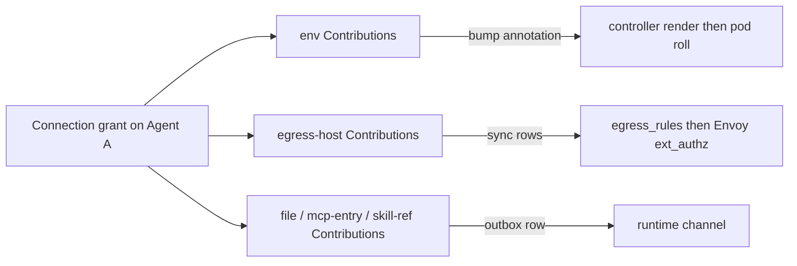
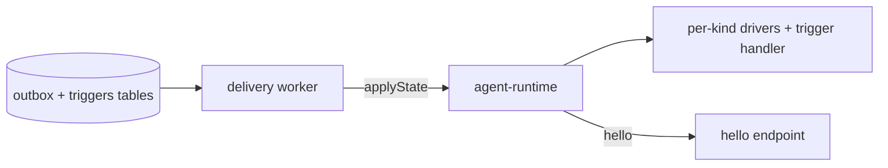
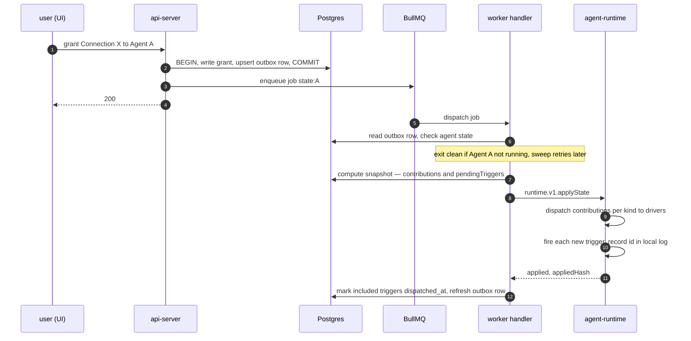
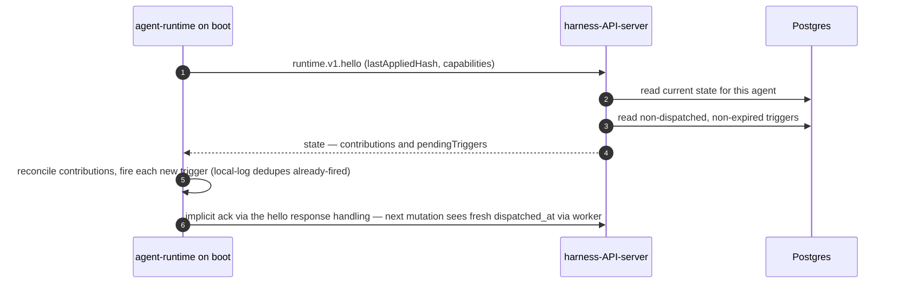
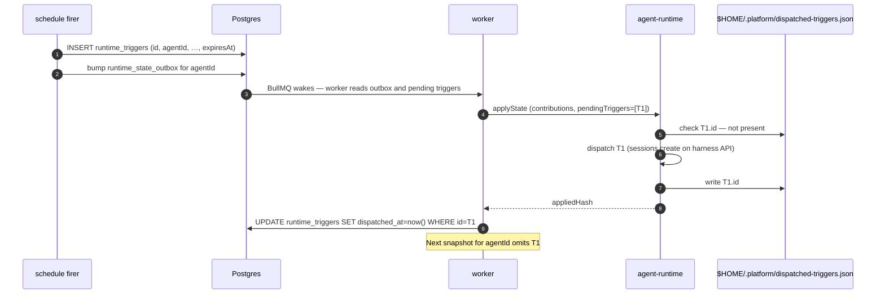
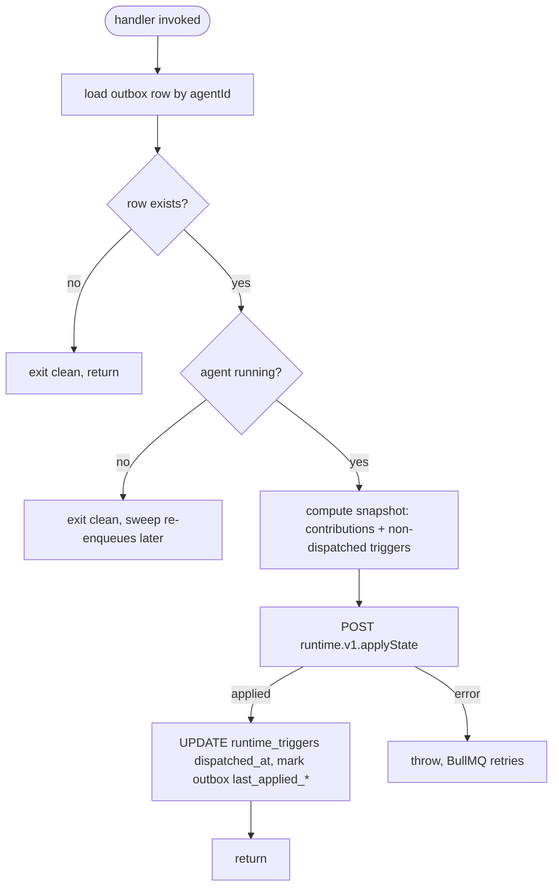

# Connections, Contributions, and the Runtime Channel

Last verified: 2026-05-22

## Motivated by

- [ADR-047 — Connections, Connection Templates, and Contributions: unified configuration model](../adrs/047-connections-and-contributions.md) — the domain shape that replaces the parallel OAuth-app and provider-preset registries
- [ADR-048 — Unified runtime channel](../adrs/048-runtime-channel.md) — the wire protocol between api-server and agent-runtime; supersedes pod-files SSE (ADR-034) and trigger files (ADR-008)
- [ADR-049 — Transactional outbox + worker](../adrs/049-runtime-outbox-worker.md) — how mutations decouple from agent reachability
- [ADR-036 — Redis as a platform primitive](../adrs/036-redis-platform-primitive.md) — the signal-path substrate the worker wakes on
- [ADR-022 — Harness API server](../adrs/022-harness-api-server.md) — the restricted port the agent reaches and where its outbound `hello` lands
- [ADR-040 — Unified secret contributions](../adrs/040-unified-secret-contributions.md) — the `env` Contribution's render-time merge survives unchanged

## Overview

A Connection is everything an agent needs to talk to one external integration — credentials, hosts to reach, config files to author, MCP entries to expose, skills to install. Connection Templates are code-level catalog entries that ship defaults; granting a Connection to an Agent materializes its Contributions into the right destinations.

The subsystem cuts cleanly across three bounded contexts:

- **api-server — Connections context** owns Connection Templates, Connections, grants. Computes per-agent Contribution snapshots. Routes Contributions to the right rail per kind.
- **api-server — Runtime Delivery context** owns the outbox table, the delivery worker, the `runtime.applyState` call into agents, and the `runtime.hello` callback from agents.
- **agent-runtime — Runtime Channel context** receives `applyState`, dispatches Contributions to per-kind drivers, dispatches pending triggers, reconciles on-disk state to match the snapshot, calls back to `hello` on boot.

A grant of one Connection produces Contributions of several kinds. They don't all travel the same rail:



Two of the three rails were already in place before this subsystem and stay unchanged ([ADR-040](../adrs/040-unified-secret-contributions.md) for envs; [ADR-035](../adrs/035-unified-hitl-ux.md) for egress_rules). The third rail — the runtime channel — is new and is what the rest of this page is about.

The runtime channel itself is two tRPC routes between api-server and agent-runtime, with the outbox + worker as the delivery substrate:



State changes write to the outbox, the worker reads and dispatches a fresh snapshot, the agent receives the snapshot and reconciles contributions + fires any pending triggers, and the agent calls back on boot/wake to catch up. Everything else in this subsystem hangs off these two diagrams.

## Concepts

### Connection Template

A code-level catalog entry. Premade templates (GitHub, Anthropic, Spotify, Linear MCP, …) ship with full defaults — auth flow, hosts, scopes, recommended contributions. Custom templates (Custom MCP, Custom OAuth, Custom Header) ship the *shape* but leave the integration's identity for the user to fill in.

Two display-axis attributes drive UI grouping:

| `category` | `isCustom` | Where the user encounters it |
|---|---|---|
| `app` | `false` | Apps section: GitHub, Spotify, Anthropic, OpenAI, Google services, GitHub Enterprise, … |
| `mcp` | `false` | MCP servers section: Linear MCP, Atlassian MCP, … (as added) |
| `mcp` | `true` | Custom Connection → "Add MCP server" |
| `other` | `true` | Custom Connection → "Add OAuth credential" / "Add Header credential" |

Templates are registered in code; adding a new integration is one entry. Schemas validate user input; the template's `build()` function projects inputs into the concrete `auth` + `contributions[]` of the Connection record.

### Connection

A uniform shape — every Connection looks the same regardless of category or auth mode:

```ts
interface Connection {
  id: string;
  ownerId: string;            // K8s sub
  templateId: string;         // which Template this was built from
  name: string;               // user-visible label
  inputs: Record<string, unknown>;   // raw user-typed values, for re-render
  auth: AuthConfig;
  contributions: Contribution[];
}

type AuthConfig =
  | { kind: "oauth"; clientId: string; refreshTokenRef: SecretRef; accessToken: SecretRef; scopes: string[]; ... }
  | { kind: "api-key"; valueRef: SecretRef; injection: { headerName: string; valueFormat: string } }
  | { kind: "header"; valueRef: SecretRef; headerName: string; valueFormat: string }
  | { kind: "none" };
```

The auth field carries credential-acquisition state (tokens, refresh schedules) separately from contributions, because credentials have their own lifecycle.

### Contribution

A typed unit a Connection emits when granted to an Agent. Discriminated union, extensible per [ADR-048's evolution rule](../adrs/048-runtime-channel.md):

```ts
type Contribution =
  | { kind: "env";          name: string; placeholder: string }
  | { kind: "egress-host";  host: string; pathPattern?: string; injection?: HostInjection }
  | { kind: "file";         path: string; format: "yaml"|"json"|"text"|"ini"; mergeMode: MergeMode; content: unknown }
  | { kind: "mcp-entry";    name: string; url: string; headers?: Record<string,string> }
  | { kind: "skill-ref";    sourceUrl: string; name: string; version: string };
```

Kinds are added by extending the union and gating on agent capabilities (see [Versioning](#versioning)).

### Pending Trigger

Not a Contribution. A transient one-shot directive that travels alongside contributions inside the state snapshot:

```ts
interface PendingTrigger {
  id: string;                  // stable across redeliveries; agent dedupes
  scheduleId: string;
  task: string;
  sessionMode?: "continuous" | "fresh";
  mcpServers?: unknown[];
  expiresAt: string;           // ISO-8601; agent silently drops past this
}
```

The snapshot's `pendingTriggers[]` is exactly the set the server believes is *not yet dispatched* for the agent. Successful apply marks them dispatched; the next snapshot omits them. See [Trigger lifecycle](#trigger-lifecycle).

## Example Connections

### App preset: GitHub Enterprise

```jsonc
{
  "id": "conn-7a8b",
  "templateId": "github-enterprise",
  "name": "GHE (ghe.acme.com)",
  "inputs": { "host": "ghe.acme.com", "clientId": "…", "clientSecret": "…" },
  "auth": {
    "kind": "oauth",
    "clientId": "Iv1.…",
    "refreshTokenRef": { "secretName": "platform-secret-conn-7a8b", "key": "refresh_token" },
    "accessToken":     { "secretName": "platform-secret-conn-7a8b", "key": "access_token" },
    "scopes": ["repo", "read:user", "user:email"]
  },
  "contributions": [
    { "kind": "egress-host", "host": "ghe.acme.com" },
    { "kind": "env",         "name": "GH_TOKEN", "placeholder": "dummy-placeholder" },
    { "kind": "env",         "name": "GH_HOST",  "placeholder": "ghe.acme.com" },
    { "kind": "file",
      "path": "$HOME/.config/gh/hosts.yml",
      "format": "yaml",
      "mergeMode": "key-targeted",
      "content": { "ghe.acme.com": { "oauth_token": "dummy-placeholder", "git_protocol": "https" } } }
  ]
}
```

### Custom MCP server

```jsonc
{
  "id": "conn-1d2e",
  "templateId": "custom-mcp",
  "name": "Acme internal MCP",
  "inputs": { "url": "https://mcp.acme.internal/sse", "authMode": "oauth" },
  "auth": { "kind": "oauth", "clientId": "…", "scopes": [], "…": "…" },
  "contributions": [
    { "kind": "egress-host", "host": "mcp.acme.internal" },
    { "kind": "mcp-entry",   "name": "acme",
      "url": "https://mcp.acme.internal/sse",
      "headers": { "Authorization": "Bearer dummy-placeholder" } }
  ]
}
```

### Custom Header credential

```jsonc
{
  "id": "conn-3f4a",
  "templateId": "custom-header",
  "name": "Internal billing API",
  "inputs": { "host": "billing.acme.internal", "headerName": "X-API-Key", "value": "…" },
  "auth": {
    "kind": "header",
    "valueRef":   { "secretName": "platform-secret-conn-3f4a", "key": "value" },
    "headerName": "X-API-Key",
    "valueFormat": "{value}"
  },
  "contributions": [
    { "kind": "egress-host", "host": "billing.acme.internal" }
  ]
}
```

## Contribution fan-out

The api-server's contribution-fanout layer routes each Contribution kind to the rail that delivers it. Different rails because the kinds have genuinely different delivery semantics:

| Kind | Rail | Delivery semantics | Note |
|---|---|---|---|
| `env` | Controller render at next pod start | Requires pod roll; immutable on a running pod | Implemented by bumping the `secrets-rev` annotation on the agent's ConfigMap; controller's existing reconciler re-renders. ADR-040 mechanism preserved. |
| `egress-host` | Postgres `egress_rules` → Envoy `ext_authz` | Live read; no pod involvement | Joined per-grant; revoke sweeps rows. Agent never sees these. |
| `file` | Runtime channel `applyState` snapshot | Sub-second push; idempotent reconciliation | Per-format + per-mergeMode driver materializes. |
| `mcp-entry` | Runtime channel `applyState` snapshot | Sub-second push; idempotent reconciliation | Driver dispatches to harness-specific path. |
| `skill-ref` | Runtime channel `applyState` snapshot | Sub-second push; per-version installer | Driver wraps existing skill-fetch helpers. |

The rail choice is a property of the kind, not of the Connection. A single grant of GitHub Enterprise produces Contributions on three rails: `env` (controller render → pod roll), `egress-host` (egress_rules → Envoy live), and `file` (runtime channel push). They flow independently.

## The runtime channel

Two tRPC routes, prefixed by protocol-major version (`runtime.v1.*`). Adding a new contribution kind, optional trigger field, or optional payload field stays on `v1` — capability flags carry the gate; new majors only on semantic break.



### `applyState` — state delivery (server → agent)

Carries the **full desired state** for one Agent — both declarative contributions and pending triggers. Agent reconciles contributions per kind and dispatches each trigger by id. Idempotent: re-applying the same payload is a no-op (the content hash short-circuits trivially-equal applications; the agent's local log dedupes already-fired triggers).

```ts
runtime.v1.applyState({
  contributions: Contribution[];   // full snapshot, post-capability-filter
  pendingTriggers: PendingTrigger[]; // server's view of not-yet-dispatched triggers
  version: number;                 // per-agent monotonic; agent rejects older
  hash: string;                    // deterministic hash over contributions + triggers
}) => { applied: boolean; appliedHash: string }
```

Concurrent dispatches from different replicas race naturally; the agent's `lastAppliedVersion` rejects older versions, last-version-wins. The hash is also durably recorded on the agent's outbox row for the periodic sweep to compare against.

### `hello` — agent → api-server catch-up

Called on boot, on wake from hibernation, and on any agent-side reconnect. Pulls current state if the agent's hash is stale. Triggers carried in the returned state are handled exactly like a fresh `applyState` — the trigger handler dispatches and the local log dedupes.

```ts
runtime.v1.hello({
  lastAppliedHash?: string;
  protocolVersion: "v1";
  agentRuntimeVersion: string;
  capabilities: { contributions: ContributionKind[] };
}) => {
  state?: {                                       // only if hash mismatched
    contributions: Contribution[];
    pendingTriggers: PendingTrigger[];
    version: number;
    hash: string;
  };
}
```



`hello`'s response is computed by the same state-builder the worker uses. There is no separate ack route; on the next worker dispatch (or the next `hello`), the server will compare the agent's `lastAppliedHash` against the freshly-computed hash and decide whether to push.

> **Note on dispatched_at via hello:** `hello` does not stamp `dispatched_at` itself — only `applyState`'s successful return does that, because the apply is what guarantees the agent processed the snapshot. After `hello`, the agent has the trigger; the next worker dispatch (which will happen because the apply-from-hello succeeded server-side) marks them dispatched. The agent's local log prevents double-fire in the meantime.

## Trigger lifecycle

Triggers are the only "active" thing on the runtime channel — contributions are declarative state, but a trigger says "fire a session now." Idempotency is layered across server and agent so a trigger fires *at most once* even under crashes and lost acks.



### Crash between fire and ack

If the agent fires T1 (creates the session) but crashes before `applyState` returns, the server never marks T1 as dispatched. The trigger reappears in the next snapshot. On reapply, the agent's local log already contains T1 → the trigger handler skips firing → returns `applied` → server marks dispatched. Net effect: at-most-once fire, idempotent ack.

### Server-side `dispatched_at` stamping

The worker holds the trigger ids it included in the outbound snapshot in memory across the `applyState` round-trip. On success, one `UPDATE runtime_triggers SET dispatched_at = now() WHERE id IN (...)` covers all of them. No echo-back from the agent is required — the server already knows the set, and the agent's local log handles the "already fired, just confirm" case.

### Expiry

Each trigger row carries `expires_at`. The state-builder filters `expires_at > now() AND dispatched_at IS NULL`. The cron sweep deletes rows past expiry that were never dispatched, counted as `dropped-expired`. The agent applies the same TTL check on incoming triggers as defense in depth.

### Local log GC

`$HOME/.platform/dispatched-triggers.json` is a small JSON file the trigger handler appends to. Entries past `expiresAt + 1h` are pruned on each boot (so a stale id can't be revived by an out-of-time-skew snapshot). The file lives on the per-Agent PVC and survives pod restarts.

## Outbox + worker

One outbox surface in Postgres, plus the triggers table that feeds the snapshot:

| Table | Shape | Why |
|---|---|---|
| `runtime_state_outbox` | One row per agent | State is snapshot-shaped and last-write-wins. A flurry of mutations affecting the same agent coalesces into one outbox row with no per-dispatch dedupe logic. |
| `runtime_triggers` | One row per pending trigger | Triggers are discrete; each has its own `expires_at` and `dispatched_at` lifecycle. The state-builder reads from this table when constructing `pendingTriggers[]`. |

### Mutation transaction

Every state-affecting handler commits the domain mutation and the outbox upsert atomically, then enqueues a BullMQ job:

```ts
await db.transaction(async (tx) => {
  await tx.connections.grant(agentId, connectionId);
  await tx.runtime_state_outbox.upsert({ agentId, lastEnqueuedAt: now() });
});
await stateQueue.add(
  "state",
  { agentId },
  { jobId: `state:${agentId}` },   // stable id → natural coalescing
);
return ok();   // user-facing response returns immediately
```

For a schedule firing:

```ts
await db.transaction(async (tx) => {
  await tx.runtime_triggers.insert({ id, agentId, scheduleId, task, expiresAt });
  await tx.runtime_state_outbox.upsert({ agentId, lastEnqueuedAt: now() });
});
await stateQueue.add("state", { agentId }, { jobId: `state:${agentId}` });
```

The user-facing response does not depend on agent reachability. If BullMQ's enqueue fails or Redis drops the pending job, the cron sweep re-enqueues the row.

### Worker

A BullMQ Worker on every api-server replica consumes from the single `state` queue. BullMQ owns the dispatch loop, retry-with-backoff, stalled-job recovery, and the dashboard surface; the platform code is the *handler*:



BullMQ retries are reserved for transport failures (network blip, agent crash mid-call). "Agent not running" exits clean — the cron sweep re-enqueues the row on its next tick, and `hello` picks up the state when the agent eventually wakes.

### Cron sweep

A scheduled job runs every minute and does two things:

1. **Outbox staleness check.** Scan rows where `last_enqueued_at < now() - sweepInterval` AND `last_applied_at IS NULL OR last_applied_at < last_enqueued_at`. For each, re-enqueue with the row's stable id. This is the load-bearing path for surviving any BullMQ / Redis loss: rows in Postgres are the truth.
2. **Expired-trigger drop.** Delete `runtime_triggers` rows where `expires_at <= now() AND dispatched_at IS NULL`; emit `dropped-expired` count.

### Agent-state cache

The worker handler reads agent running-state from an in-memory cache fed by the existing ConfigMap watch in the agents service — never from a direct K8s API call. When the agent is not running the handler exits clean; the outbox row remains for the cron sweep to re-enqueue when the agent transitions back to running, and `hello` clears it on wake.

### Redis-down behavior

Per ADR-036, Redis is the signal path; BullMQ stores job state in Redis with relaxed durability. A Redis outage may drop pending jobs; in-flight handlers see Redis errors and fail. The cron sweep is the recovery path: any outbox row whose enqueue was lost gets re-enqueued on the next sweep tick. Delivery latency degrades from sub-second to ≤ sweep-interval; no events are lost because the outbox + triggers tables are in Postgres.

## Agent-side: drivers, manifest, trigger handler

### The manifest

Every agent image ships a `runtime-manifest.yaml` declaring (1) which impl handles each Contribution kind, (2) capabilities for advertisement on `hello`, (3) any custom impls registered by harness-specific code. Validated against a versioned schema at agent-runtime boot — fail-fast on malformed manifest.

```yaml
# packages/agents/example-agent/runtime-manifest.yaml
manifestVersion: 1

drivers:
  mcp-entry:
    impl: file                                # built-in
    path: "$HOME/.claude/.mcp.json"
    format: json
    mergeMode: key-targeted
    keyPath: "mcpServers"
  skill-ref:
    impl: skill-install                       # built-in
    paths: ["$HOME/.claude/skills"]
  file:
    impl: file                                # built-in; per-Contribution params on the wire

capabilities:
  contributions: [file, mcp-entry, skill-ref]
```

A harness that needs custom code declares it explicitly in the manifest under `extensions.impls`:

```yaml
# packages/agents/codex-agent/runtime-manifest.yaml
manifestVersion: 1

drivers:
  mcp-entry:
    impl: codex-mcp-with-sighup               # custom (must be declared below)
    path: "$HOME/.codex/mcp.json"

extensions:
  impls:
    - name: codex-mcp-with-sighup
      module: "/usr/local/share/dam-runtime/codex-overrides.mjs"
      export: "codexMcpReloadImpl"

capabilities:
  contributions: [file, mcp-entry, skill-ref]
```

Custom impl names may not collide with built-in names (`file`, `skill-install`, …) — registration rejects collision; runtime-channel boot fails loud. The trigger handler is built-in and not pluggable.

### Built-in impls

| Impl | Used by | Behavior |
|---|---|---|
| `file` | `file` kind directly, and `mcp-entry` via composition | Format (`yaml`/`json`/`text`/`ini`) × MergeMode (`overwrite`/`section-marker`/`key-targeted`/`yaml-fill-if-missing`). The matrix is the substrate for all file-shaped writes. |
| `skill-install` | `skill-ref` kind | Wraps the existing skill-fetch helpers; resolves source URL, fetches at version through the gateway, materializes into configured skill paths, removes vanished skills on snapshot reconciliation. |

### Driver reconciliation

`applyState` delivers the full Contribution snapshot. The driver dispatcher groups contributions by kind and calls each driver's `apply(contributions, ctx)`:

1. Driver compares the desired set with what's on disk (or in its own state file under `$HOME/.platform/<kind>.json`).
2. Adds new contributions, updates changed ones, removes anything no longer in the snapshot.
3. Returns per-driver outcome.

Removal semantics depend on the kind and merge mode. For `file` contributions: `overwrite` and `section-marker` and `key-targeted` modes remove cleanly; `yaml-fill-if-missing` is the legacy carve-out — additive only, removal leaves stale entries until the user edits the file. New file producers must pick a remove-safe mode.

### Trigger handler

The built-in trigger handler processes `pendingTriggers[]` after contribution reconciliation completes:

```
for each trigger T in pendingTriggers:
  if T.expiresAt <= now():        # defense in depth — server may have raced
    continue
  if T.id in $HOME/.platform/dispatched-triggers.json:
    continue                      # already fired this id — server will mark on ack
  POST to harness-API-server: sessions.create(T.scheduleId, T.task, T.sessionMode, T.mcpServers)
  append T.id to dispatched-triggers.json (fsync)
```

The fsync before returning `applied` from the apply handler is what guarantees crash-safety. The dispatched log is rotated lazily — entries past `expiresAt + 1h` are dropped on boot.

## Versioning

| Version | Where it lives | Bumps on |
|---|---|---|
| **`protocolVersion`** | hello payload + route prefix | Wire-incompatible break (field removed, semantic changed). Routes coexist for one release; agents on the old major continue to function via their existing route prefix. |
| **`manifestVersion`** | top of `runtime-manifest.yaml` | Manifest schema break. Independent of protocolVersion. |
| **`agentRuntimeVersion`** | hello payload | Image build identity. Diagnostic only — never used for routing. |

### Forward-compat is the supported direction

Older agent on newer server is the common case. The server keeps every `runtime.v1.*` route operational across an additive minor change; the server's outbound payloads include only fields the agent's protocolVersion defines plus optional additions (agent parses leniently, ignores unknown fields).

Newer agent on older server is rare (images are pinned). The agent calls `runtime.v1.hello`; on 404 (server doesn't speak v1 anymore), the agent fails loud rather than silently degrading.

### Capability negotiation

The agent's `hello` declares which Contribution kinds it supports. The api-server filters outbound contribution payloads: unsupported kinds are dropped at send time (logged + counted with a `dropped-unsupported` metric). Triggers are not capability-gated — every agent that speaks the protocol must process pending triggers.

The UI surfaces the gap at grant time: connecting GitHub to a Claude-Code agent that doesn't support `skill-ref` shows "Agent doesn't support skills; this connection grants envs + hosts but not skill installation."

## Persistence touchpoints

| Substrate | What lives there | Notes |
|---|---|---|
| Postgres `connections` | Connection records (template id, auth, contributions[], inputs, owner) | New table for the unified model. |
| Postgres `runtime_state_outbox` | One row per agent with pending state delivery | Coalesce-by-agent. Carries `last_enqueued_at` and `last_applied_at` / `last_applied_hash` for the cron sweep. |
| Postgres `runtime_triggers` | One row per pending trigger | `id`, `agent_id`, `schedule_id`, `task`, `session_mode`, `mcp_servers`, `created_at`, `expires_at`, `dispatched_at`. Read by the state-builder when computing snapshots. |
| Redis (BullMQ queues) | Pending BullMQ jobs referencing outbox row ids | Relaxed durability per ADR-036; Postgres outbox + cron sweep is the recovery path. |
| Postgres `egress_rules` | `egress-host` Contributions joined per grant | Existing table; same as today (ADR-035). |
| K8s Secret per Connection | Auth credentials (refresh tokens, api-keys) | Owner-label-scoped; mounted into the paired gateway pod, never into the agent pod. |
| Agent ConfigMap `secrets-rev` annotation | Bump triggers env re-render | Existing ADR-040 mechanism unchanged. |
| `agents` table — new columns | `runtime_protocol_version`, `runtime_capabilities`, `runtime_last_hello_at`, `runtime_agent_version` | Populated on every `hello`. |
| Per-Agent PVC | Materialized files, MCP config, installed skills, `$HOME/.platform/dispatched-triggers.json` | Driver-written via runtime channel. The dispatched log is the at-most-once-fire guarantee. |
| Per-agent state file under `$HOME/.platform/<kind>.json` | Driver's tracking of what it has previously written | Per-driver, opt-in. Section-marker file driver doesn't need it; key-targeted does. |

## Invariants

- **Mutation handlers never wait on agent reachability.** The user-facing response returns after the local transaction + BullMQ enqueue; delivery is the worker's concern. A hibernated, restarting, or unreachable agent does not delay or fail user actions.
- **Postgres is the source of truth.** Every agent-bound change has a durable representation (a Connection grant, an outbox row, a trigger row) before any wire activity. BullMQ jobs and runtime-channel calls are signal/delivery paths only; either may fail or be replayed without correctness loss, with the cron sweep as the recovery path.
- **Snapshots are idempotent; reapplying the latest snapshot is safe.** Drivers tolerate repeated apply. The agent's `lastAppliedVersion` rejects older `applyState` calls; replay during disconnect/reconnect cannot regress state. The agent's dispatched-trigger log makes trigger redelivery a no-op.
- **Triggers fire at most once per id.** Server-side `dispatched_at` and agent-side local log together cover every failure window: crash before ack, crash mid-fire, replica race, hibernate-wake. The shared `id` is the single dedupe key.
- **The api-server is the only caller of the runtime channel from the cluster.** The harness port admits ingress only from api-server pods; the agent's only outbound channel is the paired gateway, which routes back to the harness-API-server.
- **Every Contribution kind has exactly one rail.** The api-server's fan-out determines which rail per kind; drivers, controller-render, and Envoy never overlap responsibilities on the same kind.
- **Capabilities are honored end-to-end.** A Contribution kind not in the agent's advertised set is dropped at send time, never silently delivered. A grant that requires unsupported kinds succeeds with a UI warning; the unsupported parts simply don't appear in the agent's snapshot.
