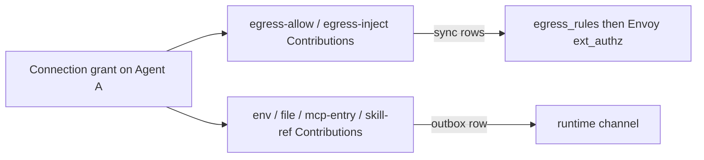

# Connections

Last verified: 2026-09-03

## Overview

A Connection is everything an agent needs to talk to one external integration — credentials, hosts to reach, config files to author, MCP entries to expose, skills to install. Connection Templates are code-level catalog entries that ship defaults; granting a Connection to an Agent materializes its Contributions into the right destinations.

The Connections context owns Connection Templates, Connections, and grants. It computes each Agent's Contribution set and routes every Contribution to the rail that delivers it.

Contributions on the runtime-channel rail are carried by a separate subsystem — the transactional outbox, the delivery worker, and the agent-side drivers and event handlers are documented in [runtime delivery](runtime-delivery.md). This page stops at the rail boundary.

A grant of one Connection produces Contributions of several kinds. They don't all travel the same rail:



There are two rails. `egress-allow` and `egress-inject` Contributions sync into Postgres `egress_rules` and are read live by Envoy; `egress-inject` additionally carries a credential the gateway injects on the wire (mechanics in [security and credentials](security-and-credentials.md)). Everything else — `env` (formerly a controller-render/pod-roll rail; moving it onto the runtime channel means a grant change no longer rolls the agent pod), `file`, `mcp-entry`, `skill-ref` — travels the runtime channel, and how it gets there is [runtime delivery](runtime-delivery.md). The rest of this page is what a Connection is and what a grant produces.

## Concepts

### Connection Template

A code-level catalog entry. Premade templates (GitHub, Anthropic, Spotify, Linear MCP, …) ship with full defaults — auth flow, hosts, scopes, recommended contributions. Custom templates (Custom MCP, Custom OAuth, Custom Header) ship the *shape* but leave the integration's identity for the user to fill in.

Two display-axis attributes drive UI grouping:

| `category` | `isCustom` | Where the user encounters it |
|---|---|---|
| `app` | `false` | Apps section: GitHub, Spotify, Anthropic, OpenAI, Google services, GitHub Enterprise, … |
| `mcp` | `false` | MCP servers section: Linear MCP, Atlassian MCP, … (as added) |
| `mcp` | `true` | Custom Connection → "Add MCP server" |
| `other` | `true` | Custom Connection → "Add OAuth credential" / "Add Header credential" |

Templates are registered in code; adding a new integration is one entry. Schemas validate user input; the template's `build()` function projects inputs into the concrete `auth` + `contributions[]` of the Connection record.

Beyond the auth credential, a template may declare optional **config inputs** that the user fills at connect time; each filled input projects into an additional `env` contribution, validated against the input's spec.

#### Internal-only templates

Some templates (Spotify, YouTube, Google services, and the custom client-credentials shape) are hidden from regular users client-side, affecting only what's offered (wherever the catalog is browsed), not Connections already created. Testers reveal the full catalog by enabling the *advanced connections* per-user experimental feature flag — see [features](features.md). The GitHub App templates are offered to everyone, grouped with the other GitHub auth methods.

### Connection

A uniform shape — every Connection looks the same regardless of category or auth mode: identity and owner, the source Template, a user-visible name, the recorded inputs (the user's own, kept for re-render, plus any platform-derived facts the Connection is identified or labelled by), the auth credential state, and the projected contributions.

The `auth` field carries credential-acquisition state in one of five modes: **OAuth** (a client identity, references to the stored refresh and access tokens, and granted scopes), **client credentials** (machine-to-machine OAuth — a client identity plus references to the stored client secret and tokens minted from it), **GitHub App** (a GitHub App identity plus a reference to the stored private key and the installation tokens minted from it — client credentials' JWT-signed counterpart), **header** (a reference to the stored secret plus the header name and value format to inject), or **none**. Token references point at the per-Connection K8s Secret — never inline secret material. Exact field shapes live in the [Connections contract types](../../packages/api-server-api/src/modules/connections/).

Credentials carry their own lifecycle. A stored one can be **updated in place** — the injected value, the client secret, or the GitHub App private key, whichever the auth mode holds. The minting modes validate by using the secret, at create and on every rotation alike, so an unusable one fails before anything is persisted. A rotation rewrites the credential and its SDS onto the same per-Connection Secret; nothing else moves — identity, contributions and every agent grant are preserved, and since the live value is read gateway-side via SDS, no Agent-spec patch or pod roll is needed. An **OAuth** credential is re-acquired, not pasted: re-running login and consent on the same Connection lands fresh tokens on the same Secret and asks for the template's current scopes, so a scope list that grew since create takes effect then. A credential that stops working reads as **expired**: the refresh loop persists a marker when the token endpoint *rejects* it rather than merely failing to answer, and a marked Connection stops being retried until a new credential clears it. A rejected *operator-supplied* client secret stays retryable, so a centrally-fixed one revives without per-connection action. A failure that is not a rejection parks nothing and instead defers the next attempt on a widening backoff held on the Connection itself, so a renewal that keeps failing is not re-attempted every sweep; any successful credential write clears both records. Credential writers — refresh, rotation, re-consent, and the re-point of a shared knowledge base onto a fresh link — serialize per Connection across replicas with an in-lock re-read that stands down if the state already advanced; grant fan-out serializes per Agent. Past its token horizon a Connection also reads expired, since a healthy one is renewed well ahead of it; a provider issuing non-expiring tokens has no horizon and stays active.

A **client-credentials** connection resolves the token endpoint from the authorization server's published OAuth metadata at create time and mints its first access token synchronously. The issuer URL is optional — when omitted it is discovered from the API host's published OAuth metadata. The same background loop that refreshes OAuth tokens re-mints it before expiry using the stored client secret. One per-Connection Secret holds the client secret, the current access token, and the SDS files baked from it; only the minted access token is ever injected on the wire.

A **GitHub App** connection applies the same mint-and-refresh shape to a GitHub App installation, signing the exchange with a private key rather than trading a client secret. The user supplies the app id, installation id, and a PEM private key; the platform signs a short-lived JWT and mints an installation token at create and again before each expiry. The per-Connection Secret holds the private key (which never leaves the api-server), the current token, and its SDS; the token injects on the same GitHub hosts as a personal access token.

Connect and disconnect raise domain events, recorded as [Activity Events](usage-tracking.md). A connect fires wherever the Connection actually reaches its connected state — at creation for the modes that complete synchronously, and at the authorization callback for OAuth, which is the only mode that cannot finish in one step. Emitting at both points would double-count OAuth; emitting only at the callback leaves every other mode invisible. A connection abandoned before that state raises neither event, so removals cannot outnumber connects. The event names the provider, not just the grant, because the Connection record is destroyed on disconnect and a grant identifier alone would die with it.

### Contribution

A typed unit a Connection emits when granted to an Agent — a discriminated union over `kind`. The kinds today:

- **`env`** — an environment variable the harness merges in at spawn. For credential-derived env the value is a placeholder (the real secret is injected gateway-side); for user-typed and non-credential config env it is the literal value.
- **`egress-allow`** — permission to reach a host (optionally path-scoped, optionally port-scoped for endpoints not on 443).
- **`egress-inject`** — an allowed host plus a credential the gateway injects on the wire, as a header or a query parameter. May additionally name a non-443 upstream port, opt the host's chain into streaming-upgrade tunneling (WebSocket/SPDY — `kubectl exec`/`port-forward`), and carry the upstream's private CA for gateway-side TLS validation (mechanics in [security and credentials](security-and-credentials.md)).
- **`file`** — a config file to author, with a format and a merge mode (see [Built-in contribution impls](runtime-delivery.md#built-in-contribution-impls)).
- **`mcp-entry`** — an MCP server to expose to the harness.
- **`skill-ref`** — a skill source to install at a pinned version.

Kinds are added by extending the union and gating on agent capabilities (see [Versioning](runtime-delivery.md#versioning)). Exact per-kind fields live in the [Connections contract types](../../packages/api-server-api/src/modules/connections/).


## Example Connections

### App preset: GitHub Enterprise

```jsonc
{
  "id": "conn-7a8b",
  "templateId": "github-enterprise",
  "name": "GHE (ghe.acme.com)",
  "inputs": { "host": "ghe.acme.com", "clientId": "…", "clientSecret": "…" },
  "auth": {
    "kind": "oauth",
    "clientId": "Iv1.…",
    "refreshTokenRef": { "secretName": "platform-secret-conn-7a8b", "key": "refresh_token" },
    "accessTokenRef":  { "secretName": "platform-secret-conn-7a8b", "key": "access_token" },
    "scopes": ["repo", "read:user", "user:email"]
  },
  "contributions": [
    { "kind": "egress-allow", "host": "ghe.acme.com" },
    { "kind": "env",          "name": "GH_TOKEN", "placeholder": "dummy-placeholder" },
    { "kind": "env",          "name": "GH_HOST",  "placeholder": "ghe.acme.com" },
    { "kind": "file",
      "path": "$HOME/.config/gh/hosts.yml",
      "format": "yaml",
      "mergeMode": "key-targeted",
      "content": { "ghe.acme.com": { "oauth_token": "dummy-placeholder", "git_protocol": "https" } } }
  ]
}
```

### Custom MCP server

An MCP endpoint contributes an `egress-allow` for its host and an `mcp-entry`
carrying the server URL. OAuth adds a placeholder Authorization header on the
`mcp-entry`; a static-header credential instead adds an `egress-inject` (as
Custom Header does), keeping the secret gateway-side.

### Shared knowledge base

A hidden managed template behind the [knowledge-base sharing](knowledge-bases.md#sharing)
consumer flow — never offered in the generic catalog; its connections surface
only in an agent's **Knowledge** settings. One lookup both authorizes the
pasted share string against a live share and settles which knowledge base it
reaches, and the connection is **identified by that knowledge base** rather
than by the link it arrived on: unsharing retires a share id and re-sharing
mints a fresh one, so a link for a knowledge base already connected re-points
the row that exists — one entry per knowledge base per owner, a constraint the
store enforces, never a dead entry beside a live one — while a link that no
longer resolves is refused instead of stored half-identified. The secret lands
in the per-Connection Secret under a **per-share header name**
(`x-kb-token-<shareId>`), which is what the serving side authenticates and what
keeps several shares distinct within one request. The owner's public name is
readable only to a consumer whose secret still works, so the connection
remembers the last one it saw and stops following renames once the secret it
holds stops working — a row that broke still says which knowledge base it was,
beside the expired status explaining it. Deliberately **no**
`mcp-entry` per connection: one built-in aggregate entry serves all of a
sandbox's shares (below). Reads are served **in-cluster over the harness**, not
by the agent dialing the platform's share host — the platform reads an agent's
granted shares and replays their per-share secrets into the aggregate serving
app server-side (see [knowledge bases](knowledge-bases.md#sharing)), so the
consumer path needs no egress. Connections of this template are capped per
owner.

### App preset: Kubernetes / OpenShift

The external-cluster connection (#2314). The user supplies the cluster API
endpoint, a service-account token, and — only when the API cert isn't publicly
trusted — the cluster's CA. The build synthesizes an `egress-inject`, a `file`
contribution writing a ready-to-use kubeconfig at a **per-connection path**, and
a `KUBECONFIG` `env` pointing at it. The kubeconfig carries only an inert
placeholder token; the gateway overwrites it with the real service-account token
on the wire, so the token only ever exists gateway-side. Multiple cluster
connections compose: each writes its own kubeconfig keyed by connection name, and
the `env` driver joins their `KUBECONFIG` entries into the `:`-separated list
`kubectl`/`oc` merge at load, so clusters that share a host on different ports
stay distinct. The CA is optional, never reaches the agent, and configures
gateway-side upstream validation only.

```jsonc
{
  "id": "conn-9c1d",
  "templateId": "kubernetes",
  "name": "prod-cluster",
  "inputs": { "host": "api.prod.example:6443", "value": "…", "caData": "…" },
  "auth": { "kind": "header", "valueRef": { "…": "…" }, "headerName": "Authorization", "valueFormat": "Bearer {value}" },
  "contributions": [
    { "kind": "egress-inject", "host": "api.prod.example", "port": 6443,
      "headerName": "Authorization", "valueFormat": "Bearer {value}",
      "upgrades": true, "upstreamCa": true },
    { "kind": "env", "name": "KUBECONFIG", "placeholder": "$HOME/.kube/connections/prod-cluster.config" },
    { "kind": "file", "path": "$HOME/.kube/connections/prod-cluster.config", "format": "yaml",
      "mergeMode": "overwrite",
      "content": { /* a one-cluster kubeconfig: the endpoint, the mounted CA path, and a placeholder token */ } }
  ]
}
```

### Custom Header credential

```jsonc
{
  "id": "conn-3f4a",
  "templateId": "custom-header",
  "name": "Internal billing API",
  "inputs": { "host": "billing.acme.internal", "headerName": "X-API-Key", "value": "…" },
  "auth": {
    "kind": "header",
    "valueRef":   { "secretName": "platform-secret-conn-3f4a", "key": "value" },
    "headerName": "X-API-Key",
    "valueFormat": "{value}"
  },
  "contributions": [
    { "kind": "egress-inject", "host": "billing.acme.internal",
      "headerName": "X-API-Key", "valueFormat": "{value}" }
  ]
}
```

## Built-in contributions

Not every contribution comes from a grant: the runtime state builder also
merges **built-ins** the platform itself contributes. Every agent gets the
platform MCP entry; a sandbox holding at least one shared-knowledge-base grant
additionally gets the aggregate `knowledge-bases` MCP entry pointing at the
in-cluster harness route (`/api/agents/:id/kb`, alongside the platform MCP
entry), appearing and disappearing with its first and last such grant.

## Contribution fan-out

The api-server's contribution-fanout layer routes each Contribution kind to the rail that delivers it. Different rails because the kinds have genuinely different delivery semantics:

| Kind | Rail | Delivery semantics | Note |
|---|---|---|---|
| `env` | Runtime channel `applyState` (state slice) | Sub-second push; applied at next harness spawn | Written to a JSON file the harness spawn path merges into the process env. Two sources feed it — user-typed env (the Environment editor) and connection-derived env — user env ordered first so it wins on name collision (first-occurrence-wins). A change recycles the harness at an idle turn boundary; only a variable-set change may force one mid-turn — value-only changes spare in-flight runs. No pod roll. |
| `egress-allow` | Postgres `egress_rules` → Envoy `ext_authz` | Live read; no pod involvement | Joined per-grant; revoke sweeps rows. Agent never sees these. |
| `egress-inject` | Postgres `egress_rules` → Envoy `ext_authz`, plus a wire-injected credential at the gateway | Live read; no pod involvement | Same `egress_rules` row as `egress-allow`; the gateway also injects `headerName`/`valueFormat` on the wire (mechanics in [security and credentials](security-and-credentials.md)). Agent never sees these. |
| `file` | Runtime channel `applyState` (state slice) | Sub-second push; idempotent reconciliation | Per-format + per-mergeMode driver materializes. |
| `mcp-entry` | Runtime channel `applyState` (state slice) | Sub-second push; idempotent reconciliation | Driver dispatches to harness-specific path. |
| `skill-ref` | Runtime channel `applyState` (state slice) | Sub-second push; per-version installer | Driver wraps existing skill-fetch helpers. |

The rail choice is a property of the kind, not of the Connection. A single grant of GitHub Enterprise produces Contributions on both rails: `egress-allow` (egress_rules → Envoy live), and `env` + `file` (runtime channel push). They flow independently.


## Persistence touchpoints

| Substrate | What lives there | Notes |
|---|---|---|
| Postgres `connections` | Connection records | The unified model's own table. |
| Postgres `egress_rules` | `egress-allow` and `egress-inject` Contributions joined per grant | Existing table; same as today. Both kinds produce the same allow row; `egress-inject`'s credential rides a separate gateway-side rail. |
| K8s Secret per Connection | Auth credentials (refresh tokens, api-keys) | Owner-label-scoped; mounted into the paired gateway pod, never into the agent pod. |

## Invariants

- **Every Contribution kind has exactly one rail.** The api-server's fan-out determines which rail per kind; drivers, controller-render, and Envoy never overlap responsibilities on the same kind.
