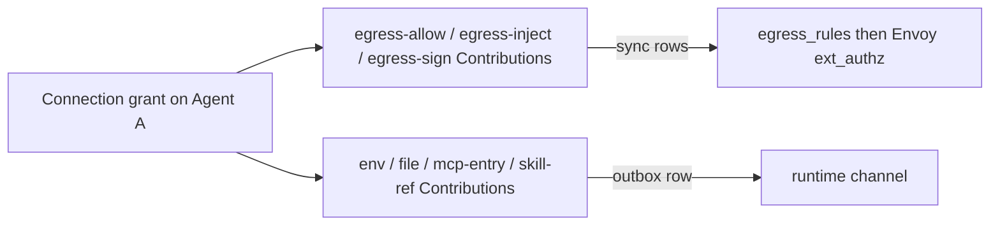

# Connections

Last verified: 2026-10-08

## Overview

A Connection is everything an agent needs to talk to one external integration — credentials, hosts to reach, config files to author, MCP entries to expose, skills to install. Connection Templates are code-level catalog entries that ship defaults; granting a Connection to an Agent materializes its Contributions into the right destinations.

The Connections context owns Connection Templates, Connections, and grants. It computes each Agent's Contribution set and routes every Contribution to the rail that delivers it.

Contributions on the runtime-channel rail are carried by a separate subsystem — the transactional outbox, the delivery worker, and the agent-side drivers and event handlers are documented in [runtime delivery](runtime-delivery.md). This page stops at the rail boundary.

A grant of one Connection produces Contributions of several kinds. They don't all travel the same rail:


```mermaid
flowchart LR
  grant[Connection grant on Agent A]
  hostRail[egress-allow / egress-inject / egress-sign Contributions]
  rtRail[env / file / mcp-entry / skill-ref Contributions]
  envoy[egress_rules then Envoy ext_authz]
  channel[runtime channel]

  grant --> hostRail
  grant --> rtRail
  hostRail -->|sync rows| envoy
  rtRail -->|outbox row| channel
```

There are two rails. `egress-allow`, `egress-inject` and `egress-sign` Contributions sync into Postgres `egress_rules` and are read live by Envoy; `egress-inject` additionally carries a credential the gateway injects on the wire, and `egress-sign` names a host whose requests the gateway re-signs with the Connection's keys (mechanics in [credential gateway](credential-gateway.md)). Everything else — `env` (formerly a controller-render/pod-roll rail; moving it onto the runtime channel means a grant change no longer rolls the agent pod), `file`, `mcp-entry`, `skill-ref` — travels the runtime channel, and how it gets there is [runtime delivery](runtime-delivery.md). The rest of this page is what a Connection is and what a grant produces.

## Concepts

### Connection Template

A code-level catalog entry. Premade templates (GitHub, Anthropic, Spotify, Linear MCP, …) ship with full defaults — auth flow, hosts, scopes, recommended contributions. Custom templates (Custom MCP, Custom OAuth, Custom Header) ship the *shape* but leave the integration's identity for the user to fill in.

Three display-axis attributes drive UI grouping. `category` and `isCustom` place a template in a section; an optional **family** (`github`, `github-enterprise`, `kubernetes`, `modal`, `mcp-server`, `custom-header`) groups templates the catalog shows as one connect page with several methods, and is what a [starter kit](starter-kits.md) names when it accepts any method of a provider. Families are declared on the templates themselves and carried on the template view, so nothing else keeps a copy of the membership.

| `category` | `isCustom` | Where the user encounters it |
|---|---|---|
| `app` | `false` | Apps section: GitHub, Spotify, Anthropic, OpenAI, Google services, GitHub Enterprise, … |
| `mcp` | `false` | MCP servers section: Linear MCP, Atlassian MCP, … (as added) |
| `mcp` | `true` | Custom Connection → "Add MCP server" |
| `other` | `true` | Custom Connection → "Add OAuth credential" / "Add Header credential" |

Templates are registered in code; adding a new integration is one entry. Schemas validate user input; the template's `build()` function projects inputs into the concrete `auth` + `contributions[]` of the Connection record.

Beyond the auth credential, a template may declare optional **config inputs** that the user fills at connect time; each filled input projects into an additional `env` contribution, validated against the input's spec.

#### Internal-only templates

Some templates (Spotify, YouTube, Google services, and the custom client-credentials shape) are hidden from regular users client-side, affecting only what's offered (wherever the catalog is browsed), not Connections already created. Testers reveal the full catalog by enabling the *advanced connections* per-user experimental feature flag — see [features](features.md). The GitHub App templates are offered to everyone, grouped with the other GitHub auth methods.

### Connection

A uniform shape — every Connection looks the same regardless of category or auth mode: identity and owner, the source Template, a user-visible name, the recorded inputs (the user's own, kept for re-render, plus any platform-derived facts the Connection is identified or labelled by), the auth credential state, and the projected contributions.

The `auth` field carries credential-acquisition state in one of six modes: **OAuth** (a client identity, references to the stored refresh and access tokens, and granted scopes), **client credentials** (machine-to-machine OAuth — a client identity plus references to the stored client secret and tokens minted from it), **GitHub App** (a GitHub App identity plus a reference to the stored private key and the installation tokens minted from it — client credentials' JWT-signed counterpart), **header** (a reference to the stored secret plus the header name and value format to inject), **SigV4** (an HMAC key pair for S3-compatible storage — references to the stored access key ID, secret access key and the credentials file the gateway signs with, plus the signing region), or **none**. Token references point at the per-Connection K8s Secret — never inline secret material. Exact field shapes live in the [Connections contract types](../../packages/api-server-api/src/modules/connections/).

Agent creation can designate a Connection as its model provider. The Connections service validates ownership, provider type, and active status before the Agent is persisted; agent-management permission is sufficient to use a known provider id. Browsing Connections still requires credential-read permission. Other initial grants remain separate from the provider selection.

Credentials carry their own lifecycle. A stored one can be **updated in place** — the injected value, the client secret, the GitHub App private key, or the storage key pair, whichever the auth mode holds. The minting modes validate by using the secret, at create and on every rotation alike, so an unusable one fails before anything is persisted; a storage key pair is proven the same way, by a request to its endpoint, and a rotation the endpoint refuses leaves the working pair in place. A model provider's key is proven by a request to list its models, where the provider offers one: a key the provider refuses is not stored, on create or rotation, while a provider that does not answer leaves the key unchecked rather than blocking the save, since an unreachable endpoint says nothing about the key. A rotation rewrites the credential and its SDS — or, for a key pair, the credentials file the gateway signs with — onto the same per-Connection Secret; nothing else moves — identity, contributions and every agent grant are preserved, and since the live value is read gateway-side, no Agent-spec patch or pod roll is needed. A static key pair has no expiry and no horizon: it reads active until it is rotated or the Connection is removed. An **OAuth** credential is re-acquired, not pasted: re-running login and consent on the same Connection lands fresh tokens on the same Secret and asks for the template's current scopes, so a scope list that grew since create takes effect then. A credential that stops working reads as **expired**: the refresh loop persists a marker when the token endpoint *rejects* it rather than merely failing to answer, and a marked Connection stops being retried until a new credential clears it. A rejected *operator-supplied* client secret stays retryable, so a centrally-fixed one revives without per-connection action. A failure that is not a rejection parks nothing and instead defers the next attempt on a widening backoff held on the Connection itself, so a renewal that keeps failing is not re-attempted every sweep; any successful credential write clears both records. Credential writers — refresh, rotation, re-consent, and the re-point of a shared knowledge base onto a fresh link — serialize per Connection across replicas with an in-lock re-read that stands down if the state already advanced; grant fan-out serializes per Agent. Past its token horizon a Connection also reads expired, since a healthy one is renewed well ahead of it; a provider issuing non-expiring tokens has no horizon and stays active.

A **client-credentials** connection resolves the token endpoint from the authorization server's published OAuth metadata at create time and mints its first access token synchronously. The issuer URL is optional — when omitted it is discovered from the API host's published OAuth metadata. The same background loop that refreshes OAuth tokens re-mints it before expiry using the stored client secret. One per-Connection Secret holds the client secret, the current access token, and the SDS files baked from it; only the minted access token is ever injected on the wire.

A **GitHub App** connection applies the same mint-and-refresh shape to a GitHub App installation, signing the exchange with a private key rather than trading a client secret. The user supplies the app id, installation id, and a PEM private key; the platform signs a short-lived JWT and mints an installation token at create and again before each expiry. The per-Connection Secret holds the private key (which never leaves the api-server), the current token, and its SDS; the token injects on the same GitHub hosts as a personal access token.

A **GitHub sign-in** made through a GitHub App holds a user token rather than an installation token, and narrows the same way: to one account the app is installed on, optionally further to chosen repositories and permissions there. The user token and its refresh token stay at rest; what injects is a scoped token GitHub derives from the user token, authorized by the app's client secret, and re-derived after every refresh, at re-consent, and when the subset is edited. GitHub rotates the refresh token on each use, so the new one is stored before the derivation — a subset GitHub refuses parks the Connection as expired without costing it the ability to renew, and never falls back to injecting the unscoped token. A narrowed token still never does more than the user could. The subset is chosen after sign-in, against the installations and repositories the user token itself reaches, since before consent there is nothing to read.

A Connection that acts as a person rather than as the Agent records **whose account** it acts as, so the product can name that person wherever the Connection is listed. The platform asks the provider with the Connection's own credential (Slack, GitHub and the Google services today) when the credential first works: at the OAuth callback, at create for a token, and again on every re-consent or rotation, since a new credential may belong to someone else. The answer is a platform-derived fact on the Connection, never a user input. A lookup that fails costs nothing but the label. Connections made before this existed are labelled by a background sweep that tries each one once per api-server process, so a credential the provider refuses is not retried in a loop.

Connect and disconnect raise domain events, recorded as [Activity Events](usage-tracking.md). A connect fires wherever the Connection actually reaches its connected state — at creation for the modes that complete synchronously, and at the authorization callback for OAuth, which is the only mode that cannot finish in one step. Emitting at both points would double-count OAuth; emitting only at the callback leaves every other mode invisible. A connection abandoned before that state raises neither event, so removals cannot outnumber connects. The event names the provider, not just the grant, because the Connection record is destroyed on disconnect and a grant identifier alone would die with it.

### Contribution

A typed unit a Connection emits when granted to an Agent — a discriminated union over `kind`. The kinds today:

- **`env`** — an environment variable the harness merges in at spawn. For credential-derived env the value is a placeholder (the real secret is injected gateway-side); for user-typed and non-credential config env it is the literal value.
- **`egress-allow`** — permission to reach a host (optionally path-scoped, optionally port-scoped for endpoints not on 443).
- **`egress-inject`** — an allowed host plus a credential the gateway injects on the wire, as a header or a query parameter. May additionally name a non-443 upstream port, opt the host's chain into streaming-upgrade tunneling (WebSocket/SPDY — `kubectl exec`/`port-forward`), carry the upstream's private CA for gateway-side TLS validation, and declare path prefix rewrites the gateway applies on the way upstream (mechanics in [credential gateway](credential-gateway.md)).
- **`egress-sign`** — an allowed host whose requests the gateway re-signs with the Connection's key pair instead of injecting a header, carrying the signing region and service. May name a non-443 upstream port, and is path-scoped to the bucket when the Connection is limited to one (mechanics in [credential gateway](credential-gateway.md#request-signing)).
- **`file`** — a config file to author, with a format and a merge mode (see [Built-in contribution impls](runtime-delivery.md#built-in-contribution-impls)).
- **`mcp-entry`** — an MCP server to expose to the harness.
- **`skill-ref`** — a skill source to install at a pinned version.

Kinds are added by extending the union and gating on agent capabilities (see [Versioning](runtime-delivery.md#versioning)). Exact per-kind fields live in the [Connections contract types](../../packages/api-server-api/src/modules/connections/).

### Addressing a Connection

A user may hold several Connections to one service — two Slack workspaces, two GitHub identities, two tenants of one MCP server — and, where the platform can tell them apart, grant more than one of them to the same Agent. They reach the same host, so the host alone does not say which account a request acts as.

Each Connection therefore has an **address**, in two carriers. One is a per-Connection path prefix on the real host, `/__platform_conn/<connection id>/`: the gateway picks the credential from that path and strips it before the request leaves, so the upstream sees the address it published. The other is the Connection's **token placeholder**, `platform:conn:<connection id>`: every credential placeholder a Connection hands the Agent — a `GH_TOKEN` env, the token in gh's hosts file, a placeholder in an MCP entry's headers — is that value rather than an inert constant, and a client that sends it where the real token goes has named the Connection, whatever URL it asked for. A client that refuses a key without its vendor's prefix is handed the address behind that prefix (`as-platform:conn:<id>`), and the gateway reads it there too; a credential inside a config file, like a kubeconfig token, is addressed the same way. The gateway reads it out of the claimed header (bare, behind a scheme such as `token` or `Bearer`, or as the password of a Basic pair) or the claimed query parameter, and overwrites it with the real credential as before. A storage Connection is addressed through its access key ID: the placeholder stands where the key ID goes in a SigV4 credential, the gateway reads it from there and re-signs the request with the real pair, and the path prefix does not apply, since the gateway signs the upstream path ([credential gateway](credential-gateway.md#request-signing)). The host stays the real one either way, so egress rules, approval prompts and logs keep describing the real destination.

The address is a property of the Agent's grant, not of the stored Connection: contributions are recorded against the real address and the inert placeholder, and the runtime state an Agent is given carries the prefixed URLs and the per-Connection placeholder. So a Connection's address is stable whether or not a second Connection to that service exists, and adding one never re-addresses the first. The platform prefixes the `mcp-entry` URLs of each Connection — the addresses it writes on the Agent's behalf. The Agent sees those entries under the names the user gave the Connections, so two workspaces read as two named servers. The two names the platform injects under are reserved: an entry name is the prefix on every tool it carries, so a Connection wearing one would displace the platform's own entry and inherit the approval a relayed turn gives that surface ([channel turns](channel-turns.md)). Naming refuses them and delivery drops them, and the Agents already holding one were re-delivered once, so rows predating the rule are covered too.

Naming a Connection is only *required* where two of them genuinely collide: the same header on the same host over paths that overlap. Connections that scope themselves to different parts of one service — one per Google Workspace service on `www.googleapis.com` — are not rivals, and each keeps being injected on its own paths without any address. Where the scopes do overlap, an unaddressed request fails closed at the gateway, because the alternative, serving it from whichever credential sorted first, is the silent wrong-account failure this addressing exists to end.

An Agent can make naming *required* for every one of its Connections. The Agent's spec says so, set at create by the create form (behind a feature flag) or a starter kit. Its gateway then injects a Connection's credential only into a request that names it, and sends any other request upstream with the credential it already carries, rather than replacing it. Contested scopes still fail closed. The case it serves is an agent whose tools — Docker containers, nested agents — call the same hosts with their own credentials or none: their requests name none of the agent's Connections, so the gateway leaves them alone. Platform-written values already carry an address, so the agent's own clients are unaffected. A Connection with no credential of the agent's own is reachable only through its path prefix. Only such an agent offers the [browser panel](browser-panel.md), whose user browses through the agent's gateway.

**Several GitHub accounts.** `gh` takes a host rather than a URL and reads one `GH_TOKEN` ahead of its own config, so two GitHub Connections on one host cannot both hand the Agent that env. When an Agent holds two or more, the platform stops contributing `GH_TOKEN` for them and writes gh's own multi-account hosts file instead: one account per Connection, named after the Connection, each under its token placeholder. The Agent switches with `gh auth switch`, and `git` follows the active account through gh's credential helper, so both identities work from one shell. The account active on delivery is the grant the user marked **preferred** on the Agent — chosen from the Agent's connections panel, at most one per group: a GitHub host is one group, and an Agent's storage Connections form another (below) — or, absent a choice, the earliest grant, which is the account the Agent already acted as. Every state push re-asserts that default, so a switch the Agent made itself lasts until the next push. The commit identity git uses follows that default too: the active account's name and email when it has one — an account that signed in with a token or as an App has none — and switching with gh changes which account authenticates, not whom the commits name. Because the env is gone, the platform states gh's availability explicitly in that case, and the runtime's own GitHub client reads the active token from the same file. The Agent learns all of this from a skill every agent image ships, `platform-github`: how to list its accounts, how to switch or act as one for a single command, and what the gateway's refusal means. A GitHub Enterprise Server is a separate case: `gh` reads `GH_ENTERPRISE_TOKEN` for such a host and never `GH_TOKEN`, which it reserves for github.com and `ghe.com` tenants, so a Connection to an Enterprise Server hands the Agent `GH_ENTERPRISE_TOKEN` and never competes with a github.com account for one env.

Two limits follow. First, an address exists only where the platform writes one or the Agent can send one. A Connection reached with no credential of the Agent's own — a Custom Header credential that sets no env — has no address the Agent can use, and two Connections whose placeholders would land in one env — two accounts of one Google service, both writing the same variable — can deliver only one of them, so in either case two such Connections that collide can never both work: every request where their paths overlap is refused. GitHub is the collision the platform resolves, through gh's hosts file. The Connections context therefore refuses to grant an Agent a Connection that collides with one it holds unless both are addressed — when a grant is added and when an Agent is created with its first grants — and the connection pickers say which granted Connection is in the way. An Agent that already holds such a pair can still change its other grants, and is shown a warning naming the pair until one is revoked. Two GitHub accounts, two Slack workspaces or two tenants of one MCP server are addressed, so they stay grantable together; so are two storage Connections on one endpoint, whose gateway signs only the requests that name each and never contests the host.

Second, a path address only holds while the Agent keeps using it: an upstream that answers with an absolute URL of its own, stripped of the prefix, sends the Agent back unaddressed. A token placeholder is not lost this way, since it rides in the credential rather than the URL. That is an accepted limit rather than a guarded one — the reply is a refusal the Agent can read, not a request served as the wrong account.

## Example Connections

### App preset: GitHub Enterprise

```jsonc
{
  "id": "conn-7a8b",
  "templateId": "github-enterprise",
  "name": "GHE (ghe.acme.com)",
  "inputs": { "host": "ghe.acme.com", "clientId": "…", "clientSecret": "…" },
  "auth": {
    "kind": "oauth",
    "clientId": "Iv1.…",
    "refreshTokenRef": { "secretName": "platform-secret-conn-7a8b", "key": "refresh_token" },
    "accessTokenRef":  { "secretName": "platform-secret-conn-7a8b", "key": "access_token" },
    "scopes": ["repo", "read:user", "user:email"]
  },
  "contributions": [
    { "kind": "egress-allow", "host": "ghe.acme.com" },
    { "kind": "env",          "name": "GH_TOKEN", "placeholder": "dummy-placeholder" },
    { "kind": "env",          "name": "GH_HOST",  "placeholder": "ghe.acme.com" },
    { "kind": "file",
      "path": "$HOME/.config/gh/hosts.yml",
      "format": "yaml",
      "mergeMode": "key-targeted",
      "content": { "ghe.acme.com": { "oauth_token": "dummy-placeholder", "git_protocol": "https" } } }
  ]
}
```

### Custom MCP server

An MCP endpoint contributes an `egress-allow` for its host and an `mcp-entry`
carrying the server URL. OAuth adds a placeholder Authorization header on the
`mcp-entry`; a static-header credential instead adds an `egress-inject` (as
Custom Header does), keeping the secret gateway-side.

### Shared knowledge base

A hidden managed template behind the [knowledge-base sharing](knowledge-bases.md#sharing)
consumer flow — never offered in the generic catalog; its connections surface
only in an agent's **Knowledge** settings. One lookup both authorizes the
pasted share string against a live share and settles which knowledge base it
reaches, and the connection is **identified by that knowledge base** rather
than by the link it arrived on: unsharing retires a share id and re-sharing
mints a fresh one, so a link for a knowledge base already connected re-points
the row that exists — one entry per knowledge base per owner, a constraint the
store enforces, never a dead entry beside a live one — while a link that no
longer resolves is refused instead of stored half-identified. The secret lands
in the per-Connection Secret under a **per-share header name**
(`x-kb-token-<shareId>`), which is what the serving side authenticates and what
keeps several shares distinct within one request. The owner's public name is
readable only to a consumer whose secret still works, so the connection
remembers the last one it saw and stops following renames once the secret it
holds stops working — a row that broke still says which knowledge base it was,
beside the expired status explaining it. Deliberately **no**
`mcp-entry` per connection: one built-in aggregate entry serves all of a
sandbox's shares (below). Reads are served **in-cluster over the harness**, not
by the agent dialing the platform's share host — the platform reads an agent's
granted shares and replays their per-share secrets into the aggregate serving
app server-side (see [knowledge bases](knowledge-bases.md#sharing)), so the
consumer path needs no egress. Connections of this template are capped per
owner.

### App preset: Kubernetes / OpenShift

The external-cluster connection (#2314). The user supplies the cluster API
endpoint, a service-account token, and — only when the API cert isn't publicly
trusted — the cluster's CA. The build synthesizes an `egress-inject`, a `file`
contribution writing a ready-to-use kubeconfig at a **per-connection path**, and
a `KUBECONFIG` `env` pointing at it. The kubeconfig carries only an inert
placeholder token; the gateway overwrites it with the real service-account token
on the wire, so the token only ever exists gateway-side. Multiple cluster
connections compose: each writes its own kubeconfig keyed by connection name, and
the `env` driver joins their `KUBECONFIG` entries into the `:`-separated list
`kubectl`/`oc` merge at load, so clusters that share a host on different ports
stay distinct. The CA is optional, never reaches the agent, and configures
gateway-side upstream validation only.

```jsonc
{
  "id": "conn-9c1d",
  "templateId": "kubernetes",
  "name": "prod-cluster",
  "inputs": { "host": "api.prod.example:6443", "value": "…", "caData": "…" },
  "auth": { "kind": "header", "valueRef": { "…": "…" }, "headerName": "Authorization", "valueFormat": "Bearer {value}" },
  "contributions": [
    { "kind": "egress-inject", "host": "api.prod.example", "port": 6443,
      "headerName": "Authorization", "valueFormat": "Bearer {value}",
      "upgrades": true, "upstreamCa": true },
    { "kind": "env", "name": "KUBECONFIG", "placeholder": "$HOME/.kube/connections/prod-cluster.config" },
    { "kind": "file", "path": "$HOME/.kube/connections/prod-cluster.config", "format": "yaml",
      "mergeMode": "overwrite",
      "content": { /* a one-cluster kubeconfig: the endpoint, the mounted CA path, and a placeholder token */ } }
  ]
}
```

### App preset: IBM LiteLLM proxy

The model-endpoint proxy that fronts models for IBM-internal use. Which
model provider an agent runs against follows from the Connection it is
granted, not from harness configuration: the LiteLLM Connection
contributes the env each harness reads for its base URL — including Bob's
gateway URL — plus an inert key placeholder.
Bob is the case that needs more than a base URL. It prefixes every
gateway call with its own service path, and that prefix is not
configurable, so the Connection also declares the prefix rewrite the
gateway applies; the auth scheme needs no such treatment, because the
gateway overwrites the credential header outright. What the endpoint has
to offer for this to work is the OpenAI-shaped chat-completion route, a
model-information route reporting a non-empty model list (Bob treats an
empty list as an error), and no region hint of its own — a gateway
answering the profile route with one would redirect Bob's inference calls
off the configured host. This Connection contributes no model of its
own, and Bob's built-in default resolves to one only its own gateway
serves — so a model has to come from somewhere else. A provider pin or a
per-agent override supplies one, and when neither does, nobody has to
step in: because this Connection redirects Bob, the platform seeds one
before the harness starts, taking the first of the names the endpoint
lists once they are ordered ([harness configuration](harness-config.md#model-discovery-and-the-seeded-model)).
A key the endpoint refuses the model-information route still gets one:
the platform then takes the names from the OpenAI model list, which such
a key may call.
The seed yields to a pin rather than overriding it — it fills an empty
slot only, so a chosen model is never swapped for one nobody picked.

### App preset: Curve Bender

A second LiteLLM proxy, fronting open models hosted on RITS rather than
Claude and GPT. It is a provider of its own, offered next to the IBM
LiteLLM proxy so an agent can hold either or both, and contributes the
same env, the same Bob prefix rewrite and the same inert key placeholder,
aimed at its own host. What differs is what it tells the harnesses about its
models, which the endpoint's model list names but does not describe. Codex and Pi start on GLM, since the
models the IBM LiteLLM proxy pins do not exist here. Pi gives every model the
endpoint lists one shared description, so the Connection tells it they are
reasoning models — without that Pi drops their thinking — and names the
smallest context window among them, so Pi compacts before the endpoint
refuses a request. Their thinking is steered with the OpenAI-style
reasoning effort; the endpoint ignores the switch GLM's own vendor API uses,
so Pi's built-in description of GLM would be the wrong one here. Claude Code
takes its models from the endpoint's list
([harness configuration](harness-config.md#model-discovery-and-the-seeded-model))
but knows nothing of their size, so the Connection names the same window to
it too; otherwise it assumes one of its own and compacts too late. Pi's
stream from this endpoint can carry the end of the thinking and the start of
the answer in one piece, which Pi alone would show as answer first, so the
image's Pi extension hands it the thinking first.

### App preset: AWS Bedrock

Models an organization hosts in AWS Bedrock, authenticated with a
**Bedrock API key**. Such a key authenticates as a bearer token on both the
Bedrock and Bedrock Runtime APIs, so this is an ordinary header Connection:
the gateway overwrites `Authorization` with `Bearer <key>` on the region's
runtime host, and the agent holds only a placeholder in
`AWS_BEARER_TOKEN_BEDROCK`. The region is a required input at connect time
and decides that host — `bedrock-runtime.<region>.amazonaws.com` — so a
Connection serves one region; it also lands in `AWS_REGION`. The key is
injected on the region's control-plane host too,
`bedrock.<region>.amazonaws.com`, which the Connection names in
`AWS_ENDPOINT_URL_BEDROCK`: that is where the region's inference profiles
are listed, so an agent is offered only models Bedrock can invoke there.
An optional model input becomes the provider's model pin. The Connection
also asks the harness's Bedrock client for HTTP/1.1, which every credential
chain speaks by default. IAM access keys and assumed roles are not accepted: Bedrock
requires those to sign each request with SigV4, and the gateway's request
signing serves S3-compatible storage only (below).

Two harnesses run on it, and both take Bedrock over any Anthropic- or
OpenAI-shaped provider the agent also holds. **Pi**'s harness-config driver
lists the profiles itself, so the Config panel offers their IDs and an
unpinned agent is seeded one
([harness configuration](harness-config.md#model-discovery-and-the-seeded-model)).
**Claude Code** has Bedrock built in; its image switches it on whenever the
key placeholder is present, and leaves model choice to Claude Code itself.
At start it lists the region's profiles and resolves each of its model
tiers — the choices its Config panel offers — to the profile carrying the
region's prefix, and it falls back to an earlier version, or from Opus to
Sonnet, when the account cannot invoke the default. The platform pins no
tier, because a pinned tier loses that fallback. The pin becomes the
default for a new session only, so a panel pick outranks it, and Claude
Code ignores it when the account cannot invoke it.

### App preset: S3-compatible storage

Shown to users as **Object Storage**. A bucket on AWS S3, Cloudflare R2,
IBM Cloud Object Storage, MinIO or Ceph, reached with
an **HMAC key pair** the user pastes at connect time together with the
HTTPS endpoint, a signing region (AWS needs the bucket's; IBM COS accepts
any) and, optionally, one bucket. S3 authenticates with SigV4 — the
secret key signs each request and never travels — so this is the one
Connection the gateway cannot serve by swapping a header value in: it
**re-signs** the agent's requests with the real pair, and the agent never
holds the keys ([credential gateway](credential-gateway.md#request-signing)).
The pair is proven by use before anything is stored — a check against the
bucket when one is named, a bucket listing otherwise — so a wrong pair is
refused at create, and again at rotation, where a refusal leaves the
working pair in place. The endpoint must be HTTPS on a DNS name: the
gateway forwards plain HTTP without terminating it, so it could not sign
there, and chains route on SNI, which clients do not send for an IP. The
key's upstream role is the real permission limit, which is why the
template suggests a read-only key for read-only access. A bucket, when
given, narrows the egress rules and the gateway's signing to that
bucket's paths on the endpoint; otherwise the whole host is allowed. The
build emits `egress-sign` for the endpoint and nothing else.

What the agent gets comes from the grant: **AWS profiles**, one per
storage Connection the Agent holds, named after the Connection. The
credentials profile carries the Connection's token placeholder as the
access key ID and a dummy secret key; the config profile carries the
endpoint, the signing region, path-style addressing — the gateway's chain
matches the endpoint host, so a bucket-as-subdomain request would miss
it — and the client settings that keep uploads plain, which the signing
step requires. The platform sets `AWS_PROFILE` to the active profile and
no key env at all, since key env overrides profiles. The active profile
is the grant the user marked **preferred** — an Agent's storage
Connections are one preference group, whatever their endpoints — or,
absent a choice, the earliest grant, re-asserted on every state push as
gh's active account is. Two storage Connections on one endpoint are both
addressed through their placeholders, so they are grantable together,
and the other profile acts as the other account. The profiles are merged
key-targeted into the user's own files, so a hand-written default profile
survives beside them ([runtime delivery](runtime-delivery.md#driver-reconciliation)).

No S3 client ships in the images; the `platform-s3` skill every image
carries, beside `platform-github`, tells the Agent to install one on
demand, which profiles it holds and how to switch, that the keys it sees
are placeholders, what the gateway's refusal of a streaming upload means,
and what does not work: presigned URLs the agent makes (signed with the
dummy key), clients that do not read AWS profiles without their own
config, and endpoints the cluster cannot reach.

Rotation takes the pair: a new HMAC credential has a new access key ID
too, so the update accepts both, re-proves them, and rewrites the Secret
in place. The gateway picks the new file up without a roll and the
agent's placeholders are untouched.

### Custom Header credential

```jsonc
{
  "id": "conn-3f4a",
  "templateId": "custom-header",
  "name": "Internal billing API",
  "inputs": { "host": "billing.acme.internal", "headerName": "X-API-Key", "value": "…" },
  "auth": {
    "kind": "header",
    "valueRef":   { "secretName": "platform-secret-conn-3f4a", "key": "value" },
    "headerName": "X-API-Key",
    "valueFormat": "{value}"
  },
  "contributions": [
    { "kind": "egress-inject", "host": "billing.acme.internal",
      "headerName": "X-API-Key", "valueFormat": "{value}" }
  ]
}
```

## Built-in contributions

Not every contribution comes from a grant: the runtime state builder also
merges **built-ins** the platform itself contributes. Every agent gets the
platform MCP entry; a sandbox holding at least one shared-knowledge-base grant
additionally gets the aggregate `knowledge-bases` MCP entry pointing at the
in-cluster harness route (`/api/agents/:id/kb`, alongside the platform MCP
entry), appearing and disappearing with its first and last such grant.

## Contribution fan-out

The api-server's contribution-fanout layer routes each Contribution kind to the rail that delivers it. Different rails because the kinds have genuinely different delivery semantics:

| Kind | Rail | Delivery semantics | Note |
|---|---|---|---|
| `env` | Runtime channel `applyState` (state slice) | Sub-second push; applied at next harness spawn | Written to a JSON file the harness spawn path merges into the process env. Two sources feed it — user-typed env (the Environment editor) and connection-derived env — user env ordered first so it wins on name collision (first-occurrence-wins). A change recycles the harness at an idle turn boundary; only a variable-set change may force one mid-turn — value-only changes spare in-flight runs. No pod roll. |
| `egress-allow` | Postgres `egress_rules` → Envoy `ext_authz` | Live read; no pod involvement | Joined per-grant; revoke sweeps rows. Agent never sees these. |
| `egress-inject` | Postgres `egress_rules` → Envoy `ext_authz`, plus a wire-injected credential at the gateway | Live read; no pod involvement | Same `egress_rules` row as `egress-allow`; the gateway also injects `headerName`/`valueFormat` on the wire (mechanics in [credential gateway](credential-gateway.md)). Agent never sees these. |
| `egress-sign` | Postgres `egress_rules` → Envoy `ext_authz`, plus a signing step at the gateway | Live read; no pod involvement | Same `egress_rules` row as `egress-allow`, path-scoped to the bucket when one is set; the gateway re-signs requests naming the Connection with its key pair (mechanics in [credential gateway](credential-gateway.md#request-signing)). Agent never sees the keys. |
| `file` | Runtime channel `applyState` (state slice) | Sub-second push; idempotent reconciliation | Per-format + per-mergeMode driver materializes. |
| `mcp-entry` | Runtime channel `applyState` (state slice) | Sub-second push; idempotent reconciliation | Driver dispatches to harness-specific path. |
| `skill-ref` | Runtime channel `applyState` (state slice) | Sub-second push; per-version installer | Driver wraps existing skill-fetch helpers. |

The rail choice is a property of the kind, not of the Connection. A single grant of GitHub Enterprise produces Contributions on both rails: `egress-allow` (egress_rules → Envoy live), and `env` + `file` (runtime channel push). They flow independently.


## Persistence touchpoints

| Substrate | What lives there | Notes |
|---|---|---|
| Postgres `connections` | Connection records | The unified model's own table. |
| Postgres `egress_rules` | `egress-allow`, `egress-inject` and `egress-sign` Contributions joined per grant | Existing table; same as today. All three kinds produce the same allow row; `egress-inject`'s credential and `egress-sign`'s signing step ride a separate gateway-side rail. |
| K8s Secret per Connection | Auth credentials (refresh tokens, api-keys, HMAC key pairs) | Owner-label-scoped; mounted into the paired gateway pod, never into the agent pod. |

## Invariants

- **Every Contribution kind has exactly one rail.** The api-server's fan-out determines which rail per kind; drivers, controller-render, and Envoy never overlap responsibilities on the same kind.
