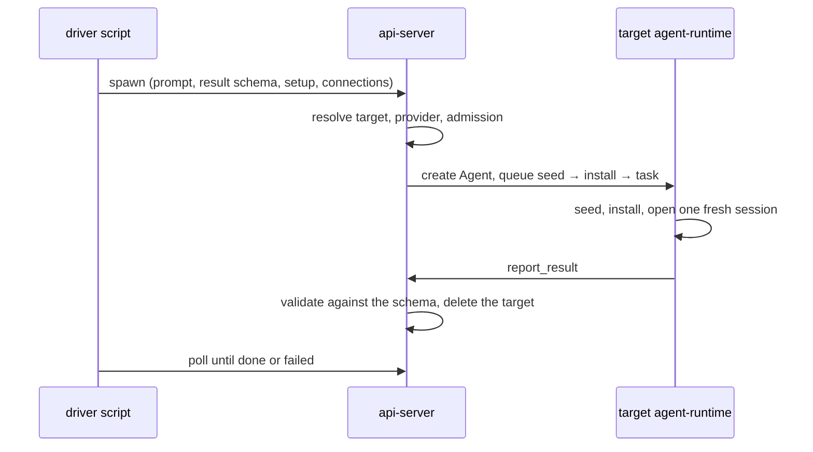

# Invocations

Last verified: 2026-09-25

## Overview

An **Invocation** is a run-once request from one Agent to another: a **Driver** asks a **target** to do one piece of work and return one result that matches a JSON Schema the Driver supplied. The common case pairs it with a freshly spawned, Sweepable target — a *temporary agent* in the interface — that exists for that one task and is deleted as soon as the Invocation goes terminal.

The Driver is almost always a script: a loop an agent wrote that fans work out and gathers the results. It speaks to the platform over the per-agent HTTP surface on the harness port, where the caller is the waypoint-authenticated agent in the path; no request body ever names the Driver.

## Spawning

**A target is set up like a kit-created Agent.** The spawn carries an **Agent Setup** — the part of a [starter kit](starter-kits.md) that decides what an Agent is and has: a repository to seed, an install command, env, CPU, memory and disk, the vm backend, external skills. Kits and spawns share the one definition, so a setup option added for kits reaches spawns in the same change, or is deliberately kit-only. What a kit carries about discovery or about outliving one task — catalog display, schedules, channels, knowledge-base shares, a hibernation override — has no meaning for a target and is not accepted. The spawn's prompt plays the role a kit's onboarding plays: it is the target's first and only turn.

**A spawn names a harness.** The target runs on that harness's Template — its image, size, env and mounts — exactly as an Agent created on it would. A harness the install does not carry is refused, naming the ones it does; the image catalogue the Driver reads lists each with its effective Size. A spawn may bring its own image instead, the way a kit with its own image does: the target is then created from that image with the install's defaults, and the harness, when named, only says what runs inside it. Either way the harness's Template states the providers it can run on, which is what Provider Inheritance checks.

**A spawn carries a label.** It names the target, so the Driver's own vocabulary for the work — not an opaque identifier — is what shows up wherever agents are listed. The minted name keeps the target's prefix and its entropy either way, because that shape is how a target is still recognised as one after it is deleted and only spend rows remain ([observability](observability.md)).

**The order is the workspace-event order.** The seed is queued with the create; the install is queued ahead of the task in the same delivery, so the harness opens its session on a workspace that is already seeded and bootstrapped ([runtime-delivery](runtime-delivery.md)). External skills are applied the way kit apply applies them, after the target is woken.

**Provider Inheritance.** A target runs on its Driver's model provider; a spawn never names one. The platform takes the provider connections granted to the Driver and gives the target the first one its Template can run on. A Template that declares providers none of the Driver's match is refused before anything is created, since the target would otherwise fail its first model call and sit until its deadline. An image target declares nothing, so nothing is narrowed.

**Attenuation.** Beyond the provider, a target receives exactly the connections the spawn names, and each must already be granted to the Driver. Network reach needs no grant of its own: a target has no egress identity and runs under its Driver's rules ([Egress Aliasing](security-and-credentials.md)); its spend is attributed to its root Driver ([observability](observability.md)).

**Admission.** A target sized past its owner's [budget](budgets.md) Ceiling could never start, so the spawn fails at once with the figures. One that fits the Ceiling but not the room free now queues and starts when room frees; the wait counts against its deadline.

## Outcomes

**One result, validated structurally.** The target calls the `report_result` platform tool; the api-server validates the value against the stored schema — shape only, never truth — flips the Invocation to done and deletes the target. The schema lives on the Invocation record and never on a Kubernetes resource.

**Failure says why.** A failed Invocation carries the platform's reason, because the target is gone by the time the Driver sees it. The reasons:

- **Setup failed.** A setup step that does not land fails the Invocation the first time, naming the step and the tail of its error, and deletes the target. That covers a seed or install the target's runtime reports as failed, and a declared skill the apply could neither install nor account for: a turn that runs without a skill the Driver asked for would otherwise return a result the Driver cannot read as incomplete. There is no retry: the Driver is waiting and can spawn again, while a long-lived agent retries within its attempt budget because a user comes back to it.
- **Deadline.** The Driver sets a liveness deadline, clamped to about a minute up to six hours; past it the Invocation fails and the target is reaped mid-work.
- **Restart.** A target pod that restarted cannot resume its one-shot turn, so the liveness sweep fails it at once from the restart count the controller publishes ([platform-topology](platform-topology.md)).
- **Driver Cascade.** Deleting a Driver fails its running Invocations and reaps their targets, transitively for chains.

## The Invocation Pin

A Driver usually waits on its sub-agents from a script, and the signals that keep an Agent awake see sessions, connections and background work its harness reports — not a detached loop, and not a harness that reports nothing. Hibernating a waiting Driver kills the loop, and the results then have nobody to collect them. So while an Agent drives at least one running Invocation it carries a pin the controller's idle checker and early reclaim both honour ([agent-lifecycle](agent-lifecycle.md#hibernate)); a hard stop or pause still wins.

The pin is **level-based**. Spawn sets it synchronously, so a Driver cannot hibernate between its spawn and the next reconcile; a periodic reconcile then pins exactly the Drivers with a running Invocation and releases the rest. No terminal path has to remember to release it, whichever of them ended the last Invocation. A release bumps the Driver's activity, so its ordinary idle window starts from the last result and a chained spawn never finds it asleep. A Driver that crashed mid-fan-out stays up until its targets' deadlines end their Invocations.

## Driver SDK

The client a Driver uses, baked into every agent image in two languages with one surface — JS and Python, both dependency-free and self-configuring from the pod's platform URL: spawn and wait, list the harnesses on offer and the Driver's own connections, read the owner's budget, and write result schemas in shorthand. A failure raises with the platform's reason. Reads retry transient errors; a spawn is sent once, because a duplicated spawn is a second target, not a duplicate. The HTTP routes are the contract; the clients stay thin. Sources: [`packages/driver-sdk/`](../../packages/driver-sdk/), [`packages/driver-sdk-py/`](../../packages/driver-sdk-py/).

[Experiments](experiments.md) additionally attach spawns made inside a span to that span.
