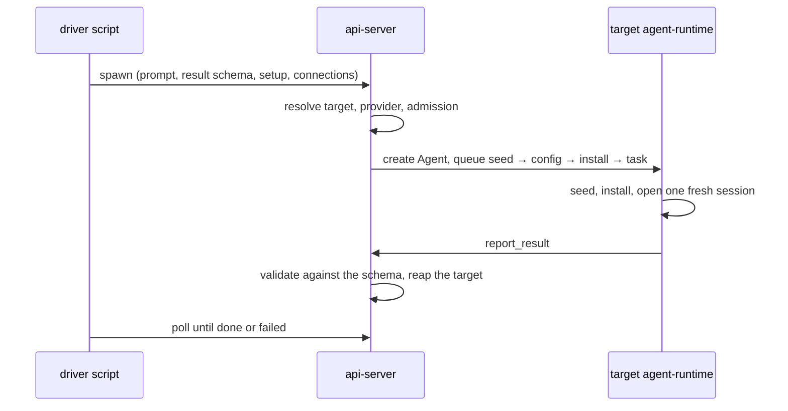

# Invocations

Last verified: 2026-10-05

## Overview

An **Invocation** is a run-once request from one Agent to another: a **Driver** asks a **target** to do one piece of work and return one result that matches a JSON Schema the Driver supplied. The common case pairs it with a freshly spawned, Sweepable target — a *temporary agent* in the interface — that exists for that one task and is reaped as soon as the Invocation goes terminal.

A Driver reaches Invocations two ways. A script — a loop an agent wrote that fans work out and gathers the results — speaks over the per-agent HTTP surface on the harness port through the [Driver SDK](#driver-sdk). An agent handing off one piece of work mid-task uses the [sub-agent tools](#sub-agent-tools) on its platform MCP server instead, without writing code. Either way the caller is the waypoint-authenticated agent in the path; no request body ever names the Driver, and both surfaces resolve a spawn through the same code, so it means the same on either.

```mermaid
sequenceDiagram
  participant D as driver script
  participant API as api-server
  participant T as target agent-runtime
  D->>API: spawn (prompt, result schema, setup, connections)
  API->>API: resolve target, provider, admission
  API->>T: create Agent, queue seed → config → install → task
  T->>T: seed, install, open one fresh session
  T->>API: report_result
  API->>API: validate against the schema, reap the target
  D->>API: poll until done or failed
```

## Spawning

**A target is set up like a kit-created Agent.** The spawn carries an **Agent Setup** — the part of a [starter kit](starter-kits.md) that decides what an Agent is and has: a repository to seed, an install command, env, CPU, memory and disk, the vm backend, external skills. Kits and spawns share the one definition, so a setup option added for kits reaches spawns in the same change, or is deliberately kit-only. What a kit carries about discovery or about outliving one task — catalog display, schedules, channels, knowledge-base shares, a hibernation override — has no meaning for a target and is not accepted. The spawn's prompt plays the role a kit's onboarding plays: it is the target's first and only turn.

**A spawn names a harness.** The target runs on that harness's Template — its image, size, env and mounts — exactly as an Agent created on it would. A harness the install does not carry is refused, naming the ones it does; the image catalogue the Driver reads lists each with its effective Size. A spawn may bring its own image instead, the way a kit with its own image does: the target is then created from that image with the install's defaults, and the harness, when named, only says what runs inside it. Either way the harness's Template states the providers it can run on, which is what Provider Inheritance checks.

**A spawn may choose the model.** It can name the target's model, mode and harness settings — the choices the target's Config panel offers — so one harness serves every model it runs, and a Driver can put one task to two models or a cheap model on a mechanical step. The choice is written into the target's own harness configuration in a delivery of its own, ahead of the task, so the one session already runs on it ([harness configuration](harness-config.md)). The platform does not check the values, and a wrong one need not fail: depending on the harness and the provider, a name the provider does not serve fails the target's first turn or runs a nearby model instead, so a Driver comparing models reads which model the target ran.

**A spawn carries a label.** It names the target, so the Driver's own vocabulary for the work — not an opaque identifier — is what shows up wherever agents are listed. The minted name keeps the target's prefix and its entropy either way, because that shape is how a target is still recognised as one after it is deleted and only spend rows remain ([observability](observability.md)).

**The order is the workspace-event order.** The seed is queued with the create; the install is queued ahead of the task in the same delivery, so the harness opens its session on a workspace that is already seeded and bootstrapped ([runtime-delivery](runtime-delivery.md)). External skills are applied the way kit apply applies them, after the target is woken.

**Provider Inheritance.** A target runs on its Driver's model provider; a spawn never names one. The platform takes the provider connections granted to the Driver and gives the target the first one its Template can run on. A Template that declares providers none of the Driver's match is refused before anything is created, since the target would otherwise fail its first model call and sit until its deadline. An image target declares nothing, so nothing is narrowed.

**Attenuation.** Beyond the provider, a target receives exactly the connections the spawn names, and each must already be granted to the Driver. Network reach needs no grant of its own: a target has no egress identity and runs under its Driver's rules ([Egress Aliasing](security-and-credentials.md)); its spend is attributed to its root Driver ([observability](observability.md)).

**Admission.** A target sized past its owner's [budget](budgets.md) Ceiling could never start, so the spawn fails at once with the figures. One that fits the Ceiling but not the room free now queues and starts when room frees; the wait counts against its deadline.

## Outcomes

**One result, validated structurally.** The target calls the `report_result` platform tool; the api-server validates the value against the stored schema — shape only, never truth — flips the Invocation to done and reaps the target a few seconds later, so the last telemetry the target exported lands before its pod goes. The schema lives on the Invocation record and never on a Kubernetes resource.

**Failure says why.** A failed Invocation carries the platform's reason, because the target is gone by the time the Driver sees it. The reasons:

- **Setup failed.** A setup step that does not land fails the Invocation the first time, naming the step and the tail of its error, and reaps the target. That covers a seed or install the target's runtime reports as failed, and a declared skill the apply could neither install nor account for: a turn that runs without a skill the Driver asked for would otherwise return a result the Driver cannot read as incomplete. It covers a harness config the target cannot apply as well — an image with no harness-config driver, a setting its catalog does not offer, or a write the target reports as failed — found once the target reports what it can do; a result such a target reports first is refused, because it came from the default and a comparison across models must never record it as the one asked for. There is no retry: the Driver is waiting and can spawn again, while a long-lived agent retries within its attempt budget because a user comes back to it.
- **Deadline.** The Driver sets a liveness deadline, clamped to about a minute up to six hours; past it the Invocation fails and the target is reaped mid-work.
- **Restart.** A target pod that restarted cannot resume its one-shot turn, so the liveness sweep fails it at once from the restart count the controller publishes ([platform-topology](platform-topology.md)).
- **Driver Cascade.** Deleting a Driver fails its running Invocations and reaps their targets, transitively for chains.
- **Stopped.** The owner stops a running target from the Driver's chat; the Invocation fails with that reason and the target is reaped like any other.

**One reap path.** Every way a target goes — reported, failed, deadline, restart, cascade, stopped — goes through one reap, which the liveness sweep backstops: a reap that did not land, or one an api-server restart forgot, is finished by the next tick. A deleted root drops only the records whose reap landed; the sweep drops the rest once it finishes their reap and finds the root gone.

## The delegation record

**The Invocation outlives its target.** The record keeps what the target was given — prompt, label, harness or image, connections, size — and what it returned, for as long as its **root Driver** exists: the first non-target Agent up the chain, since a grandchild's immediate Driver is itself a throwaway. It goes with the root Driver's other agent-scoped rows ([persistence](persistence.md#lifetime)). No age limit and no knob. Spend is not on the record; it stays in telemetry, keyed by the invocation id the target's gateway stamps ([observability](observability.md)).

**The target's conversation is kept on the root Driver's volume.** Before a reap, the platform reads the target's one session out of its pod and hands the frames to the root Driver's runtime, which keeps them with the root's own sessions, one file per target, and the record notes that it was captured. Copies are byte-capped per target, keeping the newest frames, and in total per root, evicting the oldest. Capture is best effort and bounded: it never blocks a report, never fails a reap, and **never wakes the root** — a root that is not up (stopped, paused, crashed, or whose script did not await its spawn) keeps no copy. A cascade that deletes the root itself skips capture, since the root's volume goes too. The copy is read-only history, opened beside the Driver's chat and never loaded back as a live session.

**The Driver's chat is the anchor.** The progress lines both SDKs print to stderr, naming each spawned target, are what the chat recognises in the Driver's tool output to draw the delegation in place, so their shape is a contract the SDKs and the chat share. While children run and no line names them yet, the chat shows the Driver's running Invocations from the record.

## The Invocation Pin

A Driver usually waits on its sub-agents from a script, and the signals that keep an Agent awake see sessions, connections and background work its harness reports — not a detached loop, and not a harness that reports nothing. Hibernating a waiting Driver kills the loop, and the results then have nobody to collect them. So while an Agent drives at least one running Invocation it carries a pin the controller's idle checker and early reclaim both honour ([agent-lifecycle](agent-lifecycle.md#hibernate)).

**Only a spawn sets the pin**, as part of the spawn itself. The write is conditional on the Driver it read, and a Driver changes under it for ordinary reasons, a sibling spawn's pin or a controller status update, so a write that loses is read again and retried a few times; a Driver a sibling already pinned is written again all the same, since the release below relies on every spawn changing the Driver. A write that still fails fails the spawn and leaves no Invocation behind. **A periodic reconcile only releases it**, for each pinned Driver it finds with no running Invocation, reading that Driver first and only then checking its Invocations; the release is conditional on that read, so a spawn landing in between, which must change the Driver to pin it, fails the release and the next tick decides again. No terminal path has to remember to release it, whichever of them ended the last Invocation. **A hard stop or pause wins**: both clear the pin, and since the reconcile never sets one, a paused Driver stays down while its sub-agents finish; a spawn made while the stop still stands (inside a pause's settle window) leaves the Driver unpinned, and the spawn's write is conditional on the Driver being unchanged, so a pause landing mid-spawn fails it rather than being undone. It is pinned again only by a spawn after it is awake. A release bumps the Driver's activity, so its ordinary idle window starts from the last result and a chained spawn never finds it asleep; the bump and the cleared pin are one write under that same condition, so a pause that cleared the pin meanwhile keeps its stale clock. A Driver that crashed mid-fan-out stays up until its targets' deadlines end their Invocations.

## Sub-agent tools

The platform MCP server offers every agent the everyday case as tools: **spawn_subagent** takes what the spawn route takes — prompt, result schema, harness or image, the setup, and the harness config as flat model, mode and config options — and returns the id at once; **await_subagents** takes the ids the agent is waiting on; **list_harnesses**, **list_connections** and **get_budget** answer what the SDK's reads answer. Scripts stay the path for orchestration logic — loops, wide fan-outs, scoring.

**Waiting is a long poll, bounded under the request timeout.** await_subagents returns as soon as any listed Invocation is terminal, or after four minutes with the ones still running, and the agent calls it again. The bound sits under Node's 300-second request timeout, which the harness server does not override, as the [satellite](satellites.md) wait does; no harness's own tool timeout is raised. The Driver keeps the ids; the platform tracks nothing per call, a finished id asked again answers again, and an id that is not one of the caller's own Invocations answers as unknown.

**An outcome nobody waited for is delivered as a turn.** An agent that spawned through the tool and ended its turn, or stopped calling await_subagents, is told when each Invocation ends: a short cluster-wide sweep leases such outcomes for one tick, writes one sub-agent-outcome turn per Driver, carrying what await_subagents would have returned, marks them delivered only once the turn is written, and wakes the Driver if it hibernated ([runtime-delivery](runtime-delivery.md)). A lease the server died holding expires and the next tick claims the outcome again, so none is lost. The turn continues the Session whose tool call started the Invocation: the Driver's runtime notes each spawn line as it passes and keeps the note on its own disk, so the result lands where it was asked for, and a Session it no longer knows gets a new one. A running await_subagents holds a short lease on its ids, renewed on every poll, so what it is about to return is not also pushed, and what it returns counts as delivered; a call whose client aborted collects nothing, and the sweep tells the agent instead. One outcome owes one turn: a turn that could not be written is released for the next sweep, and an hourly retry only re-wakes a Driver whose turn is written but that did not wake. **A stop wins over the wake**: a Driver the user stopped is not woken for an outcome; its turn waits in the outbox for the Driver's next deliberate wake. Script spawns are never pushed — the SDK polls, and an extra turn per child would interrupt the script's agent. A runtime too old to know the kind drops it at dispatch; await_subagents still works.

**The model is told when not to use it, and must say why it does.** Harnesses carry their own in-sandbox subagents, which start in seconds and cost nothing extra. spawn_subagent's description opens by steering the model there and names what only a platform sub-agent gives: another harness, its own setup, more resources or a microVM, isolation from the Driver's workspace, heavy parallel work, a schema-checked result. The call must name one or more of these as `needs`, and the server refuses a need the request does not bear out — another harness that is the Driver's own, a setup with no seed, install, env or skills, more resources with none asked — so a stated need is one the model acted on; the three it cannot check pass as stated. The base image's instructions carry the same rule in two sentences, for the harnesses that get no skill. The SDK's spawn route has no `needs`: a script is a deliberate choice already.

**A tool spawn anchors its Delegation block like a script spawn.** The spawn's result text carries the same `[invoke] spawned <label> -> <id>` line the SDK prints, so the chat recognises either chip the same way.

## Driver SDK

The client a Driver uses, baked into every agent image in two languages with one surface — JS and Python, both dependency-free and self-configuring from the pod's platform URL: spawn and wait, list the harnesses on offer and the Driver's own connections, read the owner's budget, and write result schemas in shorthand. A failure raises with the platform's reason. Reads retry transient errors; a spawn is sent once, because a duplicated spawn is a second target, not a duplicate. The HTTP routes are the contract; the clients stay thin. Sources: [`packages/driver-sdk/`](../../packages/driver-sdk/), [`packages/driver-sdk-py/`](../../packages/driver-sdk-py/).

