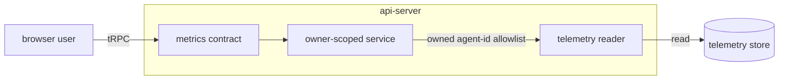

# Metrics (spend read path)

Last verified: 2026-09-03

## Overview

The **metrics** subsystem is the user-facing read path over agent telemetry: it answers *how much have my agents spent, and where* for the signed-in user. It backs the two **Usage** surfaces — the Settings tab spanning every agent the user owns, and the per-agent section narrowed to one — with per-model token/cost aggregates, monthly spend per day, spend per session kind, and (unnarrowed) a per-agent spend breakdown, reading live from the columnar telemetry store that [observability](observability.md) fills. Home's spend widget reads the same unnarrowed breakdown over a period the user picks. Its per-session rollup serves a different consumer — the chat sessions sidebar's cost-per-session line — not either Usage surface. It is almost entirely a query surface: it mutates nothing and emits no events. The one thing it does own is a **session directory** — a projection of which kind each Session was, without which spend cannot be attributed to how the work was started (see [session directory](#session-directory)). The telemetry it reads is written by the agent **export** path and stamped with trusted attribution; this page picks up where that page's *user-facing read path is a separate concern* leaves off.

The subsystem is the **api-server's** responsibility end-to-end. It is a thin owner-scoped reader in front of the telemetry store — the controller and agent-runtime do not participate.

## Contract

Two read-only tRPC procedures make up the surface; both are query-only and both are scoped to the caller's own agents. The field-level shapes live in the contract package [`packages/api-server-api/`](../../packages/api-server-api/) — this page describes what each *means*, not its literal type.

- **Overview** — the everything-for-a-window read. Returns three parallel rollups over the same filtered set: token/cost **per model**, runtime **per session** (call count, summed request latency, token/cost totals, first/last timestamps), and the most recent **per-call** context rows. The per-session rollup groups each session under the **root session of its trace family**: a child harness run the session spawned (e.g. a `claude -p` subshell) mints its own session id but inherits the parent's trace context, so its spend folds into the spawning session's row instead of appearing as an orphan — a row's totals cover everything the session drove. The root is resolved as the earliest session on a shared trace (the parent's turn calls the LLM before any child it spawns exists), independently of any session filter the caller applied, and always inside the caller's ownership scope; a session with no traced rows simply keeps its own id. It composes three independent filters — an optional lookback window (capped at 30 days), an optional exact session, and a row limit on the unaggregated per-call rows — plus an optional narrowing to a single owned agent. Omitting all filters means *all of the caller's agents, all time*.
- **Spend breakdown** — the whole Usage tab in one read. Over an absolute half-open `[from, to)` instant range, it returns four rollups together: token/cost **per model**, spend **per agent** (sorted highest cost first, no top-N cap), spend **per day** for the spend-over-time chart, and spend **per session kind**. The range is instants rather than calendar fields on purpose: the client decides what a "month" means in its own timezone, and the server never reasons about calendars. It is a single procedure — rather than one per rollup — so **ownership resolves once per page load** (one owned-agent-list + scope check, not three) and the client renders the tab from a single loading/error state, never showing a stale total above an empty chart while a slower rollup is still in flight. It spans *all* of the caller's agents by default and narrows to **one owned agent** on request, which is what backs the per-agent Usage section beside the global one; narrowing goes through the same ownership resolution, so it can only ever shrink the scope. Under a narrowed read the per-agent rollup collapses to a single row restating the total — computed anyway rather than special-cased, since the single-procedure shape is the point.
  - The **per-agent** rollup groups on the trusted, gateway-stamped agent id — the same key every read scopes by. Spend an agent drove through an Invocation already rolls up under it **by construction**, not by a read-time join: an Invocation target's rows arrive already stamped with the root Driver's id (attribution decided at spawn time — see [observability — trusted attribution](observability.md#trusted-attribution)), so the grouping needs no special case and one row per real agent covers both direct and delegated spend. The display name of a **live** agent comes from the platform's own agent registry, never from telemetry — so a bucket whose self-reported name was polluted by delegated child rows (or renamed since) still shows the agent's real current name. Only a **since-deleted** agent falls back to telemetry: the latest `platform.agent.name` among its **own** rows in range — child (target) rows, marked by a `platform.invocation.id`, are excluded. A deleted Driver that made no direct calls in the window has no own-name to show and falls back client-side to its id. The name is display-only; the id remains the sole key and the sole authority for whose spend a row is. The rollup additionally guarantees an **Invocation target never appears as a spend row**: a bucket with **no live agent** whose telemetry name is a minted target name (recognized by the invocations context) can only be a pre-cutover target whose Driver is unrecoverable — Invocation records are dropped minutes after terminal — so the row is excluded from the per-agent breakdown rather than shown under a throwaway identity; its spend still counts in the per-model and per-day rollups. The live-agent gate keeps the guard off real agents: a live agent a user happened to name like a target keeps its row. The attribution itself is a **cutover, not a migration**: rows written before the change keep their old attribution and are not backfilled.
  - The **per-session-kind** rollup is **gated on the Session costs experimental flag** — the same flag that reveals per-session cost in the sessions sidebar, since both answer *what did this piece of work cost*. The gate is server-side rather than a hidden section: the rollup rides in the same procedure as the ones every caller gets, so without a gate a user who cannot see it would still pay for a telemetry query and a directory lookup on every read. Turned off, the rollup comes back empty and neither store is touched. What it answers when on is *what started this work* — a person chatting, a Channel, a Schedule, an Experiment, a terminal. Telemetry cannot answer it alone: a call record names its Session but never what kind of Session that is, and the resource attributes that would carry it are stamped once per pod, while one pod serves Sessions of every kind at once. The rollup therefore joins per-Session cost against the session directory below. It reuses the same **trace-family root** the Overview's per-session rollup groups on, so a child harness run counts under the kind of the Session that spawned it rather than as a kind of its own. A Session the directory has no row for is **not dropped** — it is reported under an unattributed bucket, because the rollup sits beneath a total the user can read and silently shedding spend would make the two disagree. That bucket is load-bearing rather than defensive: it covers every agent that has not reported since the directory existed, and every deleted agent whose telemetry outlives its rows.
  - The **per-day** rollup takes one extra input the rest of the surface doesn't: an **IANA timezone** string the client supplies (its own `Intl` zone), because a "day" is a wall-clock calendar boundary and the server otherwise never reasons about calendars. The store groups each call into a local calendar day in that zone; the response is **sparse** — only days that actually carried spend appear, keyed `YYYY-MM-DD`. Generating the full month, zero-filling the gaps, and (for the current month) stopping at today are the client's job, the mirror of how the range leaves "what a month is" to the client.

The Overview session filter is **trace-aware**, not a literal session-id match: a queried session folds in every session that shares a trace with it, so a child harness run counts under "this session" even though it minted its own session id — the filter-side mirror of the per-session rollup's root grouping above. Both folds ride the same trace-context propagation [observability](observability.md#agent-export) describes, and neither crosses the ownership boundary — every side of a fold carries the same owner scope.

## Agent-facing read

A third read serves an agent rather than a signed-in user: the `get_usage_summary` MCP tool, over the same reader, **pinned server-side to the calling agent** — the agent names no id, so it can only ever read its own spend. It answers the one question an unattended agent needs (what did I cost over the last N days: total, per-model split, session count). Its window is bounded *and* defaulted in the contract package next to the tRPC input bounds — 7 days by default, 30 at most — so a tool call cannot widen into a whole-retention scan, and an agent that omits the argument gets the cheap window rather than the widest one. Its consumer today is the case-study skill ([case-studies](case-studies.md)), which is told to prefer it over counting tokens out of its own transcripts.

## Session directory

The kind of a Session — and whether it was a chat or a terminal — is **agent-owned state**: the agent-runtime records it beside the Session when it is created, and it lives on the agent's own volume ([persistence](persistence.md)). That is the right home for it and a useless one for this subsystem, for two reasons that both bite exactly when the read matters. A hibernated agent's volume is detached, so answering *what kind of Session was this* for a past month would mean waking every agent the user owns. And an agent's volume is reclaimed when the agent is deleted, while its spend deliberately survives in telemetry — so the kind would vanish from windows whose cost still counts.

The directory is the narrowest fix for that: **one dimension per Session — its kind — copied into Postgres**, where it outlives both hibernation and deletion. Everything else about a Session stays agent-owned; the directory is not a second Session store and nothing reads Sessions from it.

Agents push it rather than the platform pulling it, over the same authenticated agent→api-server channel [runtime delivery](runtime-delivery.md) uses: whenever its Session metadata changes, an agent reports the current set. Three properties of that report follow from what it is for:

- **It is a snapshot, not a delta.** An agent that missed a report, restarted, or predates the directory converges on its next one; nothing has to be replayed, and a lost report costs latency rather than a permanent gap.
- **It is sent only when the answer changes.** Session metadata is touched on every turn (activity stamps), while a Session's kind is fixed at creation — so the agent compares what it would send against what it last sent and stays silent when they match. Without that, an ordinary conversation would put one write per turn on the api-server to re-assert a constant.
- **Reporting is best-effort.** A failed report is logged and left for the next change or the next boot; nothing about serving the agent depends on it. The read path degrades to the unattributed bucket described above, which is exactly what a not-yet-reported agent looks like.

The directory is keyed by agent and Session, and every read of it is scoped to the caller's already-resolved owned-agent set — it widens nothing and is never a path to another user's Sessions.

It is the one table in the platform that grows with **use** rather than with the number of things that exist, so it ages out on its own: a weekly job drops rows past a retention horizon, guarded by an advisory lock so one replica does the delete and the others no-op — the same shape [usage-tracking](usage-tracking.md#retention) uses for its activity log. The horizon is deliberately several times the telemetry store's own retention rather than pinned to it. Erring long costs a few stale rows nothing reads; erring short would drop the kind of a Session whose spend is still in range, which is the exact error the directory exists to prevent.

## Ownership scoping

Every read is scoped to the agents the caller owns; the scope is resolved **in the service layer**, above the store. The service resolves the caller's owned agent IDs into an allowlist and hands only that allowlist to the reader, which does no scoping of its own — it filters unconditionally on the trusted owner attribute. A caller can never widen the scope through input: naming an agent they do not own resolves to an empty allowlist, and an empty allowlist yields no rows rather than an error. When a specific agent is requested, the same API-key binding check the rest of the agent-read surface applies is layered on top.

The owned set is the **union of the caller's live agents and the historical agent registry**, deliberately including deleted agents. Spend history is a bill: it must not shrink retroactively when an agent is deleted. Scoping only to live agents would erase a deleted agent's past spend from every window that overlaps its lifetime, so the registry keeps deleted agents in scope and their telemetry keeps counting for as long as the store retains it.

Which side of that union an agent came from is not discarded once the set is formed. Resolution carries each agent's **live-or-registry-only** status forward — and, for a live agent, its current display name — past the allowlist and into the read, where the per-agent rollup depends on it twice: to label live agents from the platform rather than from telemetry, and to exclude a still-target-named bucket only when no live agent backs it (both above). The reader itself still receives ids alone; liveness never reaches the store and never widens or narrows the scope, so it is purely a service-layer property of an already-resolved set.

## Telemetry reader

The reader is the only component that speaks to the telemetry store. It holds a process-wide read connection and translates each contract read into an aggregate query against the store, always gated on the owner allowlist plus the request's window filters.

It reads the per-LLM-call log records Claude Code exports — one record per API call — and depends on a small, stable slice of their shape: the trusted **owner attribution** attribute (every query's ownership gate), the **session** and **trace** identifiers (session grouping and the trace-aware fold), the **model** name, the **timestamp** (windowing and first/last bounds), and the per-call counters it sums — the **token counters** (input, output, cache-read, cache-creation), the **cost counter**, which is carried in integer micro-dollars and scaled to dollars at read time, and the per-call **request latency**, whose sum is reported as model time. Summed latency counts concurrent calls in parallel, so it measures model work rather than elapsed wall-clock. The per-agent breakdown additionally reads the agent's **display name** attribute — never for scoping, only to label a row, and only as the **fallback for deleted agents** (live agents are labelled from the platform registry in the service layer) — taking the latest value seen in the window among the agent's **own** rows, excluding child rows carrying an **invocation identifier** (the target-own id the gateway stamps alongside the Driver's attribution), so a Driver keeps its own name rather than inheriting a target's throwaway one; a deleted agent still keeps a readable name, and an agent with no own-name row in the window is left unlabelled for the client to fall back to its id. The per-day breakdown reuses the same **timestamp**, shifting each row into the client-supplied timezone before truncating to a calendar day so buckets line up with the user's wall clock rather than UTC. This is a coupling to the harness's export contract, not to platform code; the exact attribute keys and query text are the reader's own detail in [`packages/api-server/`](../../packages/api-server/). The reader scopes to Claude Code's per-call records by the record body alone — not by service name, which carries the agent's *template* name and would hide every template not literally named for the harness.

## Disabled backend

The telemetry store is optional (it ships with [observability](observability.md), disabled by default). When no store endpoint is configured, the metrics service is wired to a **disabled** variant whose every read fails loud with a `PRECONDITION_FAILED` error rather than returning empty results. Failing closed is deliberate: an empty success is indistinguishable from "no spend yet" and would silently misreport a bill as zero. Both Usage surfaces treat that error as *metrics unavailable on this deployment* and show an unavailable message, distinct from the empty-but-enabled state where a real store simply has no rows for the window. Because the verdict is deployment-wide rather than per-window, they withdraw the period control instead of offering months that would fail identically; the per-agent nav summary degrades to its neutral placeholder, and Home's spend widget leaves the page rather than occupy it with an error the user cannot act on. The agent-facing read deliberately inverts this: it answers `available: false` with a reason, as a *success*, because its caller is unattended and needs to report "cost is not measured on this install" and carry on rather than treat a thrown error as a failed task. Both variants are chosen once at composition time from the same configuration, so neither can be reached on an install of the other kind.

## Trust story

Attribution is trustworthy; the numbers are self-reported. The two guarantees are different and this subsystem inherits both from the export path — see [observability — trusted attribution](observability.md#trusted-attribution) for the mechanism.

- **Counters are agent-reported.** Token and cost figures come from the agent's own telemetry. An agent runs untrusted code and can misreport its own numbers — inflate a token count, understate a cost. The read path does not attempt to independently verify them; it reports what was exported.
- **Attribution is gateway-stamped and unforgeable.** The owner attribution attribute every query filters on is stamped by the agent's paired gateway, overwriting anything the agent set, and the collector drops any owner attribution that did not arrive through that gateway. So an agent can only ever pollute *its own* spend — never make its telemetry appear under another user, and never read another user's. The guarantee is **attribution, not content integrity**: whose spend is bounded exactly; how much is self-declared.
- **Display identity is not attribution.** The agent's user-facing name travels in a separate, agent-exported attribute that exists only for finding an instance in the exploration UI. It is display-only and never used for scoping or ownership — the gateway-stamped id is the sole authority for whose data this is.
