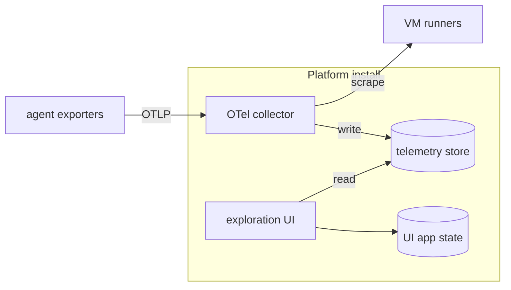

# Observability (agent telemetry)

Last verified: 2026-09-23

## Overview

The telemetry backend is an **optional, bundled subsystem** that receives and stores the OpenTelemetry signals (logs, traces, metrics) agents emit — the substrate for answering *how agents run*: token consumption, cost, per-sub-agent breakdown. This page covers the backend (receiving and storage) and the agent **export** path that feeds it (see [Agent export](#agent-export)); the user-facing read paths are a separate concern, owned by [metrics](metrics.md) for spend and [agent-telemetry](agent-telemetry.md) for the traces and log records themselves.

It is implemented with **ClickStack**: a columnar telemetry store (ClickHouse) fronted by an exploration UI (HyperDX), plus a separate document store backing that UI's own application state. Installing or upgrading the platform brings the stack up when it is enabled, but it is **disabled by default** — it is a heavy, multi-pod stack, and until agents are wired to export it would receive nothing, so operators opt in per install.

## Topology and roles

- **Collector** — an OpenTelemetry collector that receives OTLP and writes the signals into the telemetry store. It is platform-owned (deliberately not the collector ClickStack bundles — see *Access control*) and holds no upstream credentials. Its one pull path is the [VM runners](#vm-runner), which it scrapes because they cannot push; finding them is its only Kubernetes access, read-only pods in the agent namespace.
- **Telemetry store** — a columnar analytical database built for high-volume, high-cardinality, time-series telemetry. It is the only place telemetry lives. Retention is bounded: when the collector first creates the telemetry tables it stamps them with a TTL — 30 days by default, overridable per install through the chart — so signals age out instead of accumulating until the volume fills. The TTL lands only at table creation; changing it on an existing install means altering the tables by hand.
- **Exploration UI** — reads the telemetry store directly so an operator can explore signals. Its own application state (dashboards, sources, saved views) lives in a separate document store that holds no telemetry.

The whole stack sits inside the cluster trust boundary.

## Operators are install-time infrastructure

The telemetry store and the UI's app-state store are managed by Kubernetes **operators** driven by custom resources. Like the service mesh and the certificate manager, those operators and their CRDs are installed out-of-band at cluster-install time rather than by the platform chart: Helm never upgrades a chart's CRDs on an existing release, so CRD-owning infrastructure stays outside the chart. The chart ships only the custom resources and the platform-owned collector, which roll with an ordinary platform upgrade.

## Access control: the mesh, not ingestion tokens

ClickStack's default posture secures the collector with an ingestion key the UI issues and manages — application-layer, token-based access control. The platform deliberately does **not** rely on that. The collector is gated the same way as the rest of the platform: by the **service mesh**, through an authorization policy that admits only the platform's own namespaces — the release namespace and the agent namespace — and denies everything else. This keeps telemetry access on the same SPIFFE-principal model as the rest of the system (see [security-and-credentials](security-and-credentials.md)) rather than introducing a parallel token scheme.

Making the mesh the sole gate is why the collector is platform-owned. ClickStack's bundled collector takes its configuration — including the ingestion-key check — dynamically from the exploration UI, so that configuration cannot be the access boundary here. The platform instead runs its own collector with a fixed configuration and no key enforcement. The UI is unaffected: it reads the telemetry store directly, not the collector.

## Agent export

Harnesses produce telemetry by exporting it themselves over OTLP — the platform does not scrape or tap it. Export turns on with the backend: enabling `clickstack.enabled` stands up the collector, the gateway's collector egress chain, and the [trusted attribution](#trusted-attribution) below, and configures the harness to export to the collector. A per-template `telemetry` flag opts a harness in **and names which env rail it gets**, because the harnesses read different export configuration: Claude Code the standard OTLP env, Bob Shell its own `BOB_TELEMETRY_*` set — and, since 2.0.3, the standard OTLP exporter env as well, but only with the JSON protocol the Claude Code rail does not use, so a Bob image on that rail sends its export to the vendor endpoint instead of sharing the rail. Two rails exist today — Claude Code's and Bob Shell's — and both point at the same collector over the same gateway egress; a third harness means a third rail, not a change to anything downstream.

- **Rides the agent's ordinary egress.** Claude Code's exporter honours the agent's `HTTPS_PROXY`, so its telemetry leaves through the paired gateway pod over HTTPS to the bundled collector — the same dedicated, MITM-terminating chain that performs the trusted attribution below. No new network path, and no credential is injected into the export. This is a **precondition, not a convenience**: for a correctly configured rail the collector is reachable no other way, and an exporter that ignored the proxy would also miss the attribution stamp, so its records could never be attributed to a user. Honouring it is not automatic: Bob Shell's OTLP exporter builds its own HTTP agent, which the runtime's env-proxy support does not cover, so on the platform its export is attempted directly and dies at the agent's egress policy, silently — today Bob's spend reaches no collector, and the Bob rail is wired for the day its export goes through the proxy.
- **A malformed rail can redirect telemetry outward.** Bob's rail is the case that makes this explicit: its provider selection validates a key pair the platform's collector ignores but the harness insists on, and a rail that fails that validation is discarded whole — the harness then falls back to its **vendor's own external endpoint** rather than exporting nothing. So a rail value is not merely inert when wrong; for this harness a missing or malformed one changes *where the telemetry goes*. The rail therefore carries the placeholder credentials the validation demands, and the export is otherwise credential-free — no upstream secret is injected into it. Since 2.0.3 a second value redirects the same way: a standard `OTEL_EXPORTER_OTLP_*` setting the harness cannot parse — the Claude Code rail's `http/protobuf` protocol among them — fails its whole env parse and sends the export to the vendor endpoint too.

- **Config travels the harness env rail.** Each rail's export environment — the standard OTLP set on the Claude Code rail, the `BOB_TELEMETRY_*` set on Bob's — reaches the harness through the same runtime channel that carries connection env — not a pod-level Secret or env.
- **Signals.** Claude Code exports metrics, logs, and traces (the last via the enhanced-telemetry beta) over OTLP/HTTP, with one **log record per LLM call**. Bob Shell exports **traces only**, and its per-call counters ride a generation span under GenAI semantic-convention names — there is no log-record equivalent to fall back to. The [metrics](metrics.md) read path takes its **spend** from Claude Code's log records only, so even once Bob's export reaches the collector no Usage surface reads it yet; normalizing the two shapes is separate work. That path does also read the trace store, for the agent-facing span read alone — which is therefore the one read that answers something for a traces-only harness, though what it answers is span shape, not spend. Bob additionally gates those spans behind its own agent-operations switch, so the rail turns it on explicitly; without it the harness exports its lifecycle spans and none of the spend.
- **Content bodies are not exported** — prompt text, tool arguments, and raw API bodies stay off; only structural telemetry (durations, model/tool names, token and cost counters, span shape) leaves the agent. Claude Code omits them by default. Bob **includes** them by default, so its image writes the payload-exclusion setting into the harness's own configuration at startup rather than relying on the env rail: the invariant is the platform's, and a harness that defaults the other way must be corrected where it reads its settings.
- **Self-declared identity for exploration.** On the Claude Code rail the export env names the OTel service after the agent's **template** (so a nous agent reads as `nous`, not as the underlying Claude Code CLI's default), and seeds the user-declared agent name as a `platform.agent.name` resource attribute, kept current on rename. Both are exported by the harness itself and exist for finding an instance in the exploration UI — they are **display-only**; attribution rests solely on the gateway-stamped `platform.agent.id` below. Bob supplies **neither**: it fixes its own service name and builds its resource attributes internally, reading no standard OTel resource environment, so its signals are findable by service and by trusted agent id but not by the user's name for the agent. That the gap is tolerable is the same point — nothing but exploration ever depended on those two. This split is what lets an Invocation target keep its own name in the UI while its spend merges into the Driver that drove it (see [trusted attribution](#trusted-attribution)).
- **Trace-context propagation stays on.** The harness keeps W3C trace-context propagation on even when it fronts a custom model upstream — a case where it would otherwise switch it off — so its subprocesses inherit the session's trace context and its requests carry the `traceparent` header. The gateway's TLS-intercepting chains that see the decrypted header join their spans — and the egress-approval check's api-server spans — to that same trace, so a model request reads as one trace across harness, gateway, and api-server. See [logging — gateway telemetry](logging.md#gateway-telemetry) for which chains are traced and what never reaches a span.
- **Child harness runs fold into their session.** A harness run the session spawns rather than serves — a `claude -p` in a subshell, a command under the `dam-run` shell shim — mints its own OTel `session.id` but inherits the session's trace context, so its records carry the parent trace's `TraceId`. The session-scoped metrics read path folds in every session that shares a trace with the queried one — whole sessions, since a child's warmup calls carry no trace — so "this session" covers the runs the session spawned, not only its own API calls. One wrinkle makes the subshell case work at all: the harness scrubs `OTEL_*` from the env it hands Bash-tool subprocesses (while forwarding `TRACEPARENT`), so the Claude Code image mirrors the `OTEL_*` env into the harness settings file at spawn, where a child `claude -p` re-applies it at startup.

## Platform-service export

The platform's own services emit their operational telemetry through an in-process OpenTelemetry SDK apiece. Enabling the backend sets the standard OTLP endpoint environment on each deployment, pointing straight at the bundled collector over plain HTTP inside the mesh (ztunnel supplies mTLS, and the collector's authorization policy already admits the release namespace); without that endpoint the SDK never activates. Unlike agent telemetry, this export does not ride a gateway: it arrives without the trusted attribution header, so it carries no `platform.agent.id` and is never attributed to a user — which is exactly how the read path distinguishes platform telemetry from agent telemetry.

- The **controller** emits one trace per reconcile pass and background sweep (with spans for each Kubernetes API call), reconcile and workqueue metrics, and its structured logs with trace correlation.
- The **api-server** emits one trace per incoming request with a child span per tRPC procedure (and spans for outbound calls: agents, Keycloak, channels, Redis, the ext-authz gRPC checks), per-procedure duration/outcome metrics plus Node runtime health (event loop, GC, heap), the **usage counters** below, and its structured logs with trace correlation. Health-probe requests are not traced. The primary Postgres pool is not yet instrumented (no driver instrumentation exists for it); that gap is tracked as follow-up work.

### Usage counters

A set of counters records what the platform is used for, each incremented from the same interaction events [usage-tracking](usage-tracking.md) persists. They are a **deliberate second sink** on those events: that subsystem owns the durable, per-user record and its SQL read surface, while these serve the operational read — a rate on a dashboard, reachable without SQL and without that subsystem's reader role. Both sides are fed from one emission, so a turn, a fire or an import means the same thing on both rather than being counted two ways. They are not guaranteed to agree in practice: each is separately enabled — the counters need the SDK active, the log needs activity tracking on — and each fails independently, so treat a divergence as a sink being off or dropping, not as two different notions of the thing counted.

**Every counter is identity-free by construction, and that is the rule rather than a property of what happens to have been built.** A platform signal carries only dimensions whose value set is bounded and enumerable from the install's own configuration, and never a value derived from one person's identifier — not a Keycloak `sub`, not its pseudonym, and not an agent id, which resolves to an owner and is therefore a user dimension in disguise. The [trusted attribution](#trusted-attribution) attribute stays absent from these signals, but its absence is a *consequence* of the rule, not the rule itself. Where a question genuinely needs people rather than events, the counting happens inside the api-server and only the count leaves it. Anything per-person or per-agent stays in the activity log, which is pseudonymized and role-gated for exactly that reason.

What each measurement counts, and what it cannot answer:

- **Turns** — one per prompt a person sent an agent, over either transport. Its dimensions are the **surface** that carried it — for a relay turn the surface the upgrade resolved from the caller's own credential, for a channel turn its messenger — and the **Template** below. A failed turn counts like any other, because the counter measures what was asked rather than what came back. Two limits are worth knowing before charting it: a read-along turn is indistinguishable from one that addressed the agent, since the channel turn event carries no such marker, so a channel with read-along enabled reads higher than the attention it actually received; and terminal-mode sessions never appear at all, because a PTY is an opaque keystroke stream with no message boundary, which is also how the CLI chats.
- **Active actor-days** — one per platform identity first seen on a surface on a UTC day, which is the same unit the activity log's auth rows collapse to, not a count of sign-ins. Counting it needs identity, so the collapsing happens in memory in the api-server and only the increment is exported. Three consequences follow and none of them is hidden: the set is per process, so a multi-replica install over-counts a person by up to the replica count; a restart empties it, so someone returning later that day counts twice; and a messenger user who never signs in never appears, while a headless API-key caller lands in the catch-all surface rather than one of its own.
- **Schedule fires** — one per fire that reached the point of being recorded, dimensioned by the schedule's **mode**, its **outcome**, and the target's **Template**. The outcome says whether the trigger was durably queued and a wake was asked for — never whether the agent did the work. A schedule carrying a Precheck does report its verdict back, but onto the schedule's own row rather than into this counter ([schedules](schedules.md#precheck)), so a declined occurrence still counts here as a fire that succeeded. A fire whose schedule is missing or disabled is not counted at all, and a transient failure is counted only once it has exhausted its retries, so one failure means the fire was abandoned rather than merely delayed.
- **Connection changes** — one per Connection reaching its connected state or being removed, dimensioned by **action**, the **kind of integration** it came from — an app versus an MCP server — and the **provider** it was made against. The provider rides on the event because a grant's own identifier is per-grant and its record is destroyed on disconnect, so the answer to *which providers do people connect* would otherwise die with the Connection. It is the one dimension the sink cannot enumerate when it is wired, so rather than folding against a known set it caps how many distinct providers it will ever emit and sends the rest to a catch-all. That cap bounds cardinality, not content: what keeps the values safe to publish is that they name entries in a catalog fixed in code, so a later move to user-supplied provider names would need an allowlist rather than a bigger cap.
- **File imports** — one per import attempt, by **surface** and **outcome**, beside a **bytes** counter that advances only on success, so a failed transfer never inflates the volume.
- **Skill changes** — one per skill installed on or uninstalled from an agent, by **action** and **origin**. The skill's name is deliberately not a dimension: it is user-authored and unbounded, so *which* skills people install stays a question for the activity log.
- **Relay attachments** — one per interactive attachment to a running agent, by **relay** and surface: the measurement that tells whether a way of reaching an agent earns its keep. Background read-only sockets, which the browser opens to follow a session it is not driving, are not attachments anyone made and are not counted. This is the one signal whose two sinks count different units: the activity log keeps one row per person, agent and relay per day, while this counts every attachment, so the two are not comparable head to head.
- **Experiment transitions** — one per transition an actor drove, whether a person or an agent acting for its owner. A transition the platform drove itself, such as a sweep reaping an idle experiment, is not someone using the feature and is not counted.
- **Invocation spawns** — one per target an agent spawned, carrying no dimension: the driver and target would multiply series by the fleet size, and the owner is the identifier this whole section exists to keep out. Delegation volume is the question it answers.
- **Entry-point choices** — one per way-in chosen on the empty home screen, by **choice**. It counts clicks rather than people: the activity log keeps one row per person and so answers *how many chose*, while this answers *how often it was chosen*.

**The Template** an agent was built from is the one dimension that had to be collected rather than exported, since no interaction event carried it. The sink resolves it from the api-server's in-process replica of the agent records, so it costs no call to the cluster, and folds the result against the templates the install actually carries. It is deliberately the Template rather than the harness family a Template declares: only some Templates name a family, so folding to families would collapse everything else into one bucket, while the Template distinguishes every kind of agent an install offers and a reader who wants families can group several Templates into one. The set it folds against is the catalog as it stood when the process started, so a Template added to the install later lands in the catch-all until the next restart, while one removed later keeps its own series for as long as the process lives. Not knowing it is three distinct answers rather than one: an agent built from a raw image has **no** Template, an agent the replica cannot resolve — deleted, or the cache briefly desynced — is **unknown**, and a Template absent from that start-up snapshot folds into a catch-all. Keeping them apart is what lets a reader tell a real population from a measurement gap.

Four absences are deliberate. **Agent identity** would multiply series by the fleet size for questions that do not need it, and were it ever added it must not reuse the trusted attribution attribute. **Per-turn outcome** is known only on the channel side, and a dimension present on some surfaces and not others makes any filter on it silently drop the rest; per-turn outcomes stay in the activity log's channel views. **The group a person belongs to** is absent for a different reason: it is not collected anywhere. No group reaches the api-server — a Keycloak group is not claimed into the token, and the only group-like fact the platform holds about a person is whether they carry a configured realm role — so a group dimension would be new collection, and it would also be a dimension derived from a person, which the rule above forbids. Which groups use the platform for what therefore stays unanswerable from either store.

And **core-team exclusion** has no counterpart here: the activity log's inspector-facing aggregates filter the platform team's own traffic out — its analytics passthroughs leave that to their consumer — while these counters filter nothing, so a number read from the store includes the people who built it. Several recorded interactions have no counter at all, among them artifact publishing, sharing, viewing and deletion, skill publishing and skill sets, agents created under a Kind, feature flags, API keys, harness-config edits and contribution-delivery health; those remain answerable only through the activity log.

Reading them takes one property into account: each process exports its own cumulative series, so a restart resets it and replicas do not collide but do partition. Rates and increments summed across series are the honest read; raw values are not. There is no platform-owned read path over metrics — [metrics](metrics.md) reads agent log records and spans, not these — so today they are reached through the exploration UI or the store directly.

### VM runner

The [VM runner](vm-runner.md) is the one platform service that does not push. It stays off the mesh, and the collector admits only mesh identities, so a runner's export would be refused; the collector **scrapes** every runner instead. A runner serves its metrics on a scrape port apart from the machine API: that API's token creates and deletes machines, and a scraper holding it could too, so the scrape carries no token and the runner's NetworkPolicy, admitting only the collector to that port, is its whole gate. The collector finds runners by listing pods in the agent namespace — read-only, granted only when the vm backend is on — and keeps only the port a runner names for metrics. The scrape exists when both the telemetry backend and the vm backend are enabled.

What a runner measures is what judging the vm backend against the container one needs:

- **Machine operations** — each create, wake, restart and stop as a duration by outcome; the runtime's own start call inside it; and **ready latency**, from asking a machine to start to the first health check its guest answers, once per boot.
- **Unhealthy restarts** — the ones the runner made on its own because a guest that had answered went quiet, apart from those a changed spec causes.
- **Failures** by operation and by the reason the Agent is told, and **admission refusals** — machines whose memory did not fit.
- **Memory** committed to machines, counted the way admission counts it, beside the runner's limit and its own reserve.
- **The image cache** — creates that found a bootable tree and creates that did not, fetch durations by outcome, evictions and the bytes they freed, and the bytes held against the budget.

The [usage counters](#usage-counters)' identity-free rule holds here with a sharper edge: a runner exists per owner, so a machine id, an image reference or the runner's owner label would each make a series a person. Every dimension comes from a closed set — operation, outcome, failure reason, cache result — and the scrape copies no pod label onto a series. Series are still partitioned by runner, because each runner is a process with its own cumulative counters, so a runner restart resets them and rates are the honest read.

The runner's other duty here rides the machine status rather than a signal: **explaining a boot**. A guest's own boot log is on its storage disk, which the host does not read — parsing a filesystem a guest has had root on is not something the host should do — so the runner reads the machine's **console**, which the runtime writes on the host side. It carries the guest kernel and the runtime's guest agent, not the harness, whose output goes to the boot log ([persistence](persistence.md)). When a boot fails, and when a guest has not answered for a minute after it was asked to start, the status message carries the end of that console: a few kilobytes, stripped to printable text, and redacted with every env value the machine has been given, because a guest that prints its environment puts an operator's Secret there. The guest agent's line for each connection it accepts is left out first, because the runner's health probes would otherwise fill those kilobytes within a minute and push out every line the guest itself wrote. Every start empties the console first, because the file outlives the runner and a restarted runner knows only the current spec: what a tail quotes is then a boot this runner started, with values it holds. A console the runner cannot redact, holding no spec for the machine, is not shown. The runner's health prober writes the note for a quiet guest and refreshes it about once a minute, not on every probe, so a stuck machine does not rewrite its Agent's condition on each one.

## Trusted attribution

Telemetry only answers *whose agents ran, and how* if each record is reliably tied to the agent that produced it — and agents run untrusted code, so the attribution cannot be taken from what the agent put in its own telemetry. It comes instead from the platform-controlled path the telemetry already travels.

Every agent's egress, telemetry included, leaves through its **paired gateway pod**: the agent has no other admitted route (see [security-and-credentials](security-and-credentials.md)), and the gateway proxy's configuration is controller-rendered, not agent-writable. When the telemetry backend is enabled, that gateway proxy intercepts any agent OTLP bound for the collector and stamps a trusted `platform.agent.id` identifying the producing agent — **overwriting** anything the agent set, since the value is fixed in this gateway's own per-agent configuration. The collector takes the attribution from that stamp alone: it **drops whatever `platform.agent.id` the agent wrote into its own telemetry** and re-derives the attribute from the stamp, so a self-declared value never survives.

The stamp is worth trusting because the agent cannot substitute its own on any route. That gateway proxy is the agent's *whole* egress, not just its telemetry path — it also forwards ordinary requests to whatever host the agent names, and the collector answers to more names than the one the platform configures: short service DNS, its cluster address, a second port. Recognizing the collector in order to stamp selectively cannot be made exhaustive, and a name missed by that recognition would be a name on which the agent's own claim still counted. So **the gateway stamps every plaintext request it forwards for the agent, and the telemetry-terminating route alongside it**, overwriting whatever the agent set. Those two are the only ways to the collector's receivers — a host chain re-originates TLS towards its own upstream and cannot reach one — so telemetry arriving there carries the gateway's value whichever way it came. The collector depends on this: it sees a stamp and has no way to ask which route produced it. The trade is that an agent's id is visible to any plaintext destination it calls; what it buys is that no record can arrive unattributable, which is what the usage figures rest on. For the same reason the telemetry path **wins a collision** — where an owner's own egress rule names the collector's address, that rule's route gives way to the stamping one, so no setting an owner can reach costs their agent its attribution.

The guarantee is **attribution, not content integrity**: an agent can still misreport its own numbers (inflate a token count), but it can only ever pollute *its own* telemetry — never make its telemetry appear under another agent or user. The owner-scoped read path resolves `platform.agent.id` to the owning user; telemetry that carries no `platform.agent.id` (the platform's own components) is not agent telemetry and is never attributed to a user. The attribute is namespaced under the permanent `platform` codename so it never collides with OpenTelemetry semantic-convention or agent-self-reported `agent.*` attributes.

**Invocation targets attribute to their Driver.** An Invocation target is not a spend principal of its own — the same rule [Egress Aliasing](../ubiquitous-language.md) applies to network identity and Driver Cascade to deletion, here in its spend face. So a target's gateway stamps its **root Driver's** id as the trusted `platform.agent.id`, not the target's own, and every record the target produces counts as the Driver's from the first export. To keep the merged child rows distinguishable, the same gateway additionally stamps a trusted `platform.invocation.id` carrying the target's *own* id; the collector promotes it with the same drop-then-stamp sanitization, so it too is unforgeable. A non-target's gateway **strips** the invocation stamp on every route out, just as a target's stamps it on every route out, so the attribute only ever appears on genuine target rows. The target's `platform.agent.name` stays its own and remains display-only. This attribution is fixed at **spawn (write) time**: the api-server resolves the root Driver when it creates the target and bakes the override into that gateway's controller-rendered configuration, so it is settled before the target's first call and never recomputed at read time.

## Persistence

The telemetry store is a **fourth durable substrate** beyond the three in [persistence](persistence.md) (Postgres, the Agent/Run custom resources, the per-Agent PVC), and it sits outside that platform/agent split — neither the agent nor the controller touches it. Both the telemetry data and the UI's app-state persist on operator-managed volumes that survive pod restarts and a chart uninstall; losing those volumes loses telemetry history and nothing else depends on them for correctness. When the subsystem is disabled, none of it exists.

## Relationship to logging and usage-tracking

This subsystem is distinct from two neighbours, and overlaps one of them on purpose:

- [logging](logging.md) owns structured operational logs and the real-identity security audit trail, emitted to stdout.
- [usage-tracking](usage-tracking.md) owns pseudonymized usage analytics in Postgres — an append-only activity log read through SQL views. The [usage counters](#usage-counters) above are a **second sink on that subsystem's interaction events**: the same facts, read operationally as time series rather than analytically through SQL. Interaction *volume* is therefore answerable from either side, and the split is by read pattern, not by what is counted — with one asymmetry that follows from identity: anything per-person or per-agent is answerable only from the activity log.

Telemetry here is the OpenTelemetry-native, explorable signal pipeline: a different store (columnar, not Postgres), a different shape (OTLP logs/traces/metrics), and a different read surface (the exploration UI). Postgres remains the right home for coarse usage analytics; it cannot serve high-volume telemetry, which is the reason this subsystem exists at all.

See [`helm/`](../../helm/) for the chart shape — the `clickstack` values block, and the collector and authorization policy under `templates/clickstack/`.
