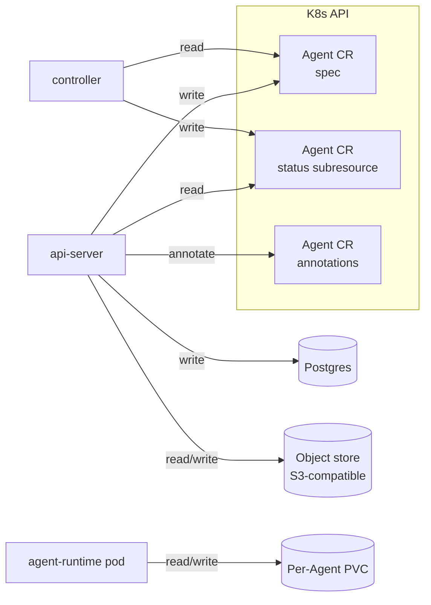

# Persistence

Last verified: 2026-09-21

## Overview

Platform persists state on four durable substrates, split cleanly between the platform and the agent:

**Platform-owned** (the agent never touches these):

- **Postgres** — application state the api-server owns end-to-end. Sole writer: api-server; the controller never reads from or writes to Postgres. Holds anything that has to be queryable when no agent pod is running (channel bindings, identity links, allow-listed users, schedules) plus any other api-server-only domain resource. Session metadata is *not* here — it is agent-owned, save for the one dimension the spend read path cannot lose to hibernation or agent deletion (see the session directory below). The bundled instance runs under three login roles — one NOSUPERUSER owner per service (`platform_apiserver`, `platform_keycloak`) plus the bootstrap superuser `platform`, kept as a separate statement-logged role for DBA work — so the api-server's connection credential cannot reach Keycloak's database or escalate. Admin sessions carry a per-role `log_statement` default that puts every statement they issue into the pod log for the cluster collector; the server-wide default logs DDL only, so routine application DML stays out of the audit trail while every role and grant change is captured whoever issues it. A fourth role, `usage_readers`, carries no credential and cannot log in: it is the group an operator grants membership in to give a read-only login access to the usage source passthrough views, owned by [usage-tracking](usage-tracking.md#source-passthrough-views).
- **Object store** — bulk binary blobs behind an S3-compatible API; consumers: artifact-library content and the published read-only snapshots of shared knowledge bases. The api-server is its sole standing authority: it holds the only credentials and mints short-lived, single-object links that let an agent upload or download (through its paired gateway) or a browser download directly, after ownership checks — each link signed for the authority its audience dials, since it is only valid on that one — an agent has no access to the store beyond a link the platform issued. The chart bundles a single-node SeaweedFS by default so dev and local clusters work without an external account; operators point production installs at their own S3-compatible endpoint instead. An install with no object store cannot store artifact content — the feature fails closed.
- **Custom resources** — resource state the controller reconciles into running infrastructure (Agents, Runs), as CRDs with a `spec` / `status` ownership split enforced by the status subresource. Sole writer of `spec`: api-server. Sole writer of `status`: controller.

**Agent-owned**:

- **Per-Agent PVCs** — the workspace and `$HOME` mounted into the agent pod. The agent process reads and writes here freely; it has no direct access to Postgres or to the custom resources that describe it. Persists across hibernation; reclaimed when the Agent is deleted.

Alongside the durable substrates, the platform runs a **Redis** the api-server cannot boot without — a bundled single-replica instance by default, or an external endpoint chosen at deploy time. It holds only coordination and ephemeral state (job queues, presence keys, handoff flows, and the pending sign-ins, share sessions and render grants for [restricted artifacts](artifact-library.md)). Losing this state signs restricted viewers out, interrupts pending sign-ins and invalidates outstanding render grants; viewers must sign in again or reload the share page. No artifact content or viewer allowlist is lost; Postgres stays the source of truth for anything durable, and the scheduled sweeps re-assert their registrations so a dataset loss cannot silently stop them ([platform-topology](platform-topology.md)).

**Choosing between Postgres and the K8s API.** A new resource belongs on a CRD iff the controller reconciles it. If only the api-server reads and writes it, it belongs in Postgres. The spec/status single-writer split exists to coordinate api-server and controller; without a controller reader, it has no purpose, and putting api-server-only state on the K8s API is using it as a generic key-value store. An earlier "K8s is the database" framing predates Postgres landing in the platform — the rule above is the refinement that replaced it, carried forward unchanged through the CRD migration. This is why schedules live in Postgres and templates never became a CRD.

The controller and api-server never write the same surface — the status subresource makes the split structural, not conventional. The agent's only durable surface is the PVC; everything the platform knows *about* the agent is mirrored onto Postgres or the Agent CR by the api-server or controller, not by the agent itself.

The optional agent-telemetry backend adds a fifth durable substrate, outside this split — see [observability](observability.md). It is operator-managed and self-contained: neither the agent nor the controller touches it, and it exists only when that subsystem is enabled.

## Diagram

## Substrates

### Postgres

Postgres carries application state the api-server owns end-to-end — anything that has to be queryable when no agent pod is running, plus any domain resource the controller does not reconcile.

- **channel routing** — bindings between external chat surfaces and the Agent/session they map to. Owned by [channels](channels.md). A Slack binding is one row per bound conversation, its identity the (Agent, workspace, conversation) triple — the conversation id being a channel, group DM or 1:1 DM, undifferentiated — so an Agent cannot connect to one conversation twice, while several Agents may share it. The workspace is absent on a binding to the install's original workspace and coalesces to the empty string in the index, so bindings made before the platform could connect a second workspace key identically to ones made after, and none needed backfilling. A second, narrower index admits at most one row per conversation marked default — at most, never exactly one, so having no default is a state the schema permits and the routing handles. Each binding carries its own ambient and default flags (absent = off). `telegram_conversations` records the conversation→Agent binding for Telegram, plus the binding owner's sub: different shapes by design, since Slack has a workspace and Telegram does not. `identity_links` maps a messenger user to a Keycloak sub, keyed by provider, so it serves any future workspace channel; a second workspace leaves it untouched, since inside one enterprise organization a user id already identifies one person and re-keying it would make anyone who linked in one workspace link again in the next. `slack_installs` is one row per workspace that completed the install handshake, holding the workspace's name, who connected it, and whether its credential still works — the bot token itself lives in a Kubernetes Secret the row points at, so no credential is stored here ([channels](channels.md)). That Secret is platform-owned rather than per-Agent: the api-server reads it, and no agent gateway is ever handed it, so it sits outside the per-`(owner, connection)` credential classes on [security-and-credentials](security-and-credentials.md).
- **identity and auth** — links between channel-side identities and platform users, the auth allow-list, and API keys for headless CLI use. Owned by [security-and-credentials](security-and-credentials.md).
- **skills catalog** — connected sources, per-Agent install records, publish history, and the per-user named skill selections a user carries between agents. Owned by [skills](skills.md).
- **activity log + agent mirror** — append-only event log (`activity_events`), per-sub role flags (`actor_roles`), and the K8s↔Postgres agent ownership mirror (`agents`). Pseudonymized `actor_sub` and `owner_sub` columns at the write boundary. Owned by [usage-tracking](usage-tracking.md).
- **session directory** — the kind of each Session (`agent_sessions`), reported by the agent that owns it. A deliberate copy of agent-owned state, kept only so spend can still be attributed to how the work was started once the agent hibernates or is deleted; it is not a Session store and no Session is read from it. Owned by [metrics](metrics.md#session-directory).
- **schedules** — RRULE, quiet hours, task payload, session mode, the optional Precheck, and firing bookkeeping (`schedules`) — the last of which separates runs from declined occurrences and from a Precheck that broke. The api-server's schedule loop fires them; the controller plays no part. Owned by [schedules](schedules.md).
- **starter kit catalog** — the resolved kits of every configured catalog (`starter_kit_catalog_entries`): catalog and kit id, the commit each entry resolved to, the kit file as read there, and its bundled skills. A rebuildable cache, not a source of truth: the refresh job rewrites it from the catalogs, replacing a catalog's rows only from a complete read. Owned by [starter-kits](starter-kits.md).
- **onboarding checklist** — what an agent reported it still needs from its owner, on the agent mirror row (`agents.onboarding_checklist`). Written by the agent itself over its own tools rather than by any UI, and read back to render the checklist. Unlike the catalog above it is not rebuildable: nothing else records what the agent asked for. Owned by [starter-kits](starter-kits.md).
- **public agent profiles** — a projection of each channel-bound Agent's name and owner (`agent_public_profiles`), serving the one unauthenticated read surface. It satisfies the rule above on every count: the controller does not reconcile it, only the api-server reads and writes it, and it must answer with no agent pod running. What is unusual is _why_ it duplicates state the Agent custom resource already holds — that copy is authoritative but unreachable here, because serving an anonymous request from the K8s API would let unauthenticated traffic drive control-plane reads. Owned by [public-agent-page](public-agent-page.md).
- **attention record** — the per-owner account of which sessions have asked for a user's attention, plus that user's own dismissal watermarks. A snapshot of agent-owned state, written by a lease-elected watcher so Home can answer for an Agent that has since hibernated; like the session directory it is never read to decide which sessions exist, and unlike it, it may be discarded — a fresh capture refills it. Owned by [home-feed](home-feed.md).
- **knowledge-base shares** — one row per shared knowledge base (`kb_shares`): the durable share secret, owner-controlled public name, the published-snapshot pointer and stats, and the publish/auto-refresh lifecycle bookkeeping. The snapshot bytes live in the object store; this row is the queryable index and access record, and answering a consumer's request must not require the owning agent to be running. Owned by [knowledge-bases](knowledge-bases.md#sharing).

Several of those rows carry an owner's Keycloak sub, and they carry it **differently on purpose**: the usage mirror hashes it, because pseudonymized identifiers are that subsystem's whole premise, while the public agent profile and the attention record store the real sub, as channel bindings already do. The difference is the requirement, not an oversight — a public page names its Agent's owner and a feed names a person's own sessions back to them, and a hash cannot be resolved back to a person. Neither table can stand in for the other, and the pseudonymized one must not be extended to serve the page.

The api-server is the sole writer for all of it. The controller does not touch Postgres — its bookkeeping lives on the `status` subresource of the custom resources it owns. The authoritative schema and migrations live in [`packages/db/`](../../packages/db/): migrations run automatically on api-server startup, serialized across replicas on a Postgres advisory lock so concurrent boots queue behind one migrator instead of racing the same DDL — table/index/enum changes generated from the schema, the reporting views hand-written — with the original history squashed to a baseline that fresh installs run and existing deployments skip, and a no-database guard asserting every schema change was generated (workflow in [`packages/db/README.md`](../../packages/db/README.md)). One non-schema step follows the migrations in the same startup sequence: a privilege reconcile for the usage source passthrough views, owned by [usage-tracking](usage-tracking.md#source-passthrough-views).

### Object store

The object store carries bulk binary blobs that would be wrong as database rows — data whose size, not queryability, is the point. Its consumers are artifact-library content ([artifact-library](artifact-library.md)) and the published read-only snapshots of shared knowledge bases ([knowledge-bases](knowledge-bases.md#sharing)); it is also the durable-bulk-storage foundation intended for future features like storage backups and agent duplication.

Ownership is api-server-centric: it holds the only standing credentials, the controller never touches the store, and bulk bytes move **directly** between producer/consumer and the store under platform-minted authorization — the api-server issues short-lived links scoped to a single object and operation, each signed for the authority its audience dials and valid on no other (upload links to agents after attributing the caller, download links to an agent through its gateway or to a browser directly, after owner checks), and the store rejects anything else. An agent's traffic still exits only through its paired gateway; what changes with the store present is that the gateway forwards store-bound requests without a per-request human decision, the link itself being the authorization ([security-and-credentials](security-and-credentials.md)). Blobs are addressed by an opaque reference held in Postgres; the store itself holds no queryable state.

The store is any S3-compatible endpoint, chosen at deploy time via Helm: the chart bundles a single-node SeaweedFS by default (dev and local clusters work with no external account; Apache-2.0, so bundling carries no copyleft obligations), or the operator points the platform at an external store — a cloud bucket or an on-prem installation. The api-server provisions its bucket at startup when missing and fails boot fast when the store is unreachable. An install with no object store fails closed: bulk-blob features are unavailable until one is configured.

### Custom resources

Resources the controller reconciles are Kubernetes CRDs under the `agent-platform.ai/v1` API group, each with a status subresource:

| Kind | What it declares | `spec` writer | `status` writer |
|---|---|---|---|
| `Agent` | Agent definition and runtime state: image, mount declarations, env, secret refs, image-pull secret ref, granted secret and connection IDs. The sole resource per Agent — the former template/instance pair was collapsed into it | api-server | controller |

Each CR carries strict single-writer ownership, made structural by the status subresource rather than held by convention:

- **`spec`** — user intent. Written exclusively by the api-server and validated by the K8s API server at admission against the CRD schema; the controller consumes typed objects without re-validating shape. Cross-field and referential rules stay application logic.
- **`status`** — observed state, written exclusively by the controller through the status subresource. Conditions are the source of truth (`Ready`, `AgentPodReady`, `GatewayPodReady`, `Reconciled`); `Ready` is the agent-and-gateway pod intersection and the api-server's sole routing signal.

There is no stored desired state — the former `desiredState` latch is eliminated. Wake is a one-off activity poke, the controller hibernates on idleness, and running-vs-hibernated is recorded as observed status; see [agent-lifecycle](agent-lifecycle.md).

High-frequency, out-of-band signals live on **annotations** rather than `status`, so they are independently patchable without a spec or status write: the last-activity timestamp and active-session marker that drive hibernation, and the roll trigger the api-server bumps to force a rolling restart of the pair. Connection and secret grants are intent and moved from annotations into `spec`. (Credential `env` rides the runtime channel; see [runtime delivery](runtime-delivery.md).)

Two domain resources are deliberately not CRDs:

- **Templates** stay ConfigMaps — chart-rendered, read-only blueprints copied into an Agent at create time, never reconciled, loaded by the api-server at boot.
- **Schedules** live in Postgres — only the api-server reads and writes them (see the Postgres/K8s rule above).

### Per-Agent PVCs

Each `agent` reconciles into a StatefulSet whose `volumeClaimTemplates` are derived from the Agent's declared mounts. A mount marked `persist: true` becomes a PVC; a non-persisted mount becomes an `emptyDir` that dies with the pod. PVCs are `ReadWriteOnce` on ordinary single-writer storage, which no install needs a shared filesystem class for. `ReadWriteOnce` binds a volume to one *node*, not one pod — any number of pods on that node could mount it — so what keeps a workspace single-writer is that the platform runs exactly one writer for it, not the access mode. A second writer on another node would not be refused at admission; its pod would schedule and then hang on attach. (Workspaces created before the RWO cutover sit on `ReadWriteMany` volumes until the storage migration below drains them.) An Agent may **pin its storage class** in its spec: a pinned Agent's workspace volumes provision on that class, while unpinned Agents use the install-wide class. The pin is also honored by the warm pool and the storage migration below.

A home volume mounts empty and shadows whatever the image bakes at that path, so the image's boot seeds it on the volume's first boot from the staged workspace: a no-clobber copy behind a sentinel file, run once per volume, so image content lands exactly once and files the user later edits are never overwritten by a restarted or upgraded image. The seed lives in the image's own boot sequence — the container entrypoint, replayed by the VM boot — with no separate init container, and the Agent CR's `spec.init` field (and a Template's `init`) is retained but no longer read. Image-shipped skills are the one carve-out from this once-per-volume rule: they are seeded, updated, and retired per skill by [image-skill reconciliation](agent-skills.md#image-skill-lifecycle), so a skill added to an image reaches existing volumes too, while everything else in the workspace keeps the one-shot semantics.

The default Claude Code template persists the workspace and `$HOME`. Together these hold:

- the **workspace** itself — git checkouts, tool caches (`node_modules`, `.venv`, mise), and any artifacts the agent has produced.
- **`$HOME`** — agent memory, skills, MCP server caches, and the harness's on-disk session store. The session store is what a cold re-attach reads after a pod restart, whichever verb the harness advertises for it ([agent-lifecycle](agent-lifecycle.md#session-inside-the-pod)). The agent-runtime's `.platform/` directory lives here too, holding the **session-metadata state file** — the platform's source of truth for per-session mode, type, `scheduleId`, `threadTs`, `createdAt`, the time of the session's last genuine message, and run accounting for scheduled fires (how many the session has served, their summed duration — timed only for machine-driven turns so a human reply never counts — and the start time of each fire, kept as a bounded newest-wins list so a reader can see where each run in view began), surfaced over ACP `_meta.platform` and (for mode and type alone) mirrored into the session directory above — those stamps and the totals are durable, but the marker for the fire currently in flight is not: it cannot outlive the process that set it, so the totals under-count a fire the pod restart interrupted — alongside the trigger-binding and runtime-channel state files. The same directory holds the **undelivered-prompts document**: the whole content of user prompts that never reached the harness (inline images capped, file attachments by name), written only when a prompt is recorded, sent again, or deleted — never on a routine turn — and deliberately separate from session metadata so a corrupt metadata write cannot take user text with it. A record outlives session teardown and pod restarts; it goes when the user resends or deletes it, with its Session, or — the document is byte-capped — when another session's write needs the room, evicting whole sessions oldest-first ([agent-lifecycle](agent-lifecycle.md) owns the delivery contract). A third document, **active-turns**, marks each session while a turn runs and clears it on every turn end agent-runtime observes; a marker still present at the next boot names a turn whose end it never saw — the process was SIGKILLed (an OOM group-kill, an eviction) mid-turn — which agent-lifecycle's recovery consumes to resume that session automatically, its own document again so a corrupt write cannot take run accounting or user text with it. The directory also holds the **run-results document**: for each `cli_run` Session, the newest finished turn's outcome — prompt identity, stop reason, accumulated assistant text (size-capped per turn, marked when cut) — written at turn end so a detached headless caller can read the result after the in-memory session log is reaped. One record per Session, newest turn wins; it goes with its Session or, under a byte cap of its own with the same evict-oldest rule, when another write needs the room ([cli](cli.md#headless-runs) owns the concept).
- **`.import-staging-*/`** — transient extraction directories used by the bundled file-import path before entries are merged into `<homeDir>/work`. Orphaned staging dirs from crashed imports are reclaimed by an agent-runtime boot sweeper; see [platform-topology](platform-topology.md).

PVCs survive hibernation — when a StatefulSet scales to zero replicas, the volume detaches but is retained. The controller explicitly deletes PVCs on Agent deletion (the standard StatefulSet behavior is to retain them to prevent data loss; Platform opts back into reclamation because Agent deletion is intentional).

What does **not** survive hibernation: anything written to the container's ephemeral filesystem outside the persisted mounts — OS-level changes, packages installed at runtime, files in `/tmp`. `$HOME/.cache` is deliberately in this category: the base-image entrypoint redirects it to node-local disk (`/tmp/agent-cache`) so churn-heavy tool caches don't load the persistent volume. The redirect is best-effort — a swap that fails is a performance regression rather than a boot failure, leaving that agent's cache on the workspace volume where it does survive. Tools and dependencies the agent relies on must be baked into the image at build time.

**The `vm` Backend has no PVCs, and one disk holding one path.** A pod attaches a volume per path, so a mount there is a size and a placement at once and the sizes were summed into the disk — two 10Gi mounts bought 20Gi that either path could eat. A machine has a single disk, so its size is the Agent's own `storageSize`, stated once and rounded once, and the path it holds is `HOME`. That is not a field an Agent sets: `HOME` is fixed on both backends, and it is already the only path every template and starter kit in the chart persists. The disk sits on the owner's [VM runner](platform-topology.md#vm-runner) volume, is grown in place when the size rises — never shrunk — survives hibernation and in-place restarts, and goes with the Agent on delete. It is per owner rather than per Agent, so the storage-class pin and the warm pool do not apply and the storage migration never sees it. An Agent whose mounts ask to persist a path outside `HOME` is refused rather than reconciled, because a machine cannot keep it and silently dropping it is how an agent comes to look healthy while discarding its work.

**`HOME`, or gone** — on the vm Backend that is the whole rule. Everything outside `HOME` is the guest's root overlay, which the machine discards every time it stops and again before every boot, so a machine that died with its runner also wakes onto a fresh root. `/tmp` needs no declaration of its own for this: it is on that overlay and therefore already empty on the next boot, which is what the container backend's non-persisted mount means too. Nothing is ephemeral by declaration and nothing persists by accident — an earlier design kept the overlay across an ordinary stop, which made software installed outside `HOME` look durable until some later boot threw it away. Tools an agent relies on are baked into the image; anything installed at runtime belongs under `HOME` or is written again on the next boot.

Mounting the disk is the platform's job rather than the image's. The runner hands every machine a read-only share holding the MITM CA and **platform-init**, and runs platform-init as the machine's entrypoint; it claims the disk, refuses to boot when the disk did not attach, seeds `HOME` once from whatever the image ships there, bind-mounts it, and execs the image's own entrypoint. Any image therefore keeps its agent's home, including one that has never heard of this platform — where before the mounting lived in the agent base image, so any other image came up with its disk unmounted and lost everything at the first stop, silently, because the guard against that lived in the entrypoint that was missing. Because the storage model is a constant rather than something an Agent describes, the share carries no plan and the guest parses nothing. The disk keeps the agent's home and the platform's own state in separate namespaces, so an image whose home happens to hold a `log` directory cannot collide with what the platform writes there because a machine's root cannot keep it: the guest's boot log, which is where an agent's output goes since a machine's console goes nowhere, kept one boot deep so a machine that died still explains itself on the boot after; and the trust store the boot reuses rather than rebuilding. Both are rebuilt or resumed by the next boot rather than being state an Agent can lose.

**The claim those disks sit on grows with the install's value.** One claim per owner holds every machine disk that owner has, so the size the install states is the ceiling on the fleet they can keep, and a bigger claim is the only remedy for a full one — the controller therefore applies a raised size to the claim an owner already has, not only to the next owner's. Kubernetes refuses to shrink a claim, so a lowered value changes nothing. A storage class that does not allow volume expansion refuses the raise; that refusal is reported and reconciliation continues, because a runner at the size it has still serves every one of that owner's agents, while a reconcile that failed over it would serve none.

### The machine image cache

A machine may reach only its gateway, so a guest cannot pull its own image — it is fetched for the machine and unpacked into a tree every machine of that image mounts read-only. Where that tree is kept is an install's choice, and it is the one part of the runner's storage that need not be on the runner's own claim.

By default it is: each owner's runner caches on its own volume, and the same few harness images are fetched once per owner. An install that would rather pay once per node points `imageCache.hostPath` at a host directory, which every runner scheduled there shares. That is a host directory rather than a shared `ReadWriteMany` claim deliberately — RWX is the most expensive class to require of an install, and what it buys over per-node is dedup across nodes, which is not worth that price. The runner already holds `/dev/kvm` and runs as root, so a host directory asks for no privilege it did not have, though a cluster with an SCC still has to admit it.

**Runners sharing a directory have to see each other's claims.** A runner knows only its own machines — they are its child processes — so a runner reclaiming space would otherwise delete a tree another runner's guest has mounted as its root filesystem. Each therefore publishes the cached images its machines hold, and reads the others' before evicting anything. A claim is believed while it is being refreshed; one that goes stale is dropped, which is safe for the same reason it is needed — a runner that stopped refreshing has no machines left running, because they were its processes. Eviction is least-recently-written first, down to a byte count the install states.

**Nothing could fill that cache before an agent needed it.** A runner exists only once one of its owner's agents reconciles, so the first machine on an image — on every node, and again after every deploy, because a release pins a new tag — waits out the fetch and the unpack with a user on the other end. Where the cache is a node directory, a per-node **image cache service** fills it instead: it exists at deploy time, so it fetches the harness images the install ships before anyone asks for one. Which images those are is fixed at deploy rather than read from the cluster, so a redeploy changes the set — and a custom agent image, which an install cannot know about, is never among them.

Fetching is the easy half. An image preloaded for nobody is held by no machine and is the oldest thing written, so eviction as described above would take it first. The service therefore claims what it preloads, in the same place and on the same lease as the runners' claims: held while refreshed, released when not. That lease answers what the service cannot answer directly — it knows who *asked* for an image, never who is still running one, since machines remain the runners' own child processes. It does not try to: each process claims what it knows and eviction is the union. It also sweeps on every pass, which no runner does — a runner prunes only as a side effect of paying for a miss, and a host directory outlives every runner on the node, so what an owner who has gone left behind was reclaimed by nothing.

**It is not in the boot path**, deliberately. A machine reads its tree out of the directory, so with the service down a cached image still boots and a miss is still the runner's own to fetch — the path a custom image always takes. What is lost while it is gone is the head start, and eventually the pins. Its reach is the runner's reach too: the same anonymous fetch, resolved the same way, with no pull secret reaching either — so a private harness image is not preloaded, and fails on demand exactly as it does today.

### Warm PVC pool

First-start provisioning of a workspace PVC is slow on production storage — tens of seconds to minutes — because the volume is allocated on demand when the first pod mounts it. To hide that latency the controller can keep a **warm pool**: a background buffer of pre-provisioned, already-bound spare PVCs, organized into per-workspace-size pools, that a newly created Agent claims instantly instead of waiting. The buffer refills in the background and is operator-tunable; it is disabled by default.

A spare only helps if it holds real storage while idle, so pool PVCs use an **immediate-binding** StorageClass — the agents' own class defers allocation until mount, which would leave a pre-created spare empty. At create time, for each persisted mount whose size matches a configured pool, the controller claims one spare and mounts it by name rather than through the StatefulSet's `volumeClaimTemplate`; a mount with no matching pool, or an exhausted pool, falls back to on-demand provisioning so Agent creation never blocks. An Agent pinned to a storage class other than the pool's bypasses the pool entirely — a spare on the wrong backend is worse than a slow first start.

Claimed-versus-spare is tracked entirely by labels: an unclaimed spare carries a pool label but **no owning-agent label**, so the orphan-PVC sweep — which acts only on agent-labeled PVCs — leaves it untouched. On claim the controller stamps the agent label and removes the available marker in one atomic update; from that point the volume is an ordinary per-Agent PVC, reclaimed on Agent deletion and reattached on wake. The claim decision is made once at create and reconstructed from the live StatefulSet on every later reconcile, so it survives hibernate/wake without ever re-rendering the pod's volumes — even if the claimed volume is deleted out-of-band, the agent keeps referencing it by name rather than degrading to a mount with no backing volume.

### Storage migration (transitional)

Workspace volumes created before the ReadWriteOnce cutover live on shared-writable (`ReadWriteMany`) storage — historically required so a second pod (the since-removed Slack per-person fork and `dam-run` executor) could write into a live agent's workspace. Both writers are gone, and an access mode cannot change in place, so the controller runs a one-time, interrupt-safe **storage migration**: for each agent still on an RWX volume it forces the pair down (a hard-stop-strength gate — in-flight work is interrupted by design), copies the quiesced volume onto a fresh RWO PVC in a Job, verifies the copy by checksum, re-points the agent at the new volume through the same by-name claim mechanism the warm pool uses, deletes the old volume, and restores the agent's prior run state. Every step is derived from cluster state, so a controller restart resumes where it left off, and an agent can never wake against a half-copied volume. Throttled fleet-wide; a no-op once no RWX workspace volume remains. The same machinery also drains workspaces whose class is not the configured destination, and an Agent's storage-class pin overrides that destination for its own volumes — pinning the class a workspace already sits on exempts that Agent from the drain, which is how part of a fleet stays on a faster class while the rest moves. Operators keep the old storage backend (the deprecated bundled NFS server, or a managed shared filesystem) available until the last RWX volume drains, then decommission it — the migration knobs and the deprecated NFS chart block are removed together in a later release.

## Lifetime

| Event | Postgres | Object store | Agent CR (spec/status) | PVC |
|---|---|---|---|---|
| Pod restart | survives | survives | survives | survives |
| Hibernate (replicas → 0) | survives | survives | survives | survives |
| Wake (replicas → 1) | survives | survives | survives | survives |
| api-server restart | survives | survives | survives | survives |
| Controller restart | survives | survives | survives | survives |
| Agent delete | Agent-scoped rows removed or closed out (below) | artifacts survive (owned by the library, not the Agent); the Agent's knowledge-base share snapshots are purged | CR removed | PVCs removed by controller |
| Schedule delete | schedule row removed | n/a | n/a | n/a |

**Agent-scoped rows follow the Agent.** No Postgres table references an Agent by foreign key — the custom resource is the authoritative record, so the database cannot cascade on its own and the api-server owns the cleanup. An API delete runs one cleanup per record kind from a single declared list: schedules (their queued fires cancelled), runtime-delivery outbox and events, egress rules, pending approvals, connection grants, environment variables, API-key scopes, the image-pull Secret, channel bindings, skills, knowledge-base shares (revoked, snapshots purged), the attention record, the usage mirror (marked deleted) and the public profile (retired); running Experiments and Invocations the Agent drove are failed and its draft Experiments removed. A periodic orphan sweep backstops that list: it diffs every kind's agent ids against the live custom resources and re-runs every cleanup for each id that no longer resolves. The deletion event carries no cleanup; both paths emit it only to notify runtime reactions — the UI hint and the Slack worker registration. The sweep names the owner on it only when a surviving channel, schedule or share row still records one; the UI hint is the one consumer that needs it, and the agent watch already delivers that hint when the custom resource disappears. It re-reads the candidate's CR right before reaping, so a row written after its Agent existed is never reaped from a live one. The sweep is what makes a deletion done directly in the cluster, or one the api-server crashed halfway through, end in the same state as an API delete. The attention record is trimmed on age as well as on delete: a periodic job removes rows past 90 days, so feed cost tracks recent activity rather than an Agent's whole history. Kept on purpose: the usage row (soft-deleted, its runtime and config snapshots cleared so a later Agent under the same name starts clean), library artifacts, the activity log, finished Experiments, and the session directory (kept so spend stays attributable). Sessions are agent-owned files on the PVC, not Postgres rows — they follow the PVC column, not this one.

Unclaimed warm-pool spares are not tied to any Agent and so are absent from this table — the pool manager reclaims them when it trims a pool below its inventory or when their size pool is removed, never via Agent deletion. Once claimed, a spare follows the PVC column above.

An Agent created on a private custom image carries an agent-scoped image-pull Secret that follows the Agent itself: the api-server writes it at create and removes it on delete (a delete-time cleanup hook, with a label-scoped orphan sweep as backstop). This is the opposite of the owner-scoped credential Secrets the gateway injects for egress, which are reusable across an owner's Agents and outlive any single one. The mechanism and trust boundary live on [security-and-credentials](security-and-credentials.md#image-pull-credentials).

## Security boundary

The PVC is a **shared mutable surface across every session, trigger, and channel-driven prompt that runs on the same Agent.** Anything written into the workspace by one turn — model output saved to disk, tool output, files fetched from upstream, and the documents people attach in a bound channel — is plain context for the next turn. That last writer is not the Agent's owner: a channel binding admits whoever the messenger admits, so a passer-by can put bytes on the disk a later session reads. Treat workspace contents as adversarial input. A scheduled job can plant a file that prompt-injects a later user-driven session; a Slack-driven prompt can leak its instructions through residue left on disk.

The platform does not sandbox writes within the workspace. Mitigations live elsewhere: NetworkPolicy restricts which upstreams the agent can reach (the agent pod can only dial its paired gateway pod, never an upstream directly), and the gateway pod gates credentialed egress. The threat model and credential isolation are detailed on [security-and-credentials](security-and-credentials.md).
