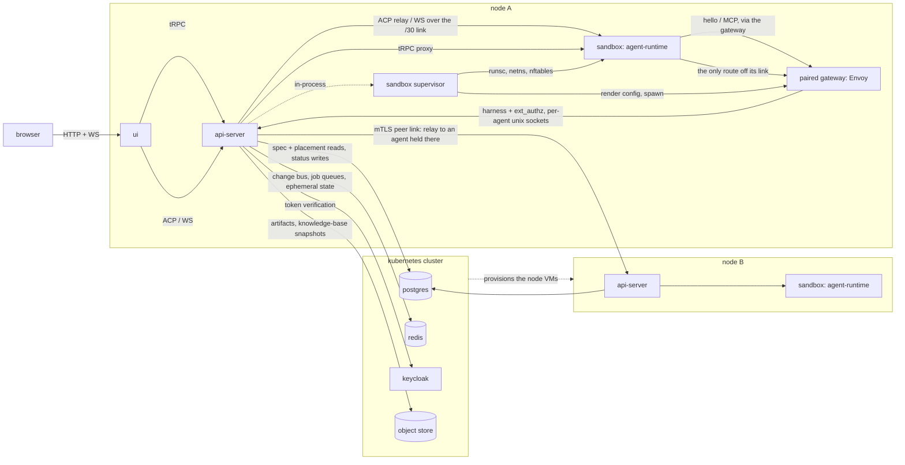

# Platform topology

Last verified: 2026-09-13

## Overview

Platform runs on a handful of **nodes**. A node is a VM running one TypeScript **api-server**, which brokers user requests, relays agent traffic, and supervises the agents placed on it; each agent is a paired **sandbox** (a gVisor container running agent-runtime) and **gateway** (an Envoy process holding that agent's credentials); a React **ui** is served by every node. Sandboxes are disposable — durable state lives in the agent's directory on the node holding it, which is what makes the hibernate/wake cycle safe.

Every node runs the same binary and nothing runs above them: there is no control-plane process and no orchestrator of agents. What makes several nodes one install is shared state. Postgres, Redis, Keycloak and an object store run in a Kubernetes cluster that no agent ever reaches, and that cluster also provisions the node VMs — **Kubernetes orchestrates nodes, never agents**, and is never told an agent exists. A node is created out of band, reads its identity and those endpoints from its own configuration, registers itself and heartbeats; that contract is the whole of what a node needs, which is why the same node image runs as a local VM or as a cluster-provisioned one without knowing which.

Nodes coordinate through Postgres and Redis alone. A **scheduler**, running on whichever node holds the install-wide lock, assigns each agent that wants to run to a node, and every role that admits exactly one holder runs beside it. A browser reaches whichever node it lands on; a request for an agent held elsewhere is forwarded to that agent's node over a mutually authenticated peer link, so no caller knows or cares where an agent lives.

The agent record in Postgres carries user intent as `spec`, observed state as `status`, and placement as a third thing beside them — placement is neither, and its only writer is the scheduler. The API surface writes only `spec`; `status` is written by the supervisor holding the agent and, for agents no node holds, by the scheduler. That split was structural when `status` was a Kubernetes subresource and is now a discipline with a single enforcement point: `writeStatus` is the only path that touches observed state.

## Diagram

## Components

### sandbox supervisor

Not a process of its own: a module inside the api-server, holding the reconcile
loop that a Kubernetes controller used to run. It is change-driven — it
subscribes to the agent store's change stream — backed by a periodic sweep that
re-reconciles every agent assigned to this node and tears down anything the node
still holds that no record assigns to it. Both halves are node-scoped, and the
teardown half especially: a sweep that compared what it holds against every
agent in the install would be correct on one node and would destroy another
node's agents on two. An agent reassigned away is torn down here exactly as a
deleted one is, except that its directory stays. For each running agent it creates the network namespace and the
point-to-point link, writes the whole nftables ruleset, renders and issues the
gateway's configuration and leaf certificate, materializes the credentials that
gateway may inject, opens the agent's pair of control-plane sockets, and starts
the sandbox by calling `runsc` with a bundle it writes. It hibernates idle
agents by stopping the pair and leaves the data directory untouched.

There is no container runtime daemon under this. The supervisor speaks the
registry API itself — manifest, config blob, layer tarballs, whiteouts — and
unpacks each image once into a directory shared read-only by every sandbox on
it, then gives each agent an overlay with its own upper. A daemon would add a
second lifecycle to keep in step with the supervisor's, and its shim was the
one thing that could not join a per-agent network namespace at all. Reclaiming
those directories falls here too: they are content-addressed, so each push to
a followed tag strands one, and workspaces share the disk. A tag is resolved
against its registry on a cadence of minutes, not on every reconcile, and a
registry that stops answering leaves the last resolution standing — a registry
outage or rate limit never takes a running agent down. A pull that does fail is
published as its own class of failure, apart from every other reconcile error,
because the owner is asked for something different.

The bundle's `config.json` doubles as the record of what the running sandbox was
given: a sandbox whose desired spec no longer matches it is replaced, which is
how an image or environment change reaches a running agent.

Folding it in is what makes the api-server a privileged process: namespaces,
nftables, mounts and sandbox creation are root-only work. The privileged surface is confined
to one module, and the unit is hardened around a
capability set rather than running unrestricted — but the blast radius is real,
and it is the price of having no second daemon.

### api-server

A TypeScript server that hosts the user-facing surface and the ACP relay. It runs two listeners:

- **Public port** — user-authenticated tRPC, REST (OAuth callbacks, health, version), and the ACP relay WebSocket. The tRPC surface is reachable over two transports on the same router: HTTP (used by the CLI) and a WebSocket endpoint that authenticates on its first frame rather than a URL token. Terms acceptance is enforced per procedure inside the router — everything except the terms procedures refuses until the caller has accepted the current terms — so either transport alone suffices for the full app, first-run acceptance included; the HTTP door additionally rejects gated calls with 412 before they reach the router, which is what the CLI's terms prompt keys off. Terms versions ship with deploys (a new version implies a server restart) and acceptance is irrevocable, so per-process acceptance caching can only be stale in the safe direction. The WebSocket is the UI's transport for everything else: queries, mutations, and the live-events subscription multiplex one authenticated connection, bounded by credential lifetime — the server nudges a reconnect shortly before the credential expires and the client re-authenticates with a fresh token. Two REST reads on this port are deliberately unauthenticated: `version`, powering the CLI's compatibility-floor check ([cli.md](cli.md)), and a single public-agent read behind its own `/api/public` prefix — a whole prefix rather than a hole punched in an authenticated one, so the carve-out stays one reviewable boundary ([public-agent-page](public-agent-page.md)). Failures leave the router as tRPC error codes: what the caller caused (a malformed identifier, a duplicate, a resource it does not own) is a client error with its message intact, except the media-type rejection, whose message would echo the request header; everything else is an internal error whose message and stack are redacted on the wire and logged server-side with the cause.
- **Harness sockets** — the same internal endpoint agents use for trigger handoff and MCP tool calls, but bound to one unix socket per running agent rather than a port. It carries no user authentication, because the socket *is* the identity: it exists only while that agent runs, it is readable only by that agent's gateway, and a request on it naming a different agent is refused before the router sees it. The ext_authz service is bound the same way, one server per agent.

The api-server proxies all ACP traffic to sandboxes; clients never dial a sandbox directly. It also wakes hibernated agents on demand before forwarding the first message of a session. Every relay and proxy verifies the caller — either a Keycloak JWT or an API key, dispatched by token prefix, taken from the `Authorization: Bearer` slot on HTTP and from a query parameter on a WebSocket upgrade, where a browser cannot set headers — and checks ownership, the operate scope and any key-to-agent binding at the public port. The caller's credential is then **stripped**, not translated: nothing is forwarded in its place, and agent-runtime authenticates nobody. agent-runtime serves unauthenticated on the assumption that the sandbox's link — reachable from the host end and nowhere else — is the auth boundary, which is where that guarantee actually lives. See [security-and-credentials](security-and-credentials.md) and [`packages/api-server/`](../../packages/api-server/).

The public port also accepts streamed bundled file imports per agent and proxies them to the target agent-runtime without buffering — ownership-checked and size-capped at the proxy boundary.

Recurring background reconciliation (expiry sweeps and similar) runs as scheduled jobs on per-job queues backed by the platform Redis, with each tick idempotent. Subsystem pages describe their own jobs (e.g. [artifact-library](artifact-library.md)); all recurring sweeps (runtime outbox, approvals delivery, OAuth refresh, activity retention, agent/invocation/experiment reapers) run this way, and the scheduler registrations are re-asserted periodically so a Redis dataset loss cannot silently stop the sweeps. What a node does *for itself* — its heartbeat, its sandbox sweep, its fair-share pass — runs on the node's own timer instead: a queue that delivers once across the install would service whichever node received the tick and leave the rest unswept. Redis also holds state that outlives a request but not the install: session-presence pins, OAuth/bind handoff flows, artifact share sign-ins, share sessions and render grants, and terminal-supersede signals; OAuth refresh backoff lives in Postgres.

Every role that admits a single holder install-wide — the channel workers, whose transports accept one consumer each; the agent watch; and the scheduler — runs on whichever node holds a **Postgres advisory lock** taken on a connection of its own. The lock dies with that connection, so a node that crashes or is partitioned from the database releases it without a lease to time out, and a node that loses it stands its singletons down rather than racing the new holder. Nothing else is elected: the recurring background jobs are already install-wide singletons through their Redis-backed queues, and every other surface is safe on any node. The per-agent MCP endpoint is nonetheless still **stateless** — it mints no streamable-HTTP session id and builds a server and transport per request — because a harness reconnects, and the api-server restarts, far more often than a harness re-initializes.

**Domain events and live updates.** Services announce every state change by emitting a domain event in-process after the write commits. Events are non-durable and advisory by contract — nothing may depend on one arriving; every domain whose events matter carries a reconciliation bounding the loss. Their only consumers are sagas running in the emitting process: the audit trail, usage rollups, the public-profile projection and Slack worker registration, and one that projects events into thin per-owner invalidation hints (a topic plus ids, never entity state) feeding each browser tab's single live-events subscription. Those hints mean "re-read this over the query path"; every (re)subscribed stream opens with a *sync* hint meaning "re-read everything", so reconnects heal by refetch rather than replay. State the platform cannot observe from a write site or the agent record — the session list, the workspace directories a client has open, the file it has open — is hinted by the sandbox that owns it instead, over the agent's own tRPC surface. A watch exists only while a subscriber is attached — and the subscriber sets its scope: a tab viewing one agent watches that agent, while a Home tab makes the api-server watch the session lists of every running agent its owner has whose runtime serves that watch surface — an older image is left out and its rows are polled instead. An idle watch emits nothing either way, and with no subscriber anywhere there are no watches at all; they coalesce under load, and how a sandbox detects change is private to it. Agent lifecycle hints come from the agent store's change stream rather than from write sites — so they also carry supervisor-driven transitions — and each change is fingerprinted so reconcile bookkeeping and activity stamps don't fan out to browsers. The stream is in-process where the write happened and is republished to the other nodes over Redis, where each node re-reads the record and re-emits it locally — so a status written on the node holding an agent reaches a browser attached to any node, and no consumer has to know the difference. Within a node the stream cannot drop an event, which is what removed the reconnect and replay-sweep machinery a Kubernetes watch needed to avoid leaving a deleted agent's row on screen forever; across nodes the bus is advisory like every other Redis fan-out, and the periodic sweep is what bounds the loss.

A session's mode is agent-owned metadata: the client switching modes persists it over ACP (`session/resume` carrying `_meta.platform.mode`), and other clients follow it live — the write lands in the sandbox's metadata store, whose session-watch notice makes them re-read. There is no server-side mode-change side effect, and the notice carries no payload — it means re-read, never the new mode; mode stays a hint about which surface to render, and the running harness is unaffected. The UI's session *list*, though, is no longer an ACP read: agent-runtime composes it on its own tRPC surface, unioning what the harness reports with its own metadata store — so a session it has recorded but the harness has not yet persisted is listed with no title, rather than being invisible until its first turn lands. The same read carries each session's live turn status: whether a turn is in flight, or for terminal sessions (which have no turn) whether the PTY has produced output recently. A watch on that surface reports when any of it changes, and clients refresh from the notice instead of a timer. The ACP `session/list` intercept still serves the readers that hold ACP connections anyway — channel workers matching a thread, the CLI, and Home's feed reads. Neither the read nor the watch wakes a hibernated agent. Deferring hibernation splits by who holds the watch: a client-held watch keeps the activity stamp fresh while its view is open, while the api-server's own owner-wide watches refresh nothing. Session read state rides the same metadata: agent-runtime stamps when a session was last seen by a viewer (machine-driven channels like the trigger driver don't count), so clients can render unread — activity newer than the stamp — consistently across devices. Read state is per-session, not per-user: agents currently have a single driving user, and shared-agent work must revisit this. A schedule's run time rides the same metadata: agent-runtime times each fire it serves — only machine-driven turns on a session belonging to a schedule, so a person replying in that session never counts — and reports the accumulated total with the number of fires behind it. A continuous schedule reuses one session across every fire, so that total spans them all rather than naming the last one.

### agent-runtime

The per-agent sandbox that runs the ACP WebSocket server and spawns the underlying agent binary via the harness-script contract. Its responsibilities are:

- Accept ACP WebSocket connections on its end of the link (relayed from the api-server) — several at once, from any mix of clients — and speak JSON-RPC 2.0 to the agent process, spawned through the harness's chat entrypoint.
- Accept terminal-mode WebSocket connections on `/api/terminal` (relayed from the api-server). Each session gets a PTY running the harness's terminal entrypoint, a binary frame protocol both ways, and kept scrollback so reattaching replays the screen. A detached PTY is reaped on the harness going quiet, not on the viewer leaving ([agent-lifecycle](agent-lifecycle.md)).
- Accept SSH WebSocket connections on `/api/ssh` (relayed from the api-server), relaying raw bytes to a per-connection `sshd` running as the agent user. The SSH wire is opaque here — this is `dam ssh`'s transport, and only on images shipping `sshd`.
- Hold the agent side of the runtime channel: call the api-server's `hello` on boot and reconnect, accept `applyState` deliveries over its tRPC surface, apply declarative state contributions under the agent's HOME (e.g. `~/.config/gh/hosts.yml` for granted GitHub Enterprise app connections), and dispatch runtime events (schedule triggers, workspace seeding) to in-sandbox handlers. See [runtime delivery](runtime-delivery.md).
- On a shared knowledge base, own share freshness: watch the share roots, persist a dirty marker in the agent's directory, and after a quiet period initiate the publish handshake against the api-server — plan locally, upload to presigned URLs, report completion. A scheduled or running flush reports the sandbox busy so hibernation waits ([knowledge bases](knowledge-bases.md)).
- Expose a scoped tRPC router — in-sandbox file operations, the composed session list, and the watch subscriptions behind the live panels — over HTTP and WebSocket: the UI reaches it through the api-server's WebSocket relay, non-browser callers through the HTTP proxy, and a channel worker dials the sandbox directly to place an inbound attachment in the workspace ([channels](channels.md)).
- Accept bundled file imports, staged in the agent's directory and landed one top-level entry at a time so a folder arrives whole and unrelated ones survive; one import per agent at a time (see [persistence](persistence.md)).
- Keep the agent alive under memory pressure — shedding a tool process rather than letting the sandbox be killed whole — and resume a turn an out-of-memory kill cut short. See [agent-lifecycle](agent-lifecycle.md).

The sandbox holds zero credentials and has no route to anything but its paired gateway: its namespace holds one /30 link and no default route, and no resolver, so a hostname is not even nameable inside it. Its `HTTPS_PROXY` value is the gateway's address on that link, but the value is decorative — the routing table admits nothing else. See [`packages/agent-runtime/`](../../packages/agent-runtime/) and [`packages/agent-runtime-api/`](../../packages/agent-runtime-api/).

### gateway

A per-agent Envoy process paired with the sandbox, running in the host namespace under its own uid. It reads the credentials the supervisor rendered for it, a leaf certificate issued by the install CA, and its own bootstrap — all under a directory only that uid can read. It binds the host end of the agent's link and nothing else, terminates the agent's egress TLS, injects credentials on the wire, and gates each request through the api-server's ext_authz over the agent's own socket. A configuration change replaces the process rather than reloading it: Envoy has no bootstrap reload, and a gateway still serving a superseded credential set is exactly the state worth avoiding. Gateways also stop with the api-server that supervises them — their control-plane sockets die with it — and the first reconcile after a restart brings each one back. See [security-and-credentials](security-and-credentials.md).

### ui

A React + Vite single-page app served by the api-server. It uses tRPC over a single authenticated WebSocket for resource management, permission flows, and live updates — server-pushed invalidation hints replace list polling, and sandbox-sourced state follows the sandbox the same way, so the remaining polls are runtime metrics (a telemetry-store aggregation, not sandbox-sourced), the sandbox's background-work report (30 s, only while the agent is awake), skill-install state, Home's approval reads, and a compatibility poll for agents whose runtime predates live updates — those fall back to the HTTP proxy and the passive ACP list, flagged in the panels with an update action, until their image is updated — and ACP WebSockets for bidirectional agent communication. A tab holds several ACP channels per Agent at once: the live channel for the session on screen, short-lived ones for history replay and Home's one-shot session-list reads, and — while a brand-new session's first prompt is on its way — a channel of its own, which either becomes the live one or carries that turn to completion after the user has moved on. Permission prompts, tool calls, and streaming output all flow over the live ACP connection. See [`packages/ui/`](../../packages/ui/).

The URL addresses what the user is looking at — an Agent's chat, and the session open inside it — so a session is linkable from outside the UI and re-opens itself on a reload or a back step. A channel reply carries such a link back to the conversation it answered ([channels](channels.md)). Following one is owner-scoped like every other read: a Session belongs to its Agent's owner, and an Agent that isn't the viewer's simply isn't there — indistinguishable from one that never existed. Since the follower is usually *not* the owner (anyone in the conversation may click), that refusal is presented as its own screen naming the reason, not as an empty or perpetually-loading chat. There is no shared-session concept; the messenger conversation remains the shared surface.

An unsent message is client state too: the composer's text is kept per session in the browser's `localStorage`, so a draft survives a reload or a browser close. It belongs to the session it was written for rather than to the composer, and it lives exactly as long as that session does — sending it, or losing the session by any route, takes the draft with it. Because the store is the browser's, every tab of that browser sees the same drafts; a tab only ever rewrites the draft it is editing, so no tab can revive one another tab has already sent, and the composer a person is typing in is never overwritten from elsewhere. That store belongs to the person who wrote into it — signing out empties it, and signing in as someone else empties it too, so an unsent message never waits for whoever logs in next. Staged attachments live only for the tab — a restored draft names the files it lost. The same storage surface briefly holds a different thing with a different lifetime: a sent message the sandbox never confirmed. Where a draft lives as long as its session, such an undelivered send is only in transit — held per session alongside the drafts, shown marked on the conversation, and handed to the sandbox's own undelivered record ([agent-lifecycle](agent-lifecycle.md)) the next time a session load reaches it, leaving the browser copy deleted only once the sandbox acknowledges. The ownership rule covers these copies too: signing out, or in as someone else, sweeps them with the drafts.

Continuing such a conversation here makes a session outlive the surface it started on, and the agent has to be told which one it is answering. A messenger frames every turn it relays with a contract naming the thread and the tools that reach it, and that text stays in the session — so a turn typed here, unframed, is answered under the messenger's instructions: the reply goes to the thread and the person typing gets a tool call instead of an answer. Each surface therefore states its own provenance on the prompt, and a turn typed here into a session that also lives in a messenger thread is framed as what it is — answered in place, in plain text, reaching the messenger only if the person asks. Provenance is **stated, not enforced**: outbound stays reachable from every session ([channels](channels.md)), so the same turn can still post to a messenger on request, and the surfaces a turn can arrive from stay open-ended — a prompt naming no surface is framed by nothing and falls back to what the messenger's own contract says about a message that arrives without it.

## Nodes

How a node registers and is judged alive, how the scheduler places agents onto nodes and drains a cordoned one, how nodes authenticate to each other over the peer link, and how an agent's workspace follows it between nodes are the subject of [nodes](nodes.md). What this page keeps is the contract the rest of the system relies on: a node is told who it is and where the shared services are, and nothing else; placement is written by exactly one scheduler; and a request for an agent held elsewhere reaches it through a local address that tunnels to the holding node, so the relays are written once for the local case.

## Protocols

| Edge | Protocol | Purpose |
|------|----------|---------|
| ui → api-server (`<rel>-apiserver`) | tRPC over WebSocket | Resource CRUD, permission flows, terms acceptance, and the live-events subscription (server-pushed cache invalidation) |
| ui → api-server | WebSocket (ACP, JSON-RPC 2.0) | Live chat session, permission prompts, streaming output; also carries session list/create/delete and mode changes, all over ACP (sessions are agent-owned) |
| ui → api-server | WebSocket (binary terminal frames) | Live terminal session — input / output / resize / exit |
| cli → api-server | tRPC over HTTP | Agent resolution, auth (same tRPC surface the UI uses). Session CRUD is removed — sessions are agent-owned over ACP; the CLI's terminal-resolution path still references the dropped `sessions.*` procedures and is pending migration |
| cli → api-server | WebSocket (binary terminal frames) | `dam chat` terminal attach — same frame protocol as the UI terminal path |
| api-server → agent-runtime | WebSocket (ACP, JSON-RPC 2.0) | Chat-mode relay target — one hop, no fan-out |
| api-server → agent-runtime | WebSocket (binary terminal frames) | Terminal-mode relay target — one hop, single client per session |
| ui → api-server → agent-runtime | WebSocket (tRPC relay) | The sandbox's own tRPC surface — in-sandbox file operations, the session list, and the watches behind all three live panels. Admitted once per upgrade on ownership, the operate scope and the key's agent binding; relayed opaquely, so the api-server never parses tRPC |
| api-server → agent-runtime | HTTP (tRPC proxy) | The same sandbox surface over HTTP, gated per request. No UI caller remains; kept as a non-browser door |
| api-server → agent-runtime | HTTP (tRPC, direct) | A channel worker writing an inbound attachment into the workspace. Not the proxy: no bearer, so the sandbox's link is the whole gate, and a woken sandbox becomes a precondition for building that turn's prompt |
| api-server → agent-runtime | HTTP (status read) | Passive read of the sandbox's status surface for session-reported background work; never wakes a sandbox or defers hibernation |
| ui → api-server → agent-runtime, cli → api-server → agent-runtime | HTTP (multipart, streamed) | Bundled file import (UI bulk, CLI `dam import`) |
| agent-runtime → api-server (via paired gateway → the agent's harness socket) | HTTP | MCP tool access, runtime-channel `hello`, and the knowledge-base publish handshake — the agent requests a publish (work order out) and reports completion |
| agent-runtime → object store (via paired gateway) | HTTPS (presigned PUT) | Knowledge-base snapshot uploads. The sandbox holds no object-store credential: it can only write the specific keys the api-server signed for it, and only until those links expire |
| gateway → api-server (the agent's ext_authz socket) | gRPC | HITL ext_authz Check; the socket is created for one agent and readable only by that gateway's uid, which is what names the caller |
| api-server → postgres | SQL + in-process change stream | Agent record CRUD and spec writes; the supervisor's status writes; the change stream drives both reconcile and the live-update hints ([agent-lifecycle](agent-lifecycle.md)) |
| api-server → agent-runtime | HTTP (tRPC) | Runtime-channel `applyState` delivery from the outbox worker; knowledge-base share config sync (roots, limits, flush nudge) |

ACP frames are JSON-RPC 2.0, one logical message per WebSocket frame.

## Sandbox network

Each sandbox has its own network namespace holding one `/30` point-to-point
link. The gateway binds the host end; the sandbox end is the only address in
the sandbox's routing table. There is no default route and no resolver, so
egress isolation is topological — there is no rule to get wrong, because there
is no second route to deny.

Two details of that namespace are load-bearing and easy to undo by accident.

**The namespace's kernel stack is blinded.** gVisor runs its own TCP/IP stack
over a raw socket on the link, but the kernel in that namespace still sees
every frame and still holds the address, so both stacks answer: the kernel
sends an RST for a port only gVisor is listening on, and the RST wins. The
namespace therefore carries an nftables `input` chain with `policy drop`.
Packet taps run before that hook, so gVisor still receives everything, and it
is the only stack that replies. Removing the address from the kernel instead
is not equivalent: the supervisor puts it back on the next pass, and gVisor
reads the address from there when it boots.

**The node's ruleset admits replies.** The node dials the sandbox on the link
for ACP, the terminal, the tRPC proxy and file imports. Those replies arrive
with an ephemeral destination port, so the per-link drop that limits new
inbound traffic to the gateway port must sit behind an
`ct state established,related accept`.

## Node resource model

One Postgres row per Agent carries both halves of the model plus its
placement, and the split between the first two is the same one the Kubernetes
status subresource enforced:

- `spec` — user intent. Written only by the API surface, validated on the way in.
- `status` — observed state, through a single `writeStatus` path. The holding
  node's supervisor writes what it observes; the scheduler writes what no
  supervisor is placed to know — why an agent it could not place is not
  running, and that an agent no node holds is at rest. The api-server routes on
  `ready` alone and **never inspects the runtime itself**; the user-facing state projection additionally
  reads the sandbox and gateway flags, so a gateway-only restart (a credential
  or L7-chain change) is not presented as an agent restart.

  Anything a consumer needs to know about an agent's workload is therefore the
  supervisor's job to observe and publish. Beyond readiness, status carries the
  sandbox's **observed restart count** and the classified cause behind it,
  because a sandbox that crashes and comes back reads as ready again and is
  otherwise indistinguishable from one that never faltered — which a one-shot
  workload cannot survive, its trigger having already been recorded as
  delivered. The count describes the sandbox currently backing the Agent, so it
  resets when that sandbox is replaced and is cleared on hibernation; a
  hibernated Agent never reads as crashed.

  Observed state is what a node saw while it held the agent, and it outlives
  the holding: an agent between nodes, or one whose node has gone quiet, is
  described by whatever its last node published. Placement and node liveness
  are therefore read alongside it, and an agent nothing is running does not
  read as running — the two ways of that being true, between nodes and on a
  node that stopped answering, are the same answer to a caller who would
  otherwise dial it. That holds on the wake path as much as in a list: a wait
  for readiness reads the node's heartbeat beside the flag, and times out
  naming the node rather than handing back an address nobody answers.

  `status` also carries the agent's **address**, the sandbox end of its link.
  Publishing it is what lets every relay build a URL without a lookup, and
  clearing it on hibernation is what makes dialing a stopped agent fail loudly
  rather than hang.

Placement is the third field: the node an agent is assigned to, and the node
whose disk holds its workspace. The scheduler is the only writer of the first;
the supervisor of the node that ran it writes the second when it stops holding
the sandbox. Together they are what lets a node answer "is this mine" and "where
do I fetch it from" without asking anyone.

Two domain resources live outside that row: **Templates** are YAML files laid
down on every node, loaded at boot (read-only, never reconciled),
and **Schedules** are Postgres rows owned by the api-server — see
[persistence](persistence.md).

For each running Agent the supervisor holds: a **network namespace** with one
/30 point-to-point link, an entry in the node's single **nftables ruleset**, a
**data directory** (the agent's home, which holds its work tree), a **gateway
directory** (rendered bootstrap, leaf certificate, credential files, all
readable only by the gateway uid), a **pair of unix sockets** for the harness
and ext_authz endpoints, an **Envoy process**, and a **runsc sandbox** whose
root is an overlay over the shared image directory. Hibernation removes everything but the data directory;
deletion removes that too.

## Invariants

- **Spec/status ownership.** The API surface never writes `status`; nothing that writes `status` writes `spec`. One process now holds all of them, so the split is kept by having exactly one function that writes observed state — and, since the writers are now on different nodes, by that function merging where the row is rather than where it was read.
- **Relay-only ACP.** All ACP traffic is proxied through the api-server. A sandbox accepts connections only on its own link, whose host end is on the node holding it, and the UI never dials one directly. A relay for an agent held elsewhere adds one node-to-node hop and changes nothing else.
- **A node touches only its own agents.** Every supervisor read is scoped to the agents assigned to that node, teardown included.
- **Nodes.** Placement has one writer, peer links belong to the node rather than the leader, and peers are named by certificate — see [nodes](nodes.md).
- **One public listener.** The public port is user-authenticated. The harness and ext_authz endpoints are not ports at all — they are per-agent unix sockets — so there is no internal port to reach from anywhere.
- **Credential isolation.** A sandbox never holds a real upstream credential. Its paired gateway intercepts its TLS using a leaf from the install CA and injects the credential from a file only that gateway's uid can read — and the sandbox has no route to anything but that gateway.
- **Identity by socket, per hop.** Three hops: (1) sandbox → gateway, admitted because it is the only address the sandbox's routing table can express; (2) gateway → harness and (3) gateway → ext_authz, each on a socket created for that one agent, owned by that gateway's uid, mode 0600. A harness request naming a different agent is refused at the socket. No app-layer header conveys identity, and nothing the caller sets can change which agent it is taken to be.
- **Nothing writes a live sandbox's workspace from the node.** A home is prepared before its sandbox is created and cleared after it stops, and a transfer only involves an agent no node is running — so the sandbox is the only writer for as long as it exists, and the sentry is configured to trust that. A node-side write to a running agent's directory would leave that sandbox reading a directory that has moved on.
- **Durable triggers.** Schedule fires are Postgres rows in the runtime outbox, delivered over the runtime channel only when the agent is ready; an undelivered fire survives sandbox and api-server restarts until it settles or expires (see [runtime delivery](runtime-delivery.md)).
