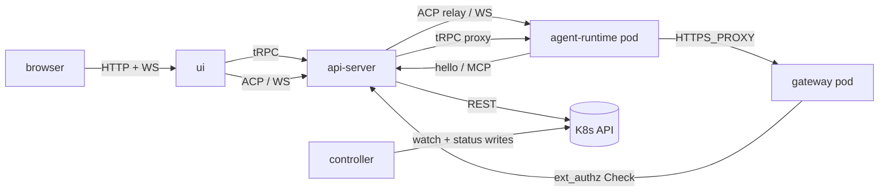

# Platform topology

Last verified: 2026-08-17

## Overview

Platform runs as four long-lived subsystems on Kubernetes: a Go **controller** that reconciles the Agent custom resource, a TypeScript **api-server** that brokers user requests and relays agent traffic, per-agent paired **agent-runtime** + **gateway** pods that host the agent process and its egress proxy, and a React **ui** served by the api-server. Agent pods are stateless and ephemeral — durable state lives on per-agent persistent volumes, which is what makes the hibernate/wake cycle (scale to zero, scale back up) safe. The controller and api-server never talk to each other directly — they coordinate through the K8s API, using the `spec` / `status` subresource split on each custom resource so that writes never contend.

## Diagram

## Components

### controller

A stateless Go reconciler built on client-go. It watches the `Agent` custom resource (`agent-platform.ai/v1`) plus agent-labelled pods, reconciles the StatefulSet, Service, NetworkPolicy, and per-agent Secret for each agent, computes agent readiness from the pod pair onto the Agent status, hibernates idle agents by scaling the pair to zero, and deletes gateway pods stranded on a configuration it has already superseded (the one case where it evicts a pod outside hibernation — see [security-and-credentials](security-and-credentials.md)). The schedule loop lives in the api-server, not here (see [agent-lifecycle](agent-lifecycle.md)). The controller writes only the `status` subresource on the resources it owns; it never writes `spec`. See [`packages/controller/`](../../packages/controller/).

### api-server

A TypeScript server that hosts the user-facing surface and the ACP relay. It runs two listeners:

- **Public port** — user-authenticated tRPC, REST (OAuth callbacks, health, version), and the ACP relay WebSocket. The tRPC surface is reachable over two transports on the same router: HTTP (used by the CLI) and a WebSocket endpoint that authenticates on its first frame rather than a URL token. Terms acceptance is enforced per procedure inside the router — everything except the terms procedures refuses until the caller has accepted the current terms — so either transport alone suffices for the full app, first-run acceptance included; the HTTP door additionally rejects gated calls with 412 before they reach the router, which is what the CLI's terms prompt keys off. Terms versions ship with deploys (a new version implies a server restart) and acceptance is irrevocable, so per-process acceptance caching can only be stale in the safe direction. The WebSocket is the UI's transport for everything else: queries, mutations, and the live-events subscription multiplex one authenticated connection, bounded by credential lifetime — the server nudges a reconnect shortly before the credential expires and the client re-authenticates with a fresh token. The `version` endpoint is unauthenticated and powers the CLI's compatibility-floor check ([cli.md](cli.md)).
- **Harness port** — an internal-only endpoint consumed by agent pods for trigger handoff and MCP tool calls. Not exposed outside the cluster and carries no user authentication.

The api-server proxies all ACP traffic to agent pods; clients never dial pods directly. It also wakes hibernated agents on demand before forwarding the first message of a session. Both the ACP relay and the tRPC proxy verify the caller — either a Keycloak JWT or an API key, dispatched by token prefix in the same `Authorization: Bearer` slot — and check ownership at the public port, then rewrite `Authorization` to the per-agent runtime token before forwarding. Agent-runtime never sees user identity directly. See [security-and-credentials](security-and-credentials.md) and [`packages/api-server/`](../../packages/api-server/).

The public port also accepts streamed bundled file imports per agent and proxies them to the target agent-runtime without buffering — ownership-checked and size-capped at the proxy boundary.

Recurring background reconciliation (expiry sweeps and similar) runs as scheduled jobs on per-job queues backed by the platform Redis — one execution per period across the api-server replicas, with each tick idempotent. Subsystem pages describe their own jobs (e.g. [artifact-library](artifact-library.md)); all recurring sweeps (runtime outbox, approvals delivery, OAuth refresh, agent/invocation/experiment reapers) run this way. Other cross-replica state also lives in shared stores: session-presence pins, OAuth/bind handoff flows and terminal-supersede signals in Redis, per-owner resize serialization and OAuth refresh backoff in Postgres. Two things are pinned rather than shared, because they are in-process by nature. In-process MCP sessions need each agent gateway to reach one replica: the waypoint hashes on source IP to achieve that (a Service `sessionAffinity` cannot — kube-proxy's setting is bypassed on a waypoint-fronted Service). The channel workers need a single holder install-wide, since their transports admit one consumer each; a Redis lease elects it, and other replicas marshal outbound channel calls to the holder over the Redis bus ([channels](channels.md)).

**Domain events and live updates.** Services announce every state change by emitting a domain event in-process after the write commits. Events are non-durable and advisory by contract — nothing may depend on one arriving; every domain whose events matter carries a reconciliation bounding the loss. Their only consumers are sagas running in the emitting process: the audit trail, usage rollups, per-agent cleanups, and two that reach across replicas by forwarding a *signal* over the shared Redis bus — never the event itself. One wakes egress-approval holds parked on other replicas; the other projects events into thin per-owner invalidation hints (a topic plus ids, never entity state) feeding each browser tab's single live-events subscription. A hint means "re-read this over the query path"; every (re)subscribed stream opens with a *sync* hint meaning "re-read everything", so reconnects heal by refetch rather than replay. Agent lifecycle hints come from a K8s watch on the Agent resources rather than from write sites — the watch also sees controller- and pod-driven transitions — and fingerprints each resource's meaningful content so reconcile bookkeeping doesn't fan out to browsers; like the channel workers, the watch runs on a single lease-elected replica so each transition is projected once, not once per replica. Anything crossing the process boundary is schema-parsed on receipt and dropped on mismatch, so replicas on different versions cannot poison each other's streams.

A session's mode is agent-owned metadata: the client switching modes persists it over ACP (`session/resume` carrying `_meta.platform.mode`), and other clients observe it on their next `session/list`. There is no server-side mode-change side effect and no cross-client broadcast — mode is a hint about which surface to render, and the running harness is unaffected. The same `session/list` read also reflects each session's live turn status — whether a turn is in flight, or for terminal sessions (which have no turn) whether the PTY has produced output recently — so a client can show per-session working/idle state across all of an agent's sessions without holding a connection open to each. That read is passive: it neither wakes a hibernated agent nor defers hibernation of a running one. Session read state rides the same metadata: agent-runtime stamps when a session was last seen by a viewer (machine-driven channels like the trigger driver don't count), so clients can render unread — activity newer than the stamp — consistently across devices. Read state is per-session, not per-user: agents currently have a single driving user, and shared-agent work must revisit this.

### agent-runtime

The per-agent pod that runs the ACP WebSocket server and spawns the underlying agent binary via the harness-script contract. Its responsibilities are:

- Accept ACP WebSocket connections (relayed from the api-server) — several at once, from any mix of clients — and speak JSON-RPC 2.0 to the agent process. Chat-mode sessions spawn `/usr/local/bin/harness-chat` as the ACP subprocess.
- Accept terminal-mode WebSocket connections on `/api/terminal` (relayed from the api-server). Each session gets a PTY running `/usr/local/bin/harness-terminal`; agent-runtime relays a binary input/output/resize frame protocol both ways and serializes scrollback so reattaching replays the screen. A detached PTY survives while the harness keeps producing output and is reaped once it has been quiet for five minutes (30 s detach grace for tab refreshes).
- Accept SSH WebSocket connections on `/api/ssh` (relayed from the api-server). Each connection spawns a per-connection OpenSSH `sshd -i` (inetd mode) as the agent user; agent-runtime relays raw bytes verbatim between the socket and the child's stdio. The SSH wire is opaque here — this is `dam ssh`'s transport. Available only on images that ship `sshd`.
- Hold the agent side of the runtime channel: call the api-server's `hello` on boot and reconnect, accept `applyState` deliveries over its tRPC surface, apply declarative state contributions under the agent's HOME (e.g. `~/.config/gh/hosts.yml` for granted GitHub Enterprise app connections), and dispatch runtime events (schedule triggers, workspace seeding) to in-pod handlers. See [connections](connections.md).
- Own every process it starts: each child leads its own process session, so tearing one down takes the whole session rather than a single pid, and a periodic sweep collects work that detached before any teardown could reach it — only while the pod is completely quiet, and never a process still listening on a socket or one an agent declared. See [agent-runtime](agent-runtime.md#reaping-orphaned-work).
- Expose a scoped tRPC router for in-pod file operations: reached by the UI through the api-server's tRPC proxy, and by a channel worker dialing this pod directly to place an inbound attachment in the workspace ([channels](channels.md)).
- Accept bundled file imports on the harness port — extract the tarball to a staging directory on the per-agent PVC, then `rm`+`rename` each top-level entry into `<homeDir>/work` (top-level folders are atomic units; unrelated existing top-level entries in `work/` survive). One import per agent at a time; a boot sweeper reclaims staging dirs orphaned by crashes (see [persistence](persistence.md)).

The agent-runtime pod holds zero credential Secrets and has no admitted route to TCP 80/443 except its paired gateway pod. Its `HTTPS_PROXY` value is the per-agent gateway Service DNS, but the value is decorative — Kubernetes admits no other route. See [`packages/agent-runtime/`](../../packages/agent-runtime/) and [`packages/agent-runtime-api/`](../../packages/agent-runtime-api/).

### gateway

A per-agent Envoy pod paired with the agent-runtime pod. Mounts the owner's credential Secrets, the cert-manager-issued leaf TLS material, and the rendered Envoy bootstrap ConfigMap. Terminates the agent's egress TLS, injects credentials on the wire, and gates each credentialed request through the api-server's ext_authz handler. NetworkPolicy admits ingress only from the paired agent pod and egress only to upstream services, the api-server's ext_authz port, and DNS. See [security-and-credentials](security-and-credentials.md).

### ui

A React + Vite single-page app served by the api-server. It uses tRPC over a single authenticated WebSocket for resource management, permission flows, and live updates — server-pushed invalidation hints replace list polling, with pod-sourced reads (session status, in-pod file listings, runtime metrics) and an agent-reachability probe the remaining polls — and ACP WebSockets for bidirectional agent communication. A tab holds several ACP channels per Agent at once: the live channel for the session on screen, short-lived ones for history replay and one-shot reads such as the session list, and — while a brand-new session's first prompt is on its way — a channel of its own, which either becomes the live one or carries that turn to completion after the user has moved on. Permission prompts, tool calls, and streaming output all flow over the live ACP connection. See [`packages/ui/`](../../packages/ui/).

The URL addresses what the user is looking at — an Agent's chat, and the session open inside it — so a session is linkable from outside the UI and re-opens itself on a reload or a back step. A channel reply carries such a link back to the conversation it answered ([channels](channels.md)). Following one is owner-scoped like every other read: a Session belongs to its Agent's owner, and an Agent that isn't the viewer's simply isn't there — indistinguishable from one that never existed. Since the follower is usually *not* the owner (anyone in the conversation may click), that refusal is presented as its own screen naming the reason, not as an empty or perpetually-loading chat. There is no shared-session concept; the messenger conversation remains the shared surface.

An unsent message is client state too: the composer's text is kept per session in the browser's `localStorage`, so a draft survives a reload or a browser close. It belongs to the session it was written for rather than to the composer, and it lives exactly as long as that session does — sending it, or losing the session by any route, takes the draft with it. Because the store is the browser's, every tab of that browser sees the same drafts; a tab only ever rewrites the draft it is editing, so no tab can revive one another tab has already sent, and the composer a person is typing in is never overwritten from elsewhere. That store belongs to the person who wrote into it — signing out empties it, and signing in as someone else empties it too, so an unsent message never waits for whoever logs in next. Staged attachments live only for the tab — a restored draft names the files it lost.

Continuing such a conversation here makes a session outlive the surface it started on, and the agent has to be told which one it is answering. A messenger frames every turn it relays with a contract naming the thread and the tools that reach it, and that text stays in the session — so a turn typed here, unframed, is answered under the messenger's instructions: the reply goes to the thread and the person typing gets a tool call instead of an answer. Each surface therefore states its own provenance on the prompt, and a turn typed here into a session that also lives in a messenger thread is framed as what it is — answered in place, in plain text, reaching the messenger only if the person asks. Provenance is **stated, not enforced**: outbound stays reachable from every session ([channels](channels.md)), so the same turn can still post to a messenger on request, and the surfaces a turn can arrive from stay open-ended — a prompt naming no surface is framed by nothing and falls back to what the messenger's own contract says about a message that arrives without it.

## Protocols

| Edge | Protocol | Purpose |
|------|----------|---------|
| ui → api-server (`<rel>-apiserver`) | tRPC over WebSocket | Resource CRUD, permission flows, terms acceptance, and the live-events subscription (server-pushed cache invalidation) |
| ui → api-server | WebSocket (ACP, JSON-RPC 2.0) | Live chat session, permission prompts, streaming output; also carries session list/create/delete and mode changes, all over ACP (sessions are agent-owned) |
| ui → api-server | WebSocket (binary terminal frames) | Live terminal session — input / output / resize / exit |
| cli → api-server | tRPC over HTTP | Agent resolution, auth (same tRPC surface the UI uses). Session CRUD is removed — sessions are agent-owned over ACP; the CLI's terminal-resolution path still references the dropped `sessions.*` procedures and is pending migration |
| cli → api-server | WebSocket (binary terminal frames) | `dam chat` terminal attach — same frame protocol as the UI terminal path |
| api-server → agent-runtime | WebSocket (ACP, JSON-RPC 2.0) | Chat-mode relay target — one hop, no fan-out |
| api-server → agent-runtime | WebSocket (binary terminal frames) | Terminal-mode relay target — one hop, single client per session |
| api-server → agent-runtime | HTTP (tRPC proxy) | In-pod file operations for the UI — gated per request on ownership, the operate scope, and the key's agent binding |
| api-server → agent-runtime | HTTP (tRPC, direct) | A channel worker writing an inbound attachment into the workspace. Not the proxy: no bearer, so the pod's NetworkPolicy is the whole gate, and a woken pod becomes a precondition for building that turn's prompt |
| api-server → agent-runtime | HTTP (status read) | Passive read of the pod's status surface for session-reported background work; never wakes a pod or defers hibernation |
| ui → api-server → agent-runtime, cli → api-server → agent-runtime | HTTP (multipart, streamed) | Bundled file import (UI bulk, CLI `dam import`) |
| agent-runtime → api-server (`<rel>-apiserver-harness`, via paired gateway → Istio waypoint) | HTTP | MCP tool access, runtime-channel `hello` |
| gateway → api-server (`<rel>-extauthz-<id>`) | gRPC | HITL ext_authz Check; per-agent Service pinned by AuthorizationPolicy to the gateway's SA principal |
| controller → K8s API | watch / list / write | Resource reconciliation and status writes |
| api-server → K8s API | REST | Resource CRUD, spec writes, pod wake |
| api-server → agent-runtime | HTTP (tRPC) | Runtime-channel `applyState` delivery from the outbox worker |

ACP frames are JSON-RPC 2.0, one logical message per WebSocket frame.

## K8s resource model

The controller-reconciled domain resources are CRDs under the `agent-platform.ai/v1` API group, each with a status subresource:

- `spec` — user intent. Owned exclusively by the api-server; validated by the K8s API server at admission.
- `status` — observed state. Owned exclusively by the controller, written through the status subresource. Conditions (`Ready`, `AgentPodReady`, `GatewayPodReady`, `Reconciled`) are the source of truth; the api-server routes on `Ready` alone and never inspects pods itself. The user-facing state projection additionally reads the pod-level conditions so a gateway-only roll (a credential or L7-chain change) is not presented as an agent restart.

| Kind | Purpose |
|---|---|
| `Agent` | Agent definition and runtime state: image, mounts, env, secret refs, granted secret and connection IDs. The sole resource per Agent — there is no separate instance resource and no `desiredState` — running-vs-hibernated is derived from activity annotations |

Two domain resources are deliberately not CRDs: **Templates** are chart-rendered ConfigMaps loaded by the api-server at boot (read-only, never reconciled), and **Schedules** are Postgres rows owned by the api-server — see [persistence](persistence.md).

For each `Agent`, the controller reconciles **two paired StatefulSets** (agent + gateway, both at replicas 0 when hibernated and 1 when running), **two pair-scoped Services** (agent's ACP and the gateway's `<agent>-gateway` proxy DNS), a **per-agent ServiceAccount** (in the agent ns), a **per-agent ext-authz Service** (`<release>-extauthz-<id>`, in the release ns), **two per-agent Istio AuthorizationPolicies** (harness path-prefix at the waypoint, ext-authz Service principal), and a per-agent Envoy bootstrap ConfigMap + leaf-TLS Certificate. Installing the CRDs requires cluster-admin at install time — moving to CRDs deliberately gave up the namespace-scoped install the earlier ConfigMap model allowed; the controller also needs write access to ServiceAccounts and Istio AuthorizationPolicies. See [`deploy/helm/platform/`](../../deploy/helm/platform/) for the install layout.

## Invariants

- **Spec/status ownership.** Controller never writes `spec`; api-server never writes `status`. The status subresource makes the split structural — write contention between the two is impossible.
- **Relay-only ACP.** All ACP traffic is proxied through the api-server. Agent pods do not accept ACP connections from outside the cluster and the UI never dials pods directly.
- **Two-port api-server.** The public port is user-authenticated; the harness port is cluster-internal and has no user authentication. They do not share routes.
- **Credential isolation.** Agent pods never hold real upstream credentials. The paired gateway pod intercepts agent TLS using a per-agent leaf cert and injects the credential header from a K8s Secret mounted only on the gateway — the agent pod has no path to TCP 80/443 except through the paired gateway. See [security-and-credentials](security-and-credentials.md).
- **SPIFFE identity per hop.** Three hops, the latter two gated by per-agent Istio AuthorizationPolicies: (1) agent → gateway on the CONNECT proxy port (admitted by NetworkPolicy — the agent pod sits outside the ambient mesh), (2) gateway → harness via the waypoint (all agent egress traverses the paired gateway pod's Envoy, including the harness call), (3) gateway → ext-authz on the per-agent ext-authz Service. The waypoint-fronted harness Service enforces principal == URL `:id`; per-agent ext-authz Services enforce principal == matching SA. For long-lived pairs both pods share the per-agent SA, so the gateway hop is identity-equivalent to the agent. No app-layer header conveys identity.
- **Durable triggers.** Schedule fires are Postgres rows in the runtime outbox, delivered over the runtime channel only when the agent is Ready; an undelivered fire survives pod and api-server restarts until it settles or expires (see [connections](connections.md)).
