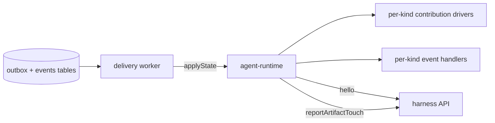
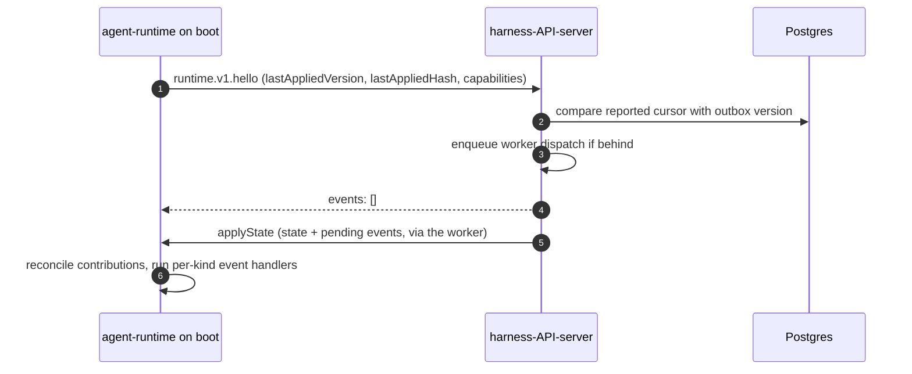
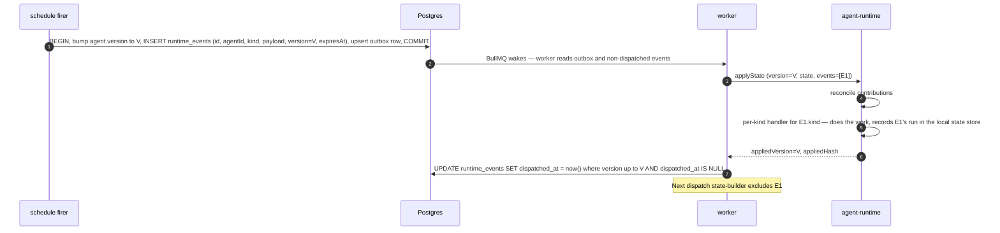
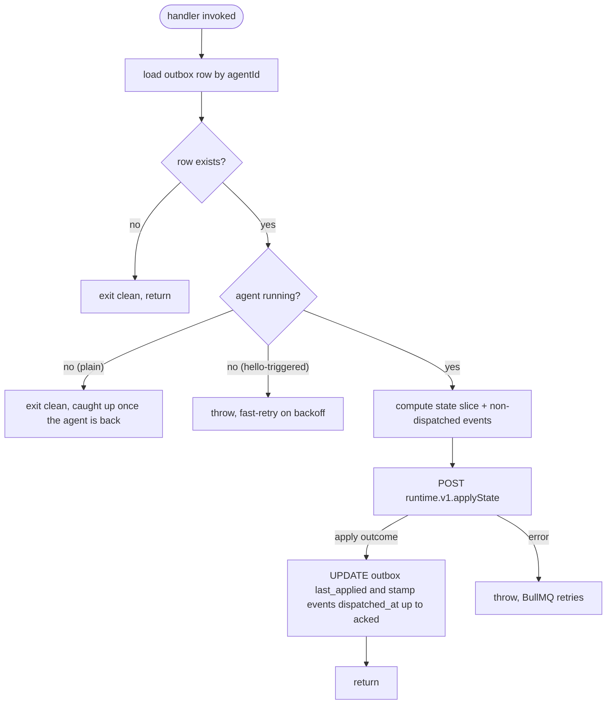

# Runtime delivery and the runtime channel

Last verified: 2026-09-04

## Overview

How a desired configuration reaches a running Agent, and how one-shot directives are executed there exactly once.

Eight subsystems push through this machinery — agents, connections, experiments, harness config, invocations, knowledge bases, schedules, and skills all produce Contributions or Events, and none of them owns the delivery path. What a Connection is and which rail each Contribution kind takes is [connections](connections.md); everything from the outbox onward is here.

The subsystem cuts across two bounded contexts:

- **api-server — Runtime Delivery context** owns the outbox table, the events table, the delivery worker, the `runtime.applyState` call into agents, and the `runtime.hello` and `runtime.reportArtifactTouch` callbacks from agents. The session-directory report rides the same channel but belongs to [metrics](metrics.md#session-directory).
- **agent-runtime — Runtime Channel context** receives `applyState`, dispatches Contributions to per-kind drivers, processes events in order through per-kind event handlers, reconciles on-disk state to match the snapshot, calls back to `hello` on boot.

The runtime channel is four routes between api-server and agent-runtime —
`applyState` inward, `hello`, the artifact-touch report and the
session-directory report outward:



The wire payload carries:

- **`version`** (top-level) — per-agent monotonic counter, the single ack cursor for the payload. Bumped on any contribution edit or event insert.
- **`state`** — the agent's full desired configuration (Contributions). Reconciled by diff. `hash` short-circuits no-op pushes.
- **`events`** — ordered one-shot directives the agent must execute (schedule triggers, schedule resets, workspace seeding, harness-config writes). Processed in order through per-kind handlers inside the agent-runtime.

State changes write to the outbox, the worker reads and dispatches a fresh payload, the agent receives state + events and reconciles contributions + invokes event handlers, and the agent calls back on boot/wake to catch up.

## Concepts

### Event

A one-shot directive the agent executes through a per-kind handler inside the agent-runtime. Each event carries an `id` (stable across redeliveries — the dedupe key), a `kind`, a kind-specific `payload`, the agent-monotonic `version` slot it occupies, and an `expiresAt` ttl. The kinds today are **trigger** (fire a scheduled task, optionally continuing or starting fresh), **schedule-reset** (clear a schedule's state), **workspace-seed** (clone a repo into the workspace), **workspace-command** (run a one-shot shell command in the workspace, e.g. a kinded agent's install bootstrap), and **harness-config** (set/clear the agent's model/mode/config defaults in the harness's own config file). Exact payload shapes live in the [runtime contract types](../../packages/agent-runtime-api/src/modules/runtime/).

While a workspace-mutating event (`workspace-seed`, `workspace-command`) is pending for an agent, the agent surfaces as *preparing workspace* rather than running, so chat — including the hidden greeting turn — waits for the mutation to settle instead of racing it. Because the settle is a Postgres stamp with no Agent-resource change behind it, the worker announces it as an agent change, so watching UIs re-read the agent promptly rather than on their next incidental refresh.

Because a pending workspace mutation blocks the agent, its delivery is bounded rather than open-ended: each delivery the agent answers without settling the event counts against a per-event attempt budget, the cron sweep keeps re-enqueuing the agent while the budget lasts, and when it is exhausted the worker stamps the event dispatched with a recorded error. A workspace-mutating kind the agent's runtime does not advertise is stamped the same way at dispatch time — capability filtering would drop it from every payload, so it could never settle. Both exits announce the same agent change as a clean settle, so the agent leaves *preparing workspace* instead of sitting there until the event's TTL; the mutation itself did not happen, which the event row's error records.

`harness-config` is the model/mode/config-defaults mechanism: a user action in the Config panel fires one event, the agent-runtime writes the mapped keys into the harness's own config file once, and — like `workspace-seed` — never re-asserts, so the file stays the user's to edit (a hand-edit via the Files panel or SSH is never reconciled away). The Config panel is driven entirely outbound, not over an ACP session: the agent's manifest declares a `harness-config` driver entry carrying both the field → file-keyPath mapping and an option **catalog** (the available model/mode/config choices and their per-model validity), and the agent advertises that catalog on `hello` (alongside a `harnessConfig` capability flag) for the api-server to serve to the UI; the *current* values are read back live from the config file via the agent-runtime `harnessConfig.current` query. A manifest may instead declare a `modelDiscovery` source, in which case that same read fills the model list live from the provider rather than from the static catalog. A source names the env vars that may carry the provider's base URL — materialized by the env rail from the granted connection, so *which* endpoint is asked follows from what the agent was granted — an optional fallback URL for when none of them is set, the path to ask, and which of two answer shapes to read: an OpenAI model listing keyed by model id, or a LiteLLM model-information listing keyed by model name. To be usable a provider has to answer that path over the agent's normal egress with a listing in one of those two shapes; nothing else about it matters, and because the request leaves the pod through the credential-injecting gateway like any other, discovery authenticates with the injected credential rather than one the agent holds. A source that resolves to no URL, a provider that refuses or cannot be reached, and a listing that turns out empty are one outcome — *unavailable* — which leaves whatever list was last established in place and never fails the read. Only harnesses whose manifest declares the `harness-config` driver honor the event and advertise the capability that gates the UI section.

Because the live read needs a running pod, the platform also keeps a **snapshot** of these values, so the Config panel renders the last known configuration while the agent is stopped. An apply records what it *declared*; a snapshot is display state and is never re-asserted onto the harness, so the harness's own file stays authoritative and the live read wins whenever the agent is up. A snapshot always carries the moment it was captured, and whether a pod has confirmed it or it is merely what an apply asserted — the distinction matters precisely because the event never re-asserts, so a hand-edit can move the file out from under a declared value. The pod confirms it at two points, and the split is forced: on `hello` it reports the file's values alone, since a clean boot with nothing pending never applies and a hand-edit would otherwise go unseen for that whole run; the apply reply reports those plus the discovered model list, which can only be resolved once the env driver has materialized the provider's base URL. A report omits the model list when it could not be resolved, so a failed read never erases one an earlier read established; a harness with no discovery source records that fact instead.

All event kinds are built-in to every agent: the agent advertises the full set on `hello`, single-sourced from the schema enum. Contribution kinds, by contrast, are gated by what the manifest's drivers declare — so capability filtering applies to contributions, not events. (`harness-config` is the carve-out: every agent can receive the event, but only one whose manifest declares a `harness-config` driver has anywhere to write it — so it advertises a `harnessConfig` capability flag the UI gates on, and the handler no-ops without it.)


## The runtime channel

Three tRPC routes, prefixed by protocol-major version (`runtime.v1.*`) —
`applyState` into the agent, and `hello` plus the artifact-touch report from
it. Adding a new contribution kind, event kind, or optional payload field stays on `v1` — capability flags carry the gate; new majors only on semantic break.

```mermaid
sequenceDiagram
  autonumber
  participant USER as user (UI)
  participant AS as api-server
  participant PG as Postgres
  participant BQ as BullMQ
  participant WK as worker handler
  participant RT as agent-runtime

  USER->>AS: grant Connection X to Agent A
  AS->>PG: BEGIN, write grant, bump version, upsert outbox row, COMMIT
  AS->>BQ: enqueue job state:A
  AS-->>USER: 200

  BQ->>WK: dispatch job
  WK->>PG: read outbox row, check agent state
  Note over WK: exit clean if Agent A not running; caught up once it is back
  WK->>PG: compute state slice and pending events for A
  WK->>RT: runtime.v1.applyState (version, state, events)
  RT->>RT: reconcile contributions per kind
  loop per event in order
    RT->>RT: per-kind handler — does the work, dedups locally
  end
  RT-->>WK: apply outcome (cursor, settled events, failures)
  WK->>PG: record the outcome, stamp the settled events
```

The computed state slice merges user-typed env, connection-granted contributions, skill refs, and the platform's **built-in contributions** — the per-agent platform MCP entry always, plus the aggregate shared-knowledge-base MCP entry while the agent holds at least one such grant ([connections](connections.md#built-in-contributions)).

### `applyState` — state and events delivery (server → agent)

The server sends a per-agent monotonic `version` cursor, the **full desired state** (the post-capability-filter Contribution snapshot plus a deterministic hash that short-circuits no-op pushes), and the **currently pending events** in order. The agent reconciles contributions per kind by diff and processes events in order through per-kind handlers in the agent-runtime.

The reply is a discriminated outcome, not a bare ack:

- **applied** — the payload was processed. It returns the applied cursor, the resulting state hash (null until the first clean settle), the set of events that settled, and **any per-driver failures**. A failure leaves that driver's slice unsettled for redelivery without blocking the rest of the payload — it advances the answered cursor but not the applied one, so a consumer that needs the pod's disk to match the spec gates on the second.
- **stale** — the requested version is strictly older than the agent's applied cursor, so state reconciliation was skipped; the agent still applies any events it hasn't seen and reports which settled.

Concurrent dispatches from different replicas race naturally: the agent rejects versions older than its applied cursor (last-version-wins), which is what surfaces as the *stale* outcome. At an equal version the hash decides, not the cursor. The applied hash is recorded on the agent's outbox row for the periodic sweep to compare against. Exact reply shape lives in the [runtime contract types](../../packages/agent-runtime-api/src/modules/runtime/).

### Session-directory report — agent → api-server

A second agent-initiated call rides the same gateway and the same harness API server. Whenever an agent's own record of its Sessions changes, it reports the **kind of each Session it holds** — a snapshot, not a delta, so a report that never arrives costs latency rather than leaving a permanent hole. It is deliberately narrow: the agent keeps owning Session state, and what leaves is the single dimension the spend read path cannot reconstruct once the agent hibernates or is deleted. [metrics](metrics.md#session-directory) owns what the report means and why it exists; this page owns only the fact that the channel carries it.

Unlike `hello`, it is not part of catch-up: it settles nothing, acks nothing, and never touches the outbox. A failed report is logged and retried on the next change or the next boot.

### `hello` — agent → api-server catch-up

Called on boot, on wake from hibernation, and on any agent-side reconnect. It never carries state itself — if the reported cursor is behind, it enqueues a worker dispatch and the catch-up arrives as an ordinary `applyState`.

The call reports the agent's applied cursor (version and hash), its protocol and runtime versions, and its capability set — which contribution and event kinds it can apply, and which optional surfaces its image serves: harness configuration, and the pod's own watch surface for live updates. A surface the runtime does not claim is treated as absent, so an older image degrades to the polled path rather than to a broken one; each claim gates both the UI surfaces that read it and the platform's pod-facing streams. Because the claim decides membership in those streams, receiving it is itself an Agent change that the platform announces.

The returned `events` array is always empty today — catch-up state and events arrive via the worker's `applyState`, never inline.



`hello` is read-only with respect to the outbox — the worker dispatch it enqueues is what stamps `dispatched_at`. Events never travel inside the `hello` response; they ride the `applyState` that follows.

### Per-kind event handlers (agent-side)

Each event kind has a built-in handler inside the agent-runtime's event loop. The kind selects the handler; the payload shape and the side effect are kind-specific. The common contract:

- The handler receives the event's `payload`; the loop owns `id`-based dedupe before the handler is ever invoked — a per-key last-run timestamp in the agent's local state store, and nothing else. An id the loop cannot read a timestamp out of settles without running: a malformed id is unrunnable, and failing closed beats re-firing it on every poll.
- It does the work (e.g. open an in-process ACP session for `trigger`, clone the seed repo for `workspace-seed`); it does NOT touch `runtime_events`.
- A handler failure leaves the event unsettled, so it is redelivered on the next dispatch until it succeeds or expires. For workspace-mutating kinds the redelivery is bounded: the worker counts each answered-but-unsettled delivery on the event row, and past the attempt budget it stamps the event dispatched-with-error instead of redelivering.

The worker is the only writer to `runtime_events.dispatched_at` (it stamps in the apply-ack transaction). Splitting responsibilities this way means a new event kind adds an agent-side handler and doesn't have to know about the outbox at all.

## Event lifecycle

Idempotency lives in two places: the work-doing handler's uniqueness constraint (prevents double side effect) and the worker's cursor stamp (prevents redelivery once the agent acknowledged).



### Crash between dispatch and ack

If the agent runs the handler but crashes before sending the apply response, the worker doesn't get an `appliedVersion` — no rows are stamped. The event reappears in the next snapshot; the agent's event loop consults its local state store (the per-key last-run timestamp, persisted on the PVC) and settles the already-run event without re-firing; the next ack stamps `dispatched_at`.

If the handler ran but the apply response is lost, same path — redelivery settles from the state store and the cursor advances. Re-fire is possible only if the crash lands between the side effect and the state-store write.

If the handler succeeds and the agent acks but then crashes before doing anything else, that's fine — events are already marked dispatched.

### Server-side `dispatched_at` stamping

Owned by the worker, set in the apply-ack transaction using the cursor. The per-kind handler does not touch the outbox — its job is the side effect; dedupe bookkeeping lives in the agent's local state store.

### Expiry

Each event row carries `expires_at`, chosen by the producer — a schedule fire, for instance, expires at the schedule's next occurrence so a backlog of fires never forms ([agent-lifecycle](agent-lifecycle.md#trigger-fire)). The state-builder filters `expires_at > now() AND dispatched_at IS NULL`. The cron sweep deletes rows past expiry that were never dispatched, counted as `dropped-expired`. The agent applies the same TTL check on incoming events as defense in depth.

## Outbox + events

One outbox surface in Postgres, plus the events table that feeds the payload:

| Table | Shape | Why |
|---|---|---|
| `runtime_state_outbox` | One row per agent | Delivery is per-agent and last-write-wins. Coalesce-by-agent. Carries the desired version and two cursors: the version the agent last **answered** for, and the one it last **applied cleanly**. |
| `runtime_events` | One row per pending event | Each carries its own version slot in the agent's monotonic sequence, a ttl, a dispatched marker, and — for the bounded workspace-mutating kinds — an attempt counter plus the error recorded when delivery gives up. The state-builder reads the live ones into `events[]`. |

### Mutation transaction

Every state-affecting handler commits the domain mutation, bumps the agent's version, and upserts the outbox row atomically, then enqueues a BullMQ job deduplicated on a stable per-agent key, and the user-facing response returns immediately. Dispatches for one agent coalesce: while one is queued or backing off, further enqueues fold into it; one that arrives while a dispatch is *in flight* is kept and runs once after it, so a change that races an in-flight delivery lands right behind it rather than waiting for the sweep. The boot catch-up that `hello` enqueues coalesces on its own key, so a plain dispatch — which exits clean on an agent that is not Ready yet — can never absorb it.

A schedule firing follows the same shape, inserting a `runtime_events` row in place of the grant before the outbox upsert.

The user-facing response does not depend on agent reachability. If BullMQ's enqueue fails or Redis drops the pending job, the row is recovered once the agent is running — by the next sweep tick, or by the agent's `hello` if its cursor is behind.

### Worker

A BullMQ Worker on every api-server replica consumes from the single `state` queue. BullMQ owns the dispatch loop, retry-with-backoff, stalled-job recovery, and the dashboard surface; the platform code is the *handler*:



BullMQ retries cover transport failures (network blip, agent crash mid-call) and the boot window: a `hello`-triggered dispatch whose agent is a heartbeat short of Ready throws to fast-retry on the backoff, so fresh config lands in ~a second instead of waiting a full sweep tick. A plain dispatch to an agent that isn't running exits clean and the row simply stays behind: while the agent is down the sweep does not re-attempt delivery to it. The row is picked up once the agent is back — by its `hello` when its cursor is behind, and otherwise by the next sweep tick, which is what covers a row left unsettled by driver failures the agent has already answered for.

Every `applyState` call carries a deadline of about a minute. An agent that accepts the request but never answers — a pod wedged on memory pressure, a harness that stopped serving — fails that attempt onto the backoff instead of holding a worker slot until the transport gives up on its own, which takes minutes. Together with per-agent coalescing, this bounds what one unresponsive agent can hold to one active job per key. The worker's concurrency is sized far above what that bound allows the live agent population to occupy at once, so a slot is never the scarce resource and no delivery waits behind another agent's; the cap protects the process from a burst, it does not schedule agents. A handler holds nothing else for the duration of the call — the Postgres reads finish before the request goes out and the outcome is recorded after it returns — so a stalled agent ties up its own socket and nothing shared.

Slots are not the only shared resource, and the other one is scarce: a single Postgres pool serves both these handlers and the request path. It is sized explicitly rather than left at the client's default, and deliberately far below the slot count — a handler borrows a connection for its short queries and never across the call to the agent, so the pool has to cover the handlers querying at any instant, not the ones parked on a slow agent. Both the pool size and the slot count are deployment values ([`deploy/helm/platform/values.yaml`](../../deploy/helm/platform/values.yaml)), and the pool is per replica: scaling replicas multiplies it against the database server's own connection limit.

### Cron sweep

A scheduled job runs every minute and does two things:

1. **Outbox staleness check.** Scan for the rows an agent is behind on — the desired version is not settled yet, an earlier apply left driver failures still under their attempt budget, or the agent holds an event that is neither dispatched nor expired — every such row, not a capped batch. That third branch is what recovers a fire whose in-pod dispatch threw: the version settles, so neither of the first two sees it, and without it the event would sit until its TTL ran out. For a workspace-mutating event the retry it drives is bounded by the per-event attempt budget — exhausting it stamps the event dispatched-with-error, which takes the row out of this branch. Re-enqueue a dispatch for each one whose agent is currently running. This is the load-bearing path for surviving any BullMQ / Redis loss: rows in Postgres are the truth. The scan is deliberately uncapped: rows of stopped agents are skipped rather than settled (below), so they accumulate for as long as their agents stay down, and a fixed-size batch would fill with them and hide the running agents' rows behind them. One row per agent bounds the scan, and the running-state read is a cache hit in steady state.

   **A row whose agent is not running is left where it is.** A stopped agent has nothing to apply the state, so re-attempting delivery buys nothing and never terminates — the row stays behind for as long as the agent stays down, which makes an unconditional re-enqueue a fixed-cadence livelock with no ceiling. Catch-up is already covered from the other side: `hello` re-enqueues on boot or wake, and once the agent is running again the next tick picks the row up regardless.

   Running-state is read through the agents subsystem (below) and can fail. A definite *not running* suppresses the row; a read that errors or times out is treated as **unknown** and the row is re-enqueued anyway. The worker applies the same gate one step later and exits clean, so an unknown that was really a stopped agent costs one job and never mis-delivers — whereas reading it as *not running* would silently disable the recovery path for as long as the failures lasted.
2. **Expired-event drop.** Delete the event rows that expired without ever being dispatched; emit a `dropped-expired` count. This does not depend on the running check, so it still runs on a tick where every row was skipped.

### Reading agent running-state

Both readers — the delivery worker before it dispatches, and the cron sweep before it re-enqueues — ask the agents subsystem whether the Agent is Ready. That answer comes from its watch-backed read cache, falling back to a live read of the Agent resource while the watch is unsynced ([agent-lifecycle](agent-lifecycle.md)). So each read can still fail or hang on its own: the sweep bounds how many it has in flight at once, puts a deadline on each, and distinguishes a failed read from a negative one. While the watch is unsynced every read is a live one, and a tick scans every pending row, so the sweep stops asking once a full round of reads has failed with none succeeding in between, and calls the remaining rows unknown — the fallback costs one round of reads per tick rather than one per row.

### Redis-down behavior

Redis is the signal path; BullMQ stores job state in Redis with relaxed durability. A Redis outage may drop pending jobs; in-flight handlers see Redis errors and fail. The cron sweep is the recovery path: an outbox row whose enqueue was lost is re-enqueued on the next sweep tick if its agent is running, and on the agent's next `hello` if it is not. Delivery latency degrades from sub-second to ≤ sweep-interval; no events are lost because the outbox + events tables are in Postgres.

## Agent-side: drivers, manifest, event handlers

### The manifest

Every agent image ships a `runtime-manifest.yaml`. Each `drivers:` entry binds a kind — contribution **or** event — to an impl, resolved uniformly through the plugin registry. Built-in drivers are **on by default** with default bindings, so a manifest declares an entry only to *configure* a kind (e.g. `harness-config`'s file/keys/catalog), *override* its impl, or *disable* it with `false`; `impl` defaults to the kind name (so it's named only to override). The kinds advertised on `hello` are derived at boot from the resolved drivers — the built-in defaults, plus what the manifest declares, minus what it disables — never declared separately. Validated against a versioned schema at boot; fail-fast on a malformed manifest or an unknown kind.

The shipped manifests live beside their agents in [`packages/agents/`](../../packages/agents/).

The manifest declares only `drivers` and optional `extensions`; there is no `capabilities` block — advertised kinds are derived at runtime from the resolved drivers.

A harness that needs custom code for a kind — contribution or event — rebinds that kind to a fresh impl name supplied under `extensions.impls`, naming the module to load it from; the built-in stays registered but unbound. Custom impl names may not collide with a built-in name — registration rejects collision and boot fails loud.

### Built-in contribution impls

| Impl | Used by | Behavior |
|---|---|---|
| `file` | `file` kind directly, and `mcp-entry` via composition | A format × merge-mode matrix, the substrate for every file-shaped write. |
| `skill-install` | `skill-ref` kind | Materializes a source's skill onto the PVC at the pinned version and reaps ones that leave the snapshot. Owned in depth by [skills](skills.md). |

### Driver reconciliation

`applyState` delivers the full Contribution snapshot. The driver dispatcher groups contributions by kind and calls each driver's `apply(contributions, ctx)`:

1. Driver compares the desired set with what's on disk (or in its own per-kind state file on the agent PVC).
2. Adds new contributions, updates changed ones, removes anything no longer in the snapshot.
3. Returns per-driver outcome.

Removal semantics depend on the kind and merge mode. For `file` contributions: `overwrite` and `section-marker` and `key-targeted` modes remove cleanly; `yaml-fill-if-missing` is the legacy carve-out — additive only, removal leaves stale entries until the user edits the file. New file producers must pick a remove-safe mode.

### Event handler loop

After contribution reconciliation, the agent processes events in order:

```
for each event E in payload.events:
  if E's id carries no readable fire ts:   # malformed — unrunnable
    settle and continue
  if E's dedupe key ran at >= E's fire ts:
    settle and continue
  if E.expiresAt <= now():         # defense in depth — server may have raced
    settle and continue
  invoke per-kind handler with E.payload
  record E's dedupe key + fire ts in the state store
```

Settled event ids ride back on the apply response, and the worker stamps `dispatched_at` from the ack cursor. The "have I run this?" state is the agent's own: the local state store records a per-key last-run timestamp, so a redelivered event settles without re-firing.

## Versioning

| Version | Where it lives | Bumps on |
|---|---|---|
| **`protocolVersion`** | hello payload + route prefix | Wire-incompatible break (field removed, semantic changed). Routes coexist for one release; agents on the old major continue to function via their existing route prefix. |
| **`manifestVersion`** | top of `runtime-manifest.yaml` | Manifest schema break. Independent of protocolVersion. |
| **`agentRuntimeVersion`** | hello payload | Image build identity. Diagnostic only — never used for routing. |
| **`version`** (per-agent) | applyState payload (top-level), outbox row, event row | Monotonic per agent; bumped on every contribution edit or event insert. The single ack cursor. |

### Forward-compat is the supported direction

Older agent on newer server is the common case. The server keeps every `runtime.v1.*` route operational across an additive minor change; the server's outbound payloads include only fields the agent's protocolVersion defines plus optional additions (agent parses leniently, ignores unknown fields).

Newer agent on older server is rare (images are pinned). The agent calls `runtime.v1.hello`; on 404 (server doesn't speak v1 anymore), the agent fails loud rather than silently degrading.

### Capability negotiation

The agent's `hello` declares which Contribution kinds and which Event kinds it supports. The api-server filters outbound payloads: unsupported items are dropped at send time (logged + counted with a `dropped-unsupported` metric). A dropped workspace-mutating event is additionally stamped dispatched-with-error right there — it can never settle on this runtime, and leaving it pending would hold the agent in *preparing workspace* until its TTL.

The UI surfaces the gap at grant time: connecting GitHub to a Claude-Code agent that doesn't support `skill-ref` shows "Agent doesn't support skills; this connection grants envs + hosts but not skill installation."

Capabilities also gate whole flows, not only payload items: `hello` carries a numeric knowledge-base publish capability, and the api-server delegates share publishing to the pod only when it meets the current level — a runtime below it gets the share marked failed with an update-the-agent hint instead of silently never publishing ([knowledge bases](knowledge-bases.md)).


## Persistence touchpoints

| Substrate | What lives there | Notes |
|---|---|---|
| Postgres `agent_env` | User-typed env per agent | The Environment editor's store — read by the state-builder as `env` contributions, ordered first. |
| Postgres `runtime_state_outbox` | One row per agent — the desired version and the two cursors behind it | Compared against the applied hash by the sweep. |
| Postgres `runtime_events` | One row per pending event | Read by the state-builder; stamped by the worker as the agent settles each id. |
| Runtime-state file on the agent PVC | The applied cursor and per-key event last-run timestamps | The timestamps settle redelivered events without re-firing; the cursor answers contribution staleness. |
| Redis (BullMQ queues) | Pending BullMQ jobs referencing outbox row ids | Relaxed durability; Postgres outbox + cron sweep is the recovery path, for as long as the agent is running. |
| Per-agent PVC env snapshot file | Reconciled credential-placeholder env | Written by the `env` driver from the channel snapshot (in [`packages/agent-runtime/`](../../packages/agent-runtime/)); read by the harness/terminal spawn paths. |
| `agents` table | Runtime registration per agent (protocol and runtime versions, advertised capabilities, last hello) plus the harness-config snapshot | Registration is rewritten on every `hello`; the snapshot on every apply, and on every pod report that changes it. |
| Per-Agent PVC | Materialized files, MCP config, installed skills | Driver-written via runtime channel. |
| Per-driver state file on the agent PVC | Driver's tracking of what it has previously written | Per-contribution-driver, opt-in. Section-marker file driver doesn't need it; key-targeted does. |

## Invariants

- **One agent's delivery never waits on another's.** Every shared stage is either per-agent (the deduplication key, the outbox row lock, the agent-runtime's serialized apply, the connection to the pod) or held only for milliseconds (Postgres reads, the job fetch). The only long hold is the HTTP call itself, bounded by its deadline and by one active job per key, and the worker runs far more of those concurrently than agents can occupy. A wedged agent slows only its own deliveries.
- **Mutation handlers never wait on agent reachability.** The user-facing response returns after the local transaction + BullMQ enqueue; delivery is the worker's concern. A hibernated, restarting, or unreachable agent does not delay or fail user actions.
- **Postgres is the source of truth.** Every agent-bound change has a durable representation (a Connection grant, an outbox row, an event row) before any wire activity. BullMQ jobs and runtime-channel calls are signal/delivery paths only; either may fail or be replayed without correctness loss, with the cron sweep as the recovery path for a running agent and `hello` for one that wakes.
- **State snapshots are idempotent, and a contribution change always bumps the version.** Drivers tolerate repeated apply, and the agent rejects strictly older pushes, so replay across a reconnect cannot regress state. Only the sweep and `hello` enqueue without a bump, and both fire only for a row the agent is behind — the sweep additionally only for an agent that is running — so a caught-up row cannot start a dispatch under a reader.
- **Events fire once per dedupe key and fire time.** The agent's local state store (a per-key last-run timestamp, persisted on the PVC) settles redelivered events without re-firing; the worker's `dispatched_at` stamp stops redelivery once acked.
- **Events settle per id, contributions per version.** The worker stamps `dispatched_at` for the events the agent reports it ran, whatever the contribution outcome.
- **The api-server is the only caller of `applyState` from the cluster.** The harness port admits ingress only from api-server pods; the agent's only outbound channel is the paired gateway, which routes back to the harness API server's callbacks: `hello`, the artifact-touch report, and the session-directory report below — the agent-runtime saying which session produced an artifact version, having seen the platform tool's marked result in that session's ACP stream. The receiving side verifies the artifact belongs to the calling agent and never overwrites another session's attribution; the semantics live with [the artifact library](artifact-library.md).
- **Capabilities are honored end-to-end.** A Contribution or Event kind not in the agent's advertised set is dropped at send time, never silently delivered. A grant that requires unsupported kinds succeeds with a UI warning; the unsupported parts simply don't appear in the agent's payload. A flow-gating capability (the knowledge-base publish level) fails visibly instead: the gated feature records an update-the-agent failure rather than dropping work silently.
