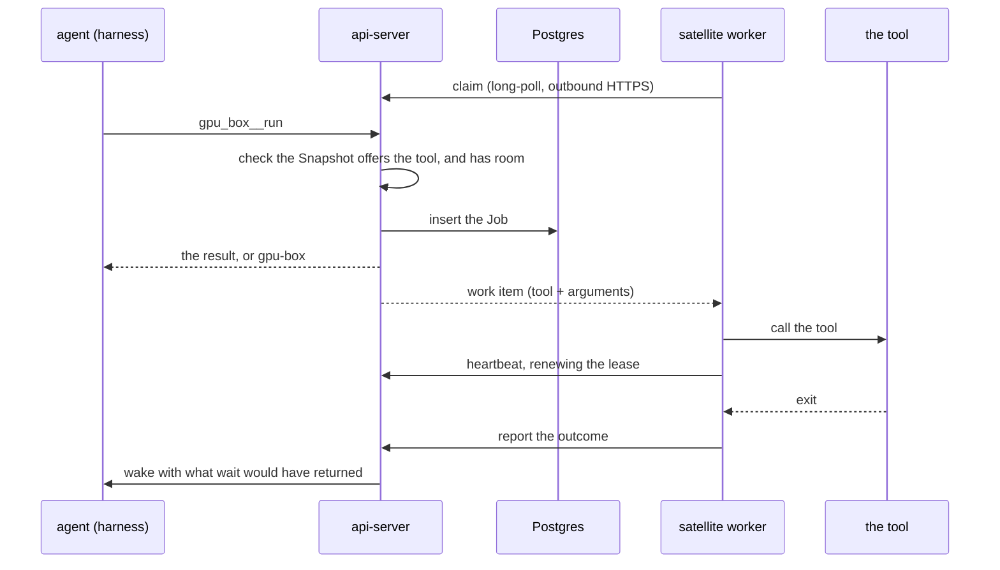

# Satellites

Last verified: 2026-09-22

## Overview

A **Satellite** is an MCP server on a machine outside the cluster, reached through a queue the machine polls. It lets an Agent call tools on a host it has no other access to — a capable machine in a higher-security zone, whose firewall admits nothing inbound.

The machine polls; nothing is pushed to it. The worker runs beside the tools, claims work over ordinary outbound HTTPS, calls them and reports back. The Agent sees each granted Satellite's tools on the platform MCP server it already has, scoped by Satellite name.

`dam satellite mcp --name build-farm -- npx -y @acme/build-mcp` runs any stdio MCP server and offers its tools as they come, bar a name the contract refuses. The platform forwards a tool call and stores an outcome; what the arguments mean is the machine's business alone, and it never reads inside a tool's schema.

Three properties follow from the queue, and each replaced a worse alternative:

- **No replica pinning.** Affinity was tried for the harness path and abandoned ([platform-topology](platform-topology.md)). A held socket would land a Satellite on one replica while the Agent's call lands on a random one; a queue in the shared store lets any replica serve either side.
- **Outcomes outlive both ends.** A Job survives the worker dying, the Satellite going offline and the Agent hibernating.
- **It traverses corporate proxies.** The egress proxies fronting these zones routinely forbid WebSocket upgrades. Plain HTTPS gets through, with the same outbound-only direction.

MCP is the *contract* between Platform and a Satellite, but not the *transport*: the worker speaks a small private RPC — claim, heartbeat, report — carrying MCP tool calls and results. A Satellite is therefore unreachable except through Platform, which is the point, while what it offers is described in the one vocabulary every harness already speaks.

## Concepts

- **Satellite** — a named, owner-scoped tool surface, identified by `(owner, name)`. Durable: the record outlives any connection, and its tools stay listable while the machine is offline. Per-owner by design — two people wanting the same machine run one worker each, so every call stays attributable to a real person's key. Platform's sharing model lends *Agents*, never resources ([multi-player](../strategy/multi-player.md)).
- **Snapshot** — the server's copy of the Satellite's **tool list**, replaced on each connect, and what the Agent's tools are built from. It is a *claim by the Satellite*, not a platform guarantee: identity is the name, so a worker reconnecting from a different checkout serves the same name backed by different tools.
- **Job** — one tool call, identified by `(satellite, sequence)` and rendered `gpu-box#7`. The sequence is minted server-side, since the id must return before any worker has seen the Job.
- **Satellite Grant** — the per-Agent permission to reach a Satellite. The granted set decides whether the tools are registered at all.

## Admission

A Job is accepted only when a worker will pick it up within a poll interval. There is **no backlog**: non-terminal Jobs may never exceed the Satellite's declared concurrency limit, and a call that would exceed it is refused with a reason rather than queued. That is what makes the *running* a call reports true in every case rather than the common one.

The count and the insert share one transaction, so two calls arriving together cannot both read a count under the limit and both land. A per-tool limit works the same way, for the tool that must not run beside itself.

Admission decides only what the platform can know from the Snapshot: that the Satellite is **online** and not **draining**, that it offers the named tool, and that there is room. It does not read the arguments — a call whose arguments the machine will refuse is admitted, dispatched and refused there, one round trip later. That is the price of the platform not understanding what its Satellites do, and it is paid in a wasted poll rather than in a wrong answer.

`--max-concurrent` is clamped to an operator ceiling. Everywhere else the machine's own declaration governs and wins; here the queue is Platform's storage, so a Satellite may ask for less than the ceiling and never for more.

Draining is set by `drain` and cleared by a **claim**, and by nothing else: a draining worker stops claiming, so a claim is the machine saying it serves again, while a heartbeat and a Snapshot push both say nothing about readiness. A heartbeat that cleared it would let a shutting-down machine un-shut itself on its own next beat.

## Jobs

| State | Meaning |
|---|---|
| queued | accepted; no worker has claimed it yet |
| running | claimed, under a lease the worker renews |
| done | terminal: the tool's result, and its exit code where the tool has one |
| interrupted | the worker stopped renewing, or it was killed — the outcome is unknowable |
| cancelled | terminal after a cancellation or the Satellite's removal |

**Interruption is detected by lease expiry, not reported.** A worker that dies cannot file a report about itself, so a Job whose lease lapses is swept into *interrupted*. A worker that knows it is dying reports directly, which is faster and says why.

**Cancellation is cooperative and travels on the poll.** How a machine stops its own work is its business; the platform asks and records what comes back. A Job still queued settles server-side with no worker involved.

**Jobs are never retried.** A tool call is not assumed idempotent and nothing can judge one safe to repeat.

**Removing a Satellite takes its Jobs with it.** A Job is keyed by the Satellite and its sequence, and that sequence restarts for a Satellite registered under the same name again, so rows left behind would collide with its successor's first Jobs. The record goes with the machine, which is what removing it asks for.

An outcome the Agent has not been told about is **never retired by the TTL** — dropping it would drop the one turn it is owed. The hourly wake retry is what eventually clears it. A Job that reached its TTL without ever starting — queued with nobody claiming — is **settled and told**, not deleted: it holds a place against the Satellite's concurrency until something ends it.

Output is captured with stdout and stderr merged in terminal order. Under a few KB it comes back inline; over that the tool returns a path and the full log is written into the Agent's own sandbox, so a large log costs the model a line rather than a context window. The file is written **at read time** — when an outcome arrives the Agent may be hibernating, but an Agent asking for it is up by definition.

## Trust boundary

**The machine decides what may run on it, and nothing else does.** The api-server checks that the Satellite offers the tool and has room; it never reads an argument, because a Satellite may be any MCP server and only that server knows what its arguments mean. The MCP server inherits the **worker's own environment**, so whatever the user exported when they started the worker is what it sees, which is worth knowing when deciding what to start it from.

This is a narrower promise than matching in both places, and deliberately so: a check the platform cannot perform for every Satellite is a check it should not appear to perform for any. What Platform still guarantees is the record — every call, verdict and outcome is stored on the Job row whether or not the machine reports honestly about itself.

Anything an Agent can call is callable by a **prompt-injected** Agent. That is the whole exposure surface, and it is why a tool call is bounded before it is stored — arguments are capped, and the concurrency limit is enforced in the same transaction that inserts. Connecting an arbitrary MCP server widens that surface to whatever the server exposes, which is the user's call to make and the reason grants stay deliberate. Every call, verdict and outcome is recorded on the Job row itself — the tool, its arguments and the result — and because Platform stores that rather than the Satellite, the record does not depend on a machine reporting honestly about itself. The rows are the whole of it: they are purged with the retention sweep a week after the Job started, so a longer-lived trail would have to be added on purpose.

A worker authenticates with an API key carrying the **serve scope**, which covers only what serving needs: registering a tool surface, claiming the work approved for it, heartbeating, reporting what came back, and declaring itself draining. It confers no scope over Agents or credentials, but it is not agent-scoped either, and the difference matters: a Satellite serves every Agent granted to it, so a worker claims work queued by any of them and the text it reports becomes that Agent's next turn. Narrowing the key to one Agent would therefore be a promise the surface cannot keep, so a serve key must be an unrestricted principal and an agent-bound one is refused outright. Read that as the cost of the surface: a serve key is trusted by every Agent granted to any Satellite of that owner, which is the reason to mint one per machine and to keep the grants deliberate. Nothing stops an owner minting a key that holds *more* than that scope — the platform cannot tell which key a machine will be given — so the guidance is the narrow key, and what the platform guarantees is only that the scope itself buys nothing else. That is what keeps the long-lived key a machine outside the cluster must hold from being worth more than the machine.

Revoking a grant, deleting a Satellite and deleting an Agent share one rule, and share the code that applies it so the three cannot drift: **revocation stops dispatch and stops reads, never execution.** The command is already running on a machine Platform cannot reach, so queued Jobs are cancelled and running ones run on. What survives differs by which authority went away. After a revoked grant or a deleted Agent the Satellite is still there, so a running Job's outcome is still reported and recorded and only the Agent's access is gone. Deleting a Satellite takes its Job rows with it: the command runs on with nothing listening, no cancellation can reach it because the worker reads cancellations from the rows that were just deleted, and no record of it is kept. Stopping the command itself is the job of whoever is at the machine.

## Surfaces

Satellites are a pre-release surface. There is no browser surface yet; the CLI and an Agent's tools are the whole of it, and the tools appear only for an Agent that holds a grant, which is deliberate to give.

The CLI is at parity plus `dam satellite mcp`, whose **log is the interface**: the tools print at startup and every Job start and exit is one line. Shutdown drains on the first interrupt and forces on the second. There is no reload: the tool list is whatever the server reports at connect, so changing it means restarting.

`dam satellite` marks itself **experimental** in its description and help text, which is how a pre-release surface is disclosed where there is no feature flag to read.

A running harness lists tools once at spawn, so a new grant or a newly added tool is invisible until it restarts — the same lag every MCP entry has. Enforcement never lags: admission reads the live Snapshot, so a removed tool is refused at once, and the machine matches against the surface it was started with.

Each Satellite's tools are registered **scoped by its name** — `gpu_box__run`, `gpu_box__wait`, `gpu_box__get`, `gpu_box__cancel`. A tool needs no `satellite` argument the model could get wrong. Two machines can still render one registered name — a tool name may hold the separator — and the second is dropped rather than registered twice, which would fail the whole session. A proxied call blocks briefly and returns the outcome if it is quick, and a job reference otherwise, so the common short call costs one tool call rather than two.

## Where the code lives

- Contract and router: [`packages/api-server-api/src/modules/satellites/`](../../packages/api-server-api/src/modules/satellites/)
- Implementation: [`packages/api-server/src/modules/satellites/`](../../packages/api-server/src/modules/satellites/)
- Worker and CLI: [`packages/cli/src/modules/satellite/`](../../packages/cli/src/modules/satellite/)
