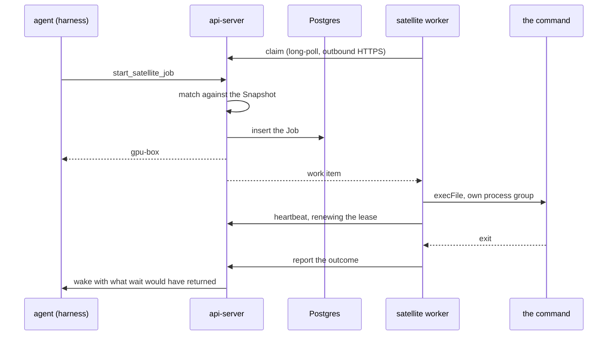

# Satellites

Last verified: 2026-09-17

## Overview

A **Satellite** is a command surface on a machine outside the cluster. It lets an Agent trigger a finite, pre-declared set of commands on a host the Agent has no other access to — a capable machine in a higher-security zone, whose firewall admits nothing inbound.

The machine polls; nothing is pushed to it. `dam satellite serve` runs beside the commands, claims work over ordinary outbound HTTPS, executes it and reports back. The Agent reaches its Satellites through tools on the platform MCP server it already has.

Three properties follow from the queue, and each replaced a worse alternative:

- **No replica pinning.** Affinity was tried for the harness path and abandoned ([platform-topology](platform-topology.md)). A held socket would land a Satellite on one replica while the Agent's call lands on a random one; a queue in the shared store lets any replica serve either side.
- **Outcomes outlive both ends.** A Job survives the worker dying, the Satellite going offline and the Agent hibernating.
- **It traverses corporate proxies.** The egress proxies fronting these zones routinely forbid WebSocket upgrades. Plain HTTPS gets through, with the same outbound-only direction.

MCP is deliberately **not** the protocol between Platform and a Satellite: the api-server is the MCP server, so the worker speaks a small private RPC — claim, heartbeat, report. A Satellite is therefore unreachable except through Platform, which is the point.

## Concepts

- **Satellite** — a named, owner-scoped command surface, identified by `(owner, name)`. Durable: the record outlives any connection, and its commands stay listable while the machine is offline. Per-owner by design — two people wanting the same machine run one worker each, so every call stays attributable to a real person's key. Platform's sharing model lends *Agents*, never resources ([multi-player](../strategy/multi-player.md)).
- **Manifest** — the local file declaring the Satellite's name, its execution defaults and its Command Patterns. Pushed on connect, never fetched.
- **Snapshot** — the server's copy of the compiled Manifest, replaced on each connect, and what the Agent's tool descriptions are built from. It is a *claim by the Satellite*, not a platform guarantee: identity is the name, so a worker reconnecting from a different checkout serves the same name backed by different scripts.
- **Command Pattern** — one permitted command shape (below).
- **Job** — one execution, identified by `(satellite, sequence)` and rendered `gpu-box#7`. The sequence is minted server-side, since the id must return before any worker has seen the Job.
- **Satellite Grant** — the per-Agent permission to reach a Satellite. The granted set decides whether the tools are registered at all.

## Command Patterns

A pattern is a usage line, and the grammar is the security boundary. Seven forms, no sub-syntax: literals, `(a|b)` for a closed set, `[…]` optional, `(…)...` repeating, `*` for one filename-like argument or part of one, `**` for a path-like one, and `^…$` for a regex covering a **whole** argument.

The **first token must be a literal**. A pattern that lets the caller choose the program is a shell, not an allowlist, and that is the one thing the parser refuses outright.

There are deliberately no named slots: names were read by nothing, and saying what to pass is the command's description. A regex covers a whole argument rather than part of one, which reads like a restriction and is not — the argument *is* the whole thing, so `^--limit=[1-9][0-9]?$` constrains a flag's value, and a regex is equally the way to write a literal `*`, `(` or `[`, which are structural everywhere else.

Two rules constrain what a match may carry, and both are about the value rather than how the pattern is written:

- **A matched argument may not begin with `-`** where the caller chose its first character, unless it follows a literal `--`. `--limit=*` pins that dash itself, and a whole-argument regex has named every character the argument may hold, so neither is second-guessed. This protects only as far as the target script honors `--`, which the platform cannot verify.
- **No matched argument may carry a `..` segment**, whatever matched it and with no normalization. A regex may widen what an argument *says*; it can never widen where it *points*.

Per-argument length and argv count are capped, because a user-authored regex meeting model-supplied input is a ReDoS on the machine this feature exists to protect.

## Admission

A Job is accepted only when a worker will pick it up within a poll interval. There is **no backlog**: non-terminal Jobs may never exceed the Satellite's `max_concurrent`, and a start that would exceed it is refused with a reason rather than queued. That is what makes the *running* a start reports true in every case rather than the common one.

The count and the insert share one transaction, so two starts arriving together cannot both read a count under the limit and both land. A per-command limit works the same way, for the command that must not run beside itself.

`max_concurrent` is clamped to an operator ceiling. Everywhere else the Manifest governs the user's own machine and wins; here the queue is Platform's storage, so a Satellite may ask for less than the ceiling and never for more.

A start is refused outright while the Satellite is **offline** (no heartbeat inside the window) or **draining**. Only `connect` and `drain` move that flag — a heartbeat may not clear it, or a shutting-down machine would un-shut itself on its own next beat.

## Jobs

| State | Meaning |
|---|---|
| pending-approval | held for a human; counts against the limit though it consumes nothing |
| queued | accepted; no worker has claimed it yet |
| running | claimed, under a lease the worker renews |
| done | terminal: exit code and captured output |
| interrupted | the worker stopped renewing, or it was killed — the outcome is unknowable |
| cancelled | terminal after a cancellation, a declined approval, or the Satellite's removal |

**Interruption is detected by lease expiry, not reported.** A worker that dies cannot file a report about itself, so a Job whose lease lapses is swept into *interrupted*. A worker that knows it is dying reports directly, which is faster and says why.

**Cancellation is cooperative and travels on the poll.** The worker signals the process *group*, not the child alone — a script that starts children would otherwise leave them running with nothing left to report them. A Job still queued settles server-side with no worker involved.

**Jobs are never retried.** The commands are not idempotent and nothing can judge one safe to repeat.

Output is captured with stdout and stderr merged in terminal order. Under a few KB it comes back inline; over that the tool returns a path and the full log is written into the Agent's own sandbox, so a large log costs the model a line rather than a context window. The file is written **at read time** — when an outcome arrives the Agent may be hibernating, but an Agent asking for it is up by definition.

## Wake on finish

A Job outliving the turn that started it is the normal case, so a terminal outcome **wakes the Agent** with a synthetic prompt carrying what `wait` would have returned. Without it the obvious use — start the nightly pipeline, then summarize what it produced — fails silently at the last step.

It rides a runtime event of its own ([runtime delivery](runtime-delivery.md)), handled agent-side by opening an ordinary chat Session. It cannot be a tool result: the Session that started the Job may be long gone.

Two rules keep it from becoming noise, and they are load-bearing because there is no opt-out:

- **An outcome already delivered does not wake.** Whichever path reports it first claims it, so an Agent sitting in `wait` does not also get a turn about the same Job.
- **Simultaneous finishes coalesce.** Delivery claims *every* undelivered outcome for the Agent in one atomic statement, so three Jobs ending together produce one turn.

A claim is released only when no turn was written at all. Once the event is committed it is durable and the outbox carries it, so releasing after a later failure would let the next claim announce the same Job a second time. The hourly sweep therefore does two different things: it *announces* an outcome nobody claimed, and it only *re-wakes* one that was claimed — waking for an unclaimed outcome would bring the Agent up with nothing to read.

An Agent parked over budget cannot wake; its outcome waits and that hourly sweep retries. Holding the pod awake for the Job's duration was rejected as the most expensive option available — hours of compute against the owner's budget to avoid one wake.

## Approval

A Command Pattern may declare that it always needs a human. That gates the *start* — never the reads — and the Job is created **pending approval** rather than blocking the call, so no turn stalls and an unattended Agent's Job simply waits for a person instead of failing.

It reuses the approvals queue as a third type beside ext_authz and acp_native ([security-and-credentials](security-and-credentials.md)): the user-facing concept really is "something wants your permission", and Home already aggregates exactly that. Only the *once* verdicts apply — a standing "allow forever" is spelled by removing the declaration from the Manifest, on the user's own machine, so satellite policy has one source of truth. The surfaces read that capability from the contract rather than hardcoding it, so no button is offered that the service refuses.

## Trust boundary

**Matching is authoritative server-side; execution is constrained satellite-side.** The api-server matches every command against the Snapshot before a Job exists, and the worker matches it again against the Manifest on its own disk before spawning: the machine does not delegate to the cluster the question of what may run on it. Execution is `execFile` with the pattern's own literals, the Manifest's working directory and environment, and no caller-supplied value beyond a matched argument. Never a shell.

Anything an Agent can call is callable by a **prompt-injected** Agent. That is the whole exposure surface, and it is why the grammar cannot express an unbounded argument and why the concurrency limit is enforced in the same transaction that inserts. Every start, verdict and outcome is recorded on the Job row itself — the literal argv, the pattern it matched, the exit and the captured output — and because Platform stores that rather than the Satellite, the record does not depend on a machine reporting honestly about itself. The rows are the whole of it: they are purged with the retention sweep a week after the Job started, so a longer-lived trail would have to be added on purpose.

A worker authenticates with an API key carrying the **serve scope**, which grants exactly three things: registering a command surface, claiming the work approved for it, and reporting what came back. It confers no reach over Agents or credentials. Nothing stops an owner minting a key that holds *more* than that scope — the platform cannot tell which key a machine will be given — so the guidance is the narrow key, and what the platform guarantees is only that the scope itself buys nothing else. That is what keeps the long-lived key a machine outside the cluster must hold from being worth more than the machine.

Revoking a grant, deleting a Satellite and deleting an Agent share one rule: **revocation stops dispatch and stops reads, never execution.** The command is already running on a machine Platform cannot reach. Queued Jobs are cancelled, running ones finish and are still recorded for the audit trail, and the Agent simply loses the tool.

## Surfaces

The Satellites section sits inside the Connections tab — adjacent because "a thing my agent can reach, granted per Agent" is the same shelf to a user, separate because a Satellite is not a Connection: it carries no credential, and the grant is a server-side read rather than a Contribution.

The CLI is at parity plus `dam satellite serve`, whose **log is the interface**: the parsed Command Patterns print at startup and on every reload, every refused command names the pattern it came closest to, and every Job start and exit is one line. The Manifest path is explicit — the file decides what may run on the machine, and discovering it implicitly is the wrong kind of convenience. Shutdown drains on the first interrupt and forces on the second; reload is SIGHUP, and a reload that fails to parse keeps the running Snapshot rather than silently disabling the machine.

A running harness lists tools once at spawn, so a new grant or a newly added command is invisible until it restarts — the same lag every MCP entry has. Enforcement never lags: a start matches the live Snapshot, so an edited command works at once and a removed one is refused at once.

## Where the code lives

- Grammar, contract and router: [`packages/api-server-api/src/modules/satellites/`](../../packages/api-server-api/src/modules/satellites/)
- Implementation: [`packages/api-server/src/modules/satellites/`](../../packages/api-server/src/modules/satellites/)
- Worker and CLI: [`packages/cli/src/modules/satellite/`](../../packages/cli/src/modules/satellite/)
- UI section: [`packages/ui/src/modules/satellites/`](../../packages/ui/src/modules/satellites/)
