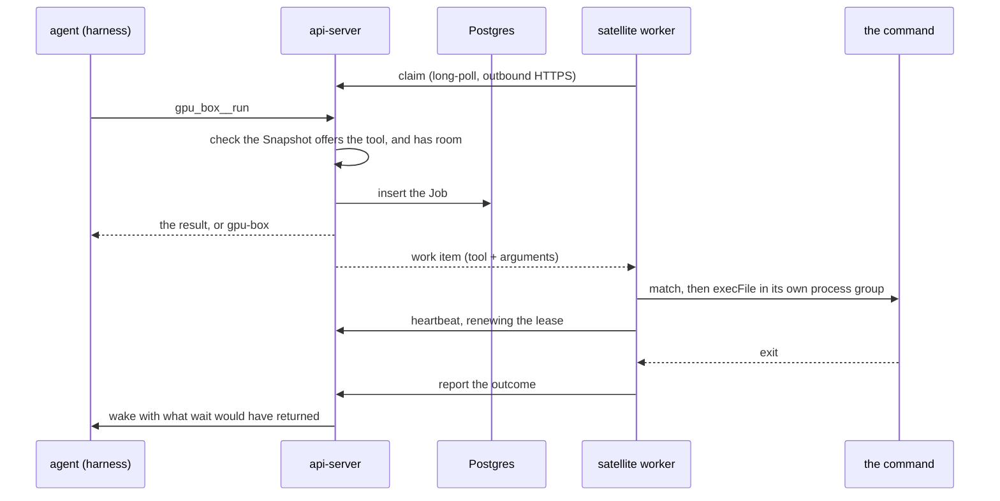

# Satellites

Last verified: 2026-09-21

## Overview

A **Satellite** is an MCP server on a machine outside the cluster, reached through a queue the machine polls. It lets an Agent call tools on a host it has no other access to — a capable machine in a higher-security zone, whose firewall admits nothing inbound.

The machine polls; nothing is pushed to it. The worker runs beside the tools, claims work over ordinary outbound HTTPS, calls them and reports back. The Agent sees each granted Satellite's tools on the platform MCP server it already has, scoped by Satellite name.

Two verbs start a worker, and **nothing above it can tell them apart**:

- `dam satellite mcp --name build-farm -- npx -y @acme/build-mcp` — any stdio MCP server, whose tools are offered verbatim.
- `dam satellite commands --name gpu-box "…"` — a **Command Surface**: permitted command shapes, one usage line each, which becomes a one-tool MCP server whose single `run` tool takes the command to run.

Two verbs rather than one flag because the two are different things to set up, not two ways of saying one thing, and an explicit verb cannot be misread the way a selector flag can.

Making the Command Surface a degenerate MCP server rather than a parallel concept is what keeps the platform out of the business of understanding commands. It forwards a tool call and stores an outcome; the machine alone reads the arguments.

The Command Surface is **text the user passes, not a file the worker reads**. It comes as one argument or on stdin, which is what a heredoc wants:

```
dam satellite commands --name gpu-box --cwd /srv --timeout 6h <<'EOF'
./process.sh (sales.db|events.db) [-n ^[1-9][0-9]{0,3}$]  # Process a database
./deploy.sh (staging|prod)   # Deploy it  [approval]
./train.sh ./data/**/*.db    # Train      [max=1 timeout=2h]
EOF
```

A `#` opens a description, and only where a shell would see one — at the start of a line or after whitespace — so an anchored regex may hold a bare `#` without escaping. A trailing `[…]` group inside the description carries the few per-command settings: `approval`, `max=N`, `timeout=D`, `cwd=PATH`. An option the parser does not know is refused rather than ignored, because a silently dropped `approval` is the one mistake this format must not make.

Having no file is the point. Nothing can drift between what the user wrote and what the machine enforces, there is no path to get wrong, and the surface is visible in the shell history that started the worker. It costs the ability to reload: changing what may run means restarting the worker, which drains first.



Three properties follow from the queue, and each replaced a worse alternative:

- **No replica pinning.** Affinity was tried for the harness path and abandoned ([platform-topology](platform-topology.md)). A held socket would land a Satellite on one replica while the Agent's call lands on a random one; a queue in the shared store lets any replica serve either side.
- **Outcomes outlive both ends.** A Job survives the worker dying, the Satellite going offline and the Agent hibernating.
- **It traverses corporate proxies.** The egress proxies fronting these zones routinely forbid WebSocket upgrades. Plain HTTPS gets through, with the same outbound-only direction.

MCP is the *contract* between Platform and a Satellite, but not the *transport*: the worker speaks a small private RPC — claim, heartbeat, report — carrying MCP tool calls and results. A Satellite is therefore unreachable except through Platform, which is the point, while what it offers is described in the one vocabulary every harness already speaks.

## Concepts

- **Satellite** — a named, owner-scoped command surface, identified by `(owner, name)`. Durable: the record outlives any connection, and its commands stay listable while the machine is offline. Per-owner by design — two people wanting the same machine run one worker each, so every call stays attributable to a real person's key. Platform's sharing model lends *Agents*, never resources ([multi-player](../strategy/multi-player.md)).
- **Command Surface** — the text declaring a Satellite's Command Patterns and their settings, passed to `dam satellite commands`. Read only by the worker; the platform never sees it. An MCP-server Satellite has none.
- **Snapshot** — the server's copy of the Satellite's **tool list**, replaced on each connect, and what the Agent's tools are built from. It is a *claim by the Satellite*, not a platform guarantee: identity is the name, so a worker reconnecting from a different checkout serves the same name backed by different tools.
- **Command Pattern** — one permitted command shape (below). A Command Surface concept only, enforced entirely on the machine.
- **Job** — one tool call, identified by `(satellite, sequence)` and rendered `gpu-box#7`. The sequence is minted server-side, since the id must return before any worker has seen the Job.
- **Satellite Grant** — the per-Agent permission to reach a Satellite. The granted set decides whether the tools are registered at all.

## Command Patterns

These apply to a Command Surface, and live entirely on the machine: the platform stores a tool, not a grammar, and never parses an argument. A pattern is a usage line, and the grammar is the security boundary. Seven forms, no sub-syntax: literals, `(a|b)` for a closed set, `[…]` optional, `(…)...` repeating, `*` for one filename-like argument or part of one, `**` for a path-like one, and `^…$` for a regex covering a **whole** argument.

The **first token must be a literal**. A pattern that lets the caller choose the program is a shell, not an allowlist, and that is the one thing the parser refuses outright.

There are deliberately no named slots: names were read by nothing, and saying what to pass is the command's description. A regex covers a whole argument rather than part of one, which reads like a restriction and is not — the argument *is* the whole thing, so `^--limit=[1-9][0-9]?$` constrains a flag's value, and a regex is equally the way to write a literal `*`, `(` or `[`, which are structural everywhere else.

Two rules constrain what a match may carry, and both are about the value rather than how the pattern is written:

- **A matched argument may not begin with `-`** where the caller chose its first character, unless it follows a literal `--`. `--limit=*` pins that dash itself, and a whole-argument regex has named every character the argument may hold, so neither is second-guessed. This protects only as far as the target script honors `--`, which the platform cannot verify.
- **No matched argument may carry a `..` segment**, whatever matched it and with no normalization. A regex may widen what an argument *says*; it can never widen where it *points*.

A user-authored regex meeting model-supplied input is a ReDoS, so per-argument length and argv count are capped before matching starts. Because matching now happens only on the machine, that cost falls where the pattern was written rather than on a shared api-server thread — which is what let the server-side regex worker, its deadline, its one-at-a-time queue and the manifest token budget all be deleted. A pattern that backtracks slows its own machine and nobody else's.

## Admission

A Job is accepted only when a worker will pick it up within a poll interval. There is **no backlog**: non-terminal Jobs may never exceed the Satellite's declared concurrency limit, and a call that would exceed it is refused with a reason rather than queued. That is what makes the *running* a call reports true in every case rather than the common one.

The count and the insert share one transaction, so two calls arriving together cannot both read a count under the limit and both land. A per-tool limit works the same way, for the tool that must not run beside itself.

Admission decides only what the platform can know from the Snapshot: that the Satellite is **online** and not **draining**, that it offers the named tool, and that there is room. It does not read the arguments — a call whose arguments the machine will refuse is admitted, dispatched and refused there, one round trip later. That is the price of the platform not understanding what its Satellites do, and it is paid in a wasted poll rather than in a wrong answer. A per-command limit inside a Command Surface is counted on the machine for the same reason: the platform sees one `run` tool and cannot tell two commands apart.

`--max-concurrent` is clamped to an operator ceiling. Everywhere else the machine's own declaration governs and wins; here the queue is Platform's storage, so a Satellite may ask for less than the ceiling and never for more.

Draining is set by `drain` and cleared by a **claim**, and by nothing else: a draining worker stops claiming, so a claim is the machine saying it serves again, while a heartbeat and a Snapshot push both say nothing about readiness. A heartbeat that cleared it would let a shutting-down machine un-shut itself on its own next beat.

## Jobs

| State | Meaning |
|---|---|
| pending-approval | held for a human; counts against the limit though it consumes nothing |
| queued | accepted; no worker has claimed it yet |
| running | claimed, under a lease the worker renews |
| done | terminal: exit code and captured output |
| interrupted | the worker stopped renewing, or it was killed — the outcome is unknowable |
| cancelled | terminal after a cancellation, a declined approval, or the Satellite's removal |

**Interruption is detected by lease expiry, not reported.** A worker that dies cannot file a report about itself, so a Job whose lease lapses is swept into *interrupted*. A worker that knows it is dying reports directly, which is faster and says why.

**Cancellation is cooperative and travels on the poll.** The worker signals the process *group*, not the child alone — a script that starts children would otherwise leave them running with nothing left to report them. A Job still queued settles server-side with no worker involved.

**Jobs are never retried.** The commands are not idempotent and nothing can judge one safe to repeat.

**Removing a Satellite takes its Jobs with it.** A Job is keyed by the Satellite and its sequence, and that sequence restarts for a Satellite registered under the same name again, so rows left behind would collide with its successor's first Jobs. The record goes with the machine, which is what removing it asks for.

An outcome the Agent has not been told about is **never retired by the TTL** — dropping it would drop the one turn it is owed. The hourly wake retry is what eventually clears it. A Job that reached its TTL without ever starting — queued with nobody claiming, or held for an approval that is gone — is **settled and told**, not deleted: it holds a place against the Satellite's concurrency until something ends it.

Output is captured with stdout and stderr merged in terminal order. Under a few KB it comes back inline; over that the tool returns a path and the full log is written into the Agent's own sandbox, so a large log costs the model a line rather than a context window. The file is written **at read time** — when an outcome arrives the Agent may be hibernating, but an Agent asking for it is up by definition.

## Wake on finish

A Job outliving the turn that started it is the normal case, so a terminal outcome **wakes the Agent** with a synthetic prompt carrying what `wait` would have returned — every field of it, so a Job that was interrupted or cancelled brings both why it ended and whatever it had printed by then. One turn carries a bounded number of outcomes and a bounded length; the rest stay unclaimed and are carried by the next delivery, since an Agent woken with a turn too large to read has not been told anything. Without it the obvious use — start the nightly pipeline, then summarize what it produced — fails silently at the last step.

It rides a runtime event of its own ([runtime delivery](runtime-delivery.md)), handled agent-side by opening an ordinary chat Session. It cannot be a tool result: the Session that started the Job may be long gone.

Two rules keep it from becoming noise, and they are load-bearing because there is no opt-out:

- **An outcome already delivered does not wake.** One outcome reaches an Agent once, and the two paths that could carry it — the blocking `wait` the Agent is already sitting in, and a fresh turn for the ordinary case where nothing is listening — are arbitrated rather than left to whichever fires first. A `wait` takes a short lease on the Job and renews it every poll; the delivery skips a Job whose lease has not lapsed. It is a lease and not a flag because a waiter can die mid-poll, and the outcome then has to become deliverable again on its own — which is what the hourly retry is for. Without it the report path always won, because a report settles and delivers in the same breath while the waiter is still between polls, and the Agent was told the same thing twice. Two properties of that lease are load-bearing rather than incidental, because the lease *withholds* an outcome. It names the **Agent** as a predicate on the write, not as something the caller was trusted to have checked first: a lease landing on another Agent's Job would stop that Agent ever being told its own command finished, and a Satellite is reachable by every Agent granted it. And it is taken **before** the Job is read, since anything read first is a window the delivery can claim in — after which both paths report the same outcome, which is the thing the arbitration exists to prevent. A waiter that loses the claim anyway releases its lease rather than holding one over a Job a turn already carries.
- **Simultaneous finishes coalesce.** Delivery claims *every* undelivered outcome for the Agent in one atomic statement, so three Jobs ending together produce one turn.

A claim is released only when no turn was written at all. Once the event is committed it is durable and the outbox carries it, so releasing after a later failure would let the next claim announce the same Job a second time. The hourly sweep therefore does two different things: it *announces* an outcome nobody claimed, and it only *re-wakes* one that was claimed — waking for an unclaimed outcome would bring the Agent up with nothing to read.

Both sweeps — the one that settles a Job whose Lease or expiry has passed, and the hourly retry — run as ordinary platform scheduled jobs on the shared queue ([platform-topology](platform-topology.md)), so they fire once per period across replicas and each tick is idempotent.

An Agent parked over budget cannot wake; its outcome waits and that hourly sweep retries. Holding the pod awake for the Job's duration was rejected as the most expensive option available — hours of compute against the owner's budget to avoid one wake.

## Approval

A Command Surface may declare that a Command Pattern always needs a human, with `[approval]`. The platform cannot see that — it sees one tool — so **the machine asks**: the worker claims the Job, matches the call, finds the declaration and reports `needs-approval` instead of running. The Job goes back to waiting rather than ending, the api-server raises the request, and a verdict marks the Job allowed and requeues it so the machine does not ask a second time.

Moving the question to the machine is what makes it work for any Satellite rather than only a command-backed one: an MCP server can hold a call for a human by the same reply, without the platform learning anything about what its tools mean.

`needs-approval` is the one move out of *running* that is not terminal, so it takes the lease with it — nothing is executing, and a lease left behind would sweep the Job into *interrupted* while the person was still deciding.

An approval nobody answers **expires**, and an expiry settles the Job exactly as a refusal does: the hold would otherwise keep its place against the machine's concurrency for ever and tell the Agent nothing. It reuses the approvals queue as a third type beside ext_authz and acp_native ([security-and-credentials](security-and-credentials.md)): the user-facing concept really is "something wants your permission", and Home already aggregates exactly that. Only the *once* verdicts apply — a standing "allow forever" is spelled by dropping `[approval]` from the Command Surface, on the user's own machine, so satellite policy has one source of truth. The surfaces read that capability from the contract rather than hardcoding it, so no button is offered that the service refuses.

## Trust boundary

**The machine decides what may run on it, and nothing else does.** The api-server checks that the Satellite offers the tool and has room; it never reads an argument, because a Satellite may be any MCP server and only that server knows what its arguments mean. The worker matches every call against the Command Surface it was started with before spawning. Execution takes the pattern's own literals, the surface's working directory, and no caller-supplied value beyond a matched argument. It is never a shell, so nothing in an argument is expanded or interpreted. The command — or the MCP server — inherits the **worker's own environment**, so whatever the user exported when they started the worker is what it sees, which is worth knowing when deciding what to start it from.

This is a narrower promise than matching in both places, and deliberately so: a check the platform cannot perform for every Satellite is a check it should not appear to perform for any. What Platform still guarantees is the record — every call, verdict and outcome is stored on the Job row whether or not the machine reports honestly about itself.

Anything an Agent can call is callable by a **prompt-injected** Agent. That is the whole exposure surface, and it is why the grammar cannot express an unbounded argument and why the concurrency limit is enforced in the same transaction that inserts. Connecting an arbitrary MCP server widens that surface to whatever the server exposes, which is the user's call to make and the reason grants stay deliberate. Every call, verdict and outcome is recorded on the Job row itself — the tool, its arguments, the exit and the captured output — and because Platform stores that rather than the Satellite, the record does not depend on a machine reporting honestly about itself. The rows are the whole of it: they are purged with the retention sweep a week after the Job started, so a longer-lived trail would have to be added on purpose.

A worker authenticates with an API key carrying the **serve scope**, which covers only what serving needs: registering a tool surface, claiming the work approved for it, heartbeating, reporting what came back, and declaring itself draining. It confers no scope over Agents or credentials, but it is not agent-scoped either, and the difference matters: a Satellite serves every Agent granted to it, so a worker claims work queued by any of them and the text it reports becomes that Agent's next turn. Narrowing the key to one Agent would therefore be a promise the surface cannot keep, so a serve key must be an unrestricted principal and an agent-bound one is refused outright. Read that as the cost of the surface: a serve key is trusted by every Agent granted to any Satellite of that owner, which is the reason to mint one per machine and to keep the grants deliberate. Nothing stops an owner minting a key that holds *more* than that scope — the platform cannot tell which key a machine will be given — so the guidance is the narrow key, and what the platform guarantees is only that the scope itself buys nothing else. That is what keeps the long-lived key a machine outside the cluster must hold from being worth more than the machine.

Revoking a grant, deleting a Satellite and deleting an Agent share one rule, and share the code that applies it so the three cannot drift: **revocation stops dispatch and stops reads, never execution.** The command is already running on a machine Platform cannot reach, so queued Jobs are cancelled and running ones run on. What survives differs by which authority went away. After a revoked grant or a deleted Agent the Satellite is still there, so a running Job's outcome is still reported and recorded and only the Agent's access is gone. Deleting a Satellite takes its Job rows with it: the command runs on with nothing listening, no cancellation can reach it because the worker reads cancellations from the rows that were just deleted, and no record of it is kept. Stopping the command itself is the job of whoever is at the machine.

## Surfaces

Satellites are a pre-release surface behind a per-user [experimental feature flag](features.md), default off. The flag is disclosure, not authorization: it decides whether the section renders, while `dam satellite` and an Agent's tools work regardless — the agent surface needs no separate gate, since the tools appear only for an Agent that holds a grant, and granting one is deliberate.

The Satellites section sits inside the Connections tab — adjacent because "a thing my agent can reach, granted per Agent" is the same shelf to a user, separate because a Satellite is not a Connection: it carries no credential, and the grant is a server-side read rather than a Contribution.

The CLI is at parity plus `dam satellite mcp` and `dam satellite commands`, whose **log is the interface**: the parsed Command Patterns print at startup, every refused command names the pattern it came closest to, and every Job start and exit is one line. A parse error names the line it is on, since the text the user just typed is the whole allowlist. Shutdown drains on the first interrupt and forces on the second. There is no reload: neither form reads a file, so changing what a machine offers means restarting it.

`dam satellite` marks itself **experimental** in its description and help text. The UI gates on the feature flag; the CLI has no flag to read, so it says so where a user meets it. A reload is refused for three reasons, and each keeps the running Manifest rather than silently disabling the machine: it does not parse, it renames the Satellite — identity is the name, so a rename is a different machine and needs a restart — or the machine is already draining, where widening what may run is the wrong answer. A reload whose push to the platform fails keeps the running Manifest too, for the same reason. An accepted reload reaches the Snapshot first and the worker second, so the machine never enforces a Manifest the server has not taken.

A running harness lists tools once at spawn, so a new grant or a newly added tool is invisible until it restarts — the same lag every MCP entry has. Enforcement never lags: admission reads the live Snapshot, so a removed tool is refused at once, and the machine matches against the surface it was started with.

Each Satellite's tools are registered **scoped by its name** — `gpu_box__run`, `gpu_box__wait`, `gpu_box__get`, `gpu_box__cancel`. Two machines offering a tool of the same name stay distinct, and no tool needs a `satellite` argument the model could get wrong. A proxied call blocks briefly and returns the outcome if it is quick, and a job reference otherwise, so the common short call costs one tool call rather than two.

## Where the code lives

- Contract and router: [`packages/api-server-api/src/modules/satellites/`](../../packages/api-server-api/src/modules/satellites/)
- Implementation: [`packages/api-server/src/modules/satellites/`](../../packages/api-server/src/modules/satellites/)
- Worker, grammar and CLI: [`packages/cli/src/modules/satellite/`](../../packages/cli/src/modules/satellite/)
- UI section: [`packages/ui/src/modules/satellites/`](../../packages/ui/src/modules/satellites/)
