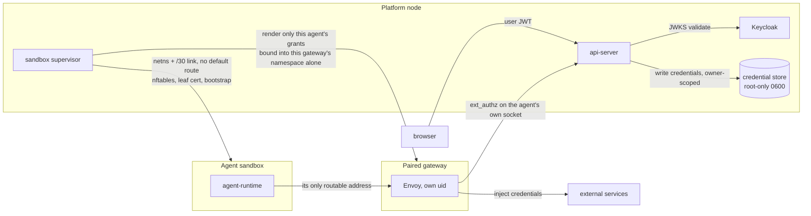

# Security and credentials

Last verified: 2026-09-10

## Overview

Three rules carry the security model:

1. **Agents never hold upstream credentials.** Real upstream tokens (GitHub,
   Anthropic, Slack, internal gateways) live in the node's credential store,
   one file per secret under a directory named for the owner, root-owned and
   0600. The Envoy process in the paired gateway injects them into outbound
   traffic on the wire — the sandbox never sees the bytes.
2. **Identity flows from Keycloak.** Browser users authenticate against
   Keycloak; the api-server validates the JWT and stamps the owner on every
   resource the user creates. Per-user credential isolation is the owner
   directory: a gateway is only ever handed credentials rendered from its own
   agent's grants, which are resolved against its owner's directory alone.
3. **Two boundaries, layered.** The sandbox → gateway hop is gated by
   *topology*: the sandbox's network namespace holds one /30 point-to-point
   link, no default route and no resolver, so its paired gateway is the only
   address it can express. There is no second route to deny, and nftables
   drops forwarding off the link as defence in depth rather than as the
   boundary itself. The gateway → api-server hops (harness and ext_authz) are
   gated by the *filesystem and the mount namespace*: each is a unix socket
   created for one agent, owned by the gateway account, mode 0600 — and every
   gateway runs in a mount namespace holding only its own agent's socket pair
   and credential directory, so another agent's are not merely unreadable but
   absent. A harness request arriving on a socket and naming a different agent
   is refused before the router sees it.

Workspace contents are explicitly outside the trust boundary — see the
security note on [persistence](persistence.md).

## Diagram

The credential boundary is the gateway's namespace: credential bytes are
rendered into a directory owned by the gateway account, and each gateway runs
with an empty filesystem laid over the agents root and only its own agent's
directory bound back in. The sandbox, for its part, has no route to anything
but that gateway. Enforcement is layered:

- **Link topology** is the sole gate on the sandbox → gateway hop. The
  sandbox's namespace holds one /30 veth and nothing else — no default
  route, no resolver — so the gateway's address on that link is the only
  destination its routing table can express. A hostname is not even
  nameable inside it.
- **The node ruleset** (one nftables table, rewritten whole on every
  change) drops forwarding off every sandbox link and admits, on each
  link's input path, only that sandbox's own gateway address and port.
  It is defence in depth: it exists so that a misconfigured route or a
  future second interface cannot quietly become an exit.
- **Sandbox ingress** needs no rule of its own: the sandbox listens on
  its end of the link, whose other end is on this node, so the
  api-server is the only thing that can reach it. agent-runtime serves
  unauthenticated on the assumption that this is the auth boundary.
- **Gateway Envoy ext_authz** gates everything the gateway
  forwards on behalf of the agent — external upstreams via the HITL
  rule model, while platform-internal upstreams pass without a
  per-request human decision: the harness path (control-plane traffic
  to the api-server) and the artifact object store, where each
  request already carries a platform-minted authorization — a
  short-lived link scoped to a single object and operation, issued by
  the api-server after ownership checks and validated by the store
  itself ([artifact-library](artifact-library.md)). This is
  the destination-side egress gate; no NetworkPolicies on Postgres /
  Redis / Keycloak / the harness or ext-authz Services are needed
  because the agent has no admitted route to any of them.
- **Per-agent sockets** gate the gateway-originated hops. The harness
  endpoint and the ext_authz service are each bound to a unix socket
  created for one agent, owned by the gateway account and mode 0600, and
  bound into that one gateway's namespace. Nothing in the request names
  the agent: the socket does. A harness call naming another agent is
  refused, and an ext_authz check is evaluated for the agent whose socket
  it arrived on, so neither the `:authority` header nor any other
  caller-set field can shift identity.

  Every gateway runs as the *same* account, so the uid separates gateways
  from the rest of the node but not from each other — the per-instance
  mount namespace is what separates them, and it is the load-bearing half
  of this boundary.

The sandbox holds no platform credential of any kind, and the gateway runs
in a separate process, uid and namespace — there is nothing co-located to
share a network or PID namespace with.

## Identity

**Keycloak** is the only identity authority. It runs on the node as a systemd
service and is the OIDC provider for every authenticated surface.

Keycloak's branded login page ships two presentation variants selected
per deployment: password-first (the default — username/password form,
with any identity-provider buttons offered below it) and SSO-first
(identity-provider CTAs only, for deployments where corporate SSO is the
expected sign-in path; the page falls back to the password form when the
realm has no identity provider configured). The chart's `keycloak.login`
values ([`helm/values.yaml`](../../helm/values.yaml))
select the variant and an optional "Request access" link; they reach the
theme as container environment variables resolved through the theme's
`theme.properties` placeholders, so switching variants is a values change
and a service restart — no theme rebuild, no realm change. The same page also
knows which client started the sign-in: when it is the artifact share
host's client, the heading and lead paragraph
tell the visitor they need to sign in to view a shared artifact instead
of the general product pitch. Upstream identity
providers themselves (e.g. w3id) are realm configuration managed outside
the node configuration.

The user agent flow:

1. Browser authenticates against Keycloak and obtains a JWT with audience
   `platform-api`.
2. UI sends the JWT to the api-server on every tRPC and ACP call. The
   api-server validates it against Keycloak's JWKS.
3. The api-server's `sub` claim becomes `agent-platform.ai/owner=` on every
   resource the user creates (Agent record, stored credential,
   etc.).

The realm holds a **dedicated public client** for the artifact share host
([artifact-library](artifact-library.md#the-share-host--trust-boundary)):
PKCE-only, redirect pinned to that host's sign-in callback, and no
`platform-api` audience, so its tokens are rejected by the api-server. A
restricted-link viewer thus gets an identity on the share origin without
the app's tokens ever being valid there.

Two interstitials can take the browser off the page the user asked for:
the login redirect above, and the Terms-of-Use gate. Both park that
destination and resume it once cleared, so a deep link survives them —
an in-chat bind link ([channels](channels.md)) is single-use, so losing
its target would cost the user a fresh bind command rather than a retry.

If the key set itself cannot be retrieved (Keycloak unreachable, fetch
timeout, non-200 response), verification fails closed with **503** and
reason `jwks-unavailable` — never 401: a transient infrastructure failure
is signalled as retryable, not as a credential rejection. Every
token-validity failure (expired, bad signature, unknown `kid`, wrong
audience) remains 401. The api-server also warms the JWKS at boot and
gates its readiness probe on the first successful fetch, so a rolling
update keeps the previous process serving until the new one can verify
tokens. The warm-up gives up after a bounded window (so a prolonged
Keycloak outage cannot wedge a restart indefinitely): past that, the process
reports ready and serves 503s on authenticated routes until Keycloak is
reachable again.

There is no token exchange — credential storage is file-native and owner-
scoped, so the api-server enforces ownership directly when reading and
writing.

Headless / CI use: the CLI accepts a long-lived **API key** in the same
`Authorization: Bearer` slot, marked by a `pk_` prefix. A key carries the
owner's `sub`, a subset of permission scopes, and an optional agent
allowlist; deleting an Agent drops it from every key, so a later
same-named Agent is not covered. The bearer middleware dispatches by
prefix and yields the same principal shape — sub, scopes, agent binding,
optional key id. Keys cannot mint or revoke other keys: the management
surface rejects any request authenticated via a key, so a leaked key
cannot escalate.

## Keycloak event logging

Keycloak is also an audit event source. It emits login and admin events
to stdout via its built-in `jboss-logging` event listener, so they
ride the same journal as every other unit on the node out to the
external log service. Successes surface at `info`, errors at `warn`, as
structured JSON in production.

Persistence is split by event class:

- **Login events** (LOGIN, LOGOUT, LOGIN_ERROR, token refresh, account
  changes, …) are *not* written to the Keycloak database. The listener
  fires independently of DB-store gating, so the events still reach
  stdout; the external log service is the source of truth for the
  authentication audit trail, and Postgres is spared the high-volume
  write.
- **Admin events** (any change made through the admin REST API or
  console) fire on the same listener, so their metadata — who acted, on
  which resource, from where — reaches stdout and the external log
  service alongside login events. That metadata is also recorded to
  Postgres (low volume), but the full request body is *not*
  (`adminEventsDetailsEnabled` is off): stored bodies would otherwise
  capture sensitive payloads — plaintext credentials on user-create /
  user-update flows — and Keycloak retains admin events indefinitely with
  no built-in expiration. The log line never carries the request body, so
  the external log pipeline, not the Keycloak database, is the audit
  source of truth.

The event knobs, log format, and realm import live in the Keycloak Helm
values under [`helm/`](../../helm/).

## Resource ownership

Multi-tenancy is **soft** — a single node, with a
`agent-platform.ai/owner` label on every owned resource carrying the authenticated
user's `sub`. The api-server is the sole writer of resource spec and stamps
the label on create; every list and get filters by it. There is no
namespace-per-user.

The supervisor picks credentials per-Agent by listing stored secrets
labelled `agent-platform.ai/owner=,agent-platform.ai/managed-by=api-server` in the agent
in the owner's directory, then rendering the matching set for the paired gateway alone. Cross-
owner leakage is structurally prevented by the label selector — a missing
`agent-platform.ai/owner` label is treated as no owner and never mounted.

## Credential storage

Each connected service produces one stored secret per `(owner, connection)`, a file under the owner's directory in the node's credential store:

- **OAuth-issued tokens** (GitHub, MCP servers, Generic OAuth apps) — the
  api-server's `/api/oauth/callback` writes the access + refresh token
  pair plus a structured **host list** describing every wire position
  the token should be injected on. The refresh-token loop re-mints
  access tokens before expiry; the agent never sees the refresh token.
  Re-running login and consent against an existing connection replaces its
  tokens in place, keeping the connection's identity and grants. When the
  connection stores the OAuth app's *client* secret itself (rather than
  inheriting the deployment's), that secret is replaceable in place too — the
  api-server immediately tries the stored refresh token with it, so a rotation
  upstream usually revives the connection with no user consent at all, and where
  it can't, re-authentication is unblocked by it. A client secret supplied by the
  operator is deploy config and is rotated there.
- **User-supplied secrets** (Anthropic API keys, generic API tokens) —
  the Connections subsystem writes them as a **header Connection** per
  credential, built from its template and stored with the same labels and
  annotations: one per-Connection secret carrying the credential value plus
  the placeholder SDS the gateway reads.
- **Client-credentials grants** (machine-to-machine OAuth) — the
  per-Connection secret stores the long-lived client secret, and the
  api-server exchanges it at the provider's token endpoint (discovered from
  the issuer's OAuth metadata at connect time) for short-lived access
  tokens: once synchronously at connect time (bad credentials fail the
  create), then again before each expiry via the same refresh loop that
  renews OAuth tokens. Only the minted access token reaches the gateway's
  injection path; the client secret stays at rest and is never sent to the
  connection's hosts. The stored client secret is replaceable in place when it
  rotates upstream — the api-server mints with the new one before writing it, so
  a wrong secret is rejected rather than stored.
- **GitHub personal access tokens** — a PAT is one **`github-pat`
  Connection** whose template re-bakes, from the bare PAT, every GitHub
  host injection it needs into a single per-Connection secret — `Bearer`
  on the API and raw-content hosts, `Basic`-encoded on the git host for
  `git clone` over HTTPS — plus a `GH_TOKEN` env contribution for the
  `gh` CLI. (This is the multi-host-injection shape described next, with
  the `Basic`-encoded half generated by the template rather than typed by
  the user.) The `github-enterprise-pat` variant bakes the same shape from
  the user's enterprise host, plus a `GH_HOST` env contribution.
- **GitHub App installation tokens** — a `github-app` Connection stores the
  app's PEM private key and mints short-lived installation tokens (`ghs_…`)
  from it, the JWT-signed counterpart of the client-credentials grant above:
  the api-server signs a short-lived app JWT, exchanges it at GitHub's
  installation-token endpoint (once at connect, then before each expiry via
  the same refresh loop), and re-bakes the same three GitHub host injections
  as the PAT template. The private key stays at rest and is never sent to any
  host; only the installation token reaches the gateway's injection path. Like
  the client secret above, a rotated private key is pasted in place and proven by
  minting before it is stored.

  A Connection may additionally **narrow the authority of the token it mints**,
  below what the app installation itself holds — to a chosen set of repositories,
  to a chosen set of permissions, or both. An installation is an
  organization-wide grant, typically far broader than any one agent's task, and
  narrowing is how one broadly-installed app backs many least-privilege
  Connections without a second app per task. GitHub is the arbiter: it refuses
  any request exceeding the installation, so the narrowing can only ever reduce
  authority, never claim it. The chosen subset is **part of the credential's
  stored identity, not a one-time argument** — every renewal and every key
  rotation re-mints against the same subset, so a Connection cannot silently
  widen back to the whole installation between renewals. Narrowing is opt-in:
  a Connection that names no subset carries the installation's full authority,
  which is what every Connection made before the capability existed does. Once
  a subset stops being covered — the organization drops a repository from the
  installation, or revokes a permission — renewal is *rejected* rather than
  merely failing, so the Connection reads expired and waits for someone to
  widen the installation or narrow the Connection, instead of retrying a
  request that cannot succeed.

  The subset is chosen against **what the installation actually grants, read
  back from GitHub** before the Connection is created: the api-server
  authenticates as the app, asks what the installation holds, and offers those
  repositories and permissions to choose from. So narrowing is a selection
  rather than a guess, and a permission can be taken at a *lower* level than
  the installation holds it — the read-only agent on a read-write installation
  is the case that motivates this, and it cannot be expressed by picking whole
  permissions alone. Repositories chosen this way are remembered by GitHub's
  identifier rather than by name, so renaming one does not quietly turn a
  working Connection into a rejected renewal. The read needs the app's private
  key and is authenticated the same way minting is; it stores nothing.

  The subset is **editable in place**, which is the one part of a Connection's
  configuration that is: what an agent should be allowed to do changes as its
  work does, and rebuilding the Connection to add a repository would mean
  re-pasting the key and re-granting it to every agent. Editing re-reads the
  installation using the Connection's own stored key — never asking for it a
  second time — and re-mints immediately, so the narrower token replaces the
  live one rather than waiting out the current one's hour. The new subset is
  proven by that mint before it is stored, so one the installation cannot
  cover fails the edit instead of parking the Connection at its next renewal.
  Nothing else moves: the credential, the contributions, and every agent grant
  are untouched, and because the token is read gateway-side the change lands
  without an Agent-spec patch or a sandbox restart.

**Multi-host connections.** A single OAuth connection can inject the
same token on more than one host with **different auth schemes per
host**, all from one stored secret. The secret carries an annotated list of
per-host injection descriptors; the supervisor fans it into one Envoy
filter chain per host, stacking entries that share a host, and mounts
the secret once. The same list drives the egress allowlist, one rule per
host and connection, so there is no second source of truth.

GitHub.com is the motivating case ([issue #219](https://github.com/dam-agents/dam/issues/219)):
the same OAuth token must reach the API host as a bearer token, the git
host as basic auth carrying the token as a password (so `git clone` of
private repos works without a credential helper), and the raw-content
host as a bearer token again.

The secret also carries the SDS documents Envoy reads, one per injection
step — see
[`packages/api-server/src/modules/connections/`](../../packages/api-server/src/modules/connections/).

## Image pull credentials

Pulling the agent's container image from a private registry uses a
**structurally separate** credential class from the egress credentials
above. It does not ride the Envoy path at all:

- **The image pull consumes it, not Envoy.** It is a docker config
  directory named on the agent's spec; the pull reads it to authenticate
  against the registry. It is never handed to the gateway and never mounted
  into the sandbox — like egress credentials, the agent never holds the
  bytes, but here that is a property of *where the credential is consumed*
  rather than of Envoy injection.
- **Scope is the Agent, not the owner.** Egress credentials are
  owner-scoped and reusable across every Agent that owner runs; a pull
  credential is agent-scoped — one directory per Agent, created with the
  Agent and torn down with it. There is no cross-agent reuse, and a pull
  only ever sees the credential for the image it is pulling.
- **Per-agent precedence over the node-wide default.** An operator may
  configure a node-wide default registry credential. When an Agent carries
  its own, the supervisor points that pull at the Agent's directory and the
  node-wide one is retained as a fallback — override, not replace.

The api-server builds the docker config from structured `{server, username,
password}` input and writes it before the Agent record, rolling it back if
that create fails. Teardown is a delete-time cleanup hook with an orphan
sweep as backstop; lifetime detail lives on [persistence](persistence.md).
The credential is validated only at pull time — a bad credential surfaces
as an image-pull failure on the sandbox, not a create-time error.

Scope is long-lived static credentials (registry PAT, robot account, basic
auth, a GCP Artifact Registry JSON key as the password). Short-lived or
dynamically-minted registry tokens (e.g. ECR) are out of scope.

## Platform database roles

The credentials above are *upstream* secrets the platform injects on behalf of
agents. The platform's own backing store has a separate credential boundary: the
bundled Postgres splits application connection identities from DBA authority.
Three login roles, not one:

- **`platform_apiserver`** / **`platform_keycloak`** — `NOSUPERUSER` owners of
  the `platform` and `keycloak` databases respectively, each the only role its
  service connects as. `CONNECT` is revoked from `PUBLIC` and granted back only
  to that owner, plus the credential-less `usage_readers` group on `platform`
  ([usage-tracking](usage-tracking.md#source-passthrough-views)), so a leaked
  api-server credential can neither read Keycloak's
  database nor escalate (no `CREATE ROLE`, no `ALTER SYSTEM`, no RLS bypass) —
  it can only do DDL/DML within the `platform` database it already owns.
- **`platform`** — the lone `SUPERUSER`, used only for DBA work. It is the
  image's bootstrap superuser, because Postgres forbids demoting that role and
  so it must be the role that is *allowed* to keep SUPERUSER, not an app role.
  An existing single-role install already bootstrapped under this name, so it is
  kept in place rather than renamed — Postgres forbids renaming the role you
  are connected as. A per-role `log_statement` default puts every
  admin-session statement into the audit trail, and every role and grant
  change is audited whoever issues it ([persistence](persistence.md)).

The admin credential lives in the same node configuration and
must be treated as high-value. The statement audit is best-effort, not enforced
— a superuser session can `SET log_statement` mid-session. Operational details are in the
[runbook](../notes/postgres-role-operations.md).

## Envoy credential injection

The supervisor renders a per-Agent Envoy bootstrap and issues the leaf TLS
material the gateway uses to terminate the agent's egress TLS. The gateway
itself is a systemd unit instance, which is what drops it to the gateway
account and gives it the namespace holding only that agent's files. The leaf is
signed by the node's own CA, generated on first boot; the CA certificate —
and only the certificate, never the key — is mounted read-only into the
sandbox at `/etc/platform/ca/ca.crt`, so the agent's TLS clients trust
Envoy's intercept cert. The leaf's SAN list is exactly the hosts the
gateway terminates, so a host with no chain cannot be intercepted; adding
one reissues the leaf and replaces the process.

On the wire:

1. The agent addresses its gateway at the host end of its link. The value
   also appears as `HTTPS_PROXY`, but that is decorative: the sandbox's
   routing table admits nothing else, so every egress arrives at the
   gateway as HTTP CONNECT whether or not the client honors the variable.
2. Envoy's outer listener (bound on that one address, reachable only from
   the paired sandbox) terminates the CONNECT and routes the inner stream
   into an internal listener that reads SNI.
3. Per-host filter chains terminate TLS with the leaf cert, run the
   credential injector(s) to add the configured header(s) (or rewrite
   `?<param>=<value>` into the URL — see below), then forward to a
   per-chain `STRICT_DNS` cluster pinned to the host (explicit upstream
   SNI + SAN-bound TLS validation). The agent's inner `Host` header has
   no influence on the upstream destination — the route-confusion
   exfiltration path is structurally closed. Allow-only chains
   (path-rule promoted, no
   credential) keep using the dynamic forward proxy — they have no
   credential to misroute.
4. The default chain (SNI miss) does TCP passthrough — the request reaches
   the upstream unchanged.

Hosts the api-server has issued a credential for surface as L7 chains (SNI
match, header injection); hosts with no credential surface as L4
passthrough chains.

**L7 promotion.** An egress rule that narrows a host by path, method, or
port is invisible to the L4 catch-all (it sees only SNI), so the rule's
host must be *promoted* onto a TLS-terminating chain to be enforceable
over HTTPS. The promotion signal is the Agent resource's `l7Hosts` spec
list. It is per-agent intent, exactly like connection grants: promoting a
host on one agent re-renders and rolls only that agent's gateway, never a
sibling's. Promoted hosts get an uncredentialed L7 chain (gate sees
method/path; nothing is injected) and extend the leaf certificate's SAN
list.

`l7Hosts` is a pure projection of the agent's active rules: the api-server
recomputes it from the rule set after every create, edit, and revoke and
writes it wholesale, so a host is demoted (dropped from interception) as
soon as its last narrowing rule is gone. A roll follows any change to that
set and nothing else, so the projection ships in the contract package:
clients predict an interruption with the server's own rule, not the rule's
shape. Connection-derived rules are excluded — their host is already
TLS-terminated by the connection's own credential chain. Because each
entry is interpolated into the gateway's Envoy bootstrap and cert SANs,
the CRD constrains list items to DNS hostnames, so a rule host cannot
inject config into the owner's gateway.
That projection is a second write to the agent record that cannot share a
transaction with the rule write, so a per-agent periodic reconcile
re-derives it from the rules — converging a host whose patch failed, or
whose api-server died between the rule commit and the patch, without
operator action.

A referenced SDS file missing from the mounted Secret is a fatal Envoy
boot error, so the supervisor verifies each credential's SDS key against
the stored credential's data at render time and degrades that host to an allow-only
chain (logged as a warning) rather than emit an unbootable bootstrap.
Requests to the host then go out uncredentialed — failing upstream auth
for that host only — instead of crash-looping the whole gateway. Stale
Secrets written by since-replaced code paths are the known trigger.

That check covers a credential already known to be bad when the gateway is
rendered. A credential can also be revoked *after* it — disconnecting a
connection deletes its file, and a render already in flight can carry the
reference past the deletion. Here the supervisor owns the process
directly, so the repair is the ordinary path rather than an eviction: a
configuration change replaces the gateway, and the next reconcile renders
the corrected set and replaces it again. Recovery costs a normal gateway
restart. The race itself is not closed — deletion is not atomic with the
render — so the replacement, not the ordering, is what bounds the harm.

A host's L7 chain can opt into HTTP/2 so credential injection also covers
gRPC request streams (e.g. Modal); hosts default to HTTP/1.1 unchanged.

**Non-443 upstreams and streaming.** Per-host injection descriptors can
carry three more chain-level attributes, motivating case being external
Kubernetes/OpenShift clusters ([issue #2314](https://github.com/dam-agents/dam/issues/2314)):

- **Upstream port** — the pinned cluster dials the declared port (default
  443) and the upstream sees a `host:port` authority. Only L7 chains honor
  ports: the SNI-miss L4 catch-all always dials 443, because a CONNECT's
  authority port is not recoverable after the tunnel handoff (SNI carries
  no port). Allow-only (uncredentialed) chains need no pinned port — they
  forward via the dynamic forward proxy, which honors the inner request's
  own `Host:port`.
- **Upgrade tunneling** — chains that opt in tunnel HTTP Upgrade flows
  (WebSocket, and SPDY/3.1 for older Kubernetes API clients) instead of
  rejecting them, so `kubectl exec` / `port-forward` / `logs -f` work
  through the credential-injecting path. The credential rides the upgrade
  request itself and ext_authz gates it once; after the 101 the gateway
  splices bytes. Such chains also get a long tunnel idle timeout (matching
  a Kubernetes API server's own streaming default) instead of the 5-minute stream
  default. Upgrade chains stay HTTP/1.1 — upgrades don't survive an
  HTTP/2 upstream leg.
- **Private upstream CA** — a connection can carry the upstream's CA
  bundle in its stored secret; the chain validates the upstream handshake
  against it instead of the system trust store (self-signed cluster CAs),
  with SAN pinning unchanged. Agent-side trust is unaffected: the agent
  always trusts the platform MITM CA, never the upstream's.

**Path rewriting.** An injection descriptor can declare path prefix
rewrites for its host: the chain matches those prefixes ahead of its
catch-all route and swaps the prefix on the way upstream, leaving every
other path untouched. Rewriting is a routing-leg concern, after the
ext_authz Check, so egress rules describe the paths the agent requests.
Both ends of a rewrite are whole path segments and the gateway drops any
that are not, so a rewrite cannot reach past what the host's chain
admits. One prefix carries one replacement: conflicting Secrets keep the
first and log the loser.

**Multiple injection steps per host.** A single host can carry more than
one credential — either two different credentials (e.g. an API key and a
tenant ID on distinct headers) or the same credential injected into both
a header and a URL query parameter, for upstreams that authenticate off
the URL. The supervisor groups Secrets by host into one L7
chain with an ordered list of credential injectors; each step must use a
unique header name, and a step that targets a query parameter instead
gets a follow-up filter that moves the percent-encoded value into that
parameter and strips the carrier header, so it never reaches the
upstream.

## HITL ext_authz

Each credentialed request goes through an ext_authz Check call against
the api-server. Identity is the **per-Agent socket** the gateway's Envoy
was configured to dial: the server on the other end was constructed for
that one agent, and the socket is readable only by that gateway's uid, so
by the time a Check arrives the calling Agent is already established. The
handler reads nothing from the request to decide who is asking; it looks
up the matching egress rule and either allows the request, denies it, or
holds it open while the user makes a verdict on Home.
`failure_mode_allow: false` — a blocked Check fails closed: agent gets
403, no approval prompt. No app-layer header conveys identity.

The HTTP filter on TLS-terminated chains sees method/path; the network
filter on the catch-all chain sees SNI only.

**Unattended requests are refused, not held.** Holding is only worth
doing where a verdict can be made. A turn driven from a messenger
([channels](channels.md)) cannot produce one — the owner is not
necessarily present, and the conversation's other members are not the
owner — so a hold raised by such a turn would occupy the entire window
and deny anyway, with the turn silent throughout. So when the gate sees
a channel turn open on the agent and no interactive session attached to
answer for it, it records the request and denies at once. The record is
the point: it stays actionable on Home, a permanent verdict there
writes the rule the agent's next attempt consumes, and retries reuse
that one row instead of filing a copy each time. No in-session prompt
is published on this path — the only consumers are the relay clients
whose absence defines it. Both signals are read across api-server
replicas (the replica relaying a turn is rarely the one a Check lands
on) and fail toward *attended*, so losing them degrades to the ordinary
hold rather than to silent denial. An attached browser or CLI session
means someone can decide, so a channel turn running alongside one holds
as usual; and an agent whose rules allow everything never reaches this
path, because nothing it requests is unmatched.

**Egress Aliasing.** An Invocation target has no egress identity of its
own: before any decision, the gate resolves the calling agent to its
driver — recursively for chained Invocations, up to the root non-target
agent — and runs rule match, hold, and approval against the driver. The
link is live: rules are matched per request, so tightening or loosening
the driver applies to its running targets immediately. Approval prompts
raised by target traffic surface as the driver's, stamped with the
originating target, and approving permanently updates the driver's
rules. The aliasing is application-layer only — the target's gateway
still mounts and injects credentials for the target's own (attenuated)
connection grants, so the target gains the driver's network *reach*,
never its credential set. Deleting a driver cascades: its running
Invocations are failed and their targets eagerly reaped (transitively
for chains), and a target that slips past the cascade fails closed at
the gate because its driver no longer resolves.

## Channel turns

Binding a conversation surface — a Slack channel/DM or a Telegram
chat — lends the Agent, credentials included, to everyone the
messenger admits there ([channels](channels.md)). Every channel turn
relays to the agent's sandbox and runs under the Agent's own
credential set, gated by the owner's egress rules exactly like any
other turn; no per-speaker credential selection happens. Such a turn can also place a file in the
Agent's workspace: an attachment sent in the conversation is written
there for the agent to open, so a speaker with no platform
identity is a writer to persistent state ([persistence](persistence.md)).
What such a turn cannot do is raise a *hold* — the decision has nowhere
to be made from a messenger, so an unmatched request is refused rather
than waited on (above). The binding owner's Terms-of-Use acceptance gates each turn
— the terms bind the party whose credentials run it — and the
security log attributes the allow to the messenger-native sender id
with basis *place*.

## `dam-run`

The in-sandbox `dam-run` CLI is a compatibility shim that runs its command
as a regular local process in the same sandbox (see
[agent-lifecycle](agent-lifecycle.md#dam-run--local-exec-shim)). It adds
no privilege: the command runs inside the agent's existing sandbox, with
the agent's existing egress boundary. The earlier remote-executor
machinery (ephemeral `Run` sandboxes borrowing the parent's gateway) was
removed.

## Node identity and admission

The sandbox and its gateway are gated by different mechanisms — they sit on
opposite sides of the credential boundary, so the threat models differ:

- **Sandbox → paired gateway** is gated by topology. The sandbox's namespace
  holds one /30 link and no default route, so the gateway's address on that
  link is the only destination it can express; DNS is not reachable either,
  because there is no resolver and no route to one — name resolution for
  external hosts happens in the gateway, so anything in the sandbox that tries
  to resolve directly fails closed. Pairing is structural rather than
  configured: the link has exactly two ends.
- **api-server → sandbox** needs no rule. The host end of the link is on this
  node and nowhere else, so the api-server is the only thing that can reach
  agent-runtime — which has verified the user JWT and agent ownership before
  forwarding anything.
- **Gateway → api-server harness.** All agent egress (the harness call
  included) flows through the paired gateway, so what arrives is
  gateway → harness, on a unix socket created for that one agent and present
  in no other gateway's namespace. A request naming a different agent is refused
  there, so handlers can treat the URL's `:id` as authenticated.
- **Gateway → api-server ext_authz** arrives on that agent's second socket,
  bound by a server that was constructed for that agent. The api-server does
  not derive the agent from anything in the request; identity is the socket,
  so no caller-set field can shift it.
- **The node ruleset** backs all of this up: forwarding off any sandbox link
  is dropped, and each link admits only its own gateway address and port.

Topology, file ownership and the mount namespace are the security boundary,
and each side's gate matches its threat model: the sandbox runs untrusted code
and is held by the kernel's routing table, while the gateway is
platform-controlled and its identity is the socket the node handed it — the
only one it can see.
