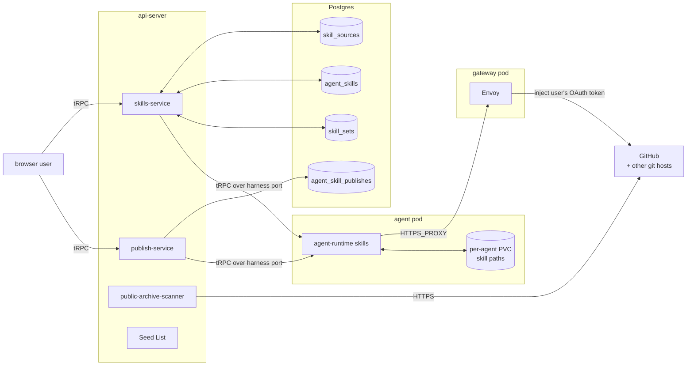
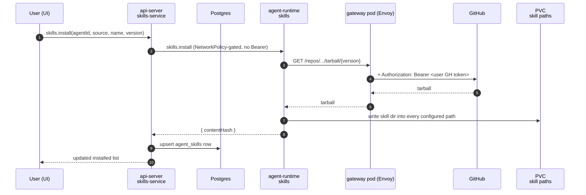
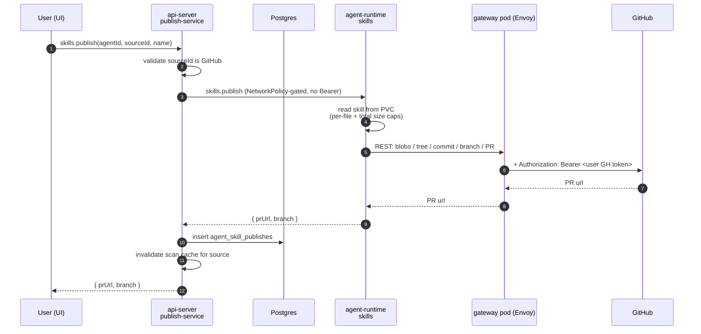

# Skills

Last verified: 2026-09-04

## Overview

A **skill** is a directory containing a `SKILL.md` manifest (YAML frontmatter — `name`, `description`) plus supporting files. Platform does not interpret skills; it **transports** them between external git repositories and the per-agent PVC, where the harness reads them from configured paths. Sources are external git repos — there is no Platform-hosted catalog.

The subsystem splits across two bounded contexts ([`docs/ubiquitous-language.md`](../ubiquitous-language.md)), one page each:

- **api-server side — this page.** Owns the catalog: which sources are connected, which skills are installed where, and what was published from which agent. All of it is api-server-only Application State and lives in Postgres or in api-server config. The api-server never touches a pod's filesystem directly.
- **agent-runtime side — [agent-skills](agent-skills.md).** Owns the pod-local files: scanning a source, materializing a skill into the configured paths, walking the disk to enumerate local skills, and publishing a local skill upstream. It also owns Skill Path and Skill Origin, the provenance verdict every Local Skill carries.

The two contexts share the agent-runtime as the only path that reaches a pod, and the paired gateway pod as the only path that reaches GitHub with credentials. Everything else is a tRPC call between them.

## Diagram

The api-server scans **public** GitHub catalogs directly (no credentials needed) and falls back to agent-runtime for everything else. agent-runtime is the only component that talks to GitHub with credentials, and it does so without holding any: the request leaves the agent pod through the paired gateway pod, where Envoy injects the owner's GitHub token from a K8s Secret on the wire ([security-and-credentials](security-and-credentials.md)).

## Concepts

### Skill Source

A connection to an external git repository, addressable by id. Three kinds, all merged into a single list at read time and badged in the UI:

- **User source** — a row in Postgres (`skill_sources`), owner-scoped. Created and deleted by the user via tRPC.
- **System source** — a Helm-declared platform-wide entry from `skills.skillSources` ([`deploy/helm/platform/values.yaml`](../../deploy/helm/platform/values.yaml)). Loaded into api-server config from the `SKILL_SOURCES_SEED` env at boot, never persisted to Postgres. Marked `system: true` and protected from deletion. Badged "Platform".
- **Template source** — declared on a template's `spec.skillSources`. Surfaced read-only on every agent derived from that template. Badged "Agent".

Listing dedupes on `gitUrl` with first-wins precedence: user → system → template. A user creating a custom source for the same URL shadows the system entry; deleting the user row exposes the system entry again.

A source may carry an optional repo-relative **path** — a subdirectory the scanner walks instead of the defaults. When set, that directory is scanned (and skills resolved) exclusively, bypassing the [Source Roots](#source-roots) union and top-level fallback — and failing by name when it resolves to nothing, whichever scanner answers: no such directory, or no skill under it; when absent, resolution is unchanged. Path is a property of the source, resolved server-side; it is denormalized onto each installed ref (`agent_skills`) so the apply path resolves the skill dir without re-reading the source. One path per `(owner, gitUrl)`; changing it is delete + re-add.

### Skill, Installed Skill Ref, Local Skill

A **Scanned Skill** is what a scan reports about one skill in a Source, from either scanner: its identity, a `version` that is the source's HEAD commit SHA, a `contentHash` that is a deterministic SHA-256 over the skill directory (what drift detection compares), and the repo-relative directory it was found in (whichever [Source Root](#source-roots) that came from — what a pinned single-file read needs to locate it). A pod predating that last field reports none, which is why the api-server's own shape keeps it optional. The field-level shape lives in the contract package ([`packages/api-server-api/`](../../packages/api-server-api/)).

An **Installed Skill Ref** is a row in `agent_skills` keyed `(agentId, source, name)` recording which Scanned Skill is installed at which Version on which Agent. The on-disk directory at the configured Skill Paths is the source of truth for "what is installed" — the Postgres row is a declarative record that self-heals on each `state` query.

A **Local Skill** is a directory present in some [Skill Path](agent-skills.md#skill-path) on the pod, regardless of how it got there; the pod judges its [Skill Origin](agent-skills.md#skill-origin) at the same time. The reconciled `state` view splits Locals into:

- **Installed** — also tracked in `agent_skills`. Drift surfaces when its Postgres `contentHash` differs from the upstream scan's `contentHash`.
- **Standalone** — on disk but not tracked. Authored in place via the Files panel, uploaded as Markdown files, seeded from the image at first boot, or copied in by an Agent Kind's Install Command at create ([experiments](experiments.md) installs its authoring skill that way). A matching `agent_skill_publishes` row gives it a badge whose label is the pull request's **resolved state** — `Draft`, `Open`, `Merged`, `Closed`, or `Submitted` when the state isn't known — so the badge is a claim about the pull request, not merely about the row's existence. `Publish again` is offered in the `Closed` state only, where nothing landed upstream. There is still no install toggle; a **merged** standalone skill instead offers a `Track from {source}` kebab action, which hands it to the source and turns it into an Installed Skill Ref governed by the normal drift loop. That action is not the install toggle this section rejects — it is a one-way, explicitly confirmed governance handover. De-duplication is separate and deliberately looser: whenever a published skill's local copy is byte-identical to the content its source now serves, that source's own entry is suppressed so the page doesn't list one file twice. It keys on the publish record plus hash equality rather than on the resolved `merged` state, because the resolved state is only a lagging proxy for "the content is upstream" — gating on it would leave the duplicate visible from the moment a pull request merges until the resolver next looks. Tracking keeps the stricter `merged` gate, since it overwrites the local copy.

The reconciled `state` read has a consumer beyond the Skills surface: the Experiments destination gates a fresh experiment agent's onboarding greeting on its authoring skill being reported present, which is how it avoids running a command whose Install Command has not landed yet. A skill's bucket is not stable — tracking one moves it from Standalone to Installed — so a reader asking "is this skill on disk" must consider both.

### Skill Publish Record

A **Skill Publish Record** (`agent_skill_publishes`) is the explicit log of a successful publish: skillName, sourceId, prUrl, plus the source name and gitUrl denormalized so the record stays usable after the source is renamed or deleted. The row's existence is what gives the skill a badge at all — replacing a name-match heuristic that produced false positives — while the resolved `prState` alongside it is what the badge *says*.

**Resolving that state.** `prState` is filled in by a periodic job rather than by the `state` query, so GitHub cost tracks the number of unresolved pull requests rather than how many users have the Skills page open. Each unresolved record is attempted at most hourly — the cadence that holds the anonymous 60-requests/hour-per-IP ceiling up to roughly fifty concurrently unresolved records, with scheduling sophistication deliberately deferred until reality demands it. An attempt is one **anonymous** read from the api-server — which preserves the invariant below, since anonymous is not "with credentials" — escalating on a `404` (private as much as gone) to the publishing agent's own pod, where the paired gateway injects the owner's token. Only pods **already warm** answer: a badge is never worth waking a hibernated agent. The in-product preview escalates the same way but deliberately **does** wake, because it serves a request a user made (see [api-server skills service](#api-server-skills-service)). `merged` and `closed` are terminal — once observed they are persisted and never re-read, so the badge only ever gets more accurate. Conditional requests are **not** a budget mechanism: an anonymous `304` is charged exactly like a `200`, so an ETag saves bandwidth only.

### Platform Skill

A **platform skill** is one the platform ships to make a feature usable. It is a reading over the pod's [Skill Origin](agent-skills.md#skill-origin) verdict, not a fourth value: the skill must be judged `system` or `system-modified` against the image **and** carry a name in the **platform skill registry**, a static skill-name-to-feature map in the contract package ([`platform-skills.ts`](../../packages/api-server-api/src/modules/skills/platform-skills.ts)). The registry lives here rather than on the pod because agent-runtime never consults it — it reports the verdict, and this side decides what the verdict means.

Both halves are load-bearing. A name is only a directory on the agent-writable PVC, so a user skill squatting on a registry name is judged `user` and never borrows the badge; origin alone cannot separate a feature's skill from an image's own built-in. Keeping the map in code rather than in a marker or a row is what keeps provenance judged against the image.

That one map is what both surfaces read. The Skills surface groups Local Skills three ways — what the user authored here, what a platform feature owns, and what is left of the image — badges each platform skill with its feature, and presents the group as platform-managed, with no edit or delete affordance. Each feature that ships a skill names it in turn; a feature that ships none says nothing, because the note exists to explain what turning a feature on changed.

Two limits follow from the mechanism. A platform skill is listed whether or not its feature is switched on, because the panel is a truthful view of what sits in the Skill Paths. And a skill installed after first boot from outside the image has no pristine counterpart, so it still reads as user-authored — the registry cannot rescue it.

### Skill Set

A per-user, named selection of skills (`skill_sets`, owner-scoped, names unique per owner) — so configuring an agent's skills is not manual work repeated from memory on each new one.

A set stores **`(gitUrl, name)` pairs only**. The git URL, not the source id, because a set must survive its source row being deleted and re-added — and it is the identity `agent_skills` installs on, so two sources that both carry an `xlsx` stay distinct. No version: an apply resolves each entry against the source's current scan, so an old set installs what the source serves today. Only source-backed skills are representable — a Standalone or image-shipped skill has nowhere to install *from*.

**Applying a set is additive by construction**: it installs what is missing and never uninstalls, enforced where the apply is assembled rather than trusted to callers. So applying one twice is a no-op, and two sets sharing a skill install it once. A skill already on is left at whatever revision it sits on — adopting a newer one is the drift path's own explicit action, never a side effect of adding a set. Entries it cannot apply are reported as closed-set verdicts rather than dropped: the source isn't connected here, is connected but unreadable, or no longer serves that name. An unreadable source blocks only its own entries — everything reachable still applies.

Names reuse the Connection name rule from one shared definition. Renaming is absent: a typo means deleting the set and saving it again, from the same dialog that adds one. An apply is bounded by the union it resolves, so a selection larger than one batch is refused before any source is read rather than part-way through.

### Source Roots

A scan reads a Source's repo from a fixed, ordered set of **source roots** — the directory layouts a repo may use to hold skills: `skills/`, then `.claude/skills/`, then `.agents/skills/`. A scan **unions** the skills found across all of them, so a repo that mixes layouts still surfaces every skill. Top-level `*` is a **fallback only** — consulted when none of the deliberate roots yielded a skill — so a repo that organizes under `skills/` is never polluted by unrelated top-level directories that happen to carry a `SKILL.md`. Discovery is one level deep per root; there is no recursive walk.

The union is then **deduped by Skill name** (`name` frontmatter, else the directory basename — the same identity `agent_skills` and install key on), first-found-wins in root order. Name, not raw path, is the identity because the on-pod store is a flat name-keyed directory and the catalog row is keyed on name: two same-named directories are not separately representable, so the earlier root wins and the later one is dropped (and logged). This collapses the common case where a repo symlinks one root to another (e.g. `.claude/skills` → `.agents/skills`): both roots enumerate the same real skill, and dedupe yields a single entry. Per-skill symlinks are still skipped — only real directories are scanned.

The ordering lives in one place shared by both scanners and the install-time resolver ([`packages/agent-runtime-api/`](../../packages/agent-runtime-api/)), so the api-server's public-archive scan, the agent-runtime clone scan, and install resolution can never disagree on precedence.

## api-server skills service

Lives in [`packages/api-server/src/modules/skills/`](../../packages/api-server/src/modules/skills/). Owns:

- The **Skill Source catalogue** — CRUD on user sources, merging in system seeds and template sources, dedupe and badge resolution.
- The **scan cache** — keyed by the source *and* by the access that produced the scan, 5-minute TTL. An uncredentialed scan is reused for everyone; one that ran under an agent's credentials is reused only for that agent. The credentialed scope is per **agent**, not per user, because connections are granted one agent at a time — two agents of the same owner can see different repositories, and sharing an entry between them would hand one a list its own credentials could never fetch, and then fail to install from. Scoping is part of the key rather than a check over a shared slot, so two readers of one private source hold separate entries instead of evicting each other — and nothing stands between a lookup and another reader's list but the key itself. Only credentialed scans multiply this way; a public source stays on the single shared entry. Each entry records the time of the upstream read it came from, so a source card can show how fresh its list is. `sources.refresh` and a successful publish invalidate every scope's entry for that source at once — the upstream moved, which is true whoever read it. The cache is per-replica and in-memory, but an invalidation fans out to every replica over the shared Redis bus; the signal is advisory — a replica that misses it serves its entry until the TTL expires.
- **Public-archive scanning** — for `github.com` URLs, downloads `archive/HEAD.tar.gz` directly from GitHub, enumerates skills across the [Source Roots](#source-roots) (or the source's `path` when set), parses frontmatter, computes `contentHash`. No credentials required. This is the path that lets the catalog UI render even when no agent is running.
- **SKILL.md content read** (`getSkillContent`) — serves one skill's raw `SKILL.md` for the in-product preview. It resolves the skill's directory and commit from the same scan dispatch `list` uses, then fetches that one file pinned at that commit, so a preview costs no repo download and renders the revision the catalog listed. Which side issues the fetch follows which side answered the scan: a public source is read anonymously from the api-server, a private one from the pod, where the paired gateway injects the owner's token. The private branch therefore inherits that dispatch's wake — a preview of a private source **starts a hibernated agent** rather than refusing, the opposite of the publish badge's never-wakes rule ([Skill Publish Record](#skill-publish-record)). A non-GitHub source returns `NOT_IMPLEMENTED`: the pinned single-file read is GitHub-only. A Local Skill has no source and no commit to pin, so the Read Local passthrough below answers its preview instead.
- **Private / non-GitHub fallback** — falls through to the agent-runtime `skills.scan` over the harness port. Needs the credential path's paired gateway pod, so it **wakes a hibernated agent** via the shared `ensureReady` primitive rather than refusing (still requires an `agentId` to target).
- **Install / uninstall orchestration** — wakes a hibernated agent before recording the change, then upserts the `agent_skills` row and bumps the outbox; the unified apply worker applies it onto the (now-warm) pod. The api-server is the only pod whose NetworkPolicy can reach the agent's tRPC listener; no Bearer token is sent. A **batch** variant takes many installs and uninstalls together and is the path every bulk action uses: because install is declarative, N changes cost N row writes but **one** outbox bump, so a bulk action settles once instead of once per skill. The security log stays per skill — "what did this agent install, from where" has to remain answerable after an incident, and one aggregate line loses that. A batch naming the same skill in both directions is refused outright rather than resolved to a winner.
- **Create Local orchestration** — wakes a hibernated agent via `ensureReady`, delegates the write to agent-runtime `writeLocal`, and security-logs it. Records no catalog row: an uploaded skill is a standalone Local Skill by design, so the reconciled `state` read picks it up on the next poll — no `agent_skills` row, no outbox bump. A pod-side collision comes back as `CONFLICT` and is passed through with its message (the offending names) intact.
- **Read Local passthrough** — wakes a hibernated agent, then forwards agent-runtime's files and caps verdict unchanged (the pod's `NOT_FOUND` / `PAYLOAD_TOO_LARGE` surface as-is). Persists nothing and is deliberately unlogged — the Files panel already serves arbitrary pod file content unlogged, so a skill read is strictly less. The browser has two consumers for that result: a download — a single `.md` for a lone `SKILL.md`, else a `.zip` whose entries sit under the skill's directory — and the in-product preview of a Local Skill, standalone or image-shipped, which renders the `SKILL.md` out of the same files. That makes a Local Skill the expensive half of preview: it pays for the whole skill directory where a source-backed preview reads one pinned file, and a directory over the caps refuses the preview outright rather than degrading it.
- **Delete Local orchestration** — wakes a hibernated agent via `ensureReady`, refuses a name tracked in `agent_skills` with `CONFLICT` (uninstall is that skill's removal path), delegates the removal to agent-runtime `deleteLocal`, and security-logs it. Records no catalog row — no row write, no outbox bump, and `agent_skill_publishes` rows are left intact: a publish record logs an event that really happened and a PR that still exists upstream, reaped only by the `AgentDeleted` cleanup saga. Returns the remaining standalone list so the UI renders from an authoritative result.
- **Publish orchestration** ([`publish-service`](../../packages/api-server/src/modules/skills/services/publish-service.ts)) — validates that the source is a GitHub URL (only host that supports publish), refuses untouched system skills (see [Skill Origin](agent-skills.md#skill-origin)), wakes a hibernated agent, calls agent-runtime, and on success writes the `agent_skill_publishes` row and invalidates the scan cache for that source.
- **MCP tools** — five tools registered on the per-agent MCP endpoint ([`mcp-endpoint.ts`](../../packages/api-server/src/apps/harness-api-server/mcp-endpoint.ts)): `list_skill_sources`, `list_skills_in_source`, `install_skill`, `uninstall_skill`, `publish_skill`. `agentId` is bound by the verified MCP session token, not user input — agents cannot spoof which agent they're acting on.
- **Reconciled `state` view** — joins live `listLocal` from agent-runtime with the `agent_skills` rows, drops ghost rows whose directories were deleted out-of-band (once the pod has caught up), and folds in the `agent_skill_publishes` rows.
- **Cleanup saga** — subscribes to `AgentDeleted` and deletes both `agent_skills` and `agent_skill_publishes` rows for the deleted agent. User-owned `skill_sources` and `skill_sets` are unaffected; they outlive any single agent.

## Flows

### Install

Public-source installs work identically except Envoy's filter chain has no credential to inject (no token swap, anonymous archive download).

### Publish

GitHub errors (missing scope, repo not found) surface to agent-runtime as the upstream's HTTP response; the api-server forwards them verbatim into the tRPC error so the UI can render the right CTA.

### Listing & scan

`skills.sources.list(agentId?)` merges the three Source kinds and returns `canPublish: true` only for GitHub URLs.

`skills.list(sourceId, agentId?)` returns a source's scanned skill list; a sibling read returns the same list plus the scan's own metadata — when it was read from upstream, and whether the repository is public — so a source card can date its list and mark a private one. Both resolve the source and dispatch:

- **Public GitHub** → `public-archive-scanner` from the api-server, served from the per-`gitUrl` cache when fresh. No agent required.
- **Anything else** → agent-runtime `skills.scan`. Requires an `agentId` (surfaces a clear error if missing) and **wakes a hibernated agent** via the shared `ensureReady` primitive before scanning.

This dispatch is one piece of code, shared with the content read — so a preview can never resolve a source differently from the list it was opened from.

Which branch answered is also what settles **visibility**: the archive serves only public repositories, so an answer from it proves public, and falling through its 404 into the pod proves private. A host the archive is never asked about stays unknown rather than being inferred from the branch that answered it.

**Every scan failure leaves that dispatch as a named verdict** — a `ScanFailure` of `{ code, title, detail }`, carried structurally on the error. The set of verdicts is closed, and the dispatch classifies into it exhaustively: anything it does not recognize becomes the generic verdict, with the real error logged server-side rather than sent. Carrying the verdict structurally rather than in the message is what lets a client distinguish a conclusion the server reached from a transport failure that never got there — the latter arrives with no `scanFailure` at all, and the client substitutes its own generic copy instead of rendering whatever string it holds. `message` stays a readable sentence for the consumers that only have it, notably the CLI.

Two of those verdicts describe the same 401/404 from GitHub and are told apart by a different signal: whether the agent's granted connections inject a credential for `api.github.com` at all. Without one, no repo is reachable and the verdict names the missing connection; with one, the repository itself is out of the grant. The gateway cannot make that distinction — an unswapped credential sentinel and a revoked token look identical to it — so the answer is read from the agent's connections, and only after a scan has already failed.

The cache is invalidated on `sources.refresh` and after every successful publish to that source — the latter so a freshly-merged PR shows up on the next list. The in-product content read shares this cache, so an invalidation also updates which revision a preview renders.

### Reconciled state

`skills.state(agentId)` is the single read the UI uses to render the Skills panel. It composes:

- `listLocal` from agent-runtime — what's actually on disk, deduped across Skill Paths.
- The `agent_skills` and `agent_skill_publishes` rows for the agent.

Then it drops "ghost" rows (tracked rows whose directory has been deleted out-of-band) and persists the cleanup. The Postgres rows stop drifting from the filesystem without requiring a separate reconciler — every read is the reconciler.

Two things qualify that. **The local list is not durable** — installed refs live in Postgres and survive the pod going away, but local skills exist only on the PVC. So `state` records the list it computed while the agent ran, and serves that recording — dated, and marked as a snapshot — while the pod is unreachable. Nothing recorded means the agent has never run, which is distinct from having no local skills. A snapshot never drives reconciliation; it is not evidence about the current disk. **And reaping waits for the pod to catch up** — install is declarative, so a freshly-installed skill's directory is legitimately absent until the apply fetches it, and reaping then would not merely lose the install: the reap re-delivers, so the pod removes the files it just fetched. A row is a ghost only on evidence from one moment that the pod has **cleanly applied** the current version ([runtime channel](runtime-delivery.md#the-runtime-channel)) — a failed apply settles without applying — and only once the row is old enough to have been delivered at all, an age that every write to the row renews. The delete and its re-delivery bump commit together, or the pod keeps an applied hash naming a set that no longer exists. The cost is an out-of-band deletion noticed one read later.

## Persistence touchpoints

Skills are entirely an **Application State** subsystem ([persistence](persistence.md)). Four Postgres tables in [`packages/db/src/schema.ts`](../../packages/db/src/schema.ts):

| Table | Key | Owner |
|---|---|---|
| `skill_sources` | `(id)`, unique on `(owner, gitUrl)` | per-user |
| `skill_sets` | `(id)`, unique on `(owner, name)` | per-user |
| `agent_skills` | `(agentId, source, name)` | per-agent |
| `agent_skill_publishes` | `(id)`, indexed by `agentId` | per-agent |

System and template sources do **not** persist — system sources come from `SKILL_SOURCES_SEED`, template sources from the template's `spec.skillSources`. Both are computed at request time.

The snapshot of the local list is not a table of its own: it hangs off the agent's own registry row, so agent deletion reaps it and the cleanup saga has nothing extra to do.

The on-pod state lives on the per-agent PVC under the configured Skill Paths. PVC reclamation on agent deletion ([persistence § Lifetime](persistence.md#lifetime)) takes care of the file-side cleanup; the Skills cleanup saga handles the row-side. User-owned `skill_sources` and `skill_sets` survive agent deletion — they are catalog connections and named selections, not agent state.

## Invariants

- **Filesystem is authoritative for installed state — once the pod has caught up.** `agent_skills` is a declarative record that self-heals on every `state` read whose agent has cleanly applied. A skill removed via the Files panel disappears from the UI without any explicit uninstall. While an apply is in flight the filesystem is not yet evidence about what was just requested, so the self-heal waits.
- **api-server never touches the pod filesystem.** Every disk-touching operation goes through agent-runtime over its tRPC port; the agent pod's NetworkPolicy admits ingress only from the api-server pod, so no in-process auth is needed on that hop.
- **MCP `agentId` is server-bound.** The per-agent MCP endpoint authenticates the agent against the agent ConfigMap's `accessTokenHash` ([channels](channels.md)) and pins the `agentId` from the verified token, not from tool input.

The pod-side invariants — provenance judged against the image, agent-runtime never holding a GitHub credential, publish being REST-only — are stated on [agent-skills](agent-skills.md#invariants).
