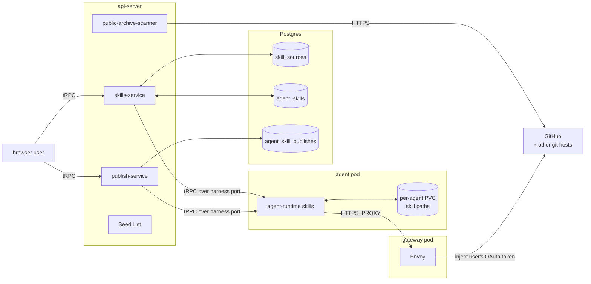
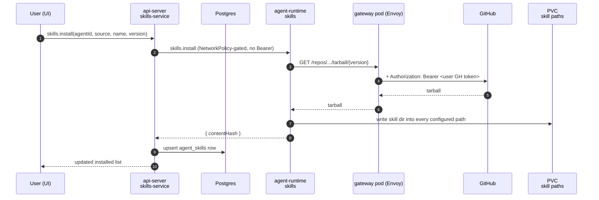
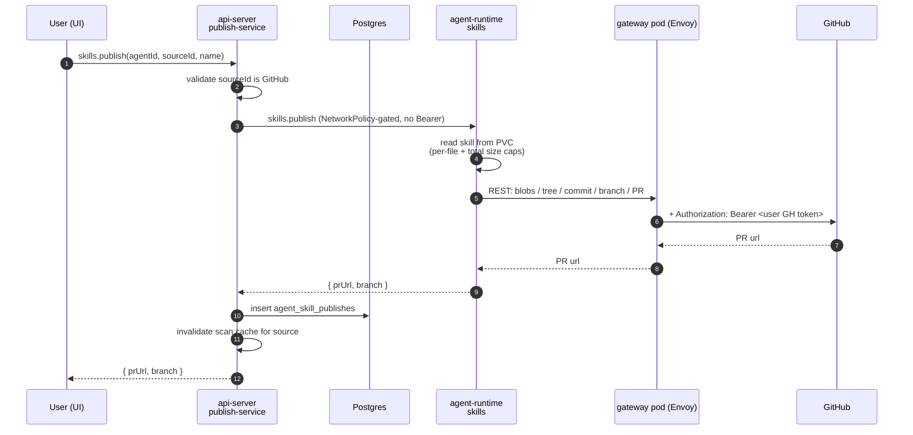

# Skills

Last verified: 2026-08-05

## Overview

A **skill** is a directory containing a `SKILL.md` manifest (YAML frontmatter — `name`, `description`) plus supporting files. Platform does not interpret skills; it **transports** them between external git repositories and the per-agent PVC, where the harness reads them from configured paths. Sources are external git repos — there is no Platform-hosted catalog.

The subsystem splits cleanly across two bounded contexts ([`docs/ubiquitous-language.md`](../ubiquitous-language.md)):

- **api-server side** — owns the catalog: which sources are connected, which skills are installed where, and what was published from which agent. All of it is api-server-only Application State and lives in Postgres or in api-server config. The api-server never touches a pod's filesystem directly.
- **agent-runtime side** — owns the pod-local files: scanning a source, materializing a skill into the configured paths, walking the disk to enumerate local skills, and publishing a local skill upstream. It never reasons about catalogs, drift, or which user owns what.

The two contexts share the agent-runtime as the only path that reaches a pod, and the paired gateway pod as the only path that reaches GitHub with credentials. Everything else is a tRPC call between them.

## Diagram

The api-server scans **public** GitHub catalogs directly (no credentials needed) and falls back to agent-runtime for everything else. agent-runtime is the only component that talks to GitHub with credentials, and it does so without holding any: the request leaves the agent pod through the paired gateway pod, where Envoy injects the owner's GitHub token from a K8s Secret on the wire ([security-and-credentials](security-and-credentials.md)).

## Concepts

### Skill Source

A connection to an external git repository, addressable by id. Three kinds, all merged into a single list at read time and badged in the UI:

- **User source** — a row in Postgres (`skill_sources`), owner-scoped. Created and deleted by the user via tRPC.
- **System source** — a Helm-declared platform-wide entry from `skills.skillSources` ([`deploy/helm/platform/values.yaml`](../../deploy/helm/platform/values.yaml)). Loaded into api-server config from the `SKILL_SOURCES_SEED` env at boot, never persisted to Postgres. Marked `system: true` and protected from deletion. Badged "Platform".
- **Template source** — declared on a template's `spec.skillSources`. Surfaced read-only on every agent derived from that template. Badged "Agent".

Listing dedupes on `gitUrl` with first-wins precedence: user → system → template. A user creating a custom source for the same URL shadows the system entry; deleting the user row exposes the system entry again.

A source may carry an optional repo-relative **path** — a subdirectory the scanner walks instead of the defaults. When set, that directory is scanned (and skills resolved) exclusively, bypassing the [Source Roots](#source-roots) union and top-level fallback; when absent, resolution is unchanged. Path is a property of the source, resolved server-side; it is denormalized onto each installed ref (`agent_skills`) so the apply path resolves the skill dir without re-reading the source. One path per `(owner, gitUrl)`; changing it is delete + re-add.

### Skill, Installed Skill Ref, Local Skill

A **Scanned Skill** is what an api-server scan reports about one skill in a Source: its identity, a `version` that is the source's HEAD commit SHA, a `contentHash` that is a deterministic SHA-256 over the skill directory (what drift detection compares), and the repo-relative directory it was found in (whichever [Source Root](#source-roots) that came from — what a raw-file URL needs to read it). The field-level shape lives in the contract package ([`packages/api-server-api/`](../../packages/api-server-api/)).

An **Installed Skill Ref** is a row in `agent_skills` keyed `(agentId, source, name)` recording which Scanned Skill is installed at which Version on which Agent. The on-disk directory at the configured Skill Paths is the source of truth for "what is installed" — the Postgres row is a declarative record that self-heals on each `state` query.

A **Local Skill** is a directory present in some Skill Path on the pod, regardless of how it got there. The reconciled `state` view splits Locals into:

- **Installed** — also tracked in `agent_skills`. Drift surfaces when its Postgres `contentHash` differs from the upstream scan's `contentHash`.
- **Standalone** — on disk but not tracked. Authored in place via the Files panel, uploaded as Markdown files, seeded from the image at first boot, or copied in by an Agent Kind's Install Command at create ([experiments](experiments.md) installs its authoring skill that way). A matching `agent_skill_publishes` row gives it a badge whose label is the pull request's **resolved state** — `Draft`, `In review`, `Published` (merged), `Closed`, or `Submitted` when the state isn't known — so the badge is a claim about the pull request, not merely about the row's existence. `Publish again` returns beside the badge in the `Closed` state only, where nothing landed upstream. There is still no install toggle; a **merged** standalone skill instead offers a `Track from {source}` kebab action, which hands it to the source and turns it into an Installed Skill Ref governed by the normal drift loop. That action is not the install toggle this section rejects — it is a one-way, explicitly confirmed governance handover. De-duplication is separate and deliberately looser: whenever a published skill's local copy is byte-identical to the content its source now serves, that source's own entry is suppressed so the page doesn't list one file twice. It keys on the publish record plus hash equality rather than on the resolved `merged` state, because the resolved state is only a lagging proxy for "the content is upstream" — gating on it would leave the duplicate visible from the moment a pull request merges until the resolver next looks. Tracking keeps the stricter `merged` gate, since it overwrites the local copy.

The reconciled `state` read has a consumer beyond the Skills surface: the Experiments destination gates a fresh experiment sandbox's onboarding greeting on its authoring skill being reported present, which is how it avoids running a command whose Install Command has not landed yet. A skill's bucket is not stable — tracking one moves it from Standalone to Installed — so a reader asking "is this skill on disk" must consider both.

### Skill Origin

Every Local Skill carries a **provenance** verdict, judged by the agent-runtime at read time. The reference is the set of **pristine roots** in the image — exactly two sanctioned locations, both immutable and always in-pod, so no build-time manifest or on-PVC marker is needed (a marker was tried and reverted — third-party baked skills aren't ours to stamp, and the PVC is agent-writable anyway):

1. the **pristine workspace copy** — the directory the first-boot init seeds onto the PVC and never touches again, and
2. the **staged-skills dir** — the one place images put system skills that must *not* reach every sandbox (an Agent Kind's Install Command copies them onto the PVC at create; the shared constant lives in the agent-runtime contract package).

This is a deliberate convention, not a growing list: an image-shipped skill anywhere else will misclassify as user-authored, so new features ship their skills through one of these two locations.

A Local Skill whose directory (with a `SKILL.md`) also exists in a pristine root is **system** when the content hashes match, **system-modified** when they differ (the user edited it, or a template upgrade moved the image ahead of the seeded copy); one with no pristine counterpart is **user**. Identity is the directory name — the same identity install and dedupe key on. A local copy that cannot be hashed (unreadable file, deletion racing the listing) degrades to system-modified rather than failing the listing. The UI segregates system skills from "Created in this sandbox" so that group only shows what the user authored, and the api-server refuses to publish **any** image-shipped skill, modified or not — divergence (a user edit, or an image upgrade) doesn't transfer ownership, so the gate cannot be disarmed by editing a file or by a routine image bump. A skill tracked as an Installed Skill Ref is exempt from that gate: install overwrites its directory, so it always diverges from a same-named baked copy, and it is governed by its Source relationship — publish back to the source keeps working. A pod predating origin classification reports no origin, which readers treat as user — the pre-provenance behavior.

A **Skill Publish Record** (`agent_skill_publishes`) is the explicit log of a successful publish: skillName, sourceId, prUrl, plus the source name and gitUrl denormalized so the record stays usable after the source is renamed or deleted. The row's existence is what gives the skill a badge at all — replacing a name-match heuristic that produced false positives — while the resolved `prState` alongside it is what the badge *says*.

**Resolving that state.** A publish record also carries `prState`, the last attempt's timestamp, and an ETag, filled in by a periodic job rather than by the `state` query — so GitHub cost tracks the number of unresolved pull requests, not how many users have the Skills page open. The job's tick runs two passes over two disjoint lanes. The **anonymous lane** reads public sources from the api-server, which preserves the invariant below: anonymous is not "with credentials", so no credential moves. A private source's pull request is invisible that way, so the first `404` marks its record as unresolvable anonymously (`pr_needs_pod`) and moves it to the **pod lane** for good: it is then read only through a publishing agent's own pod, where the paired gateway injects the owner's token — and only ever through a *warm* pod. Publishers are filtered by actual pod state before any attempt, so the escalation **never wakes a hibernated agent** — a badge is not worth spending the user's compute unasked — and a record whose publishers are all asleep is simply skipped: no clock moves, no failure counts, and the record keeps its place until a warm sample happens. That is acceptable because `merged` and `closed` are terminal: once observed they are persisted and never re-read, so the badge only ever gets more accurate. Cost is held inside the anonymous 60-requests/hour-per-IP ceiling by excluding terminal states and the entire pod lane from the anonymous candidate query and re-checking any one record at most hourly. The working set drains two ways: a record whose attempts keep *failing* — a URL that is not a pull request, a warm pod that keeps 404ing a deleted repo — backs off exponentially to at most daily and is eventually retired outright, while a record waiting on cold publishers resolves at the first warm sample or is deleted with its agent (the skills cleanup saga), so nothing holds a slot forever. Conditional requests are **not** part of that budget: an anonymous `304` is charged exactly like a `200`, so the ETag saves bandwidth only.

### Skill Path

An absolute on-pod directory the harness reads skills from — the `skill-ref` driver's `paths` in the agent's runtime manifest. The agent-runtime resolves it for both install and the read-side views (listLocal / publish); the api-server never passes paths over the wire. Every image inherits the default path declared in platform-base's [`runtime-manifest.yaml`](../../packages/platform-base/runtime-manifest.yaml).

Each per-agent Dockerfile ([`packages/agents/`](../../packages/agents/)) symlinks its harness-native skills dir onto that canonical store, so the harness reads from its own conventional path while the manifest stays harness-agnostic. An install therefore writes once on disk regardless of harness, and no per-agent manifest override is needed.

Install writes the skill directory into **every** configured Skill Path; uninstall removes it from all of them. Scanning the disk for Local Skills walks every path in order and dedupes by directory name (first found wins).

### Source Roots

A scan reads a Source's repo from a fixed, ordered set of **source roots** — the directory layouts a repo may use to hold skills: `skills/`, then `.claude/skills/`, then `.agents/skills/`. A scan **unions** the skills found across all of them, so a repo that mixes layouts still surfaces every skill. Top-level `*` is a **fallback only** — consulted when none of the deliberate roots yielded a skill — so a repo that organizes under `skills/` is never polluted by unrelated top-level directories that happen to carry a `SKILL.md`. Discovery is one level deep per root; there is no recursive walk.

The union is then **deduped by Skill name** (`name` frontmatter, else the directory basename — the same identity `agent_skills` and install key on), first-found-wins in root order. Name, not raw path, is the identity because the on-pod store is a flat name-keyed directory and the catalog row is keyed on name: two same-named directories are not separately representable, so the earlier root wins and the later one is dropped (and logged). This collapses the common case where a repo symlinks one root to another (e.g. `.claude/skills` → `.agents/skills`): both roots enumerate the same real skill, and dedupe yields a single entry. Per-skill symlinks are still skipped — only real directories are scanned.

The ordering lives in one place shared by both scanners and the install-time resolver ([`packages/agent-runtime-api/`](../../packages/agent-runtime-api/)), so the api-server's public-archive scan, the agent-runtime clone scan, and install resolution can never disagree on precedence.

## Subsystems

### api-server skills service

Lives in [`packages/api-server/src/modules/skills/`](../../packages/api-server/src/modules/skills/). Owns:

- The **Skill Source catalogue** — CRUD on user sources, merging in system seeds and template sources, dedupe and badge resolution.
- The **scan cache** — per-`gitUrl`, 5-minute TTL, invalidated on `sources.refresh` or after a successful publish to that source.
- **Public-archive scanning** — for `github.com` URLs, downloads `archive/HEAD.tar.gz` directly from GitHub, enumerates skills across the [Source Roots](#source-roots) (or the source's `path` when set), parses frontmatter, computes `contentHash`. No credentials required. This is the path that lets the catalog UI render even when no agent is running.
- **SKILL.md content read** (`getSkillContent`) — serves one skill's raw `SKILL.md` (frontmatter + markdown body) for the in-product preview. It resolves the skill's directory and commit from the cached scan, then fetches that one file pinned at that commit — so a preview costs no repo download and renders the same revision the catalog listed. Public sources only; private sources return `NOT_IMPLEMENTED` (preview deferred).
- **Private / non-GitHub fallback** — falls through to the agent-runtime `skills.scan` over the harness port. Needs the credential path's paired gateway pod, so it **wakes a hibernated agent** via the shared `ensureReady` primitive rather than refusing (still requires an `agentId` to target).
- **Install / uninstall orchestration** — wakes a hibernated agent before recording the change, then upserts the `agent_skills` row and bumps the outbox; the unified apply worker applies it onto the (now-warm) pod. The api-server is the only pod whose NetworkPolicy can reach the agent's tRPC listener; no Bearer token is sent.
- **Create Local orchestration** — wakes a hibernated agent via `ensureReady`, delegates the write to agent-runtime `writeLocal`, and security-logs it. Records **nothing** in Postgres: an uploaded skill is a standalone Local Skill by design, so the reconciled `state` read picks it up on the next poll — no `agent_skills` row, no outbox bump. A pod-side collision comes back as `CONFLICT` and is passed through with its message (the offending names) intact.
- **Read Local passthrough** — wakes a hibernated agent, then forwards agent-runtime's files and caps verdict unchanged (the pod's `NOT_FOUND` / `PAYLOAD_TOO_LARGE` surface as-is). Persists nothing and is deliberately unlogged — the Files panel already serves arbitrary pod file content unlogged, so a skill read is strictly less. The browser turns the result into a single `.md` (a lone `SKILL.md`) or a `.zip` whose entries sit under the skill's directory.
- **Delete Local orchestration** — wakes a hibernated agent via `ensureReady`, refuses a name tracked in `agent_skills` with `CONFLICT` (uninstall is that skill's removal path), delegates the removal to agent-runtime `deleteLocal`, and security-logs it. Records **nothing** in Postgres — no row write, no outbox bump, and `agent_skill_publishes` rows are left intact: a publish record logs an event that really happened and a PR that still exists upstream, reaped only by the `AgentDeleted` cleanup saga. Returns the remaining standalone list so the UI renders from an authoritative result.
- **Publish orchestration** ([`publish-service`](../../packages/api-server/src/modules/skills/services/publish-service.ts)) — validates that the source is a GitHub URL (only host that supports publish), refuses untouched system skills (see [Skill Origin](#skill-origin)), wakes a hibernated agent, calls agent-runtime, and on success writes the `agent_skill_publishes` row and invalidates the scan cache for that source.
- **Reconciled `state` view** — joins live `listLocal` from agent-runtime with the `agent_skills` rows, drops ghost rows whose directories were deleted out-of-band (and persists the cleanup), and folds in the `agent_skill_publishes` rows.
- **MCP tools** — five tools registered on the per-agent MCP endpoint ([`mcp-endpoint.ts`](../../packages/api-server/src/apps/harness-api-server/mcp-endpoint.ts)): `list_skill_sources`, `list_skills_in_source`, `install_skill`, `uninstall_skill`, `publish_skill`. `agentId` is bound by the verified MCP session token, not user input — agents cannot spoof which agent they're acting on.
- **Cleanup saga** — subscribes to `AgentDeleted` and deletes both `agent_skills` and `agent_skill_publishes` rows for the deleted agent. User-owned `skill_sources` are unaffected; they outlive any single agent.

### agent-runtime skills service

Lives in [`packages/agent-runtime/src/modules/skills/`](../../packages/agent-runtime/src/modules/skills/). Exposes a Bearer-authenticated tRPC surface (`install`, `uninstall`, `publish`, `scan`, `listLocal`, `readLocal`, `writeLocal`, `deleteLocal`) over the harness port; the api-server is the only caller.

A Local Skill's name **on the wire is its frontmatter `name:` when it has one**, and the pod resolves that name to a directory: exact `<skillPath>/<name>` first, then the first directory whose frontmatter `name:` matches, first-wins in Skill Path order. `writeLocal` is what makes the two diverge — it writes a slug directory and forces frontmatter `name:` to the confirmed display name — so every name-keyed operation (`readLocal`, `deleteLocal`, and therefore Publish) goes through the shared resolver rather than treating the name as a directory. Because Publish reads through the same resolver, a Local Skill whose frontmatter name differs from its directory is publishable.

**Read Local** returns the resolved directory basename alongside the files, so a caller names a download from the on-disk identity instead of re-slugging the display name.

Five responsibilities:

- **Install** — fetches the source at the requested `version`. For GitHub URLs, uses the REST tarball endpoint (anonymous first, retry authenticated on 404 to distinguish "not found" from "private"); for everything else, shallow-clones via `git`. The paired gateway pod injects the owner's GitHub token on the wire when the request hits `api.github.com`. Resolves the named skill's directory from the source's `path/<name>/` when a [path](#skill-source) is set, else by walking the [Source Roots](#source-roots) in order (then top-level); copies it into every configured Skill Path, and returns the deterministic `contentHash`.
- **Scan** — same fetch path; enumerates skills from the source's `path` exclusively when set, else across the [Source Roots](#source-roots) (union, deduped by name, top-level fallback); parses frontmatter, and returns `(name, description, version, contentHash)` for each.
- **Publish** — REST-only. Reads the local skill from disk (size-capped per file and per skill), creates blobs + tree + commit + branch + PR via the GitHub REST API, with author `Platform <platform-publish@users.noreply.github.com>`. Files land under the source's [`path`](#skill-source) subdir when set (so the same source's subdir-exclusive scan finds the published skill), else under `skills/`. Branch naming: `platform/publish-<slug>-<timestamp>`, where the slug is the skill's name reduced to ref-safe characters — a Local Skill's name is a display name, and git refnames forbid spaces. There is no `git push`.
- **Write Local** — validates and materializes user-uploaded Markdown as standalone Local Skills (one skill per file). Each file lands as `<slug>/SKILL.md` in every configured Skill Path, with frontmatter `name:` forced to the confirmed display name (synthesized when absent). Enforces the same size caps as the read side and rejects the whole batch (before writing anything) on any collision — a slug/directory clash or a display-name clash with an existing Local Skill — so an upload never clobbers an installed or in-place-edited skill.
- **Delete Local** — removes a Local Skill's directory from **every** configured Skill Path. Imperative, unlike uninstall: install/uninstall flow declaratively off an `agent_skills` row that a standalone skill by definition **lacks**, so the driver would have nothing to reconcile. A name that resolves to no directory is a no-op, not an error.

When env credentials arrive over the runtime channel, the agent-runtime reacts by running `gh auth setup-git`, so a private-repo `git clone` invoked from inside the pod also routes through `gh` (and therefore through the gateway pod's credential injector) instead of stalling on a username prompt. It deliberately does not run at boot, where credentials aren't available yet.

### Credential injection on the wire

Agent-runtime never holds a real GitHub token. The paired gateway pod performs the swap:

1. The agent pod's `HTTPS_PROXY` is `http://<agent>-gateway:<envoy-port>` — the per-agent gateway Service DNS. The agent pod's NetworkPolicy admits no other route to TCP 80/443, so credential injection is enforced by the cluster, not by the agent honoring an env var. `SSL_CERT_FILE` points at the cluster-issued MITM CA so TLS termination on the gateway succeeds ([security-and-credentials](security-and-credentials.md)).
2. Envoy renders **three** host-specific filter chains for one GitHub OAuth Secret ([issue #219](https://github.com/dam-agents/dam/issues/219)). One Secret, three chains, three auth shapes; the Secret carries a per-host SDS file (`host-<sha8>.sds.yaml`) for each chain to read:
   - `api.github.com` — `Authorization: Bearer <token>` (REST/GraphQL API).
   - `github.com` — `Authorization: Basic base64("x-access-token:<token>")` (the HTTP Basic shape `git` over HTTPS expects, so private `git clone` / `git fetch` / `git push` work with no credential helper).
   - `raw.githubusercontent.com` — `Authorization: Bearer <token>` (private raw-file fetches).
3. agent-runtime makes its API calls without authenticating — Envoy supplies the credential.

If the user has not connected GitHub, no Secret exists and the request leaves authenticated only when the agent has supplied its own token. The agent runtime exposes `PLATFORM_GH_TOKEN_AVAILABLE=true|false` so wrapper scripts can short-circuit instead of making a 401-eliciting request first.

Since credential env moved to the runtime channel, the flag is derived in-pod from the reconciled env rather than stamped on the pod by the controller. It therefore inherits the channel's best-effort first-spawn semantics: on a cold pod it reads `false` until the first env snapshot arrives, then flips to `true` on the harness respawn that follows. A wrapper that short-circuits on `false` may do so during that boot window — treat it as "not yet known," not "permanently absent."

The same path lets `git clone` of a private repo work without any credential being mounted into the agent pod.

## Flows

### Install

Public-source installs work identically except Envoy's filter chain has no credential to inject (no token swap, anonymous archive download).

### Publish

GitHub errors (missing scope, repo not found) surface to agent-runtime as the upstream's HTTP response; the api-server forwards them verbatim into the tRPC error so the UI can render the right CTA.

### Listing & scan

`skills.sources.list(agentId?)` merges the three Source kinds and returns `canPublish: true` only for GitHub URLs.

`skills.list(sourceId, agentId?)` resolves the source and dispatches:

- **Public GitHub** → `public-archive-scanner` from the api-server, served from the per-`gitUrl` cache when fresh. No agent required.
- **Anything else** → agent-runtime `skills.scan`. Requires an `agentId` (surfaces a clear error if missing) and **wakes a hibernated agent** via the shared `ensureReady` primitive before scanning.

The cache is invalidated on `sources.refresh` and after every successful publish to that source — the latter so a freshly-merged PR shows up on the next list. The in-product content read shares this cache, so an invalidation also updates which revision a preview renders.

### Reconciled state

`skills.state(agentId)` is the single read the UI uses to render the Skills panel. It composes:

- `listLocal` from agent-runtime — what's actually on disk, deduped across Skill Paths.
- The `agent_skills` rows for the agent.
- The `agent_skill_publishes` rows for the agent.

Then it drops "ghost" rows (`agent_skills` rows whose directory has been deleted out-of-band, e.g. via the file panel) and persists the cleanup. The Postgres rows stop drifting from the filesystem without requiring a separate reconciler — every read is the reconciler.

## Persistence touchpoints

Skills are entirely an **Application State** subsystem ([persistence](persistence.md)). Three Postgres tables in [`packages/db/src/schema.ts`](../../packages/db/src/schema.ts):

| Table | Key | Owner |
|---|---|---|
| `skill_sources` | `(id)`, unique on `(owner, gitUrl)` | per-user |
| `agent_skills` | `(agentId, source, name)` | per-agent |
| `agent_skill_publishes` | `(id)`, indexed by `agentId` | per-agent |

System and template sources do **not** persist — system sources come from `SKILL_SOURCES_SEED`, template sources from the template's `spec.skillSources`. Both are computed at request time.

The on-pod state lives on the per-agent PVC under the configured Skill Paths. PVC reclamation on agent deletion ([persistence § Lifetime](persistence.md#lifetime)) takes care of the file-side cleanup; the Skills cleanup saga handles the row-side. User-owned `skill_sources` survive agent deletion — they are catalog connections, not agent state.

## Invariants

- **Filesystem is authoritative for installed state.** `agent_skills` is a declarative record that self-heals on every `state` read. A skill removed via the Files panel disappears from the UI without any explicit uninstall.
- **Origin is judged at read time against the image, never recorded.** Nothing on the PVC or in Postgres marks a skill as system — the pristine image copy is the only reference, so provenance works retroactively on every existing agent and survives the PVC being adversarial ([persistence § threat model](persistence.md)).
- **api-server never touches the pod filesystem.** Every disk-touching operation goes through agent-runtime over its tRPC port; the agent pod's NetworkPolicy admits ingress only from the api-server pod, so no in-process auth is needed on that hop.
- **agent-runtime never holds a GitHub credential.** Every authenticated GitHub call leaves the agent unauthenticated; Envoy in the paired gateway pod injects `Authorization: Bearer <user OAuth token>` from the owner's K8s Secret on the wire. A compromised agent pod cannot exfiltrate the user's GitHub token because the token is never mounted into the agent pod — only the gateway pod, and the agent pod's NetworkPolicy admits no route to GitHub other than through that gateway.
- **Publish is REST-only.** No `git push` on the publish path. `git` is used only for cloning non-GitHub sources during install/scan, and that path also routes through the gateway pod's credential injector via `gh auth setup-git`.
- **MCP `agentId` is server-bound.** The per-agent MCP endpoint authenticates the agent against the agent ConfigMap's `accessTokenHash` ([channels § Auth without an admin login](channels.md#auth-without-an-admin-login)) and pins the `agentId` from the verified token, not from tool input.
