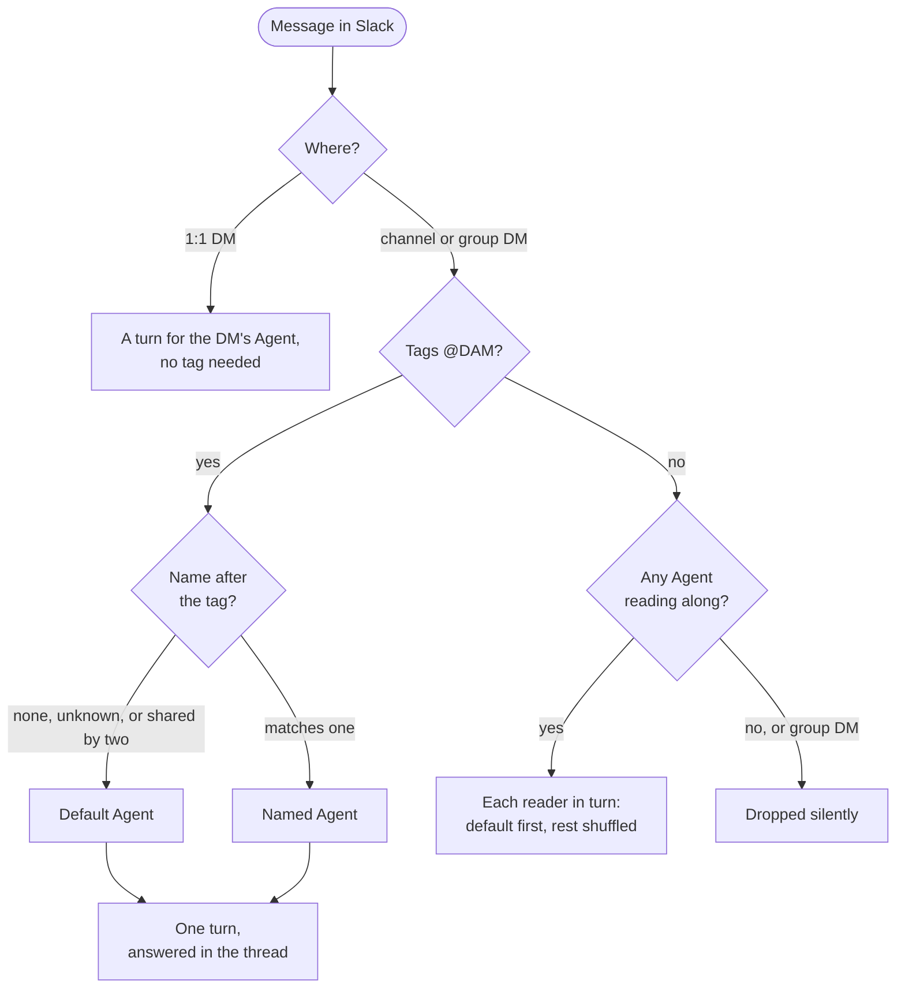
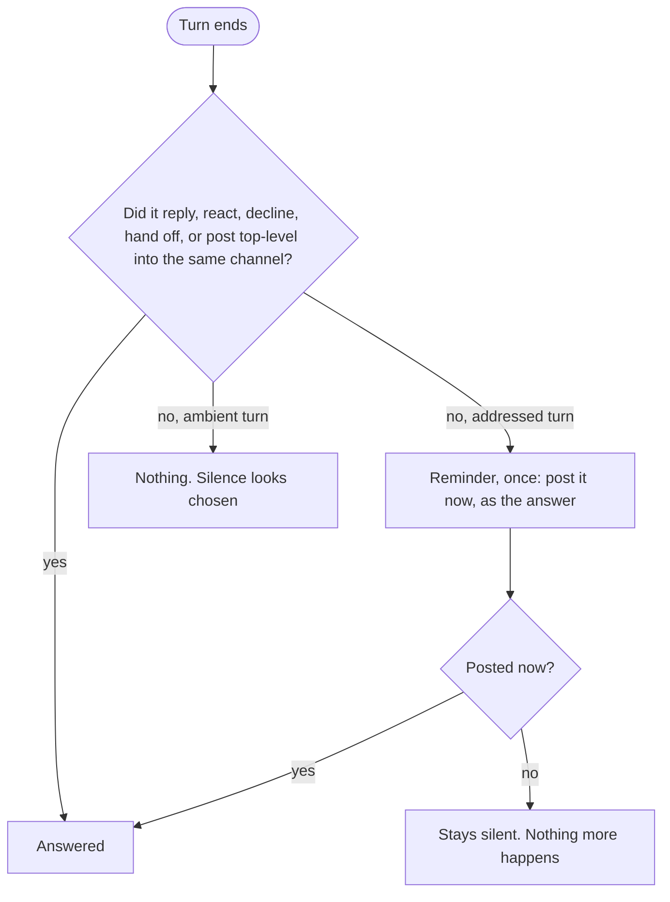

# Slack: what is guaranteed, what is the agent's call, what depends on setup

Last verified: 2026-10-10

Companion to [channels](channels.md) and [channel-turns](channel-turns.md). Those pages own the mechanics; this one states, for each thing an agent does in Slack, whether the outcome is guaranteed, the agent's judgement, or dependent on setup. A change to Slack behavior updates all three in the same PR. It also serves as the source for a shareable page or deck: the "decided by" and drawback columns map to colored labels, and the two diagrams render as they are.

- [0. Ways to slack](#0-ways-to-slack)
- [1. Usage modes](#1-usage-modes)
- [2. Reach: bot vs. owner's account](#2-reach-bot-vs-owners-account)
- [3. Who decides what](#3-who-decides-what)
- [4. "It looks broken"](#4-it-looks-broken)
- [5. Reach the owner may not expect](#5-reach-the-owner-may-not-expect)
- [6. Settings that change behavior](#6-settings-that-change-behavior)
- [7. Several workspaces](#7-several-workspaces)

"Decided by": **Platform** = code guarantees it. **Agent** = the model's judgement, steered by the prompt. **Setup** = the owner's configuration.

---

## 0. Ways to slack

A single Slack bot per install. 

A **binding** puts one Agent into one conversation; whoever Slack lets into that conversation drives the Agent, with the Agent's own credentials. The platform never asks who is typing. 

The owner's **Slack Account Connection** is a separate thing: it gives the Agent the owner's personal Slack access as an MCP server. On a bound Agent, channel members get that access too unless the harness refuses the calls (§3 safety gates).

`/dam login` links a Slack user to a platform user. It authorizes `/dam bind|unbind|ambient|default|delete`, never who may talk to the Agent.

### How the agent reaches Slack

Two paths, both by tool call; plain assistant text is never posted.

- **As the bot**, through the platform's MCP server. Four tools dispose of the turn being answered: `reply`, `react`, `no_reply_needed`, `hand_off_to_agent`. Five work from any session, UI or scheduled included: `send_channel_message`, `describe_channel`, `describe_channel_users`, `read_thread`, `describe_message_reactions`. Every post carries a footer naming the Agent and linking to the session that wrote it. The owner removes one with `/dam delete <message link> [reason]`: confirmation dialog, post and files go, the agent's session is told.
- **As the owner**, through Slack's own MCP server, when the Agent holds the owner's Slack Account Connection. Posts carry no footer, `/dam delete` doesn't apply, and the platform doesn't see them (§2).

A message sent from the UI carries no Slack framing, so the agent answers in the UI and posts to Slack only if asked.

---

## 1. Usage modes

What starts a turn, and for whom:

### 1.1 Channel, mention-only (the default)

| Situation | What happens | Drawback |
|---|---|---|
| `@DAM …` at top level | New thread, new session; the answer is a reply under your message | To amend or steer, reply in that thread, tagged |
| `@DAM …` inside a thread | Joins that thread's session; if the agent is mid-turn there it is fed into the running turn (harness permitting), else it's the next turn | none |
| Reply in the thread without `@DAM` | **Dropped silently**, even under the agent's own answer, even mid-turn | The natural follow-up doesn't work |
| `@DAM Reviewer …` | Reaches the Agent named Reviewer (name must open the message; case-insensitive, whole word) | `@DAM hey Reviewer` goes to the default |
| Edit a message to add the tag | Ignored | none |
| Another bot or workflow posts a plain message | Ignored (also what keeps an agent from answering its own posts) | none |
| Another bot or workflow posts a message that tags `@DAM` | Not filtered by the platform; up to Slack | Another bot can start a turn |

### 1.2 Channel, ambient (reads along)

| Situation | What happens | Drawback |
|---|---|---|
| Anyone posts at top level, no tag | Read on the channel's rolling session; the agent reacts, replies in a thread, or stays silent (told to react first as a quiet ack) | Everything anyone writes is input to the agent; one turn per message per reading Agent |
| Anyone replies inside a thread, no tag | A new turn on that thread's session | Waits for the next turn even if one is running (a tagged reply would join it) |
| Type the agent's name without `@` | The prompt treats it as a mention | Prompt only; it can miss it |
| Several Agents read along | One after another: default first, the rest in random order; later ones see what earlier ones posted | Cost multiplies; order unpredictable |
| Something fails (wake, crash, terms) | Nothing is posted: no waking notice, no error, no reminder | A broken agent looks like a silent one |
| A mention was already answered in its thread | The channel window marks the thread with a reply count and a `read_thread` id, without the replies | An agent that skips the read can answer again in a new thread |

### 1.3 1:1 DM with the bot

| Situation | What happens | Drawback |
|---|---|---|
| Send a message | A turn, no tag needed (`@DAM` here is plain text) | none |
| Send several messages quickly | Merged into one turn (0.4 to 2.4 s quiet period, up to 20) | The agent may fold them into one answer |
| Message a DM nobody bound | Ephemeral pointing at `/dam bind` | none |

### 1.4 Group DM

| Situation | What happens | Drawback |
|---|---|---|
| Tag the agent | Same as a channel mention | none |
| Write without a tag | Dropped: the platform doesn't subscribe to plain group-DM messages (a platform choice, not a Slack limit) | Ambient has no effect in a group DM |
| Bind a group DM the bot is not in | Refused with the reason: Slack only lets the bot into a group DM at its start | none |

### 1.5 Several Agents in one conversation

| Situation | What happens | Drawback |
|---|---|---|
| Bare `@DAM …` | Reaches the **default Agent**: the first one connected, unless changed with `/dam default` | If the default was disconnected, nobody; an ephemeral lists who is here until an owner runs `/dam default X` |
| `@DAM Reviewer …` | Reaches Reviewer; an unknown name is plain text and goes to the default | Two connected Agents with the same name: default, only the agent is told |
| An Agent hands the message to a peer | The peer, bound to the same conversation, takes the whole turn as its own in the same thread | Once only; attachments dropped; the receiver's owner must have accepted the terms |
| Mixed bindings: one reads along, another is mention-only | Ambient is per binding. Plain messages reach only readers. A tagged mention reaches one Agent, default or named; readers aren't handed it live | A reader may meet it later as history and take it as open if the answer sits in a thread |
| A plain message names an Agent without `@` | Readers only; the named one answers if it reads along, the others are told to stay silent | A mention-only Agent gets nothing; the silence is prompt only |

### 1.6 Proactive and cross-channel posts

As the bot. Through the owner's Slack Account Connection the Agent posts wherever the owner can (§2).

| Situation | What happens | Drawback |
|---|---|---|
| Posts top-level into a channel, from any session | Allowed where **its owner is a member** (public or private), via the owner's linked Slack account; bound conversations and the running turn's channel always | Unlinked owner: no channels beyond the bound ones; DMs still work |
| DMs someone | Any workspace member, by user id | No relationship with the Agent or its owner needed |
| Someone replies to such a post | Routed by that conversation's bindings: its default Agent, or nobody | Never the posting Agent by itself; no continuity |

### 1.7 What the agent is handed, per case

Every Slack turn carries: how to respond (tools, the thread to reply into, "plain text is not delivered"), a note that unallowed hosts are refused, and with several Agents who else is here and who is default. **Catch-up**: what arrived since the agent's last delivered turn there, as a backlog ("act only on what is still open"); nothing when nothing is new.

| Case | History injected | Extra framing |
|---|---|---|
| Top-level mention, first time | The channel's last 50 top-level messages, labelled by author, as *background*. No thread replies; threads carry a reply count and a `read_thread` id | "You were mentioned; answer in a thread under it" |
| Mention in a thread, first time | The thread (up to 50 newest) as *the conversation* | "Answer in this thread" |
| Mention in a thread with an existing session | Catch-up | same |
| Tagged reply while the agent is mid-turn | None | "Another message arrived while you were working: read it and answer everything in one reply" |
| Ambient, top-level | First turn: the 50-message window. Later: catch-up (up to 500) | "Chime in only when you can clearly help; react first; if in doubt stay silent." With peers: what they already posted, quoted |
| Ambient, thread reply | The thread, or catch-up | Same reading-along frame |
| 1:1 DM | DM history (50), or catch-up; no speaker labels; a burst as `[ts] text` lines | "Every message here is addressed to you" |
| Hand-off received | The peer's own session for that thread | "X handed this to you… files not carried over… you cannot hand it on again" |
| Any message with files | Same as the case it arrives in | Images become prompt content where the harness accepts them (else the sender is told "answering text only"); other files are saved to the workspace and listed by path. 20 MB of files or 30 MB of images per message |
| Reminder after a silent turn (the *nudge*) | None | "Your previous turn ended without a reply being posted. Post it now, as the answer, not as a correction; or call `no_reply_needed`". After an out-of-memory restart during the turn: "it was cut short because the agent ran out of memory; tell the person, and that the owner can give it more memory" |
| Continued from the UI | None | None; a message without the frame "didn't come from Slack" |

---

## 2. Reach: bot vs. owner's account

Both belong to the Agent; they differ in identity and scope.

| | Bot (any binding) | Owner's Slack Account Connection |
|---|---|---|
| Acts as | The bot, with the Agent's footer | The owner, no footer |
| Can post | Channels the owner is in, DMs, group DMs | Anywhere the owner can |
| Can read | Only what the platform shows it: bound threads, the channel window, threads it was shown | Everything the owner can see, search included |
| The platform sees it | Yes: counts as the turn's answer, security-logged | No: the agent must close the turn with `no_reply_needed`, or the reminder follows |

Outside its bound conversations, the bot never reaches a channel the owner couldn't, provided the owner's Slack identity is linked.

---

## 3. Who decides what

### Getting in

| Behavior | Decided by | Caveat |
|---|---|---|
| Which messages start a turn: tagged ones on a normal binding, every message on ambient or in a 1:1 DM | Platform | On a normal binding, untagged thread replies never arrive |
| Which Agent a mention reaches | Platform | Two Agents sharing a name: default, sender not told |
| One turn per top-level mention; DM bursts merged; a tagged reply joins a running turn | Platform; joining needs a harness that supports it (**Setup**), else next turn | Read-along messages never join a running turn |
| Whether the turn runs at all | Platform, from the Agent's state: stopped by its owner, over budget, migrating, terms not re-accepted | Addressed: a notice. Ambient: nothing |
| What the agent is shown (§1.7) | Platform | "Since your last turn" lives in api-server memory; after a restart: since the agent's last post, at most 24 h |

### Delivery

What counts as answered:

| Behavior | Decided by | Caveat |
|---|---|---|
| Only tool calls reach Slack; answered means `reply`, `react`, `no_reply_needed`, hand-off, or a top-level post into the same channel | Platform | Prose is lost unless the reminder rescues it. A post via the owner's Connection doesn't count; close such a turn with `no_reply_needed` |
| Answer, react, stay silent or hand off; thread vs. top-level; `alsoSendToChannel`; names not raw ids | **Agent**, prompted | A `no_reply_needed` is final. A top-level answer counts, just noisier |
| Standard Markdown rendering for agent posts, with paired compact Slack-style code fences normalized | Platform | Ambiguous standalone fences keep Markdown semantics; tools ask for separate fence lines. Oversized text bypasses normalization |
| One reminder after a silent addressed turn | Platform | Never on ambient. A reply whose attachment failed still counts; the agent is told which file |
| With two turns running, each reply, reaction, silence or hand-off names its thread; the platform never guesses | Platform | |
| A reply after the api-server lost the agent mid-turn: accepted for 60 min | Platform | Later, one that names its thread still lands; one that doesn't is refused |
| Hand-off: same conversation, once, receiver's owner accepted the terms | Platform constrains, **Agent** chooses | |

### Tools and reach

| Behavior | Decided by | Caveat |
|---|---|---|
| The platform's tools are always present; refused without a binding. A Connection's tools exist only while it is granted | Platform | |
| Where it may post (§1.6); attach any file from the agent's home | Platform allows, **Agent** decides | |
| Look up any member by id (name, title, email, timezone); `read_thread` only on threads it was shown, 48 h | Platform | Shown threads live in api-server memory; after a restart they must be shown again |
| The owner's Slack Connection is usable on a channel turn | **Setup**: whether the harness asks before running tools (below) | |

### Safety gates

| Behavior | Decided by | Caveat |
|---|---|---|
| **Permission prompts.** A harness that pauses to ask "may I run this tool?" gets *no*: nobody in Slack can answer. The platform's own Slack tools are approved automatically | Platform, if the harness asks (**Setup**) | Codex never asks: every tool runs. Claude Code asks only in an asking mode. The sender is never told |
| A host outside the owner's egress rules: refused at once, shown as a pending approval on Home; approving writes a rule | Platform | The turn goes on with a 403; only the agent can explain |
| `/dam delete`: owner only, Slack identity linked | Platform | |
| All bindings released when the Agent is deleted | Platform | |
| Terms of Use re-versioned and not re-accepted: the owner's Agents go quiet in Slack | Platform | Addressed: a notice. Ambient: nothing |

---

## 4. "It looks broken"

### Nothing happens

| Situation | Why |
|---|---|
| Untagged reply in the agent's thread (normal binding) | Dropped |
| Untagged message in a group DM | Dropped |
| Edited a message to add the tag | Edits are ignored |
| A bot or workflow wrote to the agent without tagging it | Bot plain messages are ignored (loop prevention) |
| Mentioned a name two connected Agents share | Went to the default; sender not told |
| An ambient agent went quiet | Every failure on ambient turns is invisible |
| The agent did less than asked | A tool call was auto-refused or a host blocked; only the agent can explain |

A revoked bot token or uninstalled app silences every conversation, and nothing in Slack says why.

### Odd, but with a cause

| Symptom | Cause |
|---|---|
| Same answer posted twice | The agent answered as the owner through the Slack Connection, which the platform can't see, and didn't close the turn with `no_reply_needed` |
| Two mentions in one thread, one reply | The second was fed into the running turn |
| Replied to an agent's announcement; a different agent answered, or nobody | Replies route by that conversation's bindings, not by who posted |
| The agent says it may only post where its owner is, or that the owner hasn't linked Slack | Owner-membership check; the owner needs `/dam login` |
| Re-answers a settled mention in a new thread | The channel window carries the thread's reply count and a `read_thread` id, not the replies; an agent that skips the read sees the mention as open |
| After an api-server restart: re-answers old messages, or can't read a thread it was just shown | "Since last turn" and "threads shown" live in memory |

### Notices

Addressed turns get a plain-language notice for: unbound conversation, no default Agent, waking ("still starting" up to 10 min), stopped by owner, deleted, over budget, migrating, lost contact, stalled, terms not accepted, hand-off failed, a refused attachment. Ambient turns get none.

---

## 5. Reach the owner may not expect

One case: an Agent with both the owner's Slack Account Connection and a channel binding lets channel members act through the owner's Slack account. Nothing warns the owner. Open on Codex. On Claude Code: open in `auto` (the classifier approves most calls), in `bypassPermissions`, or with an allow rule for the Connection's tools; `default` and `dontAsk` refuse those calls on a channel turn.

Everything else (DM people, attach files, look people up, react) is within the owner's own reach.

---

## 6. Settings that change behavior

| Setting | Effect on a Slack turn |
|---|---|
| **Harness** | Claude Code: `default` asks (refused on Slack); `dontAsk` denies what isn't pre-approved; `auto` lets a classifier decide; `bypassPermissions` or an allow rule runs everything. **Codex never asks; everything runs.** Bob with `approvals=ask` refuses even the reply tool, so it is unusable in Slack |
| **Steering / image support** (harness) | Mid-turn message joins the turn vs. becomes the next one; pictures in the prompt vs. "text only" |
| **Egress rules** | Allow-all: nothing refused. Restricted: unmatched hosts refused on unattended turns, held for the owner when a UI/CLI session is open |
| **Connection grants** | A Slack Account Connection adds the owner's Slack MCP server with no channel awareness; only the harness's asking stands between the channel and it |
| **Owner's Slack identity linked** | Unlinked: the Agent posts into no channel beyond its bound ones; DMs and group DMs still work |
| **Ambient** (per binding) | §1.2 |
| **Owner stopped the Agent** | Slack can't wake it. Hibernated Agents wake normally |

---

## 7. Several workspaces

- A binding belongs to the workspace whose bot is a member of the conversation. A pasted DM id resolves to the workspace whose bot is in that DM.
- An Agent in **two** workspaces: `describe_channel_users` looks in the workspace of the conversation being answered, or of a passed chat; outside a turn with no chat it refuses and says to pass one. `send_channel_message` outside a turn must name the conversation.
- Optional scopes a workspace withheld degrade quietly: no channel list, no emails, raw ids for people and for connected 1:1 DMs.
- A revoked workspace credential is marked, never cleaned up: bindings stay, everything goes silent until re-install.
