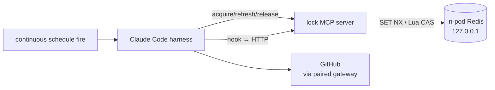

# Software-factory agent

Last verified: 2026-05-21

## Motivated by

- [ADR-019 — Scheduled session identity and lifecycle](../adrs/019-session-identity.md) — the rejected "heartbeat schedule type" left a gap that this agent fills with an in-pod coordination primitive rather than a platform-wide one
- [ADR-036 — Redis as a platform primitive](../adrs/036-redis-platform-primitive.md) — frames when Redis is the right substrate; the per-pod Redis used here is a deliberately narrower scope (a single pod, not cross-replica)

## Overview

The software-factory agent autonomously drives a small product loop — turn a PRD into GitHub issues, pick the next unblocked ticket, implement it, file a PR, review it, merge — by repeatedly waking on a continuous schedule. Each wake is a **heartbeat**: a turn that reads the current state from GitHub (labels carry the state machine), advances one step, and ends.

Two things distinguish it from other agents:

- A **single-flight invariant** on heartbeats. Because the same instance can be re-fired by the schedule loop before its previous turn has cleaned up — and because the workflow has steps (e.g. PR review, merge) that must not interleave — the agent enforces "at most one heartbeat running at any moment" with a pod-local lock.
- A **per-pod coordination substrate**: an in-pod Redis instance plus an MCP server that exposes the lock as three tools. The platform's cluster-wide Redis ([ADR-036](../adrs/036-redis-platform-primitive.md)) is the wrong scope here — the invariant is "one heartbeat per pod," not cross-replica.

The agent image extends [`platform-base`](../../packages/platform-base/) the same way the other [agents](../../packages/agents/) do; the lock substrate is the only architectural addition.

## Components inside the pod

- **In-pod Redis** — single-node, bound to `127.0.0.1`, no persistence (`--save "" --appendonly no`). Holds exactly one key: the lock. Loss on restart is acceptable; the next heartbeat re-acquires on a cold key.
- **Lock MCP server** — long-lived HTTP server on `127.0.0.1`, exposing three tools (`acquire_lock`, `refresh_lock`, `release_lock`) over the MCP Streamable HTTP transport, plus two plain HTTP endpoints (`/lock/refresh`, `/lock/release`) for the hook path. Stateless transport — connection per request — because the MCP TS SDK's `Protocol.connect()` is single-shot per server instance.
- **Heartbeat driver** — instructions baked into the agent's workspace, read by the Claude Code harness on each wake. The driver is the only caller of `acquire_lock`; it bails out immediately if `acquired: false`.
- **Hooks** — Claude Code's `PostToolUse` hook calls `/lock/refresh` after every tool use, and the `Stop` hook calls `/lock/release` when the turn ends. The harness never has to think about lock lifetime explicitly.

Everything except the GitHub egress is loopback-only. The trust boundary is the pod boundary; the lock has no reason to be reachable from outside.

## Lock semantics

The lock is a single Redis key with a TTL and a per-acquisition token:

- **Acquire** — `SET <key> <random-uuid> EX <ttl> NX`. Atomic; succeeds for exactly one caller while the key exists.
- **Refresh** — Lua compare-and-extend: if the stored value equals the holder's token, `EXPIRE` it; otherwise no-op. Prevents a stale holder from extending a lock that has already been re-acquired by someone else after expiry.
- **Release** — Lua compare-and-delete: same guard. A holder cannot release a lock it doesn't own.

The TTL is the safety net. If the harness crashes mid-turn (or the pod is killed), the lock expires on its own and the next heartbeat picks up the work — there is no orphan-recovery code path because there is no orphan state to recover. The TTL must outlive a normal heartbeat turn; the `PostToolUse` hook's refresh keeps it alive across long tool runs.

The current token is held in module-scope state inside the MCP server process. This is sound only because the invariant is one heartbeat per pod, and the MCP server lives in the same pod as the harness. A multi-process or multi-pod scope would need an explicit holder identity threaded through the API.

## Heartbeat coordination

The instance is scheduled with a continuous-mode RRULE that fires on a short interval. Every fire is the same: the schedule loop wakes the pod (if hibernated), `kubectl exec`s a trigger file, the trigger watcher opens an ACP session against the harness, and the harness reads its heartbeat instructions.

Step 0 of those instructions is unconditional: call `acquire_lock`. The branch is mechanical:

- `acquired: true` → the heartbeat owns this turn. It runs through the workflow: orchestrate (label transitions on GitHub issues), implement (one ticket, file a PR), or review (PR review and conditional merge).
- `acquired: false` → another heartbeat is still running. The harness exits the turn with no further actions. The trigger watcher deletes the trigger file, the schedule keeps firing, and the next fire that finds the lock free picks up the work.

Triggers serialize within a schedule (see [agent-lifecycle](agent-lifecycle.md#trigger-fire)), so back-pressure already prevents an unbounded pile-up of overlapping fires from the schedule itself. The lock guards against the other source of overlap: manual sessions, restarts during a long turn, and any future case where two callers could deliver work to the same pod concurrently.

## Workflow state lives in GitHub

The agent does not keep its own durable workflow state. GitHub issues and their labels are the source of truth:

- `PRD` — the requirements document, filed as an issue.
- `prd:<n>` — every issue decomposed from PRD `<n>` carries this label; lets the agent find all children of a PRD in one query and gates `/to-issues` against duplicate decomposition.
- `working` — the ticket the current implementation phase is owned by. At most one at a time, by convention.
- `needs review` — the implementation has a PR awaiting review.
- `done` — the PRD has been fully delivered; the heartbeat exits and disables its own schedule when it sets this label.
- `paused` — the heartbeat suspended itself after repeated failures and is waiting for the user to remove the label. See "Stuck detection and pause" below.

A heartbeat's behavior is determined entirely by the labels visible at the moment it starts, so a heartbeat that's killed and re-fired sees the same state, picks up where the last one left off, and never has to reconcile with a local journal. The lock prevents two heartbeats from racing label transitions; GitHub's own concurrency model handles the rest.

## Stuck detection and pause

The heartbeat can encounter classes of failure it cannot retry its way out of: a push blocked by branch protection, CI persistently red on the same SHA, a tool call that keeps failing, or genuine ambiguity in the requirement. Continuing to retry would burn cycles and produce noise (the [`todo-app-2` incident](#) was this failure mode taken to extremes — 31 duplicate issues across four re-decompositions before the schedule was killed manually). The agent therefore self-suspends on signal, not on time.

At the end of every turn the heartbeat records observed failures against the active work unit (a ticket number for implementation, a PR number for review, the string `"idle"` for the safeguard). Failure types are a small named set — `push_blocked`, `ci_red`, `tool_error`, `unknown` — so thresholds can match against them. Long-but-progressing work does **not** count; only failures the agent can name do.

When `stuckCounters[<work-unit>].failures.length` crosses `stuckThresholds.failuresPerWorkUnit` (default 3), or the last `ciRedConsecutive` failures (default 3) are all `ci_red` on the same SHA, the heartbeat transitions to **paused**:

1. Posts a failure summary to any connected Slack/Telegram channel (discovered via `describe_channel`).
2. Comments the failure history on the stuck ticket — the durable record humans see.
3. Adds the `paused` label to the PRD — the resume signal.
4. Exits without calling `toggle_schedule`. The schedule keeps firing because that is how the heartbeat learns the user has cleared the label; each paused fire costs one `gh issue view`.

The user resumes by removing the `paused` label. The next heartbeat sees the label gone, clears `stuckCounters`, posts a one-line resume note, and proceeds.

A separate **idle safeguard** catches the symmetric case — no failures, no progress, no work to do (e.g. all open tickets blocked on external dependencies). After `stuckThresholds.idleHeartbeats` consecutive turns with no merge, no label transition, and no recorded failures, the same pause flow runs with reason `idle`.

Operator-tunable thresholds live in `config.json`'s `stuckThresholds`; the heartbeat falls back to the documented defaults if absent. The agent never sets thresholds itself.

## What this does not address

- **Cross-pod coordination.** Two software-factory instances pointed at the same repo are not coordinated — the lock is pod-local. If we ever run more than one factory pod per project, the lock substrate has to move up to the cluster Redis with a per-repo key, and the holder identity has to be passed explicitly across the MCP boundary.
- **Crash detection.** A pod that dies mid-turn drops the lock by TTL expiry, not by signal. There is no "the holder is gone" notification; the next heartbeat just finds an unowned key and proceeds.
- **Quality gates.** The agent is instructed to verify CI checks are green before merging, but this is harness-level discipline, not a platform-enforced gate. A misbehaving agent is constrained by GitHub branch protection and required reviews — not by anything the platform does.
