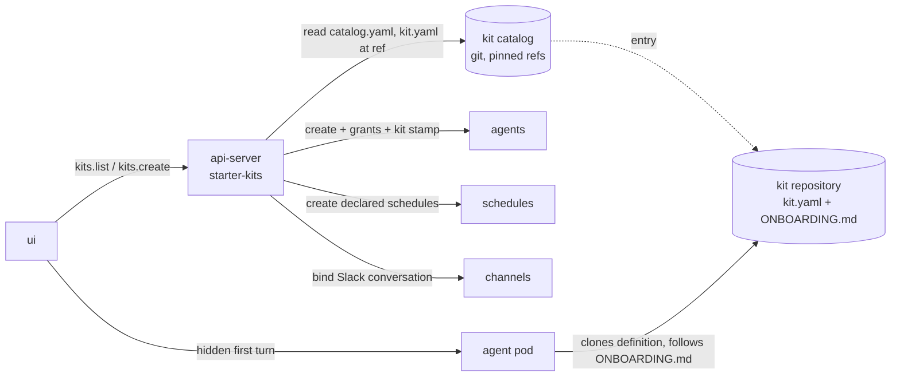

# Starter Kits

Last verified: 2026-09-10

## Overview

A **Starter Kit** is a proven way of working applied to a *new* Agent: the connections, channels and schedules a job needs, an optional pin to the Template it runs on, and an onboarding step that asks only for what the user alone can supply. It is not an Agent and not a Template ([ubiquitous language](../ubiquitous-language.md#starter-kits-bounded-context--in-design-3576-3638)). Template answers *what runs*; a kit answers *what for*.

Kits are **git, never cluster state**. A kit is a `kit.yaml` at the root of the repository that holds it — for an agent definition such as Code Guardian, the definition repository *is* the kit — and the platform reads kits from one curated **Kit Catalog**: an index of repository URLs, each pinned to a ref. The api-server holds no kit rows; an Agent remembers only the **Kit Version** it came from, `kit@commit`.

This is the V1 cut: a snapshot at create. Nothing tracks the kit's source afterwards, there is no backup and no automatic update. The increments that follow — the platform seeding the definition clone, a read-only definition, work-dir backups, and a detect-and-update path — are each additive to this page.

## Concepts

- **Kit Catalog** — the index the install reads kits from, configured as one locator: a GitHub repository (optionally a directory in it, or a ref), or a local directory for development. Entries are either a path inside the catalog or an external repository plus pinned ref. The catalog is fetched anonymously over the public raw-file endpoint, so every V1 catalog and kit repository must be public; results are cached for a few minutes.
- **Kit Schema** — the Zod schema in the contract package is the one source of truth; `kit.yaml` carries a `schemaVersion`. A kit that fails validation is dropped from the listing with a logged reason, never applied half-parsed. A duplicate id keeps the first.
- **Connection Requirement** — what a kit *accepts*: a set of Connection Templates or **connection families** (`github`, `github-enterprise`, …, the same groups the connection catalog shows as one connect page), required or suggested, plus a note. A family expands to every template in it, so `accepts: [github]` is satisfied by an OAuth, PAT or App connection and its Connect button opens the GitHub page with all methods; a kit that must insist on one method names the template instead. The family table lives in the contract package and is shared by the server-side check and the catalog UI.
- **Kit Schedule** — declared with the author's defaults and created by the platform at apply; a suggested one is created **disabled**. The apply form lists them with their cadence and lets the user **skip** any before create; onboarding never asks for cadence, and the user edits the rest on the instance.
- **Kit Channel** — suggested only. A channel never blocks apply; the apply form offers the Slack picker, other messengers are a note onboarding repeats.
- **Kit Parameter** — a value only the user can supply, listed so the catalog is honest about what onboarding will ask. In V1 the platform lists them and the agent asks for them.
- **Provider compatibility** — the apply form narrows the provider picker twice: to the kit's provider requirement, and to what the chosen harness can run on (Claude Code on Anthropic or the LiteLLM proxy, Codex on OpenAI or the proxy, Bob on its own gateway or the proxy, Pi on any of the three). The harness-to-provider table lives in the contract package beside the harness families; an empty intersection blocks create with a message rather than offering a provider the harness cannot use.
- **Template pin** — optional. A kit for a workload baked into a custom image (the research frameworks) names its Template and the harness choice disappears from the apply form; a kit without a pin runs on whichever harness the user picks. A pinned Template that is not installed marks the kit unavailable.
- **External Skill** — a skill from another repository, declared by source and name and installed through the same additive apply Skill Sets use ([skills](skills.md#skill-set)): the source must be a Skill Source connected for the owner — a user, system or template source — and an entry it cannot apply is reported with the same closed-set verdict rather than dropped. A kit whose skills come from a source the install does not seed is a catalog quality-bar item, not a platform failure. Skills inside the kit repository are not declared: the harness discovers them as files when it loads the definition.

## Apply

Apply — the `create` procedure of the starter-kits router, since tRPC reserves `apply` — is **create-only** and a composition of existing rails, compensated rather than transactional:

1. Resolve the kit at the catalog's pin. Resolve the Template from the pin or the user's pick; refuse when neither exists.
2. Check every required Connection Requirement against the templates of the connections the user granted; refuse before anything is created.
3. Create the Agent through the plain create with the grants, the kit's fixed env and hibernation override, and the Kit Version stamped as a create-time annotation — the same shape the knowledge-base template id uses ([agent-lifecycle](agent-lifecycle.md#create)).
4. Create the declared schedules, toggling suggested ones off; bind the Slack conversation if one was given. A failure here deletes the fresh Agent and surfaces the error.
5. Wake the Agent and record the apply in the security log.
6. Install the declared external skills. This step waits for the Agent to be reachable, like every skill install, so a kit with external skills returns once the Agent is up; its verdicts ride back on the apply result, and a failure here is reported, never compensated by deleting the Agent — the requirements that justify a refusal were all checked before create.

**Kit Onboarding** is the hidden first turn the UI sends once the Agent runs and has no sessions — the same greeting mechanism knowledge bases and experiments use. The prompt is **platform-composed from the kit and the Agent's state**: the definition repository and ref to clone, the connection requirements and which were granted, the schedules and which are disabled, the bound channel, the declared parameters — then "follow `ONBOARDING.md`", or the kit's own `onboarding.prompt` as the instruction. Every kit ships `ONBOARDING.md` beside `kit.yaml`. In V1 the agent clones its own definition; the platform does not seed it.

## Invariants

- **Kits are catalog-only platform inputs.** The platform never reads configuration back out of an Agent's own repository or workspace, so an agent committing to either can widen nothing the platform enforces — connections, egress, channels and the Template stay owner-managed platform state.
- **Requirements are checked before create.** A missing required connection is refused with nothing to clean up.
- **Nothing kit-shaped lives in the cluster.** The catalog locator is the only configuration; the Agent's kit stamp is provenance, not a source the platform re-reads.

## Where the code lives

- Contract: [`packages/api-server-api/src/modules/starter-kits/`](../../packages/api-server-api/src/modules/starter-kits/)
- Implementation: [`packages/api-server/src/modules/starter-kits/`](../../packages/api-server/src/modules/starter-kits/)
- UI: [`packages/ui/src/modules/starter-kits/`](../../packages/ui/src/modules/starter-kits/)
- Proof-of-concept catalog: [`starter-kits/`](../../starter-kits/)
