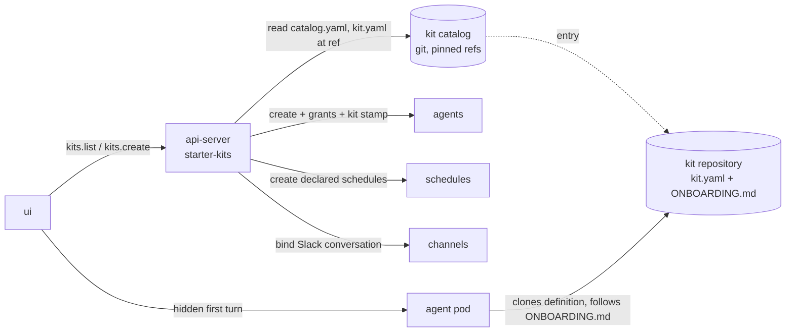

# Starter Kits

Last verified: 2026-09-14

## Overview

A **Starter Kit** is a proven way of working applied to a *new* Agent: the connections, channels and schedules a job needs, optionally its own agent image, and an onboarding step that asks only for what the user alone can supply. It is not an Agent and not a Template ([ubiquitous language](../ubiquitous-language.md#starter-kits-bounded-context--in-design-3576-3638)). Templates are the platform's **harness catalog** — the images the platform itself delivers — and a kit is self-sufficient: it either runs on a harness the user picks from that catalog, or brings its own image.

Kits are **files in git, never rows in the cluster**. A kit is a `kit.yaml` at the root of the repository that holds it — for an agent definition such as Code Guardian, the definition repository *is* the kit. The platform reads **several named Kit Catalogs** through one reader, in a fixed order: the **built-in catalog** (`platform`), whose files ship inside the chart under `helm/starter-kits/` and are mounted into the api-server as a directory, so it is versioned with the release and needs no network; and any number of external catalogs, each a public git repository holding a `catalog.yaml` index of kits pinned to refs. A kit is addressed as `<catalog>/<kit>`, so two catalogs may ship a kit of the same id without one hiding the other. The api-server holds no kit rows; an Agent remembers only `<catalog>/<kit>@<version>`.

This is the V1 cut: a snapshot at create. Nothing tracks the kit's source afterwards, there is no backup and no automatic update. The increments that follow — the platform seeding the definition clone, a read-only definition, work-dir backups, and a detect-and-update path — are each additive to this page.

## Concepts

- **Kit Catalog** — a named index the install reads kits from. The chart renders the list: the built-in catalog as a mounted directory when enabled, then each external catalog as a GitHub repository URL (optionally a directory in it, or a ref). Entries are either a path inside the catalog or an external repository plus pinned ref. External catalogs are fetched anonymously over the public raw-file endpoint, so they and their kit repositories must be public; results are cached for a few minutes. A built-in kit can be switched off per install (`starterKits.builtin.kits.<id>.enabled`), the same switch the workload Templates had: the chart then leaves the kit out of the rendered catalog, so an image the install does not build never reaches the UI. The built-in catalog's workload images carry the same `@ci-pin` marker the chart uses for its own images, rewritten to the release's source sha by the same publish step, so the versioning mechanics are unchanged — only the declaration moved from Helm values into kit files.
- **Kit Schema** — the Zod schema in the contract package is the one source of truth; `kit.yaml` carries a `schemaVersion`. A kit that fails validation is dropped from the listing with a logged reason, never applied half-parsed. A duplicate id keeps the first.
- **Connection Requirement** — what a kit *accepts*: a set of Connection Templates or **connection families** (`github`, `github-enterprise`, …, the same groups the connection catalog shows as one connect page), required or suggested, plus a note. A family expands to every template in it, so `accepts: [github]` is satisfied by an OAuth, PAT or App connection and its Connect button opens the GitHub page with all methods; a kit that must insist on one method names the template instead. Families are declared on the Connection Templates themselves ([connections](connections.md#connection-template)) and carried on the template view, so the server-side check and the catalog UI read the same data.
- **Kit Schedule** — declared with the author's defaults and created by the platform at apply; a suggested one is created **disabled**. The apply form lists them with their cadence and lets the user **skip** any before create; onboarding never asks for cadence, and the user edits the rest on the instance.
- **Kit Channel** — suggested only. A channel never blocks apply; the apply form offers the Slack picker, other messengers are a note onboarding repeats.
- **Kit Parameter** — a value only the user can supply, listed so the catalog is honest about what onboarding will ask. In V1 the platform lists them and the agent asks for them.
- **Provider compatibility** — the apply form narrows the provider picker twice: to the kit's provider requirement, and to the **providers the chosen Template declares** it can run on — or, for a kit with its own image, the providers the kit declares for it (a Helm-declared list on each Template, validated at load — Claude Code images on Anthropic or the LiteLLM proxy, Codex on OpenAI or the proxy, Bob on its gateway or the proxy, Pi on any of the three). A Template that declares none narrows nothing. An empty intersection blocks create with a message rather than offering a provider the image cannot use.
- **Harnesses** — a kit without its own image may name the harness families it runs on (`harnesses: [claude-code, bob]`); the apply form then offers only Templates of those families, and says so when none is installed. Templates are the platform's harness catalog: Helm declares only harness images (`harnessTemplates`), never workloads.
- **Own image** — optional. A kit for a workload baked into a custom image (the research frameworks) names the image itself — an OCI reference, the harness family inside it, and the providers it can run on — and the harness choice disappears from the apply form. The Agent is created on that image exactly as a custom-image agent is, with the install's default mounts; nothing has to be declared in Helm for a kit to work. A kit without an image runs on whichever harness Template the user picks. The former `preconfigured` Templates are now kits in the built-in catalog: workload images belong in kits, harness images in Templates.
- **Kit Size** — optional `resources`: the CPU and memory limits and the workspace disk the kit's workload needs, plus a `note` saying why. It is stated in the user-facing vocabulary and nothing else: limits are what an agent's power and its owner's Ceiling are measured in, so a kit never states requests — the controller derives those from the limits. Each dimension is independent and a stated one wins over the harness Template's own value, so a kit sizes its workload whether it brings an image or runs on a picked harness; an omitted dimension inherits the Template's, then the install default. CPU and memory stay editable on the Agent afterwards like any other Size; disk is fixed at create. This is where the sizing the `preconfigured` Templates used to carry now lives.
- **External Skill** — a skill from another repository, declared by source and name and installed through the same additive apply Skill Sets use ([skills](skills.md#skill-set)): the source must be a Skill Source connected for the owner — a user, system or template source — and an entry it cannot apply is reported with the same closed-set verdict rather than dropped. A kit whose skills come from a source the install does not seed is a catalog quality-bar item, not a platform failure. Skills inside the kit repository are not declared: the harness discovers them as files when it loads the definition.

## Apply

Apply — the `create` procedure of the starter-kits router, since tRPC reserves `apply` — is **create-only** and a composition of existing rails, compensated rather than transactional:

1. Resolve the kit at the catalog's pin. Use the kit's own image when it brings one, otherwise the Template the user picked; refuse when neither exists.
2. Check every required Connection Requirement against the templates of the connections the user granted; refuse before anything is created.
3. Create the Agent through the plain create — from the kit's image or the picked Template — with the grants, the kit's fixed env, size and hibernation override, and the Kit Version stamped as a create-time annotation — the same shape the knowledge-base template id uses ([agent-lifecycle](agent-lifecycle.md#create)).
4. Create the declared schedules, toggling suggested ones off; bind the Slack conversation if one was given. A failure here deletes the fresh Agent and surfaces the error.
5. Wake the Agent and record the apply in the security log.
6. Install the declared external skills. This step waits for the Agent to be reachable, like every skill install, so a kit with external skills returns once the Agent is up; its verdicts ride back on the apply result, and a failure here is reported, never compensated by deleting the Agent — the requirements that justify a refusal were all checked before create.

The catalog has two entry points, answering the placement question in #447 with *both*: a **Starter kits** destination in the rail with the full catalog and setup pages, and a **Home widget** — in the activity aside for users with agents and under the first-run entry points for users without — listing the first few kits with a Use button. The widget renders nothing when the install has no catalog, so an install that has not opted in sees no new surface.

**Kit Onboarding** is the hidden first turn the UI sends once the Agent runs and has no sessions — the same greeting mechanism knowledge bases and experiments use. The prompt is **platform-composed from the kit and the Agent's state**: the definition repository and ref to clone, the connection requirements and which were granted, the schedules and which are disabled, the bound channel, the declared parameters — then "follow `ONBOARDING.md`", or the kit's own `onboarding.prompt` as the instruction. Every kit ships `ONBOARDING.md` beside `kit.yaml`. In V1 the agent clones its own definition; the platform does not seed it.

## Invariants

- **Kits are catalog-only platform inputs.** The platform never reads configuration back out of an Agent's own repository or workspace, so an agent committing to either can widen nothing the platform enforces — connections, egress, channels and the Template stay owner-managed platform state.
- **Requirements are checked before create.** A missing required connection is refused with nothing to clean up.
- **Nothing kit-shaped lives in the cluster.** The catalog locator is the only configuration; the Agent's kit stamp is provenance, not a source the platform re-reads.

## Where the code lives

- Contract: [`packages/api-server-api/src/modules/starter-kits/`](../../packages/api-server-api/src/modules/starter-kits/)
- Implementation: [`packages/api-server/src/modules/starter-kits/`](../../packages/api-server/src/modules/starter-kits/)
- UI: [`packages/ui/src/modules/starter-kits/`](../../packages/ui/src/modules/starter-kits/)
- Built-in catalog: [`helm/starter-kits/`](../../helm/starter-kits/)
