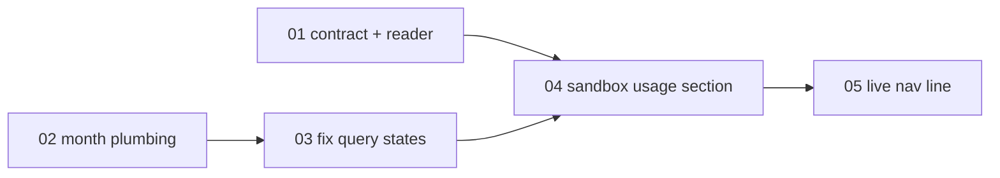

# Sandbox-level usage metrics on the Configure Sandbox page

> Working plan — temporary, committed on the feature branch. Deleted once the feature ships.

**Issue:** https://github.com/ibm/dam/issues/2774

## Goal

A **Usage** section on the Configure Sandbox page showing LLM spend for the selected sandbox
alone, so a user can answer "what is this sandbox costing me" without leaving it for the global
Settings › Usage page.

For one calendar month, scoped to one sandbox:

- four headline stats — **total cost**, **API calls**, **tokens in / out**, **model time**;
- **spend by model** — the existing per-model table;
- **spend by day** — the existing per-day column chart.

The month is chosen with the same ‹ › switcher Settings › Usage already uses. The section's nav
line carries the sandbox's month-to-date spend, so the figure is visible without opening the
section.

## Approach

The read path already exists and is described in [`docs/architecture/metrics.md`](../../architecture/metrics.md).
`metrics.spendBreakdown` returns the whole Usage tab in one read — per-model, per-agent and
per-day rollups over an absolute `[from, to)` instant range — under a single ownership
resolution. Two gaps separate it from a sandbox-scoped view:

1. **It is deliberately all-agents.** The service calls its own `ownedScope` helper with
   `undefined`, so every read spans the caller's whole agent set. That helper already takes an
   optional `agentId` and is used that way by `metrics.overview`; narrowing `spendBreakdown` is
   passing the input through, not new machinery. Naming an unowned agent resolves to an empty
   allowlist and yields no rows — the existing ownership guarantee, unchanged.
2. **The per-model rollup carries no duration.** `duration_ms` is present on every exported call
   record and already summed by `runtimeBySession` and `contextPerCall`; the per-model rollup
   simply never asked for it. Adding it is one `sum()` and one additive contract field.

Everything else is reuse. The section renders `ModelSpendTable` and `SpendByDayChart` unchanged,
and shares the month plumbing with the global view rather than duplicating it.

### Attribution: what "this sandbox's spend" means

Per [observability — trusted attribution](../../architecture/observability.md#trusted-attribution),
an Invocation target's telemetry arrives already stamped with the **root Driver's** agent id. So
scoping to one agent yields *everything that sandbox drove*, delegated work included — and a
sandbox that only ever ran as an Invocation target shows nothing for that work, because those
rows belong to the Driver. This falls out of the existing stamping; no read-time join, no special
case, and no way for a caller to widen the scope through input.

### Pinned contract

Both sides implement against this. Additive only — the global Usage view keeps working untouched.

```ts
// packages/api-server-api/src/modules/metrics/schemas.ts
metricsSpendBreakdownInputSchema = metricsSpendInputSchema.extend({
  agentId: z.string().min(1).optional(),   // NEW — narrows to one owned agent
  timeZone: z.string().min(1).refine(isValidTimeZone),
});

// packages/api-server-api/src/modules/metrics/types.ts
interface TokenSpendByModel {
  model, calls,
  inputTokens, outputTokens, cacheReadTokens, cacheCreationTokens,
  costUsd,
  durationMs: number;                      // NEW — sum of per-call duration_ms
}
```

`durationMs` is **summed request latency**, so concurrent calls overlap within it. It measures how
long models spent working, not elapsed wall-clock, and the UI labels it "Model time" — matching
the label the chat sidebar's `SessionStats` already uses for the same quantity.

### Derived stats

Three of the four headline stats are sums over `byModel`; only `durationMs` needed the contract
change. Nothing new is computed server-side.

| Stat | Source |
|---|---|
| Total cost | `sum(byModel[].costUsd)` |
| API calls | `sum(byModel[].calls)` |
| Tokens in / out | in = `sum(inputTokens + cacheReadTokens + cacheCreationTokens)`, out = `sum(outputTokens)` |
| Model time | `sum(byModel[].durationMs)` |

Tokens "in" folds cache reads and cache creation into the input figure, the same way
`ModelSpendTable` and `SessionStats` already do — cache reads dominate agent traffic, so an
unfolded input count reads as implausibly small next to the cost.

The per-agent rollup is meaningless once scoped to a single agent (it collapses to one row). The
section ignores it; the procedure still computes it, which is one redundant aggregate per read.
Left alone deliberately — skipping it would add a branch to the contract for no user-visible gain.

### Disabled backend

The telemetry store is optional and ships disabled. When it isn't configured every metrics read
throws `PRECONDITION_FAILED` rather than returning empty rows, because an empty success is
indistinguishable from "no spend yet" and would misreport a bill as zero. The section shows the
same *unavailable on this deployment* message the global view does, and the nav line falls back to
its neutral placeholder — both distinct from the empty-but-enabled state where a live store simply
has no rows for the month.

## Sub-issues

| #  | Title | Scope | Depends on |
|----|-------|-------|------------|
| 01 ✅ | Narrow the spend breakdown to one agent, add model time | Contract, service, router and ClickHouse reader; architecture page | — |
| 02 | Extract the month-period plumbing both Usage surfaces share | Pure refactor of the global Usage view | — |
| 03 | Stop the Usage tab flashing a skeleton on every month change | `keepPreviousData` + a sticky unavailable verdict, in the shared query hook and the global view. Fixes [#3148](https://github.com/ibm/dam/issues/3148) | 02 |
| 04 | Sandbox Usage section, reachable from the sandbox nav | Stat cards, section component, query hook, route + nav wiring | 01, 02, 03 |
| 05 | Live month-to-date figure on the Usage nav line | `use-section-summaries` | 04 |

01 is independent of 02–03 and may land at any point before 04.

Slice 03 fixes a **pre-existing** bug rather than one this feature introduces. It is in scope because
04 adds a second surface with the same query-state branching: fixing it first means the sandbox section
inherits the corrected behaviour instead of duplicating the wart, which is what "reuse the global
view's components" was chosen for. It is kept out of 02 so that slice stays a provably
behaviour-preserving refactor.



## Conventions & glossary

- **Sandbox** — the user-facing name for an Agent across the redesigned UI. "Agent" stays the
  domain and code term, so the contract keeps saying `agentId` while the UI says sandbox.
- **Configure Sandbox page** — `SandboxHomeView`, the two-column shell whose left nav
  (`SandboxSectionNav`) lists Sandbox Setup, Connections, Channels, Skills, Schedules, Artifacts.
  Usage joins it last, matching the issue's prototype.
- **Sandbox section** — one entry in that nav. The set is a Zod enum (`sandboxSectionSchema`) that
  also generates the route-matching regex, so adding a section is a one-place change.
- **Model time** — summed per-call request latency. Not wall-clock; see the pinned contract.
- **Driver / Invocation target** — see the attribution note above.

Engineering skills the implementing agent must apply:

- **`/typescript-engineering`** — slice 01 (contract, service, reader).
- **`/react-ui-engineering`** — slices 02, 03, 04 (everything in `packages/ui`).

Repo conventions that bite here: always `mise run …`, never a bare `pnpm`/`tsc`/`eslint`; prefer
`@carbon/icons-react` over lucide; comment only non-obvious *why*; never hardcode the brand.

The UI is verified against the Vite dev server on `localhost:5173`, which the user runs — never by
deploying to the dev cluster.

## Whole-feature smoke test

**Prerequisite for every numeric check:** the telemetry store must be up. It is `enabled: false` by
default, so a dev cluster shows *unavailable* until it is brought up — no credentials or external
accounts needed, one env var on a task that skips image builds:

```
CLICKSTACK=1 mise run cluster:helm
```

That installs the ClickHouse + MongoDB operators from ClickStack's public chart repo, sets
`clickstack.enabled=true`, and restarts HyperDX onto a ready Mongo. It is a heavy stack (ClickHouse
server + Keeper + MongoDB + HyperDX + collector, 20Gi PVC), and the third-party images are mirrored to
`quay.io/dam-agents` **by hand** — a missing tag surfaces as `ImagePullBackOff`. Afterwards, run an
agent turn so there is spend to read.

Without the store, everything structural is still verifiable — routing, the nav entry, the month
switcher, the unavailable and empty states, the nav line's `—` fallback — and slice 03 is verifiable in
full, since its symptom is what a store-less deployment shows. Only the figures themselves are
blocked; record those checks as outstanding rather than passing them.

With the branch checked out and the dev server running:

1. `mise run check` and `mise run test` — both green.
2. Open a sandbox that has run at least one LLM call → Configure Sandbox → **Usage**.
   - Four stats populate; total cost matches the sum of the model table's Cost column.
   - Spend by model and Spend by day render, and the day chart's columns sum to the total.
   - The nav's Usage line shows the same month-to-date figure as the Total cost stat.
3. Step the month back with ‹ — figures change; ›  is disabled on the current month.
4. Cross-check scoping: note this sandbox's total, then open Settings › Usage for the same month.
   The sandbox's total appears as its own bar in Spend by agent, and the global total is ≥ it.
5. Open Usage on a sandbox that has never run a turn → the empty-month message, not an error and
   not a zeroed-out chart.
6. Confirm Settings › Usage still works as before slice 02's refactor, and that stepping the month
   there dims the figures rather than flashing a skeleton (slice 03).
7. On a store-less deployment, confirm both Usage surfaces show *unavailable* once, with a single
   `spendBreakdown` request between them and no month switcher.

## Delivery

Each sub-issue is one atomic commit. The whole feature lands as a single PR for
https://github.com/ibm/dam/issues/2774.
