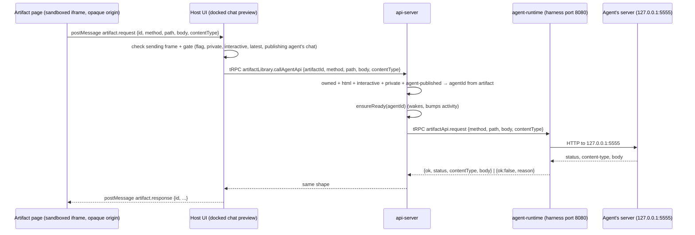

# Artifact API: interactive artifacts read and write data on their agent

> Working plan. Temporary, committed on the feature branch. Deleted once the feature ships.

**Issue:** [#2884 Epic - Interactive Artifacts](https://github.com/dam-agents/dam/issues/2884) (this feature is the epic's "private first" callback; it does not close the epic)

## Goal

A private interactive artifact can ask its agent for data and get an answer back. The page calls
`window.platform.request({ method, path, body })` and receives `{ status, contentType, body }` from
an HTTP server the publishing agent runs inside its own sandbox on `127.0.0.1:5555`.

This turns an interactive artifact from "a page with prompt buttons" into a small personal app: a
dashboard that loads fresh numbers, a form that saves into the agent's workspace, a tracker whose
state lives with the agent.

The agent writes and runs the server itself. The platform only carries requests to it.

## Approach

Read first: [artifact-library](../../architecture/artifact-library.md) (section *Interactive
pages*), [agent-lifecycle](../../architecture/agent-lifecycle.md) (image contract, wake,
hibernate), [platform-topology](../../architecture/platform-topology.md) (who may reach an agent
pod), [security-and-credentials](../../architecture/security-and-credentials.md) (agent ingress
NetworkPolicy).

One request travels four hops:



Design decisions (settled in a grill session; do not reopen while implementing):

- **Who can call.** Only private, interactive, `html` artifacts that an Agent published, opened by
  their owner in the docked chat preview with that Agent, on the latest version. Share links
  (restricted or public), library previews and history versions cannot call.
- **The server picks the agent.** `callAgentApi` takes an artifact id, never an agent id. The
  api-server reads the artifact's `agentId` and calls that agent. An artifact can never reach
  another agent, even one the same user owns. User-uploaded artifacts (no `agentId`) get no access.
- **No credentials in the page.** The page talks only to its parent over postMessage. The host UI
  makes the tRPC call with the user's own session. This keeps the rule of the existing
  `sendPrompt` bridge.
- **Fixed port 5555, not configurable.** No kit field, no Agent spec field, no settings UI, no
  MCP tool. The port is part of the image contract, like the fixed-path entrypoints. An agent with
  nothing on 5555 answers `app-not-listening`.
- **Relay through agent-runtime, loopback only.** The server binds `127.0.0.1`. agent-runtime,
  already reachable on 8080 by the api-server only, forwards to it. No new container port, Service
  port or NetworkPolicy rule, and nothing changes on the VM runner, so both Backends work.
- **The agent keeps its server alive.** The platform does not start, supervise or restart it. A
  `nohup` server survives the runtime reaping a session's harness (the runtime kills only its direct
  child). It does not survive hibernation; that gap is accepted. A running server does not keep the
  agent awake.
- **Gating.** Reuse the per-user `interactive-artifacts` feature flag in the UI. The flag is not
  authorization: `callAgentApi` makes its own checks whatever the flag says.

### Pinned contracts

Page API (injected by the bridge shim, only for interactive artifacts):

```ts
window.platform.request({
  method: "GET" | "POST" | "PUT" | "PATCH" | "DELETE",
  path: string,          // starts with "/", includes query string, relative to the server root
  body?: string,         // text only
  contentType?: string,  // default "application/json" when body is set
}): Promise<{ status: number; contentType: string | null; body: string }>
```

- Resolves for any HTTP status the server returns, including 4xx and 5xx (like `fetch`).
- Rejects only on platform failure, with an `Error` whose `reason` property is one of the reasons
  below.

Failure reasons (one enum in `api-server-api`, reused end to end):

| reason | meaning |
|---|---|
| `invalid-request` | bad method, path not starting with `/`, body over the limit |
| `not-allowed` | artifact not owned, not html, not interactive, not private, or not agent-published |
| `agent-unreachable` | wake failed or the pod could not be reached |
| `unsupported-runtime` | the agent's runtime is older than this feature (no `artifactApi` procedure) |
| `app-not-listening` | nothing accepted a connection on 127.0.0.1:5555 (retryable) |
| `timeout` | the server did not answer within 30 s |
| `response-too-large` | the server's body is over 1 MiB |
| `too-many-requests` | the page already has 8 requests in flight (UI-side only) |

Limits: request body at most 1 MiB, response body at most 1 MiB, 30 s timeout per request, no
streaming, no binary, at most 8 in-flight requests per frame. Request headers other than
`content-type` are never forwarded; response headers other than `content-type` are dropped.

tRPC (api-server, `artifactLibrary` router, `operateAgentsProcedure`):

```ts
callAgentApi: input  { artifactId: string; method; path; body?; contentType? }
              output { ok: true; status: number; contentType: string | null; body: string }
                   | { ok: false; reason: ArtifactApiFailureReason }
```

tRPC (agent-runtime, `artifactApi` router):

```ts
request: input  { method; path; body?; contentType? }
         output { ok: true; status; contentType; body } | { ok: false; reason: "app-not-listening" | "timeout" | "response-too-large" }
```

postMessage (page ↔ host), schemas next to `ARTIFACT_PROMPT_TYPE` in
`packages/api-server-api/src/modules/artifact-library/prompt.ts`:

```ts
{ type: "artifact.request",  id: string, method, path, body?, contentType? }        // page → host
{ type: "artifact.response", id: string, ok: true,  status, contentType, body }     // host → page
{ type: "artifact.response", id: string, ok: false, reason }                        // host → page
```

## Sub-issues

| #  | Title | Scope | Depends on |
|----|-------|-------|------------|
| 01 | ✅ [Runtime relay to the Artifact API Port](./01-runtime-relay.md) | `ARTIFACT_API_PORT`, `artifactApi.request` in agent-runtime-api and agent-runtime, limits and outcomes | none |
| 02 | [api-server `callAgentApi` mutation](./02-api-server-call-agent-api.md) | contract schemas + reasons, artifact checks, agent from publisher, wake, pod client | 01 |
| 03 | [Bridge `platform.request` in shim and host UI](./03-bridge-request-ui.md) | shim `request()`, message schemas, host hook with gate and in-flight cap | 02 |
| 04 | [Docs: skill and architecture pages](./04-docs.md) | `platform-artifacts` skill section, architecture pages | 03 |

## Conventions & glossary

- Terms (already in [ubiquitous-language](../../ubiquitous-language.md), Artifact Library section):
  **Artifact Bridge** (the postMessage channel, `window.platform`, carries `sendPrompt` and
  `request`), **Artifact API** (the HTTP API an Agent serves for its own interactive Artifacts),
  **Artifact API Port** (fixed `5555`, loopback only). Do not call it "app" (a Connection Template
  category) or "backend" (the isolation substrate). The one exception is the user-facing reason
  `app-not-listening`, which is page-author-facing wording.
- Apply `/typescript-engineering` for all server-side TS (api-server, agent-runtime, both `-api`
  contract packages) and `/react-ui-engineering` for `packages/ui`.
- Follow [comment guidelines](../../guidelines/comment-guidelines.md) and run
  `mise run check:comment-types` after code changes.
- Never hardcode the brand. Use `mise run` for every build, check and test.

## Whole-feature smoke test

On the dev cluster (`mise run cluster:*`, see the `cluster-ops` skill), with the
`interactive-artifacts` flag on for your user and an agent chat open:

1. Rebuild and install the changed images and UI (`agent-runtime` is in every harness image).
2. In the agent's terminal: start a tiny JSON server on the port, e.g.
   `nohup python3 -c '<http.server handler that answers GET /ping with {"pong":1} and echoes POST bodies>' >/tmp/api.log 2>&1 &`
   bound to `127.0.0.1:5555`.
3. Ask the agent to publish an interactive HTML artifact with two buttons: one calls
   `platform.request({method:"GET", path:"/ping"})`, the other POSTs a JSON body, and both print the
   result into the page.
4. Open it in the docked preview. GET shows `{"pong":1}`; POST shows the echoed body.
5. Kill the server. Clicking again shows a rejection with `reason: "app-not-listening"`.
6. Open the same artifact from the library view (not docked): `request` rejects, nothing reaches
   the api-server.
7. Hibernate the agent, open the chat and artifact again, click: the agent wakes and the page gets
   `app-not-listening` (the accepted gap) until the server is started again.

## Delivery

Each sub-issue is one atomic commit. The whole feature lands as a single PR referencing #2884.
