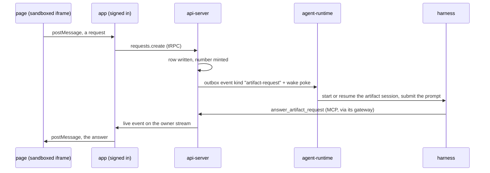

# Interactive Artifacts — private pages can call back into their agent

> Working plan — temporary, committed on the feature branch. Deleted once the feature ships.

**Issue:** https://github.com/dam-agents/dam/issues/2887 (part of epic #2884)

## Goal

An agent publishes an HTML page. Today that page is frozen. This feature lets a button on
the page ask the agent that published it to do something, and the answer lands back in the
page without a reload.

It works only for a **private** artifact, viewed by its **owner**, **inside the app**. That is
not a scoping preference, it is the security boundary: an agent holds its owner's credentials
and connections, so a page anyone could open must never be able to drive it.

## Approach

The whole design was settled in a grilling session (22 decisions). The load-bearing ones:

- **The page never talks to the api-server.** It runs in a sandboxed iframe with an opaque
  origin. A request is handed to the app over `postMessage`, and the app — already signed in as
  the owner — makes the tRPC call. Private-only is therefore structural, not a check that
  could regress. Any step that gives the page its own endpoint or token has broken the design.
- **Serving one is a full agent turn.** Not a prepared function. Slow, paid for, able to do
  anything the agent can do.
- **An Artifact Request is not an Invocation.** Invocations work because the asking agent lends its
  network reach and pays for the target. A page has neither, so it cannot be a driver. We copy
  the *shape* (a numbered request, an answer reported through a tool) and none of the machinery.
- **Delivery reuses the schedule-fire rails.** Outbox event, activity poke, `hello` catch-up,
  TTL. See [agent-lifecycle](../../architecture/agent-lifecycle.md#trigger-fire).
- **A page asks in the conversation it belongs to.** Bound to the chat it was first used in,
  resumed on every request. A page built to outlive that chat sets `own_session` and gets its
  own Artifact Session instead, resumed the same way, exactly like a continuous schedule.
- **Interactive is settled at create**, like an artifact's kind, and an interactive artifact
  **cannot be shared**.

Architecture pages this touches: [artifact-library](../../architecture/artifact-library.md),
[agent-lifecycle](../../architecture/agent-lifecycle.md),
[runtime-delivery](../../architecture/runtime-delivery.md),
[usage-tracking](../../architecture/usage-tracking.md),
[features](../../architecture/features.md).

### The path of one request



## Sub-issues

| #  | Title | Scope | Depends on |
|----|-------|-------|------------|
| 01 | Interactive artifacts exist and cannot be shared | `interactive` settled at create, surfaced on reads, sharing refused | — |
| 02 | Artifact Request lifecycle | table, repository, service, tRPC, one-in-flight, cap, named failures, activity | 01 |
| 03 | Pod-side delivery | new event kind in the runtime-channel plugin, per-artifact session binding | 02 |
| 04 | Wake, prompt, and the answer tool | outbox emit + wake, prompt composition, `answer_artifact_request` behind the flag | 03 |
| 05 | The browser bridge | two-way postMessage, app-owned waiting states, typed failures | 04 |
| 06 | Self-refresh limits and the indicator | client pacing, pause when hidden, idle stop, visible chip | 05 |
| 08 | The bridge shim | `platform.ask` injected at render, protocol becomes internal | 06 |
| 09 | The brief | what the cold Artifact Session needs, asked for at create | 08 |
| 10 | Conversation binding | a page asks in the chat it belongs to; `own_session` opts out; `session_deleted` | 09 |
| 11 | Every page is bound | `own_session`, the brief and self-refresh removed; unbound sessionless asks refused | 10 |
| 07 | Documentation | vocabulary section + four architecture pages | 11 |

Order is linear and runs 01 → 06, 08, 09, 10, 11, 07. 04 is the first slice where the feature is
visible end to end. 08, 09 and 10 were added after 06 shipped, when using a page by hand showed
what the protocol was missing. 11 was settled in a second grilling after using 10 by hand: the
Artifact Session was not worth the two slices (06, 09) that existed to patch it, so 11 removes
all three surfaces. 07 keeps its number and stays last: it documents what exists, and the later
slices change what exists.

## Pinned contracts

Both sides implement against these. Do not redesign them mid-slice; if one is wrong, change it
here first.

**Feature flag id:** `interactive-artifacts` (per-user, off by default). It gates UI surfaces
*and* whether `answer_artifact_request` is registered into an agent's MCP session. It is not a
security boundary — owner scoping is.

**Postgres** (`packages/db/src/schema.ts`, generated via `mise run db:generate`):

- `library_artifacts.interactive` — `boolean not null default false`, written only at create.
- `library_artifacts.own_session` — `boolean not null default false`, written only at create.
  True means the page takes its own Artifact Session and never binds to a conversation, which is
  what a page has to do if it must outlive the chat that made it.
- `library_artifacts.session_id` — `text`, nullable, written **once** and never rewritten: the
  conversation the page asks in for the rest of its life. Written by the first ask that carries a
  conversation, which is not always the page's first ask — a page asked from the Artifacts
  destination with no chat open binds nothing and can still bind later, because otherwise where a
  page asks would depend on where it happened to be opened first. Null means no ask has yet
  carried a conversation, or `own_session` is set, and the page uses its own Artifact Session.
  Null on every row published before slice 10.
- `library_artifacts.brief` — `text`, nullable, at most 8 KB. What the page's author left for
  the session that serves it: written at create and replaceable later **without** publishing a
  version, because a version bump reloads the frame and destroys the state the brief serves.
- `artifact_requests` — `id`, `owner`, `artifact_id` (fk → `library_artifacts`, cascade),
  `agent_id`, `seq` (per-artifact counter), `action`, `payload` (jsonb), `trigger`
  (`user` | `auto`), `state` (`pending` | `delivered` | `answered` | `failed`), `result`
  (jsonb, null until answered), `failure_reason`, `created_at`, `settled_at`.

**tRPC** (`packages/api-server-api/src/modules/artifact-library/router.ts`):

- `requests.create({ artifactId, action, payload, trigger, sessionId? })` →
  `{ requestId, seq, state }`. Returns as soon as the row is committed. **Never waits for the
  turn.** `sessionId` is the conversation the app has open behind the page, sent on every ask.
  The first ask that carries one pins the page; every ask after that ignores it. Omitted when no
  chat is open, and only ever sent when the open chat belongs to the page's own agent.
- `requests.get({ requestId })` → current state, result or failure.
- `requests.cancel({ requestId })` → stops listening. It does **not** stop the agent.
- `create({ …, brief })` / `update({ …, brief })` → the brief. A brief-only `update` publishes
  no version. A brief on a non-interactive artifact is refused; nothing would ever read it.
- `create({ …, ownSession })` → settled at create like `interactive`, unchangeable after, and
  refused on a non-interactive artifact for the same reason.

**Live event** on the existing owner stream (`api.events.owner`):
`ArtifactRequestSettled { requestId, artifactId, state }`. The app refetches on it.

**Named failure reasons** (the whole set, the page renders its own copy for each):
`agent_deleted`, `session_deleted`, `wake_failed`, `over_budget`, `rate_limited`, `busy`,
`cancelled`, `expired`. `session_deleted` is a bound page whose conversation the owner deleted:
the artifact is **kept** and still reads as a document, only its interactivity is gone, exactly
as for `agent_deleted`.

**Outbox event** (`runtime-delivery`): kind `artifact-request`, payload
`{ requestId, artifactId, task, sessionId }` where `sessionId` is the bound conversation or null
for an `own_session` page, with the same TTL treatment as `trigger` but a **15-minute**
TTL, not the schedule's hour: a request in flight blocks the page from asking again, so a request
nobody answers has to give up while the person is still there. A minute-by-minute sweep settles
requests past that TTL as `expired`, because the outbox expiry only drops the event.

**MCP tool:** `answer_artifact_request({ request_id, result })`. Attribution is the calling
agent's mesh identity — a harness cannot answer another agent's request, and the tool refuses a
request that is not pending or not its own.

**Page API** (the whole of what an agent has to know to write an interactive page). The renderer
injects a shim into an interactive page, which puts this on the page's `window`:

```
await platform.ask(action, payload?)   // resolves with the agent's result
platform.onState(cb)                   // "sent" | "waking" | "queued" | "running"
platform.ready                         // resolves once the app has handed over the port
```

A refusal is a rejection carrying `{ reason, message }` from the named reason set above. The
shim owns the connect handshake, the `ref`, and matching a reply to the ask that is waiting for
it. It does not queue, retry or pace — one in flight is the app's rule and the server's rule, and
`busy` reaches the page as a rejection like any other.

**postMessage transport** (between the app and the shim, not the page's API — a page that talks
to it directly is reaching under the contract, and we may change these shapes):

```
app  → page  { type: "artifact.connect" }   + one MessagePort, on load
page → app   { type: "artifact.request", ref, action, payload }
port → page  { type: "artifact.state",   ref, state: "sent"|"waking"|"queued"|"running" }
port → page  { type: "artifact.answer",  ref, result }
port → page  { type: "artifact.failed",  ref, reason, message }
```

`ref` is minted by the shim and never leaves the browser; the app maps it to the server-side
request id.

The shim asks on the window: `window.parent.postMessage(request, "*")`. The app drops anything
whose `event.source` is not its own iframe, and anything that is not the shape above.

Replies come back on a **MessagePort**, not on the window. The frame is `srcDoc` inside
`sandbox="allow-scripts"`, so its origin is opaque; `postMessage(reply, "null")` is a
SyntaxError in every browser, and a concrete target origin is therefore not reachable. A port is
strictly stronger than one anyway: it is bound to the document that received it, so a page that
navigates itself away cannot be handed an answer. The app posts `artifact.connect` with the port
once, on the frame's `load`, and the shim keeps `event.ports[0]`.

**Request prompt.** Short on purpose. The rules for answering are written on the
`answer_artifact_request` tool, so the prompt carries only what the tool cannot know: which page
asked, the action and payload, the request id, and one line saying the answer is that tool call
and not a reply. A bound page's prompt is shorter again — no inlined source, no line about who is
waiting (a bound page is refused automatic asks, so a person always is), and the brief only on the
ask that bound it. An `own_session` page keeps the source on its first request and the brief on
every one, because that session starts cold and can see nothing else.

**Caps** (Q12): the server refuses beyond **60 requests per artifact per rolling hour**
(`rate_limited`) and beyond **one in flight per artifact** (`busy`), and refuses an automatic
request on a page that is not `own_session` at all — a bound page's turns land in a conversation
somebody is reading. The client additionally paces automatic requests at no more than one per
30 s, pauses them while the tab is hidden, and stops them after 30 minutes with no human
interaction.

## Conventions & glossary

Apply [`/typescript-engineering`](../../../.claude/skills) to all server-side TS and
[`/react-ui-engineering`](../../../.claude/skills) to anything in `packages/ui`. Each sub-issue
names which.

Vocabulary, to be used in code, logs and errors:

- **Interactive Artifact** — an artifact that may ask its agent. Settled at create, never later.
- **Artifact Request** — one thing a page asked its agent to do: a button clicked, a choice
  made in a dropdown, a form submitted. `action` names what was asked, `payload` carries its
  arguments. Numbered, answered once, or failed with a named reason.
- **Artifact Session** — the dedicated ACP session an `own_session` page's requests land in.
  One per artifact, resumed. A page bound to a conversation has none: it asks there instead.
- **Bound** — a page asks in the conversation it was first used in, pinned by the first ask that
  carries one and fixed for the page's life. The default.
- **Brief** — what the page's author left for the session that serves it: standing instructions
  on the artifact. Prepended to every request prompt for an Artifact Session, which starts cold
  and can see nothing else, and only to the ask that bound a page to a conversation, which keeps
  its own history. The source says what the page is; the brief says what to do about it.
- **Callback** — an explaining word for prose only. Never a table, field, or error string.
- **Press** — do not use, in code or in prose. A page asks through a button, a dropdown, a
  form; "press" names only one of those and reads as a button everywhere else.

Do not name anything `Invocation`: that word belongs to agent-to-agent requests.

## Whole-feature smoke test

With the `interactive-artifacts` flag on for the test user:

1. Have an agent publish an interactive HTML page with a Refresh button (it can be a page that
   shows the current time as reported by the agent).
2. Open it in the Artifacts destination. Confirm Share is refused with a reason.
3. Press Refresh on a hibernated agent. The app shows waking, then running, then the page
   updates in place with the agent's answer.
4. Press Refresh again. The agent's answer shows it remembered the first one (same session).
5. Delete the agent, reload the page, press again: it renders as a document and the button
   reports that the agent is gone.

## Delivery

Each sub-issue is one atomic commit. The whole feature lands as a single PR for issue #2887.
