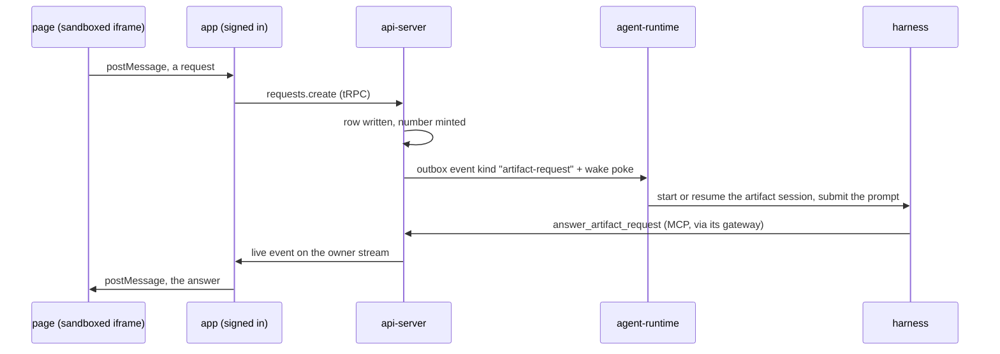

# Interactive Artifacts — private pages can call back into their agent

> Working plan — temporary, committed on the feature branch. Deleted once the feature ships.

**Issue:** https://github.com/dam-agents/dam/issues/2887 (part of epic #2884)

## Goal

An agent publishes an HTML page. Today that page is frozen. This feature lets a button on
the page ask the agent that published it to do something, and the answer lands back in the
page without a reload.

It works only for a **private** artifact, viewed by its **owner**, **inside the app**. That is
not a scoping preference, it is the security boundary: an agent holds its owner's credentials
and connections, so a page anyone could open must never be able to drive it.

## Approach

The whole design was settled in a grilling session (22 decisions). The load-bearing ones:

- **The page never talks to the api-server.** It runs in a sandboxed iframe with an opaque
  origin. A request is handed to the app over `postMessage`, and the app — already signed in as
  the owner — makes the tRPC call. Private-only is therefore structural, not a check that
  could regress. Any step that gives the page its own endpoint or token has broken the design.
- **Serving one is a full agent turn.** Not a prepared function. Slow, paid for, able to do
  anything the agent can do.
- **An Artifact Request is not an Invocation.** Invocations work because the asking agent lends its
  network reach and pays for the target. A page has neither, so it cannot be a driver. We copy
  the *shape* (a numbered request, an answer reported through a tool) and none of the machinery.
- **Delivery reuses the schedule-fire rails.** Outbox event, activity poke, `hello` catch-up,
  TTL. See [agent-lifecycle](../../architecture/agent-lifecycle.md#trigger-fire).
- **One conversation per artifact**, resumed on every request, exactly like a continuous
  schedule.
- **Interactive is settled at create**, like an artifact's kind, and an interactive artifact
  **cannot be shared**.

Architecture pages this touches: [artifact-library](../../architecture/artifact-library.md),
[agent-lifecycle](../../architecture/agent-lifecycle.md),
[runtime-delivery](../../architecture/runtime-delivery.md),
[usage-tracking](../../architecture/usage-tracking.md),
[features](../../architecture/features.md).

### The path of one request



## Sub-issues

| #  | Title | Scope | Depends on |
|----|-------|-------|------------|
| 01 | Interactive artifacts exist and cannot be shared | `interactive` settled at create, surfaced on reads, sharing refused | — |
| 02 | Artifact Request lifecycle | table, repository, service, tRPC, one-in-flight, cap, named failures, activity | 01 |
| 03 | Pod-side delivery | new event kind in the runtime-channel plugin, per-artifact session binding | 02 |
| 04 | Wake, prompt, and the answer tool | outbox emit + wake, prompt composition, `answer_artifact_request` behind the flag | 03 |
| 05 | The browser bridge | two-way postMessage, app-owned waiting states, typed failures | 04 |
| 06 | Self-refresh limits and the indicator | client pacing, pause when hidden, idle stop, visible chip | 05 |
| 07 | Documentation | vocabulary section + four architecture pages | 06 |

Order is linear. 04 is the first slice where the feature is visible end to end.

## Pinned contracts

Both sides implement against these. Do not redesign them mid-slice; if one is wrong, change it
here first.

**Feature flag id:** `interactive-artifacts` (per-user, off by default). It gates UI surfaces
*and* whether `answer_artifact_request` is registered into an agent's MCP session. It is not a
security boundary — owner scoping is.

**Postgres** (`packages/db/src/schema.ts`, generated via `mise run db:generate`):

- `library_artifacts.interactive` — `boolean not null default false`, written only at create.
- `artifact_requests` — `id`, `owner`, `artifact_id` (fk → `library_artifacts`, cascade),
  `agent_id`, `seq` (per-artifact counter), `action`, `payload` (jsonb), `trigger`
  (`user` | `auto`), `state` (`pending` | `delivered` | `answered` | `failed`), `result`
  (jsonb, null until answered), `failure_reason`, `created_at`, `settled_at`.

**tRPC** (`packages/api-server-api/src/modules/artifact-library/router.ts`):

- `requests.create({ artifactId, action, payload, trigger })` → `{ requestId, seq, state }`.
  Returns as soon as the row is committed. **Never waits for the turn.**
- `requests.get({ requestId })` → current state, result or failure.
- `requests.cancel({ requestId })` → stops listening. It does **not** stop the agent.

**Live event** on the existing owner stream (`api.events.owner`):
`ArtifactRequestSettled { requestId, artifactId, state }`. The app refetches on it.

**Named failure reasons** (the whole set, the page renders its own copy for each):
`agent_deleted`, `wake_failed`, `over_budget`, `rate_limited`, `busy`, `cancelled`, `expired`.

**Outbox event** (`runtime-delivery`): kind `artifact-request`, payload
`{ requestId, artifactId, task }`, with the same TTL treatment as `trigger`.

**MCP tool:** `answer_artifact_request({ request_id, result })`. Attribution is the calling
agent's mesh identity — a harness cannot answer another agent's request, and the tool refuses a
request that is not pending or not its own.

**postMessage protocol** (the page's public API, and the only thing an agent needs to know to
write an interactive page):

```
page → app   { type: "artifact.request", ref, action, payload }
app  → page  { type: "artifact.state",   ref, state: "sent"|"waking"|"queued"|"running" }
app  → page  { type: "artifact.answer",  ref, result }
app  → page  { type: "artifact.failed",  ref, reason, message }
```

`ref` is minted by the page and never leaves the browser; the app maps it to the server-side
request id. The app validates `event.source` against its own iframe and posts back with a
concrete target origin, never `"*"`.

**Caps** (Q12): the server refuses beyond **60 requests per artifact per rolling hour**
(`rate_limited`) and beyond **one in flight per artifact** (`busy`). The client additionally
paces automatic requests at no more than one per 30 s, pauses them while the tab is hidden, and
stops them after 30 minutes with no human interaction.

## Conventions & glossary

Apply [`/typescript-engineering`](../../../.claude/skills) to all server-side TS and
[`/react-ui-engineering`](../../../.claude/skills) to anything in `packages/ui`. Each sub-issue
names which.

Vocabulary, to be used in code, logs and errors:

- **Interactive Artifact** — an artifact that may ask its agent. Settled at create, never later.
- **Artifact Request** — one thing a page asked its agent to do: a button clicked, a choice
  made in a dropdown, a form submitted. `action` names what was asked, `payload` carries its
  arguments. Numbered, answered once, or failed with a named reason.
- **Artifact Session** — the ACP session a page's requests land in. One per artifact, resumed.
- **Callback** — an explaining word for prose only. Never a table, field, or error string.
- **Press** — do not use, in code or in prose. A page asks through a button, a dropdown, a
  form; "press" names only one of those and reads as a button everywhere else.

Do not name anything `Invocation`: that word belongs to agent-to-agent requests.

## Whole-feature smoke test

With the `interactive-artifacts` flag on for the test user:

1. Have an agent publish an interactive HTML page with a Refresh button (it can be a page that
   shows the current time as reported by the agent).
2. Open it in the Artifacts destination. Confirm Share is refused with a reason.
3. Press Refresh on a hibernated agent. The app shows waking, then running, then the page
   updates in place with the agent's answer.
4. Press Refresh again. The agent's answer shows it remembered the first one (same session).
5. Delete the agent, reload the page, press again: it renders as a document and the button
   reports that the agent is gone.

## Delivery

Each sub-issue is one atomic commit. The whole feature lands as a single PR for issue #2887.
