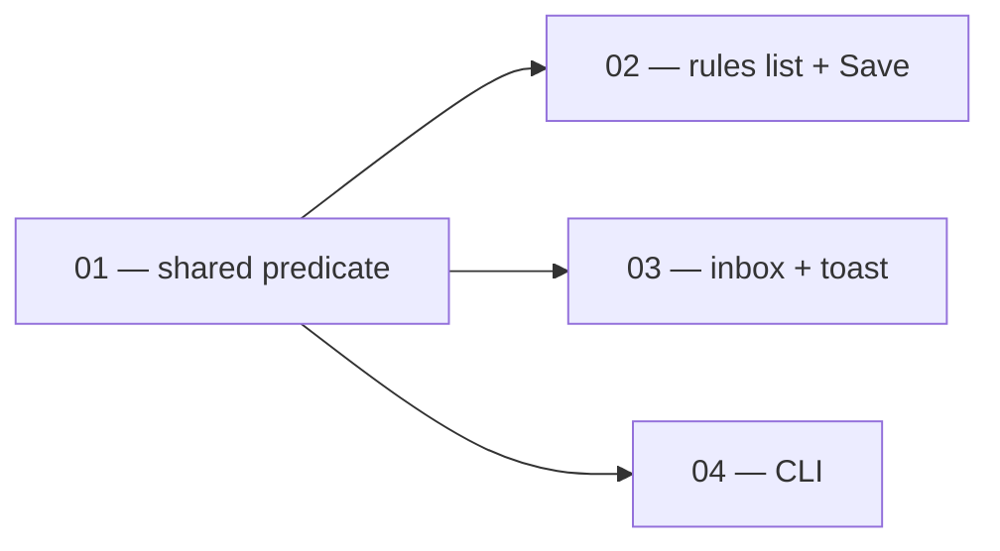

# Network gateway restart warnings match when the gateway actually restarts

> Working plan — temporary, committed on the feature branch. Deleted once the feature ships.

**Issue:** https://github.com/dam-agents/dam/issues/2969

## Goal

A user changing a sandbox's network access is warned about the ~5–15s gateway
interruption when — and only when — it will really happen, and gets the same answer
from every surface: the rules list, the settings Save dialog, the approvals inbox and
toast, and the CLI.

Today each surface re-derives the answer with its own approximation. The
approximations disagree with each other and with the server. Users get warned about
interruptions that never happen, which teaches them to click through the dialog, and
they get real interruptions that nothing announced.

## Approach

### How the gateway actually decides to restart

The api-server projects the agent's active rules onto the Agent CR's `spec.l7Hosts`
via `promotedHosts()`. The controller hashes that list together with the credential
Secrets into the gateway StatefulSet's `agent-platform.ai/envoy-secrets-rev`
pod-template annotation ([`packages/controller/pkg/reconciler/envoy.go`](../../../packages/controller/pkg/reconciler/envoy.go)).
Kubernetes replaces the pod only when the annotation changes. The list is deduplicated
and sorted, so the restart question is a **set** comparison, not a per-rule shape test:

> The gateway restarts iff `promotedHosts(rules_after) ≠ promotedHosts(rules_before)`.

Every current surface tests the shape of the single rule being written instead. That is
the whole bug. See [`docs/architecture/security-and-credentials.md`](../../architecture/security-and-credentials.md)
("L7 promotion") for the promotion rules themselves.

### The fix

One pure function, in the contract package both the server and its clients already
depend on, replaces every local approximation. `promotedHosts()` moves out of the
api-server domain into `packages/api-server-api/src/modules/egress-rules/promotion.ts`
and gains a companion that answers the set-difference question for a pending change.
The server keeps calling the same function it always did; the UI and CLI now call it too.

This follows the reason the contract packages exist — a single source of truth so
clients stop re-implementing server rules.

There is no new round trip for the UI: the rules editor already holds the agent's rule
list from `egressRules.listForAgent`, which is the exact input the function needs.

### Measured ground truth

Reproduced on the local k3s cluster against `spec.l7Hosts`, the gateway StatefulSet's
pod-template hash, and the gateway pod UID. Rows 1–6 measured; 7–8 read from the write
path, which is identical to rows 1 and 3.

| # | Change | Gateway | Rules list | Save dialog | Inbox |
|---|---|---|---|---|---|
| 1 | 1st narrowing rule, fresh host | **restarts** | warns ✅ | warns ✅ | — |
| 2 | 2nd narrowing rule, same host | no restart | quiet ✅ | **warns ❌** | — |
| 3 | narrowing rule on `*` host | no restart | **warns ❌** | **warns ❌** | — |
| 4 | path rule on port-promoted host | no restart | **warns ❌** | **warns ❌** | — |
| 5 | revoke last narrowing rule | **restarts** | **silent ❌** | **silent ❌** | — |
| 6 | narrowing rule on connection-narrowed host | **restarts** | **silent ❌** | warns ✅ | — |
| 7 | "Allow permanently" | **restarts** | — | — | **silent ❌** |
| 8 | "Allow host" | no restart | — | — | silent ✅ |

Three cases the issue text does not list, all fixed by the same function:

- **"Deny forever" promotes too.** `promotedHosts()` filters on host, source and shape —
  never on verdict. A deny rule with a concrete path restarts the gateway exactly like
  an allow rule.
- **Take-ownership promotes.** When a manual or inbox write adopts a connection-derived
  rule ([`egress-rule-writer.ts`](../../../packages/api-server/src/modules/egress-rules/services/egress-rule-writer.ts)),
  the host leaves the connection-excluded set and promotes.
- **The CLI is a fourth surface** with its own copy of the guess, and its copy names the
  wrong thing — it says the *agent* restarts, when the agent keeps running.

Two facts that look like bugs and are not — do not "fix" them:

- **Presets never promote.** Preset rules are always host-wide `*`/`*`, and `applyPreset`
  does not recompute the projection. A preset sweep does not restart the gateway.
- **Port 443 does not promote.** `splitHostPort` drops an explicit `:443`, matching the
  L4 catch-all which always dials 443.

### Decisions taken

- **Demotion confirms.** A restart caused by removing access gets the same dialog as one
  caused by adding it, with its own wording. This was the issue's open question. The
  interruption is identical from the user's side.
- **The CLI is in scope.** The issue names three surfaces; the CLI is a fourth with the
  same defect, and sharing the predicate makes it cheap.

### Out of scope

**Connection grants and revokes also restart the gateway silently.** Measured: granting an
OpenAI connection to a sandbox rolled the gateway with `l7Hosts` still empty, because the
credential Secret is the *other* half of the controller's hash. Warning about it means the
UI would have to predict that half too — a second guess about gateway internals, which is
the failure mode this issue exists to remove. The robust answer is a server-computed one.
A follow-up issue is filed separately; nothing here makes the current behavior worse.

## Sub-issues

| #  | Title | Scope | Depends on |
|----|-------|-------|------------|
| 01 | One promotion answer in the contract | Move the projection into `api-server-api`, add the impact function, repoint the server | — |
| 02 | Rules list and Save dialog agree | Both surfaces ask the shared function over the whole staged change set | 01 |
| 03 | Inbox and toast mark the restarting action | Confirm the two actions that promote; say why the third does not | 01 |
| 04 | CLI gives the same answer | Same function, plus a confirm on revoke and honest wording | 01 |



02, 03 and 04 are independent of each other.

## Conventions & glossary

- **Narrowing rule** — a rule that scopes a host by method, path, or non-standard port.
  Only these promote.
- **Promote / demote** — a host entering / leaving `spec.l7Hosts`, i.e. the gateway
  starting / stopping TLS-terminating inspection for it.
- **Restart wording.** The **gateway** restarts. The **sandbox keeps running**. Never say
  the agent or the sandbox restarts — that is a different, heavier event with its own dialog.
- Apply [`/typescript-engineering`](../../../.claude/skills/typescript-engineering/SKILL.md)
  to server-side and contract-package TypeScript, and
  [`/react-ui-engineering`](../../../.claude/skills/react-ui-engineering/SKILL.md) to
  `packages/ui`.
- No code comments (see [`CLAUDE.md`](../../../CLAUDE.md)). Run
  `mise run common:check:comment-types` after each slice.
- The contract package must stay browser-safe: `promotion.ts` may not import
  `@trpc/server` or anything from `router.ts`.

### Driving the local cluster headlessly

Every slice's smoke test needs a token and the cluster. Access tokens expire in ~5 minutes —
re-mint before each batch.

```bash
TOK=$(curl -s -X POST 'http://keycloak.localhost:4444/realms/platform/protocol/openid-connect/token' -d grant_type=password -d client_id=platform-ui -d username=dev -d password=dev -d scope=openid | python3 -c 'import sys,json;print(json.load(sys.stdin)["access_token"])')
```

Observe the restart decision directly — `l7Hosts` is the projection, `rev` is what makes
Kubernetes replace the pod, and a changed pod UID is the restart itself:

```bash
export KUBECONFIG="$(mise run cluster:kubeconfig)"; A=<agent-id>; kubectl -n platform-agents get agent "$A" -o jsonpath='{.spec.l7Hosts}'; echo; kubectl -n platform-agents get statefulset "$A-gateway" -o jsonpath='{.spec.template.metadata.annotations.agent-platform\.ai/envoy-secrets-rev}'; echo; kubectl -n platform-agents get pod "$A-gateway-0" -o jsonpath='{.metadata.uid}'
```

The dev app is **http**, not https: `http://localhost:4444`, login `dev`/`dev`. The
api-server pod is `platform-apiserver-*` (no hyphen in `apiserver`).

## Whole-feature smoke test

With all four slices done, walk the eight rows of the table above and confirm each
surface's warning matches the measured column. In particular:

1. Add a first narrowing rule, then a second one on the same host. The first warns
   everywhere; the second warns nowhere, and the rules list and the Save dialog agree.
2. Revoke the last narrowing rule on that host. Every surface confirms first.
3. Add a narrowing rule on `*`. Nothing warns.
4. In the inbox, "Allow permanently" and "Deny forever" confirm; "Allow host" does not.
5. `dam network create` on an already-promoted host does not prompt; `dam network revoke`
   of the last narrowing rule does.

Then `mise run check` and `mise run test`.

## Delivery

Each sub-issue is one atomic commit. The whole feature lands as a single PR for
https://github.com/dam-agents/dam/issues/2969.
