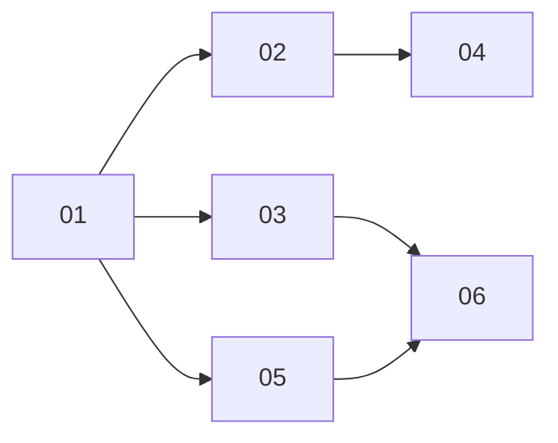

# The publish badge reports the pull request's real state

> Working plan — temporary, committed on the feature branch. Deleted once the feature ships.

**Issue:** [#3019](https://github.com/dam-agents/dam/issues/3019)
**Epic:** [#3022 — Close the Skills usability gaps](https://github.com/dam-agents/dam/issues/3022)

## Goal

A published Standalone Local Skill currently carries a pill that reports only that a publish
happened — `Published · {source}` — because nothing ever re-reads the pull request. This feature
resolves the pull request's actual state from GitHub and says which of five things is true:
it's a draft, it's awaiting review, it landed in the catalog, it was closed without landing, or
we genuinely don't know.

Two consequences of knowing the state come with it, because both are only reachable once the
state exists:

- A pull request that was **closed unmerged** is a dead end today — the pill permanently
  replaces the Publish button, so a user told "rename it and resubmit" cannot. The button comes
  back, as **Publish again**, in that state only.
- A **merged** skill currently appears twice on the page — as a local creation *and* as an
  uninstalled entry under its source, whose toggle claims "not installed" while the file is on
  disk and loaded by the harness. That contradiction is resolved, and the handoff to
  source-tracked governance becomes an explicit action.

## Approach

### Which component reads GitHub, and why it matters

[`docs/architecture/skills.md`](../../architecture/skills.md) states an invariant this feature
must not break: *"agent-runtime is the only component that talks to GitHub with credentials, and
it does so without holding any"* — the token exists solely as an Envoy injection in the gateway
pod paired with the agent.

The code upholds it without exception. Every one of the api-server's `accessTokenRef` references
is a **write** (`putFields`) or a path enumeration; there is **no read anywhere**. What the
api-server does read from the secret store is narrow — client secrets, refresh tokens, App
private keys — and every one is used against a **provider token endpoint** to mint or refresh,
never against a resource API.

So the split is real:

| Component | Talks to | With |
|---|---|---|
| api-server | OAuth **token endpoints** | client secrets, refresh tokens, App keys |
| gateway Envoy | **resource APIs** | the access token, injected on the wire |
| agent-runtime | originates resource requests | nothing |

**This feature does not change that.** The api-server resolves state for **public** sources with
an **anonymous** request — anonymous is not "with credentials", so the invariant holds — and
private sources are resolved by the agent-runtime through the existing gateway swap. Using the
owner's access token from the api-server was considered and rejected: it would be the first time
the api-server calls a resource API with a user's token, and a badge is not worth being the
precedent for that. If that boundary should ever move it needs its own ADR.

### Making the read affordable

Pull-request state can only come from `api.github.com`, which is **60 requests/hour per IP
unauthenticated**, shared across every user of an api-server. That budget is exactly what
[`public-archive-scanner.ts:22`](../../../packages/api-server/src/modules/skills/infrastructure/public-archive-scanner.ts:22)
deliberately steers around — it uses the tarball endpoint *because* that endpoint has no such
limit. There is no tarball equivalent for pull-request state, so four mechanisms carry the cost —
though the first turned out not to work, which is why there are four:

1. ~~**Conditional requests.**~~ **Measured false — do not rely on this.** The original plan
   assumed `304 Not Modified` is exempt from the rate limit, so an unchanged pull request would
   cost nothing. Against `api.github.com` unauthenticated, it is not: four consecutive
   `If-None-Match` requests each returned `304` and each decremented
   `x-ratelimit-remaining` by one (55 → 54 → 53 → 52), identically to a `200`. GitHub's
   "conditional requests are free" behaviour applies to the *authenticated* primary limit, which
   is the bucket slice 04's pod path uses — not this one. The ETag is still stored and sent (it
   saves bandwidth, and it is the right thing on the authenticated path), but it buys **no
   budget**, so mechanism 4 rather than this one is what makes the read affordable.
2. **Terminal-state persistence.** `merged` and `closed` are immutable. Observe once, persist,
   and never read that record again. The population needing checks only ever shrinks.
3. **A periodic job, not on-read resolution.** Resolving inside the `state` query would couple
   GitHub cost to how many users have the Skills page open — the wrong coupling, and the origin
   of the shared-fate risk. [`core/periodic-jobs.ts`](../../../packages/api-server/src/core/periodic-jobs.ts)
   is a BullMQ registry that is idempotent across replicas, so volume becomes a function of how
   many open published pull requests exist.
4. **A per-record hourly re-check.** Since mechanism 1 turned out not to hold, this is what
   actually bounds spend. Selection requires
   `prStateCheckedAt IS NULL OR prStateCheckedAt < now() - 1h`, so every unresolved pull request
   costs exactly **one request per hour** and roughly **50** of them fit inside the ceiling. The
   alternative — checking each record on every 10-minute tick — costs six per hour each, so ten
   open pull requests would exhaust the whole instance's allowance for every user at once.

   `prStateCheckedAt IS NULL` is exempt from the wait, which is what keeps the case a user
   actually watches fast: a *freshly published* pull request still resolves on the next tick,
   within ten minutes. Only re-checks of an already-known state wait the hour, so the badge is
   at most ~70 minutes stale after a transition — acceptable for a badge, and the price of
   supporting 50 records instead of 10.

   Two things fall out for free. The per-tick cap becomes a pure backstop against a pathological
   backlog rather than the thing bounding spend. And no record can starve the others: one just
   attempted removes itself from the candidate set, so no ordering logic is needed.

When the budget is exhausted anyway, state resolution degrades to the unknown case, which is a
truthful label. Nothing breaks; the badge just claims less.

### The badge vocabulary

The label answers *"is this skill published upstream?"*, not *"what happened to the pull
request?"* — the user's question, not GitHub's. Once merged the skill genuinely **is** in the
catalog, so `Published` is literally true there and stops being a hedge.

| Pull-request state | Label | Variant |
|---|---|---|
| draft | `Draft · {source}` | `outline` |
| open | `In review · {source}` | `info` |
| merged | `Published · {source}` | `success` |
| closed, unmerged | `Closed · {source}` | `muted` |
| unknown | `Submitted · {source}` | `muted` |

`merged` reclaiming `Published` is why the **unknown** case must be renamed to `Submitted`.
Leaving both as `Published` would conflate "definitely in the catalog" with "no idea" — a worse
claim than the one this issue was filed about, because `Published` now carries a definite
meaning. `In review` + `info` for the open state is confirmed by the owner's design frame.

`success` is legitimate for `Published` here. The earlier `Published`-only pill deliberately
avoided green because "the pull request was accepted" was precisely what could not be known;
that objection lapses once it can be.

### The post-merge duplicate, split in two

The confusion after a merge is not merely cosmetic. `standalone = local.filter(s =>
!trackedNames.has(s.name))` ([`skills-service.ts:656`](../../../packages/api-server/src/modules/skills/services/skills-service.ts:656))
decides the bucket purely on whether an `agent_skills` row exists, and publishing creates none.
So the page ends up asserting both *"this skill exists and works"* (standalone row) and *"this
skill is not installed"* (source row, toggle off) about the same file.

These are two different problems and the plan keeps them apart:

- **Presentation** — the duplicate is the system's mess, not the user's. While a standalone skill
  has a `merged` record for a source *and* is content-identical to that source's copy, its
  source-group entry is suppressed. Unconditional, no consent needed, no risk.
- **Governance** — handing the skill over to the source (creating the `agent_skills` row) changes
  who owns it: future installs overwrite the local copy. That is an explicit, explained action —
  a **kebab item**, `Track from {source}`, with a confirm whose wording depends on whether the
  local copy has diverged.

Automatic migration on merge was considered and rejected. Its `identical` precondition fails in
the most ordinary real merge — a maintainer fixes a typo before merging, or the repo normalizes
line endings — so it would silently not fire exactly when a user expects it to, and the manual
path would be needed anyway. It also makes a row vanish from a section whose header is a
*provenance* claim ("I made this here"), which stays true regardless of tracking.

Deliberately **not** a toggle on the standalone row. [`skills.md:86`](../../architecture/skills.md)
records a #944 decision that standalone skills have no install toggle; a kebab action is not that
toggle, so the page needs a note rather than a reversal.

### Scope boundaries

- **Not** reverting [`e7ad761c`](https://github.com/dam-agents/dam/pull/3124). The shipped
  `Published · {source}` pill is this feature's starting point; slice 03 renames the unknown case
  to `Submitted` and adds the other four.
- **No** review-decision state (approved / changes requested). It needs a second request per
  pull request and buys little over `In review`.
- **No** updating an existing pull request in place. `platform/publish-${name}-${timestamp}`
  ([`publish.ts:111`](../../../packages/agent-runtime/src/modules/skills/services/publish.ts:111))
  mints a fresh branch every publish, so `Publish again` opens a *new* pull request. Branch reuse
  with force-push semantics is a separate feature, which is why `Publish again` is offered only
  in the `closed` state where no live pull request exists.
- **No** `created Jun 30 · only in this sandbox` sub-line from the design frame. `created` is not
  reliably knowable — `localSkillSchema` has no timestamp, and the filesystem offers only
  `mtime` (last modified, which moves on every agent edit) with `birthtime` unreliable on this
  NFS-backed PVC. Labelling `mtime` as "created" would be the exact over-claim this issue
  exists to remove. `only in this sandbox` also becomes false after a merge, and the slot
  currently holds the skill's description, which is worth more.
- **No** publish affordance on installed/source rows. The server permits publishing back a
  tracked skill and the UI never offers it; that gap is real but separate.

## Sub-issues

| #  | Title | Scope | Depends on |
|----|-------|-------|------------|
| 01 ✅ | Record the resolved pull-request state | `prState`, `prStateCheckedAt`, `prEtag` on `agentSkillPublishes` + `skillPublishRecordSchema`; generated migration; repository read/write. No resolution, no UI change. | — |
| 02 ✅ | Resolve public pull-request state | Anonymous conditional `api.github.com` read, ETag storage, terminal persistence, registered periodic job, rate-limit backoff. | 01 |
| 03 ✅ | Render the five states | Badge mapping and tones; `Submitted` replaces the unknown-case `Published`; `Publish again` in the `closed` state only. | 01 |
| 04 ✅ | Resolve private state through a warm pod | `getPullRequest` on the runtime's GitHub port, tRPC procedure, api-server delegation only when the pod is already running. | 01, 02 |
| 05 | Expose the local content hash and de-duplicate the merged row | Lazy `contentHash` on local skills; suppress the source-group entry for an identical merged standalone skill. | 01 |
| 06 | Hand a merged skill over to its source | `Track from {source}` kebab action with a divergence-aware confirm; architecture-doc update and `Last verified` bump. | 03, 05 |

02 and 03 together are the shippable spine: public sources get real state, everything else reads
`Submitted`. 04, 05 and 06 each extend it independently.

## Conventions & glossary

- **Skill Publish Record** — a row in `agent_skill_publishes`, the append-only log of a
  successful publish. Denormalized so it survives the source being renamed or deleted, and
  reaped only by the `AgentDeleted` cleanup saga. This feature adds the *resolved outcome* of
  that record's pull request; the record itself still attests only that a publish happened.
- **Terminal state** — `merged` or `closed`. Immutable on GitHub, so once observed it is written
  once and never re-read. `draft` and `open` are non-terminal and get re-checked.
- **Standalone Local Skill** — on the pod's PVC but with no `agent_skills` row. Only these can be
  published, and only user-authored ones (`origin: "user"` or absent).
- **Content hash** — deterministic SHA-256 over a skill directory. The runtime's
  [`hashSkillDir`](../../../packages/agent-runtime/src/modules/skills/infrastructure/local-skill-repository.ts:523)
  and the api-server's
  [`computeContentHash`](../../../packages/api-server/src/modules/skills/infrastructure/public-archive-scanner.ts:107)
  are **algorithmically identical** (same dotfile-skipping recursive walk, same sort, same
  `rel` + NUL + body + NUL feed), so hashes from either side are comparable. They are duplicated
  implementations — do not let them drift, and do not "improve" one alone: stored
  `agent_skills.contentHash` values were produced by these, so a change mass-triggers phantom
  drift.
- **Apply [`/typescript-engineering`](../../../.agents/skills/typescript-engineering/SKILL.md)**
  for api-server and agent-runtime work, and
  [`/react-ui-engineering`](../../../.agents/skills/react-ui-engineering/SKILL.md) for
  `packages/ui` — mandated by [`packages/ui/CLAUDE.md`](../../../packages/ui/CLAUDE.md). Each
  sub-issue names which applies.
- **`mise` is the only task runner.** After UI edits run **`mise run ui:fix`** then
  `mise run check`. ⚠️ `packages/ui/CLAUDE.md` says `mise run lint:fix` — **that task does not
  exist**; the real ones are `ui:fix` and `fix`.
- **Never hand-write a table migration.** Edit `packages/db/src/schema.ts`, run
  `mise run db:generate`, add a top comment saying *why*. `db:check:generated` is part of
  `mise run check` and fails if the snapshot drifts from `schema.ts`.
- **Comments sparingly** — only the non-obvious *why*.
- **No new tests.** Verification leans on the existing suite plus the manual smoke tests. If a
  slice looks genuinely unverifiable without one, flag it rather than writing one silently.

## Whole-feature smoke test

Against the local k3s dev cluster (use the [`cluster-ops`](../../../.claude/skills/cluster-ops/SKILL.md)
skill), with a running sandbox that has a user-authored standalone skill and a connected
**public** GitHub source:

1. Publish the skill. The pill reads `In review · {source}` in the info tone.
2. Convert the pull request to a draft on GitHub, wait for the resolver tick, reload → `Draft`.
3. Mark it ready again → `In review`. Close it unmerged → `Closed`, and a **Publish again**
   button appears beside the pill.
4. Publish again, then **merge** that pull request → `Published · {source}` in the success tone.
5. Confirm the merged skill appears **once**: its source-group entry is suppressed while the
   local copy is identical.
6. Kebab → `Track from {source}` → confirm. The row leaves "Created in this sandbox" and appears
   under the source with its toggle on and drift detection live.
7. Repeat step 1 against a **private** source with the sandbox running → state resolves. Hibernate
   the sandbox → the badge falls back to `Submitted` rather than going stale, and no wake is
   triggered.

## Delivery

Each sub-issue is one atomic commit. The whole feature lands as a single PR for
[#3019](https://github.com/dam-agents/dam/issues/3019). The cleanup commit deleting this folder
is what unblocks the `Plan check` gate.
