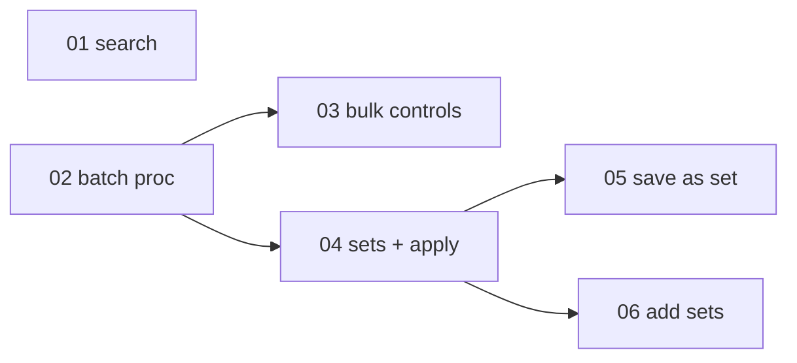

# Search, bulk-toggle, and reuse skill selections across sandboxes

> Working plan — temporary, committed on the feature branch. Deleted once the feature ships.

**Issue:** https://github.com/dam-agents/dam/issues/3023

## Goal

Picking skills stops being a per-sandbox chore done from memory.

Today a source with 40 skills means expanding its card, reading 40 truncated descriptions, and
flipping toggles one at a time — then doing it again on the next sandbox tomorrow. After this
feature there is one search box across every connected source, skills can be enabled or disabled
several at once, and a selection can be saved as a named **skill set** and added to any other
sandbox.

That matters because skills are the main lever for shaping what an agent is good at, and sandboxes
are meant to be cheap to create. When configuring skills is manual per-sandbox work, people either
skip it or keep one long-lived sandbox to avoid redoing it. Both defeat the point of disposable
sandboxes.

This is Phase 2 of epic [#3022](https://github.com/dam-agents/dam/issues/3022).

## Approach

Read [`docs/architecture/skills.md`](../../architecture/skills.md) before starting — in particular
**Skill, Installed Skill Ref, Local Skill**, **Skill Origin**, and the **Install** flow. The design
reference is the prototype attached to [#3208](https://github.com/dam-agents/dam/issues/3208)
(`issue-3022-prototype.html`); pull it and read the Running panel plus the two set modals. The frame
beats this prose for copy, placement and empty states.

Five facts from the code shape every slice:

1. **Search needs no server work.**
   [`use-skills-surface.ts`](../../../packages/ui/src/modules/sandboxes/hooks/use-skills-surface.ts)
   already scans every source eagerly on mount, so the whole catalogue is in the browser before the
   box is typed in. Search is a filter, not a query. Do not add a procedure for it.

2. **A source's identity on an installed row is its git URL.** `agent_skills.source` holds the URL —
   `skillInstallInputSchema.source` is `z.string().url()`, and the repository exposes
   `removeBySource(agentIds, gitUrl)`. `skill_sources` is unique on `(owner, gitUrl)`, so the URL is
   stable per owner and survives a source being deleted and re-added. **A skill set therefore stores
   `(gitUrl, name)` pairs**, which map straight onto the install key with no ambiguity when two
   sources both carry an `xlsx`.

3. **Install is declarative, so batching is nearly free.** `install` upserts a row, bumps the outbox
   and enqueues; the unified apply worker does the fetch
   ([`skills-service.ts`](../../../packages/api-server/src/modules/skills/services/skills-service.ts)).
   A batch is therefore N row writes and **one** bump — not N apply cycles. Doing it as N separate
   calls would be N wakes, N bumps and N reconcile settles for one user action.

4. **A set records names, never versions.** `skillInstallInputSchema` requires `version` and takes an
   optional `contentHash`, and both come from a scan. A set that pinned them would install stale
   content months later, so applying a set resolves the *current* version from the source's scan at
   apply time.

5. **Origin already tells the three groups apart.** #2828 shipped, so every Local Skill carries an
   `origin` verdict. That closes the dependency the issue records: search covers standalone and
   image-shipped skills too, while bulk actions and sets cover only source-backed ones — those have
   nowhere to install from, which is exactly what the prototype's note says.

**Sets are additive, never subtractive.** Adding a set turns skills on alongside what is already on;
overlap is fine and nothing is turned off. This is a deliberate safety property, not an
implementation shortcut — a set is a starting point someone else saved, and it must never silently
remove work the current sandbox depends on.

### Scope calls

**The create wizard is not touched.** The issue names "the new-sandbox flow", and the prototype
answers it as: create the sandbox, then add a set on its page. That settles the issue's open
question — "carry a selection" is a saved named set, not a copy-from-another-sandbox action and not
something declared on a template. The wizard's three steps
([`components/steps/`](../../../packages/ui/src/modules/sandboxes/components/steps/)) stay as they
are.

**Applying a set starts a stopped sandbox.** Every mutating skills procedure calls
`ensureAgentReachable` today, and the batch is no exception. The prototype's never-run copy ("they'll
be applied the first time the sandbox starts") describes a no-wake install path that does not exist.
That is a separate capability, out of scope here, and currently unowned — do not build it as a side
effect of this feature.

**Renaming a set is out.** 04 ships list, create and delete. The prototype deliberately leaves set
management homeless ("managing them lives wherever sets get owned"), so a typo means delete and
recreate. Known gap, recorded here rather than filed.

**MCP is out.** The five skills MCP tools keep their single-skill shape. Nothing about agent-driven
installs needs batching.

## Sub-issues

| #  | Title | Scope | Depends on |
|----|-------|-------|------------|
| 01 ✅ | Search across every connected source | Client-side filter over all three groups; reaches collapsed rows; match count in the header | — |
| 02 ✅ | Batch install and uninstall | One procedure taking installs and uninstalls: N row writes, one bump, one enqueue, a per-skill security log. Also gates the `state` reconcile on the outbox being settled — batching turned a latent race into a routine one | — |
| 03 ✅ | Bulk controls on the surface | Per-source Enable all / Disable all, and Update all for drifted skills | 02 |
| 04 ✅ | Skill sets: table, CRUD, and additive apply | `skill_sets` owner-scoped; list/create/delete; `applyToAgent` resolves names against connected sources and reports what it skipped | 02 |
| 05 ✅ | Save as skill set | Modal: pre-checked from what is on, grouped by source, name validation, source-backed only | 04 |
| 06 | Add skill sets | Multi-select modal, union counting, additive apply, skipped-entry reporting | 04 |

01 is first and standalone on purpose: it needs no server work and clears the papercut the issue
opens with, so the feature delivers something on its first commit.

## Conventions & glossary

- **Skill set** — a per-user named list of `(gitUrl, name)` pairs. Not versioned, not owned by a
  sandbox, and not a catalog: it records *which* skills, and applying it resolves *which version*
  from the source at that moment.
- **Additive apply** — applying a set installs what is missing and leaves everything else alone. It
  never uninstalls.
- **Skipped entry** — a set entry that could not be applied: its git URL is not among the sandbox's
  connected sources, or the source no longer serves that name. Reported back, never silently dropped.
- **Source-backed skill** — one that came from a Skill Source, so it has somewhere to install from.
  Standalone and image-shipped skills are not source-backed and cannot go in a set.

Apply the `/typescript-engineering` skill to the server slices (02, 04) and the
`/react-ui-engineering` skill to the UI slices (01, 03, 05, 06). Both are named again inside each
sub-issue.

Slice 04 changes `packages/db/src/schema.ts`, so it needs a generated migration:
`mise run db:generate`. `mise run db:check` fails when the schema moved without one.

Run `mise run lint:fix` after UI edits — it auto-fixes import order and `import type`.

## Whole-feature smoke test

On the local dev cluster ([`cluster-ops`](../../../.claude/skills/cluster-ops/SKILL.md)), at
`http://localhost:4444` (http — https 404s at Traefik):

1. Connect a source with many skills to a running sandbox. Type part of a skill's name in the search
   box: matches appear across every group, including skills inside collapsed cards, and the header
   reports the match count.
2. Use Enable all on that source. Every skill installs, and the page settles once — not once per
   skill.
3. Save the current selection as a skill set. Standalone and image-shipped skills are not offered,
   and the name field rejects `My Set` while accepting `document-processing`.
4. Create a second sandbox, connect the same source, and add the saved set. Only the missing skills
   turn on; nothing already on is disturbed.
5. Add the same set again. Nothing changes and the modal says everything is already on.
6. Remove one source from the second sandbox and add the set again. The skills from the removed
   source are reported as skipped, and the rest still apply.

## Delivery

Each sub-issue is one atomic commit. The whole feature lands as a single PR for
[#3023](https://github.com/dam-agents/dam/issues/3023).
