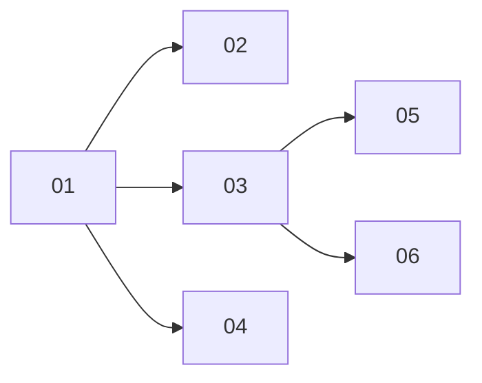

# Mid-turn steering and message correction

> Working plan — temporary, committed on the feature branch. Deleted once the feature ships.

**Issue:** https://github.com/dam-agents/dam/issues/3105

## Goal

A user keeps talking while an agent works. A message sent mid-turn goes into the running turn
where the harness can steer, and queues where it cannot. A queued message stays visible inline,
in every tab, and can be edited or deleted until it starts. Stop ends the current turn only; the
queue then continues. An earlier message can be edited while the session is idle, which reruns
the conversation from that point and discards what came after it. Every message shows a clear
state: queued, then sent (steered or started), then answered.

## Approach

Read first: [agent-lifecycle — Session inside the pod, Prompt delivery](../../architecture/agent-lifecycle.md#prompt-delivery),
[channel-turns — Inbound](../../architecture/channel-turns.md), and
[platform-topology — Protocols](../../architecture/platform-topology.md).

**Where things live today.**

- UI → api-server → pod is one ACP WebSocket per tab (`packages/ui/src/modules/acp/acp.ts`); the
  api-server relay is opaque (`packages/api-server/src/apps/api-server/agent-proxies/acp-relay.ts`).
- The pod's **prompt scheduler** (`packages/agent-runtime/src/modules/acp/services/acp-runtime/prompt-scheduler.ts`)
  is the one place a prompt waits: one turn per session, cap 32, parked 90 s after the last channel
  leaves, written to the undelivered store when dropped. It tells only the **sender** about a
  prompt (`platform/promptAccepted{queued}`, `platform/promptStarted`).
- `acp-runtime.ts` (`session/prompt` branch) writes the user echo into the in-memory transcript
  **at submit time**, marked `_meta.queued` when a turn is in flight. Other tabs and replays infer
  the queue from those echoes (source of #3264-class bugs).
- The UI tracks delivery in `packages/ui/src/modules/sessions/lib/prompt-delivery.ts` and renders
  "Waiting for previous prompt…" in `chat-message.tsx`. `failQueuedOnDisconnect` and
  `finalizeAllStreaming` (on Stop) end queued bubbles the runtime still holds.
- Steering exists only for Slack/Telegram: `packages/api-server/src/modules/channels/infrastructure/conversation-queue.ts`
  coalesces a burst, then steers mid-turn messages through `acpClient.steer()`
  (`packages/api-server/src/core/acp-client.ts`, ACP extension `_session/steering`, detected by
  `initialize` → `_meta.steering.supported`). Claude Code's adapter supports it; pi-acp 0.0.33,
  codex-acp and Bob do not.
- Claude Code's adapter advertises `sessionCapabilities.fork` and implements
  `unstable_forkSession`: a copy of the session up to and including an assistant `messageId`
  (fork point in `_meta.jetbrains.air.fork = {version:1, messageId}`; no point = whole session).

**What changes.**

1. The scheduler's queue becomes **shared, observable state**: broadcast to every engaged channel
   on each change and returned on `session/load`. A user echo enters the transcript **when its
   prompt starts** (or is steered), never while it waits. The UI renders queued items inline from
   the queue state.
2. A queued item can be edited or removed through runtime methods until it starts.
3. A UI prompt that arrives mid-turn is **steered** by the runtime when the harness supports it,
   and queued otherwise.
4. Idle sessions can be **rewritten from a message**: fork up to the reply before it, move the
   session's identity to the fork, delete the original, send the edited text.
5. pi gains steering through a pi-acp patch (upstream PR svkozak/pi-acp#115).
6. Channel steering moves into the runtime: the channel queue submits prompts that may be steered,
   and its own steer path goes away. The runtime is then the one steering point for every surface.

### Pinned contract (runtime ↔ clients)

Add to `packages/api-server-api/src/modules/acp/types.ts` (schemas + builders, like the existing
`platformPromptAccepted*`):

| Frame | Direction | Shape | Slice |
|---|---|---|---|
| `platform/queueChanged` | runtime → all engaged channels of the session (notification, ephemeral) | `{ sessionId, items: QueuedPrompt[] }` | 01 |
| `session/load` result `_meta.platform.queue` | runtime → loader | `QueuedPrompt[]` | 01 |
| `platform/updateQueued` | client → runtime (request) | `{ sessionId, promptId, prompt: PromptBlock[] }` → `{}` or error `data.code = "PROMPT_NOT_QUEUED"` | 02 |
| `platform/removeQueued` | client → runtime (request) | `{ sessionId, promptId }` → `{}` or error `data.code = "PROMPT_NOT_QUEUED"` | 02 |
| `platform/promptAccepted` | runtime → sender | adds `steered?: true` (then no `promptStarted` follows) | 03 |
| user echo `_meta` | transcript | `{ steered: true }` on a steered echo; `queued` no longer written | 01, 03 |
| `platform/rewriteFrom` | client → runtime (request) | `{ sessionId, upToMessageId: string \| null, prompt: PromptBlock[], promptId }` → `{ sessionId: newId }` | 04 |
| `session/prompt` `_meta.platform.steer` | channel → runtime | `{ prompt: PromptBlock[] }` — the text to inject if steered; presence marks the prompt steerable | 06 |

`QueuedPrompt = { promptId: string | null, prompt: PromptBlock[], queuedAt: string, editable: boolean }`
— `editable` is true only for prompts with a `promptId` sent from the UI surface.

### Rules every slice keeps

- **One delivery.** A message reaches the agent once: queued, steered or started, never two of
  them. A steer that the harness refuses (`promptRequired`, failure, or the turn ended during the
  round trip) puts the prompt back at the **head** of the queue.
- **Order.** Nothing is reordered: a prompt behind a queued one queues too, even if it could steer.
- **Steering scope.** Only prompts from the UI surface (`_meta.platform.surface === "ui"`) steer in
  03; scheduled fires, invocation outcomes and CLI runs keep queueing. 06 adds channel prompts.
- **Correction is UI only.** Editing (02, 04) exists in the web UI; Slack and Telegram get no
  correction in this feature. On a steering harness a mid-turn message is read at once, so it is
  corrected by another (steered) message, or by Stop and then a rewrite (04).
- **Stop** (`session/cancel`) ends the running turn only; the queue continues as today. The UI
  must not mark queued items done or failed on Stop or on a socket drop.

## Sub-issues

| #  | Title | Scope | Depends on | Done |
|----|-------|-------|------------|------|
| 01 | [The queue is shared and truthful](01-shared-queue.md) | Broadcast + load snapshot of the queue, echo at start, UI renders queue state inline, Stop/disconnect stop ending queued bubbles | — | ✓ |
| 02 | [Edit and delete a queued message](02-edit-queued.md) | `updateQueued`/`removeQueued`, inline Edit/Delete on a queued bubble | 01 | |
| 03 | [Steer a mid-turn message](03-native-steer.md) | Runtime steers UI prompts via `_session/steering`, steered echo, composer wording | 01 | |
| 04 | [Edit an earlier message and rerun](04-rewrite-from.md) | `rewriteFrom` via harness fork, replace in place, Edit on user bubbles when idle | 01 | |
| 05 | [pi steers](05-pi-steering.md) | pi-acp `_session/steering` from upstream PR #115, carried in the pi-agent image | 03 | |
| 06 | [One steering point for every surface](06-channel-steering-in-runtime.md) | Channel queue submits steerable prompts; runtime steers; channel steer path removed | 03 | |

## Open decision (outside this plan)

**Platform-level steering for harnesses without it** (Codex, Bob): at the next completed tool
call, cancel the turn and send "You were interrupted by the user. Their new message: …". Works
with any harness, but cancel semantics differ per harness and a long tool call delays the steer.
The team decides whether it is needed; if so, it becomes a follow-up issue.

## Conventions & glossary

- **Queued** — waiting in the scheduler; editable while queued. **Steered** — injected into the
  running turn. **Started** — handed to the harness as a turn. **Locked** — steered or started.
- **Rewrite** — the user-visible "edit and rerun": the session keeps its place, title and URL slot;
  its id changes to the fork's.
- Server-side TS: apply `/typescript-engineering`. UI (`packages/ui`): apply `/react-ui-engineering`;
  prefer `@carbon/icons-react`.
- Update the architecture pages named above in the same slice that changes their behavior
  (agent-lifecycle "Prompt delivery", channel-turns "Inbound"); keep each page under the doc-size cap.
- Run `mise run check:comment-types` after code changes. No new tests unless a slice says so.

## Whole-feature smoke test

On the local cluster with a Claude Code agent, in two browser tabs on the same session:

1. Send a long task. While it runs, send "also list the files you touched" from tab A. It shows
   at once as a sent message in both tabs, and the agent's answer covers it in the same turn.
2. On a Codex (or Bob) agent: send a long task, then two messages. Both tabs show two queued
   bubbles. Edit the first in tab B, delete the second in tab A; both tabs agree. Press Stop: the
   current turn ends and the edited message starts.
3. Reload mid-queue: queued bubbles come back as separate, queued bubbles.
4. On the Claude Code agent, idle: edit the second user message to a new text. The session keeps
   its place and title in the list, the later messages are gone, and the agent answers the new text.
5. On a pi agent: step 1 behaves the same as on Claude Code.
6. Slack DM to a Claude Code agent: send a task, then a follow-up mid-turn. One reply covers both.

## Delivery

Each sub-issue is one atomic commit. The whole feature lands as a single PR for #3105.
