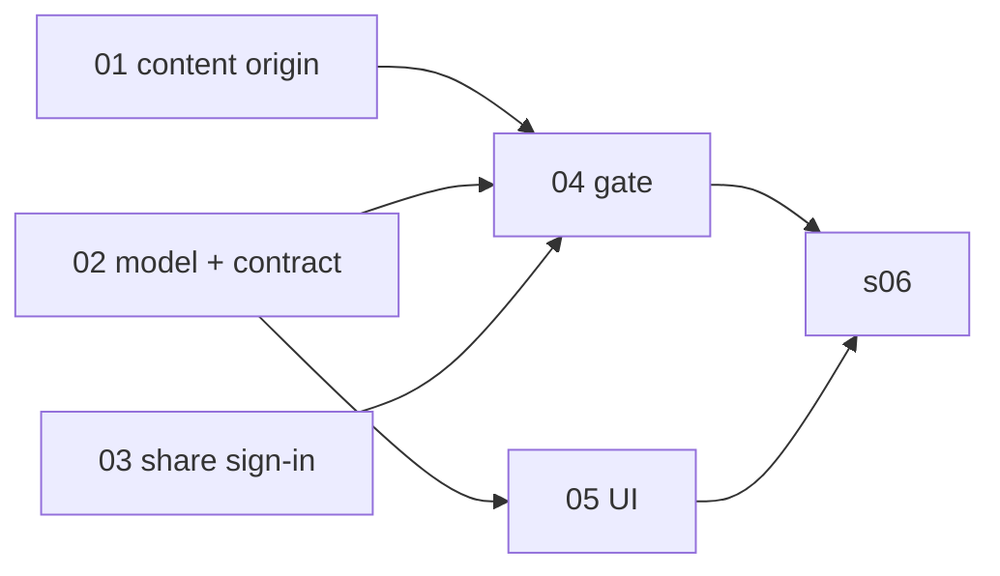

# Share an artifact with a restricted group

> Working plan — temporary, committed on the feature branch. Deleted once the feature ships.

**Issue:** https://github.com/dam-agents/dam/issues/3114
**Prerequisite issue folded in:** https://github.com/dam-agents/dam/issues/3485 (slice 01)

## Goal

An artifact owner can share an artifact with a named group of people and be sure nobody
else can open it. Today the only choices are "only me" and "anyone with the link". This
adds a third: **Restricted**. The owner types the email addresses of the people who may
view. When someone opens the link, the share host asks them to sign in through the
platform's Keycloak (the company SSO). If their verified email is on the list, or they are
the owner, the artifact renders. Otherwise they see a plain "You don't have access" page.

Decisions taken in the grilling session (and why):

| # | Decision | Why |
|---|----------|-----|
| 1 | Viewers are people with an account in the connected identity provider. They may never have opened the platform before. The list stores **emails**, not Keycloak subs. | A listed person has no Keycloak user row until their first sign-in. Emails are unique per realm user. The platform sends no email, so externals with no IdP account are out of scope. |
| 2 | Restricted is a **third visibility value**, not a list attached to "public". | "Public" keeps meaning anyone. An empty list can never silently mean public. |
| 3 | Viewers **stay signed in** on the share host (session cookie). #3485 must be fixed first. | Per-link sign-in is hostile to the invited people and does not remove the risk while a page is open. |
| 4 | **Folder pages are unchanged**: they list public artifacts only. | Keeps folder pages sign-in free. Folder-level lists are a later feature. |
| 5 | **Only a person** sets Restricted and the list, in the UI. Agent tools keep `private` / `public`. | Owner's explicit call. |
| 6 | Agent tools **refuse any sharing change** on a restricted artifact, both to public and to private. | One rule: once a person restricted it, only a person changes its sharing. |
| 7 | Blocked viewers get a **plain page**: signed-in email, "ask the sender", switch account. No title, no owner, no request button. | No leak of what the artifact is. Request-access needs a notification channel that does not exist. |
| — | A password on the link is **dropped**. | It travels the same way the link does. |

## Approach

Read [`docs/architecture/artifact-library.md`](../../architecture/artifact-library.md) first,
especially "Sharing model" and "The share host — trust boundary". This feature changes two
sentences there on purpose: the slug stops being the *entire* access control, and the share
host gains a login of its own. Everything else in that page stays true.

**Model.** `libraryArtifacts.visibility` gains the value `restricted`. A new table
`library_artifact_viewers` holds `(artifact_id, email)` rows, email lowercased and trimmed,
cascading with the artifact. The share URL exists for `restricted` exactly as for `public`
(same slug, same link; flipping between them never breaks a link). Switching to `private`
keeps the viewer rows; visibility alone decides whether they are consulted.

**Enforcement lives on the share host.** `ShareViewerService.resolveArtifact` returns a
new `restricted` resolution. The viewer app decides per request: no session → redirect to
sign-in and back; session whose `sub` is the owner, or whose verified email is on the list
→ render; anything else → the no-access page. The rendered page, raw bytes, downloads,
past versions, and the image preview all pass through the same decision (they already share
one lookup). Removing an email takes effect on the next request; nothing is cached per
viewer.

**Sign-in on the share host.** A new public Keycloak client (`platform-share`, PKCE,
redirect `{share}/auth/callback`) declared in the Helm realm. The share host app gets
`/auth/login`, `/auth/callback`, `/auth/logout`. The server exchanges the code, verifies the
ID token with `jose` against the realm JWKS (audience = share client id, nonce match), and
stores `{sub, email, emailVerified}` in Redis through the existing `TtlStore` behind an
opaque `HttpOnly; Secure; SameSite=Lax` cookie scoped to the share host. The app origin and
the share origin still never share a cookie or token: two clients, two cookies, two origins.
The api-server's own JWT admission code is not reused; this is a browser session, not a
bearer.

**Why #3485 is inside this branch, and the content host.** The artifact iframe is currently
sandboxed with both `allow-scripts` and `allow-same-origin` on the share host itself, which lets
artifact code reach the share origin. That is harmless while the origin holds nothing. The
moment a viewer session exists there, a hostile artifact could act as the viewer. Slice 01 moves
the frame to a **content host**: a second domain (`content.<domain>`, Helm `urls.content`) that
serves only artifact documents and raw bytes, never sets or reads a cookie, has no app route,
and answers only when framed by the share host. The outer page on the share host keeps the
banner, version navigation, Source link, and the session. The browser enforces the boundary by
origin, so the sandbox attribute is no longer load-bearing, and any popup or fake login form an
artifact opens shows the content domain in the address bar. Single content domain for now; a
wildcard per-artifact subdomain is the later upgrade.

Because the content host has no cookie, it cannot tell viewers apart. For a restricted artifact
the share host, having authorized the viewer, mints a **render token** (60 s, bound to one
artifact and version) and puts it in the iframe `src`; the content host serves restricted
documents and bytes only with a valid token. Public artifacts need no token.

**Agents.** `publish_artifact` and `set_artifact_sharing` keep `visibility: private | public`.
The library service refuses `setSharing` on a restricted artifact when the caller is an
agent, and the MCP tool turns that into a clear tool error. The service already knows its
`surface`; the refusal keys off it.

**Usage tracking.** `ArtifactShared` fires on the transition *out of* `private` (into
`public` or `restricted`), not only into `public`. Views on restricted renders count like
any other view. See [`docs/architecture/usage-tracking.md`](../../architecture/usage-tracking.md).

## Threat model: the rendered artifact must not be able to steal or use the viewer's identity

Reviewers raised this as the core risk. Each layer below maps to a slice; the implementing
agent verifies every one before calling its slice done.

| Layer | Guarantee | Slice |
|-------|-----------|-------|
| Separate content origin | Artifact code runs on `content.<domain>`, a different origin from the share host. It cannot read the share host's cookie, storage, or DOM, and the browser does not attach the share cookie to its requests. Popups it opens show the content domain. | 01 |
| Content host holds nothing | The content host never sets or reads cookies, has no sign-in, no app route, and only answers when framed by the share host (`frame-ancestors`). | 01 |
| No token in the browser | The code exchange and ID-token verification happen server-side. The browser receives only an opaque random session id. The ID token is never written to a cookie, storage, or HTML. | 03 |
| `HttpOnly` cookie | No script on the share page can read the session id. | 03 |
| Callback is platform chrome | `/auth/callback` never renders artifact content. The authorization code is single-use and bound to a PKCE verifier held only server-side. | 03 |
| Dedicated Keycloak client | No audience mapper, so the share host's tokens are rejected by the api-server even if the server were compromised. The api-server already validates audience on every JWT. | 03 |
| Narrow render token | 60 s TTL, bound to one artifact and version, accepted only by the content host. Theft yields one document the holder could already see, for one minute. | 04 |
| No secrets in the wrapper | Everything interpolated into the outer page goes through `escapeHtml`; the session id and tokens are never interpolated, except the render token inside the iframe `src`, which is what it is for. | 04 |

Out of scope and stated as such: an artifact can still open popups and draw a fake login form
(the phishing part of #3485). That is not identity theft from this feature and is tracked there.

## Sub-issues

| #  | Title | Scope | Depends on |
|----|-------|-------|------------|
| 01 | Serve the artifact frame from a content origin | Second by-link host (`urls.content`) that serves artifact documents and raw bytes only; the share page frames it by `src`. Public renders keep working. | — |
| 02 | Restricted visibility: model, service, contract, agent refusal | New visibility value, viewers table + migration, service/tRPC for the list, share event on leaving private, MCP tools refuse on restricted. | — |
| 03 | Sign-in on the share host | Keycloak share client in Helm, `/auth/*` routes, Redis session behind an HttpOnly cookie. No gating yet. | — |
| 04 | Gate restricted artifacts | Share host resolves `restricted`, redirects/allows/blocks, no-access page; render token minted for the frame; content host serves restricted only with the token. | 01, 02, 03 |
| 05 | Share dialog and badges | Three-way choice, email list editor, Restricted badge, refreshed row tooltip text. | 02 |
| 06 | Architecture docs and Helm values | Rewrite the sharing model and trust-boundary paragraphs, document the content host, share client, and env, whole-feature smoke test. | 01–05 |

## Conventions & glossary

Terms are in [`docs/ubiquitous-language.md`](../../ubiquitous-language.md) under
"Artifact Library": **Visibility** (`private` / `restricted` / `public`), **Viewer
Allowlist**, **Restricted Share**. Use those words in code, tool descriptions, and UI copy.
Avoid "whitelist", "ACL", "permissions".

- Emails are normalised once, at the boundary: `trim().toLowerCase()`. Comparison is exact
  after that. Cap the list at 50 entries per artifact (schema-enforced).
- The viewer session is a **share session**. It is never a bearer token and never leaves the
  share origin.
- Server-side TS follows `/typescript-engineering`. UI follows `/react-ui-engineering`.
  Comments follow [`docs/guidelines/comment-guidelines.md`](../../guidelines/comment-guidelines.md);
  run `mise run common:check:comment-types` after every slice.
- Never hardcode the brand; the viewer already receives `brandName`.
- No new tests unless a slice says so. Verification is the existing suite
  (`mise run api-server:test`, `mise run <pkg>:check`) plus the manual smoke test.

## Whole-feature smoke test

On the local cluster (`cluster-ops` skill; the dev cluster is on port 4444):

1. `mise run cluster:build-apiserver && mise run cluster:build-ui && mise run cluster:install`
   so the realm gains the share client and migrations run.
2. In the UI, publish an HTML artifact (upload or via an agent). Open Share, choose
   **Restricted**, add `alice@example.com`, save. Copy the link.
3. In a private window, open the link. Expect a redirect to Keycloak, sign in as a realm
   user whose email is `alice@example.com`, land back on the rendered artifact. The banner
   shows the artifact; the framed content renders; the Source download works.
4. In another private window, sign in as a user not on the list. Expect the no-access page
   naming that email, with a switch-account link. No title, no owner on that page.
5. Remove `alice@example.com` in the Share dialog, save. Reload Alice's tab: no-access page.
6. Switch the artifact to **Public link**. Both tabs render without sign-in prompts.
7. Switch to **Private**. Both tabs get the existing not-found page.
8. From an agent chat, ask the agent to make the (restricted) artifact public. The tool
   refuses with a message pointing to the app; the artifact stays restricted.
9. Open the artifact's folder page (`Copy folder link`). The restricted artifact is not
   listed; public siblings are.
10. Open a public JSX artifact and a public image artifact: both render, and DevTools shows the
    iframe loading from the content domain. Paste the iframe `src` of a restricted artifact
    into a new tab after 70 seconds: 401.

## Delivery

Each sub-issue is one atomic commit. The whole feature lands as a single PR for
https://github.com/dam-agents/dam/issues/3114, which also closes #3485.
