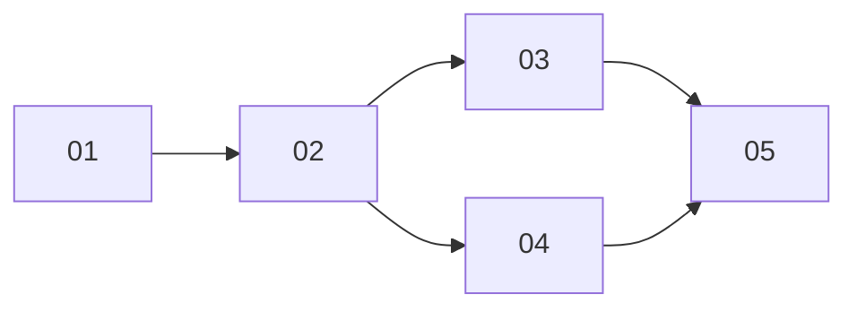

# Public Agent Page

> Working plan — temporary, committed on the feature branch. Deleted once the feature ships.

**Issue:** https://github.com/dam-agents/dam/issues/3135

## Goal

Someone in a Slack channel clicks the link under an agent's message. Today, if they are not the
agent's owner, they land on a near-empty page that says the sandbox does not exist. The sandbox
does exist. They have hit an access boundary, and nothing on the page says so.

Replace that dead end with a **Public Agent Page**: an unauthenticated page that names the agent,
names its owner, explains what the platform is, and invites the reader to create an agent of their
own. It is the first surface most people in a shared channel will ever see, so it is a conversion
surface, not an error page.

## Approach

A new page at `/a/<agentId>` on the app host, server-rendered by the api-server and reachable with
no login.

**Why the app host and not the share host.** The share host exists for one reason: user-generated
content must never execute on the app origin ([artifact-library](../../architecture/artifact-library.md)).
This page is platform chrome, so none of that rationale applies, and putting a conversion surface on
a deliberately-untrusted subdomain is a bad URL to hand people.

**Why server-rendered and not a route in the SPA.** Slack unfurls links. A server-rendered page with
OG tags shows an agent card in the channel before anyone clicks, and a stranger does not download the
whole app bundle to read four paragraphs.

**Nobody is identified.** Tokens live in `sessionStorage` ([auth.ts](../../../packages/ui/src/auth.ts)),
so the api-server sees no credential on a plain navigation and there is no app-origin cookie. The page
therefore cannot tell an owner from a stranger, and does not try. It has exactly two states:

- **named** — the agent exists and holds at least one channel binding
- **unnamed** — unknown id, unbound agent, or deleted agent, all rendering identically

Rendering all three non-cases identically means the URL confirms nothing about which agents exist, and
a stale link from a deleted agent still lands on something useful instead of a 404.

**Public traffic never touches the K8s API.** Agent names live only on the Agent CR, so a naive
implementation would let anyone with curl drive control-plane reads. Ids are unguessable, which cuts
the wrong way: every `/a/agent-<random>` is a distinct cache key and therefore a guaranteed cache miss.
Instead the page reads an owned Postgres projection, filled lazily behind the binding check so K8s reads
are bounded by the number of bound agents rather than by request volume.

### The owner sub is stored unhashed, deliberately

The neighbouring `agents` table in [schema.ts](../../../packages/db/src/schema.ts) hashes `owner_sub`
on write ([agents-postgres-repository.ts](../../../packages/api-server/src/modules/usage/infrastructure/agents-postgres-repository.ts)),
because it belongs to [usage-tracking](../../architecture/usage-tracking.md), whose whole premise is
pseudonymized identifiers. **That table cannot serve this page** and must not be extended for it. The new
projection stores the real sub, exactly as `channels.owner` already does, so the owner's email can be
resolved for display.

### Service contract (pinned — 01 implements it, 02 consumes it)

```ts
export interface PublicAgentView {
  agentId: string;
  name: string;
  ownerEmail: string | null;
}

export interface PublicAgentPageService {
  /** null means: render the unnamed generic page. */
  get(agentId: string): Promise<PublicAgentView | null>;
}
```

`get` returns `null` for an unknown id, an agent with no channel binding, and a deleted agent. Slice 02
never distinguishes those cases and must not try. `ownerEmail` is `null` when the directory lookup fails;
the page omits the owner line rather than failing.

### Three projection mechanisms, one job each

| Mechanism | Job |
|---|---|
| **Lazy fill** | Fills a row on first page view for an agent bound before this shipped. This is the backfill. There is no migration backfill and no boot walk. |
| **Saga** | Keeps the row current on `AgentCreated` / `AgentUpdated` / `AgentDeleted`, and pre-warms it on `SlackConnected` so the first click after a bind is already warm. |
| **Reconcile** | Refreshes names on rows **that already exist**. It does not walk `channels` looking for agents to add. Its only job is catching a replica that died between the K8s write and the Postgres write. |

## Sub-issues

| #  | Title | Scope | Depends on |
|----|-------|-------|------------|
| 01 | Public agent projection and read service | Table, migration, repository, saga, reconcile, lazy fill, the pinned service | — |
| 02 | Public agent page HTTP surface | Renderer, Hono app, route mounting, ingress path, brand, CTAs, OG tags | 01 |
| 03 | Decouple the Slack agent footer from attribution | Parse the id not the label; new URL and label | 02 |
| 04 | Chat route falls back to the public page | SPA redirect on a forbidden or missing agent read | 02 |
| 05 | Architecture documentation | New page plus `channels.md` and `persistence.md` edits | 01–04 |



03 and 04 are independent of each other. Both must follow 02 so that neither the footer nor the redirect
ever points at a route that does not exist yet.

## Conventions & glossary

Apply **`/typescript-engineering`** to every server-side slice (01, 02, 03) and
**`/react-ui-engineering`** to the UI slice (04).

Terms are defined in [ubiquitous-language.md](../../ubiquitous-language.md); **Public Agent Page** and
**Agent Footer** rows were added there as part of this design.

- **Public Agent Page** — this feature. Says *agent*, never *sandbox*. This is now simply the
  house rule: #3216 made *agent* the primary user-facing word and #3397 applied it across the GUI, so
  "sandbox" survives only where the copy describes the container itself. It matters extra here because
  "sandbox" reads to an unfamiliar reader as an infrastructure permissions error, which is the exact
  failure being fixed.
- **Agent Footer** — the context block under every agent post in Slack. The **agent id in the URL** is
  the wire format; the **link label** is presentation. Attribution must never read the label again.

Brand: CLAUDE.md forbids hardcoding the brand. The pitch sentence is fixed copy for now (a deliberate
call on this issue), but it interpolates `brand.name` so no literal brand string appears in source.

## Whole-feature smoke test

On the dev cluster, with a Slack-bound agent:

1. `mise run cluster:install`, then bind an agent to a Slack channel and have it post a message.
2. The footer under the message reads **Powered by DAM** and links to `/a/<agentId>?s=<sessionId>`.
3. Open that link in a private window (no session). The page renders the agent's name, the owner's
   email, the pitch, and both CTAs. No login prompt.
4. Open `/a/agent-0000000000000000` in the same window. Identical page, no agent name, no owner.
5. As the owner, click **Open in DAM**. Keycloak bounces and the agent's session opens in chat.
6. As a logged-in non-owner, open `/chat/<agentId>` directly. It redirects to `/a/<agentId>`.
7. Have a second bound agent post in the same channel, then prompt the first agent about the channel
   history. It refers to the other agent **by name**, not as "Powered by DAM".

Step 7 is the regression check for the footer decoupling and is easy to forget.

## Delivery

Each sub-issue is one atomic commit. The whole feature lands as a single PR for
https://github.com/dam-agents/dam/issues/3135.
