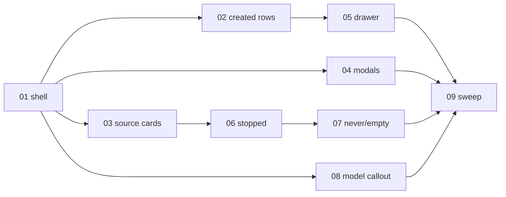

# Rebuild the Skills surface on the new design

> Working plan — temporary, committed on the feature branch. Deleted once the feature ships.

**Issue:** https://github.com/dam-agents/dam/issues/3208

## Goal

The Skills surface today grew by accretion — every epic issue added a row, badge, or modal
into the existing layout. #3208 rebuilds the surface to match the settled design prototype
(attachment `issue-3022-prototype.html` on the issue) across all four sandbox states
(Running, Running · empty, Stopped, Never run), both themes, and every overlay — while
preserving every capability the epic shipped. No new user-facing capability; where the
prototype implies one, this plan scopes it out and records it.

## Approach

Architecture pages: [`docs/architecture/skills.md`](../../architecture/skills.md) (required
reading; must be updated by slice 09 within the 40,000-character gate of
`scripts/doc-size.mjs` — post-#3023 main is at **39,799 characters, ~200 of headroom**, so
slice 09 very likely needs the sanctioned cuts and may need the page-split escape hatch).

The rework is UI-only with one deliberate exception: a `visibility` field on the scan-meta
contract (slice 03) so the Private badge and drawer chip can render — the server already
knows which dispatch branch (public archive vs. pod) served a scan; the field only surfaces
it. Everything else restyles or rearranges components that exist on `main` plus the #3023
branch (`feat/3023-search-bulk-and-skill-sets`, PR #3243).

**Implementation gate: satisfied.** PR #3243 merged 2026-08-11 as `c5d398d5`; this branch
is rebased onto it. Two review rounds (`be0c20a0`, `c9d01612`) landed after this plan was
first written — the component map below was re-verified against merged main (all paths
hold; rounds 3–4 changed internals only and added `packages/ui/src/hooks/use-debounced-value.ts`).
The plan still references components by responsibility: if a named file diverges, find the
component by its responsibility and adapt.

Component map (responsibility → file, verified on merged main `c5d398d5`), all under
`packages/ui/src/modules/sandboxes/` unless noted:

| Responsibility | File |
|---|---|
| Surface orchestration, group order, readOnly branch | `components/skills/skills-surface.tsx` |
| Search input, counts line, notice/actions slots | `components/skills/skills-search-header.tsx` |
| Page-level drift banner / shared drift predicate | `components/skills/skill-drift-banner.tsx`, `skill-drift.ts` |
| Header set buttons | `components/skills/skill-set-actions.tsx` |
| GitHub sources section | `components/skills/skill-sources-section.tsx` |
| Source card (header, bulk toggle, rows, error) | `components/skills/skill-source-card.tsx` |
| Source skill row | `components/skills/skill-row.tsx` |
| Created-here row (badges, publish, kebab) | `components/skills/standalone-skill-row.tsx` |
| Created-here group + placeholder/empty states | `components/skills/standalone-skills-group.tsx` |
| Image-shipped group | `components/skills/built-in-skills-group.tsx` |
| Save-set / Add-sets modals | `components/skills/save-skill-set-modal.tsx`, `add-skill-sets-modal.tsx` |
| Modal mounting | `components/skills/skills-modals.tsx` |
| SKILL.md preview dialogs (source-backed / local) | `components/skills/skill-render-modal.tsx`, `local-skill-render-modal.tsx`, `skill-markdown-modal.tsx` |
| Surface state, polling, mutations | `hooks/use-skills-surface.ts`, `use-skills-derivations.ts`, `use-skills-confirms.tsx` |
| Sidebar per-section summaries | `hooks/use-section-summaries.ts`, `components/sandbox-section-nav.tsx` |
| Skills state query (`standaloneSnapshot`) | `../agents/api/skills.ts`; contract in `packages/api-server-api/src/modules/skills/schemas.ts` |
| Harness-config snapshot (`hasRun`, `modelsPaired`) | `../agents/api/harness-config.ts`; contract in `packages/api-server-api/src/modules/harness-config/schemas.ts` |

## Rendering the prototype (mandatory before each slice)

Never claim visual fidelity from the HTML source alone — render it:

```bash
curl -sL -o /tmp/proto.html "https://github.com/user-attachments/files/30827535/issue-3022-prototype.html"
~/Library/Caches/ms-playwright/chromium_headless_shell-1223/chrome-headless-shell-mac-arm64/chrome-headless-shell \
  --headless --disable-gpu --hide-scrollbars --window-size=1400,2400 \
  --screenshot=/tmp/proto.png --virtual-time-budget=5000 "file:///tmp/proto.html"
```

To capture a state you cannot click into, copy the file and inject a call before `</body>`:
`setState('stopped'|'empty'|'never', document.querySelector('button[onclick*="stopped"]'))`
(or `.click()` the switcher buttons), `setTheme(true, btn)` for dark, `openSave()`,
`openApply()`, `openDetails('pdf-fill')`, `doSearch('sync')`, `askDelete('x')`,
`askRemove('x')`, `togSource(btn)`, `toggleMore(hint)`, `startScan('Anthropic skills')`.
The in-app browser pane cannot open `file://` URLs; use the headless shell and Read the PNG.

## Decision record (settled with Petr, 2026-08-11)

1. **Baseline** — plan references #3243 components by responsibility; implement only after it merges.
2. **Badge labels** — live semantics win: `Draft / In review / Published(merged) / Closed /
   Submitted(unknown)`. The pill stays a PR link with its tooltip; only the visual treatment
   follows the prototype.
3. **Publish CTA** — no inline row button. `Publish…`/`Publish again…` lives in the
   created-here kebab and the drawer footer, both gated by the shipped rules (offer only when
   no publish record exists or the PR closed).
4. **Never-run panel** — scoped down to the truth: skills need the sandbox started; primary
   action Start sandbox; Add source stays (platform-side). No "applied on first start" copy.
5. **Source error state** — live verdict copy + Manage connections survive, restyled into the
   new card.
6. **Running · empty** — means "no created skills and no sources"; the image group keeps
   rendering whenever the image ships skills.
7. **Set management** — out of scope (no rename surface); follow-up issue drafted below.
8. **Stale-model callout** — in scope as its own slice (banner + nav dot + Start & fix),
   powered by `modelsPaired` which already exists on `main`.

## Deviations register

Maintained here during implementation; slice 09 copies the final table into the PR
description before the plan folder is deleted. Seeded entries:

| # | Prototype shows | We ship | Why |
|---|---|---|---|
| D1 | Badges `Open`, `Merged`, `Published` (state unknown) | `In review`, `Published` (merged), `Submitted` (unknown) | Prototype labels re-introduce the conflation #3019 rejected; live labels encode settled semantics |
| D2 | Publish pill is a bare label | Pill stays a clickable PR link with tooltip | Losing the link is a capability regression |
| D3 | Publish only via drawer footer, unconditional | Kebab + drawer, gated (no record / closed) | Discoverability of the epic's core loop; shipped gating rules are deliberate |
| D4 | Never-run: "pick skills now — applied the first time the sandbox starts" | "Start the sandbox to configure skills"; Start sandbox primary | Capability does not exist; every mutating path wakes the pod (`ensureAgentReachable`) |
| D5 | Never-run sources card has no kebab | Keep the kebab (Re-scan / View repo / Remove source) | Sources are platform-side; prototype inconsistency (Stopped keeps it) |
| D6 | No source error state | Live `SourceError` verdict + Manage connections, restyled | Real states must survive the redesign |
| D7 | Running · empty hides the image group | Image group renders when the image ships skills | Real images bake skills in; hiding them hides active truth |
| D8 | — (prototype assumes visibility is known) | `visibility` field added to scan-meta contract | Only way to render the Private badge/chip honestly |
| D9 | Bulk button hidden while a search is active (#3243) | Button stays, scoped to the visible matches and labelled with the count (`Enable 4 matching`) | #3243 hid it because `Enable all` beside 4 of 22 visible rows misreports what it does; naming the count fixes the label rather than removing the affordance. `applyBatch` already takes arbitrary subsets. Settled with Petr 2026-08-11 — a deliberate scope widening, and it narrows follow-up Draft D to the checkbox multi-select alone |

Add rows as new deviations surface. Never silently diverge.

**Not deviations — prototype bugs.** The prototype's `doSearch` toggles rows,
show-more hints and groups, and never inspects source cards. A card matching
nothing therefore keeps its header, while a query matching nothing *anywhere*
hides the whole group and its cards with it — the two cases contradict each
other. We hide zero-match cards (already #3243's behaviour). Settled with Petr
2026-08-11: a prototype bug is not a design to match.

## Follow-up issue drafts (file only on Petr's approval, attach to epic #3022)

> **These drafts die with this folder.** Slice 09 deletes `docs/plan/3208-skills-ui-rework/`
> as the last commit before the PR goes ready — which is exactly when these are meant to be
> filed. Slice 09 must file them (or post them to #3208) **before** the deletion commit. A
> durable copy also lives in the session memory note for epic #3022.

**Draft A — Deferred skill install for never-run sandboxes.** Feature. Problem: picking
skills on a sandbox that has never started requires waking it; the #3208 design originally
promised "applied the first time the sandbox starts". Goal: a platform-side pending
selection (sets and/or individual skills) recorded without waking the pod and applied on
first `hello`. Needs its own design: storage, conflict with image/created skills, failure
semantics, idempotency. Out of #3208 by decision 4.

**Draft B — A home for skill-set management.** Feature. Problem: sets have
`list/create/delete/applyToAgent` but no rename and no management surface; a typo means
delete-and-recreate. Goal: decide where sets are owned (user-level settings page?) and ship
rename + list/delete there. The Skills surface deliberately only saves and applies sets.
Out of #3208 by decision 7.

**Draft C — Apply a skill set while creating a sandbox.** Feature. Descoped from #3023
(closed 2026-08-11). The issue's scope named the new-sandbox flow, but sets only apply to a
sandbox that already exists — `applyToAgent` needs an agent. Goal: a set picker in the
create wizard plus a post-create apply step. Distinct from Draft A: creation starts the pod
anyway, so this needs no deferred-install machinery. The prototype does not cover the
wizard, so this needs design.

**Draft D — Per-skill multi-select and search-scoped bulk.** Feature. Descoped from #3023.
Today bulk is per-source `Enable all`/`Disable all`, and the bulk control hides while a
search is active — so the issue's motivating flow ("find my 6 skills, act on them at once")
has no path. `applyBatch` already accepts arbitrary subsets; what is missing is the
selection surface. The settled prototype does not design one either (no row checkboxes; its
bulk acts on the whole source regardless of search), so this needs design against the
rebuilt surface — which is why it waits for #3208.

**Draft E — Two engineering findings inherited from #3243 (not user-facing).** Tech debt,
no owner since #3023 closed. Both verified present on `main` at `c5d398d5`: (1) the Skills
page's 5s poll runs `isSettled` → full `contributionsStatus`, which also queries
`seedingAgentIds` for a field `getState` discards — a narrower port reading the outbox row's
two version columns would roughly halve it; (2) ghost-row reaping stays suspended whenever
the outbox never settles (a wedged pod where `applyState` throws records no outcome), so a
skill deleted through the Files panel stays listed indefinitely — consider reaping past some
age. Neither ever reached the PR UI (the review tool's report call failed), so this note is
the only durable record besides memory. File only if you want them tracked.

## Sub-issues

| #  | Title | Scope | Depends on |
|----|-------|-------|------------|
| 01 ✅ | Page shell and grouping | Group order, section headers, counts line, search row, drift banner placement | — |
| 02 ✅ | Created-here rows | Name-only rows, badge restyle, publish → kebab, Track from | 01 |
| 03 | Source cards | Header layout, scanning state, row density, expand control, error restyle, `visibility` field | 01 |
| 04 | Set modals restyle | Save-as-set + Add-sets visuals per prototype | 01 |
| 05 | Skill detail drawer | Unified drawer: header toggle, chips, file strip, footer gating | 02 |
| 06 | Stopped state | Snapshot notice, Skills-at-last-run chips, live sources list | 03 |
| 07 | Never-run and Running · empty | Scoped-down never panel; empty panels with image group | 06 |
| 08 | Stale-model callout | Stopped banner + nav dot + Start & fix | 01 |
| 09 | Sidebar summaries, docs, final sweep | Nav copy, `skills.md` update, both-themes sweep, deviations → PR | 02–08 |



## Conventions & glossary

- Apply `/react-ui-engineering` on every slice; `/typescript-engineering` additionally on
  slice 03 (contract field).
- **No new tests.** Verification is `mise run ui:check` / `mise run check`, the existing
  suites, and manual smoke tests. UI tasks: `ui:fix`, `ui:check`, `ui:test`
  (`packages/ui/CLAUDE.md`'s `lint:fix` does not exist).
- "Sandbox" is the user-facing noun; code says "agent".
- Never hardcode the brand; user-visible brand flows through `getBrand()`.
- Both themes on every slice — the live app defaults dark, the prototype defaults light.
- Dev cluster: `http://localhost:4444` (https 404s). After `mise run cluster:build-ui`,
  unregister the service worker and clear caches before judging a UI change (stale-bundle
  trap). The Skills page's 5s poll swallows errors — an expired dev token (5 min) freezes
  the page silently; re-login before believing a frozen render.
- The Skills page source scan calls `ensureReady` — visiting it wakes a stopped sandbox.
  For Stopped-state smoke tests, load the page, then stop the sandbox, and avoid re-scans.

## Whole-feature smoke test

On the dev cluster with a running sandbox that has ≥2 sources (one private), created
skills with publish records in several PR states, and image-baked skills:

1. Running: groups render Created → Sourced from GitHub → Included with sandbox image;
   search narrows across sources and reaches collapsed rows; drift banner and Update all
   work; Enable all/Disable all flips per source; Save-as-set and Add-sets round-trip.
2. Drawer: open from every group; toggle drives the row; Source⇄Preview flips; publish
   gating matches decision 3.
3. Stop the sandbox: Stopped panel shows the dated snapshot chips and live sources list;
   stale-model callout appears when `modelsPaired` is false; no toggles/search render.
4. Create a fresh sandbox, don't start it: Never-run panel per decision 4.
5. Repeat 1–4 in dark and light. `mise run ui:check` and `mise run test` pass.

## Delivery

Each sub-issue is one atomic commit. The whole feature lands as a single PR for
https://github.com/dam-agents/dam/issues/3208. PR #3243 is merged and this branch is
rebased onto it — implementation can start. The final implementation commit deletes
`docs/plan/3208-skills-ui-rework/` (the `Plan check` CI job blocks merge while it exists).
