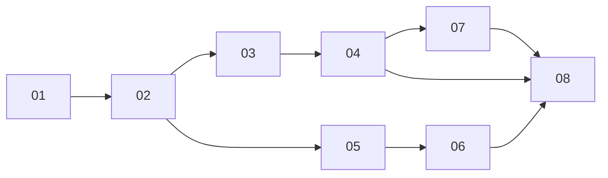

# Live updates for pod-sourced state — sessions and files

> Working plan — temporary, committed on the feature branch. Deleted once the feature ships.

**Issue:** https://github.com/dam-agents/dam/issues/3307
**Decision:** [ADR-084](../../adrs/084-pod-owned-live-updates.md)

## Goal

The session list and the Files panel stop lagging behind reality. A session started by a schedule, and a file produced by a running task, appear when they happen instead of on the next poll tick. An agent nobody is looking at produces no reporting traffic at all.

Three surfaces poll today: the session list every 5s, the workspace tree every 2s, and the open file's full contents every 2s. A fourth was added later — the Home feed lists sessions for *every running agent* every 15s, opening and closing a WebSocket per agent per tick.

## Approach

Read [ADR-084](../../adrs/084-pod-owned-live-updates.md) first; it carries the reasoning and the rejected alternatives. The short version:

Pod-owned state is read and observed over **the agent-runtime's own tRPC surface**, exposed over WebSocket alongside the existing HTTP handler and relayed by the api-server as a fourth relay beside ACP, terminal and SSH. A **Watch** is a pod-side observer whose lifetime *is* its subscription — that is what makes "unobserved agent, no traffic" structural rather than aspirational.

Architecture pages this touches: [platform-topology](../../architecture/platform-topology.md) (live updates, protocols, the ui section) and [agent-lifecycle](../../architecture/agent-lifecycle.md) (reachability, hibernation signals). Both currently state the polling as fact and are updated in sub-issue 08.

Four rules every slice must respect:

1. **A notice means "re-read", never "here is the value."** Every consumer needs a query path. This holds for liveness too — a terminal session's working state has no falling edge to push, so the pod times it out and emits an ordinary notice.
2. **Sync-on-subscribe is the entire loss bound.** Every subscription opens with a notice meaning "re-read everything you map", and there is no steady-state poll behind it. This mirrors `events.owner` exactly (see `packages/api-server/src/modules/live-events/services/live-events-service.ts` — the pending queue is seeded with `sync` *before* subscribing, so nothing slips between).
3. **The harness stays authoritative over which sessions exist.** The platform unions and enriches; it never maintains a competing list.
4. **Watching does not keep an agent alive; being used does.** See the relay policy below — getting this wrong either pins the fleet awake or hibernates a pod under someone's editor.

### The relay policy, in one place

The new per-agent relay is the third activity policy on this surface, and every slice that touches it needs the same rules:

| | Behaviour |
|---|---|
| Readiness at upgrade | Passive — check the controller's `Ready` condition and fail closed. Never `ensureReady`, so opening an agent page cannot wake it. Matches the panel's existing `useIsAgentOperable` gate. |
| Session pin | None. A tab left open must not hold a pod. |
| Activity stamp | A periodic refresh while a **user-facing** relay is open, at the 30s interval the other relays already use. Unconditional on a timer, **not** driven by frame inspection. |
| Server-held streams | Stamp nothing, pin nothing, wake nothing. |

**Why the stamp is on a timer and not on traffic.** tRPC's WebSocket keepalive sends the literal string `"PING"` as a *data* frame every 5s and the server answers `"PONG"` — they are not protocol-level ping frames. Any rule of the form "bump on client→pod frames" therefore fires forever on an idle connection. A plain timer sidesteps this entirely and means the relay never inspects frame contents.

**Why a stamp is needed at all.** `last-activity` is not just a hibernation input, it is the wake mechanism: `shouldRun` (`packages/controller/pkg/reconciler/hibernation.go`) is what the reconciler uses to pick the replica count, so writing a fresh timestamp is what scales a hibernated agent up. The pod's `/api/status` probe cannot replace it — the probe is a level with no memory ("am I working now"), so without the timestamp there is no idle grace period, and a pod that does not exist cannot be probed. Attached channels do not count as work for that probe, so a user editing files with no chat session open is invisible to it.

## Sub-issues

| #  | Title | Scope | Depends on |
|----|-------|-------|------------|
| 01 | Pod tRPC over WebSocket, and the agent relay | Pod serves its existing router over WS; api-server adds the fourth relay with the policy above. No UI change. | — |
| 02 | Per-agent UI client moves to WebSocket | `createAgentTrpc` becomes a WS client; unreachability from connection state; reachability probe retires. | 01 |
| 03 | `sessions.list` on the pod router | agent-runtime composes the list (harness ∪ own store, closing the ADR-055 gap); UI reads it over the per-agent client. Poll stays. | 02 |
| 04 | Session Watch | `sessions.watch`, terminal falling-edge timer, widened PTY window; UI drops the 5s poll. | 03 |
| 05 | Workspace tree Watch | Pod-side watch machinery + tree topic; UI drops the 2s tree poll. | 02 |
| 06 | Open-file Watch | Reuses 05's machinery for one path; UI drops the 2s content refetch. | 05 |
| 07 | Home feed on an owner subscription | Owner-scoped subscription, lease-elected holder, per-`agentId` notices; UI drops the 15s fan-out. | 04 |
| 08 | Architecture docs | platform-topology and agent-lifecycle both state the current polling as fact. | 01–07 |

## Conventions & glossary

Terms are defined in [`docs/ubiquitous-language.md`](../../ubiquitous-language.md) under **Live Updates** — added by this feature's ADR commit. The load-bearing ones:

- **Watch** — a pod-side observer whose lifetime is its subscription.
- **Live Event** — the invalidation notice: a Topic plus ids, never entity state.
- **Sync** — the opening notice meaning "re-read everything you map".
- **Signal** and **Domain Event** are *not* this — they are ADR-083's cross-replica Redis message and in-process announcement respectively. Don't reuse either word here.

Apply [`/typescript-engineering`](../../../.claude/skills/typescript-engineering/SKILL.md) for server-side TypeScript (api-server, agent-runtime, the contract packages) and [`/react-ui-engineering`](../../../.claude/skills/react-ui-engineering/SKILL.md) for anything in `packages/ui`. Run `mise run ui:fix` after UI edits and `mise run common:check:comment-types` after any code change.

Never invoke `pnpm`, `go`, `kubectl` or `helm` directly — `mise run` only. Cluster work goes through the [`cluster-ops`](../../../.claude/skills/cluster-ops/SKILL.md) skill.

## Whole-feature smoke test

Against a real cluster (`mise run cluster:install`, then `mise run cluster:status`):

1. Open an agent's chat. In a second terminal, `kubectl exec` into the pod and `touch ~/work/hello.txt` — it appears in the Files panel without a 2s wait. Delete it; it disappears.
2. Open a file in the panel. Append to it from inside the pod; the contents update.
3. With DevTools' network tab open on the chat view, confirm no repeating `files.listDirs` or `session/list` traffic while idle, and exactly one open WebSocket per agent.
4. Create a schedule that fires within a minute, then close the chat view and reopen it. The schedule's session appears in the sidebar as soon as it fires — including before its first turn completes, which is the ADR-055 gap this closes.
5. Open Home with several running agents. Confirm one refetch scoped to the agent that changed, and no per-agent WebSocket churn.
6. Leave the chat view open on an agent with no session selected. Confirm `last-activity` is patched roughly every 30s, not every 2s: `kubectl get agent <id> -o jsonpath='{.metadata.annotations}'` twice, 10s apart.
7. Leave a tab on Home and stop touching it. Confirm agents still hibernate on schedule — the lease-held streams must not hold them up.

## Delivery

Each sub-issue is one atomic commit. The whole feature lands as a single PR for [#3307](https://github.com/dam-agents/dam/issues/3307). The final commit deletes this folder — the `Plan check` CI job fails while `docs/plan/` exists, so the PR cannot merge until it is gone.
