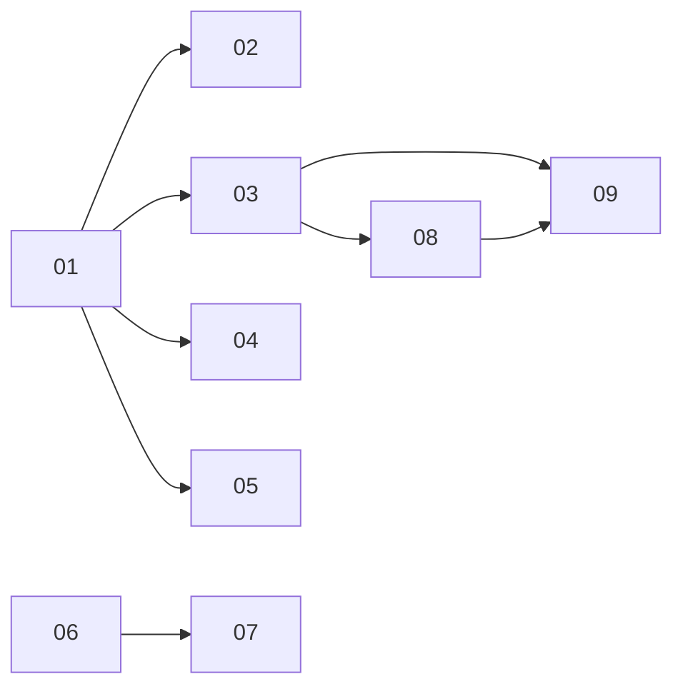

# A Home page: an activity feed, contextual widgets, and approvals wherever you are

> Working plan — temporary, committed on the feature branch. Deleted once the feature ships.

**Issue:** [#3317](https://github.com/dam-agents/dam/issues/3317)

## Goal

A user arriving in the product sees, in one screen and without navigating, what needs a decision from
them and what is still working. Home becomes that screen: a feed down the left, contextual widgets
down the right, and approvals actionable from wherever the user happens to be. `/inbox` — today's
single-purpose approval queue and landing surface — folds into it.

Today approvals are reachable only by leaving the page you are on, the sandbox list shows pod state
so a sandbox mid-turn looks identical to one merely awake, and compute and spend are visible only
per sandbox.

## Approach

**The prototype is the design, and it lives on a branch.** `design/home-prototype`. Add a worktree,
run `mise run ui:mock` from it, and open `/prototype.html`; the state strip switches between empty,
populated and cleared states, and `/compare` is the component reference. Work from that prototype
only — earlier prototypes, including the `prototype.html` attached to the issue, are superseded.

**The prototype is a reference, not code to merge.** It is ~30k lines of `checkpoint:` exploration on
a branch that forked 143 commits back; merging costs 27 conflicted files and drags in a parallel
implementation of the creation flows that [#3234](https://github.com/dam-agents/dam/issues/3234)
already shipped. Lift each component's structure and markup by hand into a real `modules/home`, and
rewrite its data layer against live queries:

- `modules/home/views/home-view.tsx` (1,910 lines) holds the current design as thirteen named,
  separable components — `FeedFilterBar`, `FeedFilterDropdown`, `FeedApprovalCard`,
  `ResolvedApprovalCard`, `RunningSection`, `ScheduledSection`, `BlockedCardsStacked`,
  `CardTypeFilter`, `HomeCreateScheduleModal`, `FeedDashboardLayout`. Take the shapes, not the file.
- `components/floating-approvals-pill.tsx` (342 lines) is standalone and closest to reusable.
- `modules/home/views/comparison-view.tsx` (6,325 lines) is the `/compare` catalogue. Never ships.
- Every `modules/home/home-*-data.ts` is a mock fixture. None of it comes across.
- `modules/home/components/ready-section.tsx` and `ReadySection` in the view are dead code from an
  earlier checkpoint — no call sites, never rendered. There is no "Ready for you" section.

**The prototype page runs at a 15px root font-size; the app runs at 16px.** Tailwind spacing is
rem-based, so the same classes compute ~7% larger in the app — `p-5` is 18.75px there and 20px here,
`py-3` 11.25 against 12. Copying classes faithfully still yields a taller component, and the gap
compounds with nesting. Measure against the prototype and trim the app side to match, biasing slightly
under rather than over. Do not chase parity by rewriting the root font-size.

**The feed is current state, not history.** This is the decision the whole plan rests on. The feed
carries exactly three things, all of them "now":

| Feed content | Source | Ready? |
| --- | --- | --- |
| Approvals (*needs attention*) | `approvals.listForOwner` — pending only, which is all that interests us | Yes |
| Running sessions (*in progress*) | `agents.list` filtered to `state === "running"`, then `agents.backgroundWork` per agent — a tRPC call, not an ACP dial | Yes |
| Unread sessions | ACP `listSessions` per **running** agent, unread being `updatedAt` later than `seenAt` | Yes, for running sandboxes |

Because the feed is current state, a hibernated sandbox legitimately has nothing to show, and none of
this needs a stored activity log. In particular the platform's `activity_events` table is **not** a
source here: [usage-tracking](../../architecture/usage-tracking.md) is operator-facing, pseudonymizes
every owner id at the write boundary, and gates reads behind the separate `platform-inspector` role.

**The one place unread is imperfect.** `seenAt` lives in the agent-runtime's session metadata store,
inside the sandbox pod — not Postgres — so unread is knowable only for running sandboxes. That is a
deliberate, accepted limitation for this feature, not an oversight: covering hibernated sandboxes
would mean tracking read state per user in Postgres, which is a separate decision for the team.

**Decisions taken with the user.** These are settled; do not relitigate them while implementing:

- **No "Ready for you" / done-and-unseen section**, and no stored read state.
- **No page-level time-range control.** An earlier prototype scoped the whole page by "since last
  visit"; it is gone. The only period control lives inside the spend widget, where a range means
  something.
- **Unread is scoped to running sandboxes**, per above.
- **Dismiss and clear-all persist.** Marking read today only happens when a session is loaded,
  engaged or prompted, so slice 04 adds a `platform/markSeen` ACP ext-method — the same shape as the
  existing `platform/deleteSession`. Dismiss does **not** apply to approvals or to running sessions;
  those clear when they are actioned or finish.
- **`/inbox` disappears.** The pending count moves to the Home rail icon and unresolved approvals
  render on Home.

**One contract change only.** `schedules.list` requires an `agentId`; the widget needs an owner-wide
list. Everything else reads contracts that already exist: `approvals.listForOwner`,
`agents.list`/`backgroundWork`, `budgets.reserved`, `metrics.spendBreakdown` (owner-wide when
`agentId` is omitted), `artifactLibrary.list`, and the schedule mutations.

## Sub-issues

| #  | Title | Scope | Depends on |
|----|-------|-------|------------|
| 01 ✅ | Home module, two-column shell, feed spine | The route, the layout, the three feed sources, chronological ordering | — |
| 02 ✅ | Feed filtering | Status filter and sources in/out | 01 |
| 03 | Inline approval cards | Approvals in the feed with the full action set and their resolved state | 01 |
| 04 | Dismiss, clear all, and `platform/markSeen` | Feed dismissal that survives a reload | 01 |
| 05 | Compute and spend widgets | Per-agent CPU/memory bars; spend with its period toggle | 01 |
| 06 | Owner-wide schedule list | The one contract change | — |
| 07 | Schedules widget | Top-five list, "See all" modal, toggle, inline create and edit | 06 |
| 08 | Floating approvals pill | The pill and its mini panel on every non-Home page | 03 |
| 09 | Retire `/inbox` | Route folded into Home, badge moved, copy and the e2e spec | 03, 08 |

## Conventions & glossary

- **Feed** — the chronological left column. **Feed item** — one card in it. **Widget** — one block in
  the right-hand column. **Pill** — the floating approvals affordance on non-Home pages.
- **Unread** means a session whose `updatedAt` is later than its `seenAt`. Derived, never stored.
- Apply the `/react-ui-engineering` skill throughout. Slices 04 and 06 also touch server-side
  TypeScript (`packages/agent-runtime`, `packages/api-server`) — apply `/typescript-engineering`
  there, and read the subsystem's architecture page before changing its behavior.
- State lineage: feed and widget data are **server state** and belong in TanStack Query. Filter
  selections are **UI-local** to Home. Nothing here belongs in `sessionStorage`.
- `modules/home` is a new module. Keep components small enough to read in one sitting; the
  prototype's single 1,910-line view is the anti-pattern this plan exists to avoid.
- Fanning out per running agent is inherent to the feed. Bound it to `state === "running"` — never
  dial a hibernated pod, and never wake one to render a page.
- Run `mise run ui:fix` after edits, then `mise run --force ui:check` and `--force ui:test`. Always
  pass `--force` — mise caches per task and will otherwise report a check it skipped. Slice 04 also
  runs `--force agent-runtime:check` and `--force agent-runtime:test`; slice 06 also runs
  `--force api-server:check` and `--force api-server:test`.
- No code comments except the registered typed prefixes. Never hardcode the brand.
- Home is the landing route for every signed-in user, including one with no sandboxes.

## Whole-feature smoke test

On the Vite dev server, signed in, with at least two sandboxes (one running) and one schedule:

1. Sign in and land on Home. The feed lists pending approvals, running sessions and unread sessions
   from running sandboxes, newest first.
2. Filter to *In progress*, *Unread* and *Needs attention* in turn; each shows only matching items.
   Toggle sources out and back in.
3. Trigger an approval, confirm it appears inline, that Allow and Deny both work from the feed, and
   that the card moves to its resolved state.
4. Dismiss an unread item, reload, and confirm it stays dismissed. Clear all and confirm the same.
   Confirm approvals and running sessions are unaffected by both.
5. Confirm the compute widget shows a bar per agent against the ceiling, and that the spend widget's
   1d/1w/1m/1y toggle changes the figures.
6. Confirm the schedules widget lists up to five across all sandboxes, that enable/disable sticks,
   that "See all" opens, and that inline create and edit round-trip.
7. Navigate to a sandbox and confirm the approvals pill appears, expands, actions a request, and
   disappears once nothing is pending.
8. Visit `/inbox` and confirm it lands on Home, with the rail badge count now on Home.
9. Open Home with no sandboxes and confirm it explains itself rather than showing empty blocks.
10. Hibernate every sandbox and confirm Home degrades honestly — no unread section, nothing woken.
11. `mise run --force ui:check`, `--force ui:test`, `--force agent-runtime:test`,
    `--force api-server:test` and `--force common:check:comment-types`.

## Delivery

Each sub-issue is one atomic commit. The whole feature lands as a single PR for
[#3317](https://github.com/dam-agents/dam/issues/3317).

The branch starts from `feat/3234-per-feature-setup` (PR #3352), which retires the creation wizard
and owns `list-view.tsx`, `icon-rail.tsx` and the routes this feature edits. Rebase onto `main` once
#3352 merges.
