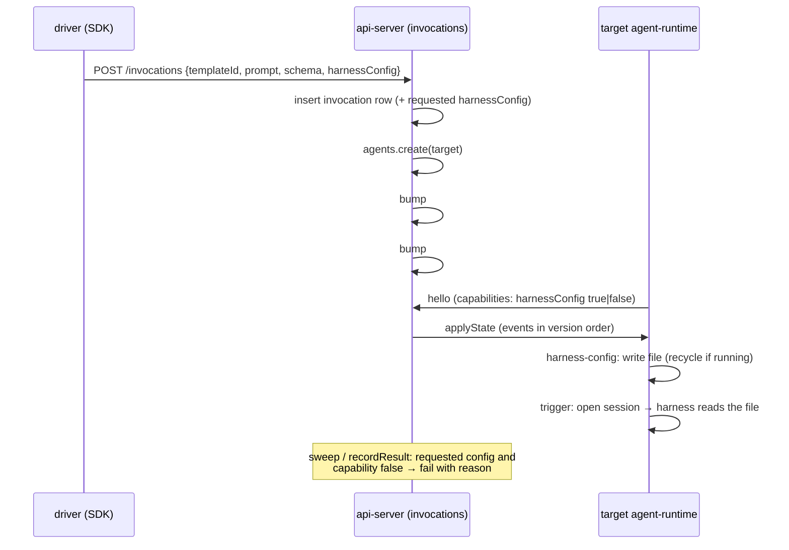

# A spawn chooses the model its sub-agent runs

> Working plan — temporary, committed on the feature branch. Deleted once the feature ships.

**Issue:** https://github.com/dam-agents/dam/issues/3422

## Goal

A driver that spawns a sub-agent (an Invocation) can choose the child's model, and the other
harness config values the Config panel offers (mode, and config options such as effort). One
template then serves any model choice. A driver can run one task across models and compare
the results and the cost. It can also send hard subtasks to a frontier model and mechanical
ones to a cheap model.

A child that cannot apply the requested config fails fast with a reason. It never reports a
result from its default model, because that would corrupt a model comparison with no error.
All four catalogue harnesses (Claude Code, Codex, Pi, Bob) support the choice.

If the spawn names no config, the child runs as today: the template default, the seeded model,
or a connection's model pin.

## Approach

Read these architecture pages first:
[harness-config](../../architecture/harness-config.md) (what the `harness-config` event means),
[runtime-delivery](../../architecture/runtime-delivery.md) (events, ordering, capability gating),
and [experiments](../../architecture/experiments.md) (the spawn contract, its fail-fast checks,
and "a failed spawn says why").

**No new mechanism.** The `harness-config` runtime event is already *the*
model/mode/config-defaults mechanism. Today the Config panel is its only producer. A spawn
becomes the second producer. After `InvocationsService.spawn` creates the target agent, it
queues one `harness-config` event with the requested values, then queues the trigger. The
agent-runtime runs an agent's events in order. So the config file is written before the
trigger opens the child's first session, and the harness reads the file when it spawns.
If the harness already runs, the existing config recycle restarts it before the turn. The
model seed never overwrites the value: the seed runs only while the file has no model.

**Two bumps, not one.** Pending events are ordered by their outbox `version` only
(`outbox-repo.ts` `pendingEvents`). Events inserted in one `RuntimeMutator.bump` share a
version, so their relative order is undefined. The config event gets its own `bump` before
the trigger's `bump`.

**What a spawn does not do.** No person acts, so the spawn emits no `HarnessConfigChanged`
activity event. It also writes no harness-config snapshot: the target is a temporary agent
reaped at terminal, and the live read covers it while it runs. It never sends `unset`, because
a fresh child has nothing to clear.

**No up-front value check.** The api-server cannot know a template's catalog before a target
pod boots: the catalog comes on `hello`, and Pi, Bob and Codex discover their model list live
from the provider. The values pass through verbatim. A wrong model name fails the child's
first turn, and the invocation then waits until its TTL. A missing model connection behaves
the same way today. The skills document the valid values and advise a short TTL.

**Fail fast when the child cannot apply it.** A target whose image declares no
`harness-config` driver reports `harnessConfig: false` (or no flag) on `hello`. For such a
target the event is a no-op. An invocation that asked for a config records it on its row.
The liveness sweep fails it once the target has registered without the capability. `recordResult`
refuses a result in the same case, because the sweep ticks every 60 s and a quick child could
report first.

**Codex gets a `harness-config` driver.** It is the only catalogue harness without one. Its
scripts pass `-c model="$OPENAI_MODEL"` from the connection env, and a `-c` flag outranks the
config file. So slice 03 also makes a model in the file outrank that env pin. Bob follows the
same rule (`bob-settings.mjs`: panel value first, `BOB_SHELL_MODEL` second). Codex agents also
get the model picker in the Config panel, because the UI gates that section on the capability.



## Pinned contract

The field-level source of truth is `packages/api-server-api/src/modules/invocations/schemas.ts`.
Both SDKs implement against this shape.

`POST /api/agents/:id/invocations`: the request body gains one optional field:

```ts
harnessConfig?: {
  model?: string;                        // min length 1
  mode?: string;                         // min length 1
  configOptions?: Record<string, string>; // keyed by the target catalog's option id
}                                        // refine: at least one of the three is present
```

- The values are the target harness's own catalog values, the same ones its Config panel
  offers. The platform passes them through verbatim, so the event payload equals this object.
- Reuse `agentConfigOptionsSchema` from `packages/api-server-api/src/modules/harness-config/schemas.ts`.
- Name the schema noun-first, `invocationHarnessConfigSchema`. It lives in the browser-safe
  `schemas.ts`.

`GET /api/agents/:id/images`: each entry gains `harness?: string`, the template's harness
family (`claude-code | codex | pi | bob`) from `TemplateSpec.harness`. The driver uses it to
pick the value list for a template id it does not know by name.

`GET /api/agents/:id/invocations/:invocationId`: no shape change. A fail-fast failure arrives
as `status: "failed"` plus `errorReason`.

SDKs use flat options that map onto `harnessConfig`. They send the object only when at least one
option is given:

| SDK | Options |
|---|---|
| JS `driver-sdk` `spawn()` | `model`, `mode`, `configOptions` |
| Python `experiment_sdk.spawn()` | `model=`, `mode=`, `config_options=` |

Values per harness, for the skills (slice 01 writes them; slice 03 adds Codex):

| Harness | `model` | `mode` | `configOptions` |
|---|---|---|---|
| claude-code | `fable`, `opus`, `sonnet`, `haiku` (static catalog) | permission mode. Leave it unset for an unattended child: `default` asks approvals nobody answers | `effort`: `low`, `medium`, `high`, `xhigh` (Haiku takes none) |
| pi | a name from the provider's model list (live discovery) | thinking level: `off` … `xhigh` | — |
| bob | a name from the provider's model list (live discovery) | `agent`, `plan`, `ask` | `approvals`: `auto` (`ask` stalls an unattended child) |
| codex (slice 03) | a name from the provider's model list (live discovery) | — | `effort`: the installed Codex's `model_reasoning_effort` values |

The catalogues live in each image's `runtime-manifest.yaml` under `packages/agents/`. Take the
values from there, not from this table, when the two differ.

## Sub-issues

| #  | Title | Scope | Depends on |
|----|-------|-------|------------|
| 01 | [A spawn sets its child's harness config](./01-spawn-sets-harness-config.md) | Contract field, the two-bump event queue in the service, `/images` harness family, both SDKs, both skills, architecture docs | — |
| 02 | [A child that cannot apply it fails fast](./02-unapplied-config-fails-fast.md) | Store the requested config on the invocation row (migration), fail it in the liveness sweep and in `recordResult`, JS SDK surfaces `errorReason`, docs | 01 |
| 03 | [Codex honors a harness config](./03-codex-harness-config.md) | Codex `runtime-manifest.yaml`, a model in the file outranks the `OPENAI_MODEL` pin, Dockerfile, Codex README, skills table row | 01 |

03 comes after 02 on purpose. Until 03 lands, Codex is a real "cannot apply" case, and 02's
smoke test uses it.

## Conventions & glossary

- **Driver / target / Invocation.** The ubiquitous-language terms
  ([Invocations](../../ubiquitous-language.md)). "Child" and "sub-agent" in this plan mean the target.
- **Harness config.** The model/mode/config-options triple the `harness-config` event carries.
  Do not introduce a new domain term for it.
- **Capability.** The `harnessConfig` flag a target advertises on `hello`, stored as the
  agent's `runtimeCapabilities` (`runtimeDelivery.agentsRuntimeRepo`). `null` means the
  target has not registered yet: keep waiting, never fail on it.
- Apply `/typescript-engineering` to all api-server and contract changes (three-layer slice:
  services, domain, infrastructure; ports injected through `compose.ts`; cross-module access
  only through a module's `index.ts`).
- There are no UI changes. The Codex Config panel section appears on its own through the
  existing capability gate.
- **Tests:** do not add tests. Keep the existing suite green: the invocations unit tests under
  `packages/api-server/src/__tests__/unit/invocation*.test.ts` build the service and the sweep
  by hand, so a new dependency must be threaded through them. Verification is
  `mise run check`, `mise run test`, and each slice's manual smoke test.
- **Comments:** follow [`docs/guidelines/comment-guidelines.md`](../../guidelines/comment-guidelines.md)
  and run `mise run check:comment-types`.
- **Docs:** follow [`docs/guidelines/documentation-guidelines.md`](../../guidelines/documentation-guidelines.md).
  Pitch at the level of meaning, not field names. Bump `Last verified:` on each edited page.
  `runtime-delivery.md` has about 150 chars left under the 40,000-char cap, and
  `agent-lifecycle.md` about 40. Keep any edit there net-small, or leave those pages alone.
- **Dev cluster:** use `mise run cluster:build-apiserver` for api-server changes and
  `mise run cluster:build-agent` for image changes (the driver-sdk ships in `platform-base`,
  so every harness image carries it). App URL: `http://localhost:4444`. Use `mise run cluster:kubectl`,
  never bare `kubectl`.

## Whole-feature smoke test

On the dev cluster, after all three slices, rebuild everything: `cluster:build-apiserver`,
then `cluster:build-agent`.

1. Create a Claude Code driver agent with a model connection. Open a shell in its pod
   (`dam ssh`, or `mise run cluster:kubectl -- exec`).
2. Write and run a `node` script with `/usr/local/lib/driver-sdk.mjs` that spawns the same
   prompt three times, in parallel. The prompt: "Report the exact model id you are running as."
   The schema: `"string"`. The three spawns:
   - `template: "claude-code", model: "haiku"`
   - `template: "claude-code", model: "opus", configOptions: { effort: "low" }`
   - `template: "codex", model: <a name from the Codex agent's Config panel list>`

   Expect three results that name three different models.
3. On the Usage surface (per-model rollup), the driver's spend now shows the Haiku, Opus and
   Codex model ids.
4. Negative path: spawn a raw `image:` whose manifest declares no `harness-config` driver,
   with `model: "haiku"`. The mock agent image, or `platform-base`, qualifies if the cluster
   carries one. Expect the SDK to throw within about a minute of the target booting, with an
   `errorReason` that says the target cannot apply the requested harness config.
5. Spawn with no `model`. Expect behavior unchanged from `main`.
6. Open a Codex agent's Config panel. It lists models, and a pick lands in
   `~/.codex/config.toml` and survives a harness restart.

## Delivery

Each sub-issue is one atomic commit. The whole feature lands as a single PR for
https://github.com/dam-agents/dam/issues/3422.
