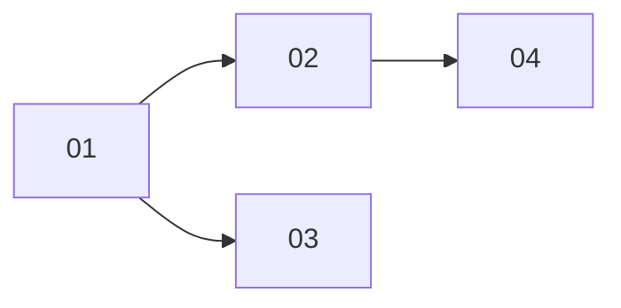

# Spawn a sub-agent through a tool call

> Working plan — temporary, committed on the feature branch. Deleted once the feature ships.

**Issue:** https://github.com/dam-agents/dam/issues/3424

## Goal

An agent can hand a task to a platform sub-agent from its normal tool-use flow, without
writing a script. It spawns one or more sub-agents with a tool, waits on them with a
second tool, and gets each typed result back. If it ends its turn first, the platform
wakes it with the outcome. Script orchestration through the driver SDK keeps working
unchanged; the tools cover the everyday "hand this off and give me the result" case.

## Approach

Read [invocations](../../architecture/invocations.md) first; this feature adds a second
front door to it. The Invocation, its spawn, Provider Inheritance, Attenuation, Admission,
outcomes and the Invocation Pin stay as they are. The model reaches them through tools on
the **platform MCP server** (`packages/api-server/src/apps/harness-api-server/mcp-endpoint.ts`),
the server that already carries `report_result`, so every harness gets them.

The design mirrors **Satellites**, the other job-like tool family on the same server
([satellites](../../architecture/satellites.md) § Jobs,
`packages/api-server/src/modules/satellites/mcp-tools.ts`,
`packages/api-server/src/modules/satellites/services/outcome-delivery.ts`): start returns
a reference, a wait tool long-polls under Node's 300 s request timeout, and an outcome the
agent was not waiting for is delivered as a new turn.

### The tools

| Tool | Does |
|---|---|
| `invoke_agent` | Spawns one Invocation. Same inputs as `POST /api/agents/:id/invocations` (`spawnInvocationRequestSchema`): `prompt`, `schema` (JSON Schema, **required**), `harness` or `image`, optional `label`, `ttlMs`, `connections`, `seed`, `install`, `env`, `resources`, `backend`, `skills`. Returns at once with the id. |
| `await_invocations` | Takes **required** `ids`. Returns as soon as any listed child is terminal, or after the wait bound, with: done (result), failed (reason), still running. An id that is not this agent's child is reported as unknown. Passing a finished id again returns it again. |
| `list_harnesses` | What `GET /images` returns: each template's harness, name, description, effective size. |
| `list_connections` | What `GET /connections` returns: the driver's own granted connections (id, name, hosts). |
| `get_budget` | What `GET /budget` returns: reserved CPU/memory and the default worker size. |

### Decisions

- **Naming follows "invocation"** (the leading option in the #3423 naming discussion, not
  final): tools `invoke_agent` / `await_invocations`; descriptions say "invoke an agent" and
  contrast with "your harness's own subagents". If the discussion lands elsewhere, the
  names live in `apps/harness-api-server/invocation-tools.ts` and the slices after it.
- **Polling, long-poll bound 240 s.** Same bound and reason as `DEFAULT_SATELLITE_WAIT_MS`:
  under Node's 300 s request timeout, which the harness server does not override. No
  harness MCP timeout is changed. The wait re-reads the rows every ~2 s; there is no
  terminal invocation event, and a row read works on any replica.
- **Wake only for tool spawns.** A child spawned by `invoke_agent` whose outcome no
  `await_invocations` call has returned is delivered to its driver as a turn, like a
  satellite outcome. Script spawns are never pushed: the SDK polls, and an extra turn per
  child would disturb the script's driver.
- **Depth cap stays 16** (`MAX_CHAIN_DEPTH`, `driver-resolution.ts`). Children get the same
  tools; deadlines, the budget Ceiling and Driver Cascade bound a runaway chain.
- **Need-based rule in the description.** `invoke_agent`'s description tells the model
  to prefer its built-in sub-agent tool (same sandbox, starts in seconds, no compute) and
  to spawn only when the task needs one of: another harness, its own setup (repo, install,
  env), more resources or a VM backend, isolation from this workspace, heavy parallel work,
  or a schema-checked result. It names the cost: a new sandbox, tens of seconds to minutes
  to start, compute against the budget.
- **Spawn line in the result.** `invoke_agent`'s text result includes the SDK's progress
  line `[invoke] spawned <label> -> <id>`, so the Delegation block from #3425
  (`packages/ui/src/modules/invocations/lib/fan-out.ts`) anchors on the tool chip without a
  second recognition path.

### Branch base

This branch starts from `feat/3425-delegation-visibility` (Delegation block, durable
Invocation record, child conversation capture) and is rebased onto `main` once #3425
lands. The feature is not finished before that.

## Sub-issues

| #  | Title | Scope | Depends on |
|----|-------|-------|------------|
| 01 ✓ | Invocation tools on the platform MCP server | Five MCP tools; shared spawn-request resolution for routes and tools; long poll; invocations page | — |
| 02 ✓ | Wake the driver when a tool-spawned child ends | Origin and delivery columns, outcome delivery and hourly retry, `invocation-outcome` event kind in the runtime | 01 |
| 03 | Delegation card for tool spawns | Card anchors on the `invoke_agent` chip; `await_invocations` chips render compact | 01 |
| 04 | `dam-invoke` skill leads with the tools | Tools first with the need-based rule; scripts for orchestration | 01, 02 |

## Conventions & glossary

- **Driver**, **target**, **Invocation**: as in [invocations](../../architecture/invocations.md).
  Model-facing text says "invoke an agent" / "invoked agent" and contrasts it with the
  harness's own subagents (see Decisions: naming).
- **Tool spawn** / **script spawn**: an Invocation created by `invoke_agent` / by
  `POST /invocations` from the driver SDK.
- **Outcome turn**: a turn the platform opens on the driver carrying a finished child's
  result or failure reason.
- Apply `/typescript-engineering` for everything under `packages/api-server`,
  `packages/api-server-api`, `packages/agent-runtime*`, and `/react-ui-engineering` for
  `packages/ui`.
- Follow `docs/guidelines/comment-guidelines.md` and run `mise run check:comment-types`.
- Use `mise run` for every build, check, test and cluster step.

## Whole-feature smoke test

On the local cluster (`cluster-ops` skill), with the branch deployed:

1. In a Claude Code agent's chat, ask: "Hand this to a sub-agent on claude-code: compute
   6 * 7 and return it as an integer." The model calls `list_harnesses` (optionally),
   `invoke_agent`, then `await_invocations`, and answers 42.
2. The chat shows a Delegation block on the `invoke_agent` chip with the child's status,
   cost and result; `await_invocations` chips read compact. After it finishes, "Open
   conversation" shows the child's transcript.
3. Ask for a child that sleeps ~5 minutes before reporting, and tell the agent to end its
   turn without waiting. When the child finishes, a new outcome session opens on the
   driver with the result.
4. A script spawn through `dam-invoke` still works and opens no outcome turn.
5. `mise run check` and `mise run test` pass.

## Delivery

Each sub-issue is one atomic commit. The whole feature lands as a single PR for
https://github.com/dam-agents/dam/issues/3424, after #3425 merges and this branch is
rebased onto `main`.
