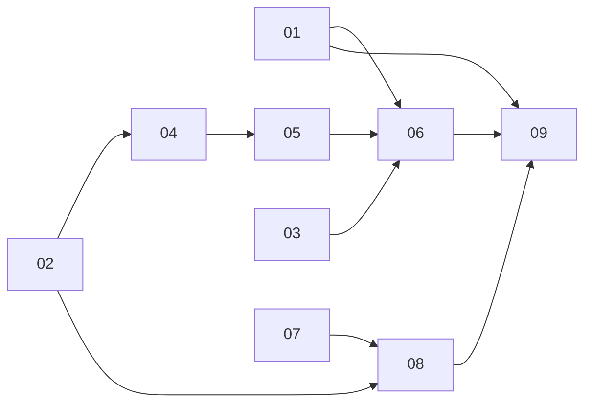

# Delegation visibility on the driver's session

> Working plan — temporary, committed on the feature branch. Deleted once the feature ships.

**Issue:** https://github.com/dam-agents/dam/issues/3425
**Decision:** [ADR-093](../../adrs/093-durable-delegation-record.md)

## Goal

When an agent fans work out to sub-agents, the user sees it in the chat where it happened:
an expandable Delegation block in the driver's message, one row per child with status, cost
and returned result, nested for grandchildren. A finished child can be opened and its
conversation read. All of it survives reload and the child's teardown.

Today the only trace is the raw Bash tool chip whose stderr names the child ids. The
Invocation row is deleted ten minutes after the child ends, the child's conversation dies
with its volume, and the prompt the child received is never stored.

## Approach

Nothing changes in how an agent fans out. The driver still runs the `dam-invoke` skill's
node script against the driver SDK, the SDK still posts to the harness API and polls, and
the child is still a throwaway Agent reaped the moment it reports. What changes is that the
platform remembers the delegation:

- **The Invocation row becomes the durable delegation record** (ADR-093). It stays for the
  root driver's lifetime, gains the fields the UI needs, and goes with the root driver's
  agent-scoped cleanup. Pages: [agent-lifecycle](../../architecture/agent-lifecycle.md),
  [persistence](../../architecture/persistence.md).
- **The driver's transcript is the anchor.** The Bash tool chip already carries
  `[invoke] spawned <label> -> <id>` lines. The UI recognises that chip, extracts the child
  ids, and renders the Delegation block in place of the raw text. Replay of the driver's
  history restores it for free. No session attribution is needed on the server.
- **Cost is read live from telemetry**, grouped by the trusted `platform.invocation.id`
  the child's gateway already stamps ([observability](../../architecture/observability.md)
  § Trusted attribution). It ages out with the telemetry store's 30-day retention, like
  every other cost view. Page: [metrics](../../architecture/metrics.md).
- **The child's conversation is captured at teardown into object storage** through the
  existing artifact store, and the record keeps the key. A finished child opens read-only
  from the stored frames.

Out of scope, as the issue and the ADR state: reviving a finished child for follow-up
questions (a later decision, seeded from the stored frames), and showing background
processes as a level below sub-agents.

### Two sub-agent mechanisms, one in scope

Claude Code's own Agent tool also works over ACP: the adapter emits it as a nested tool call
in the same session, same pod, same model connection, cost pooled into the driver. It has no
own session, telemetry or image, so nothing in this plan applies to it. This plan covers
**Invocations** only: children that are real platform Agents.

### Decisions worth stating once

- **Retention follows the root driver, not the immediate parent.** A grandchild's record
  must survive its parent's reaping, so every row carries `root_driver_id` and cleanup keys
  off that. The existing `resolveRoot` walk already computes it at spawn.
- **The child Agent is reaped exactly as today.** Eager delete on report, liveness sweep on
  deadline or pod restart, driver cascade on driver delete. Only the row deletion ten minutes
  after terminal is removed.
- **Capture happens before the delete, best effort, bounded.** A child whose pod does not
  answer within the capture budget yields a record without a conversation, never a failed
  reap and never a blocked `report_result`.
- **The stored conversation is ACP frames, not a rendered document.** One `session/update`
  JSON-RPC frame per line, the exact shape the runtime's history providers already produce
  and the UI's `applyUpdate` reducer already folds. No new format.
- **A running child opens live, a finished child opens stored.** While the child Agent
  exists the block opens its chat like the experiments dock does today. Once it is gone the
  block opens the stored frames read-only.
- **Fan-out recognition rides the SDK's stderr lines, not a new tool.** The recogniser is a
  line regex on the chip content. The SDK gains a `label` on the spawn request so the record
  can show the same name the driver printed.

### The contracts both halves implement against

Pinned here so the backend and UI slices can proceed in parallel.

**Recogniser (UI side, slice 06)** — a tool chip is a fan-out when any content line matches:

```
^\[invoke\] spawned (?<label>.+?) -> (?<id>agent-[a-z0-9]+)$
```

Ids are then validated by the read path; an id the driver never spawned is dropped.

**tRPC, `invocations` namespace** (`packages/api-server-api/src/modules/invocations/`),
all `readAgentProcedure` + `checkAgentBinding(ctx, input.driverAgentId)`:

```ts
// slice 04
invocations.tree({ driverAgentId: string; ids: string[] })
  -> { nodes: DelegationNode[] }          // one per requested id, children nested

interface DelegationNode {
  id: string;                              // child agent id == invocation id
  title: string;                           // label, else first prompt line, truncated
  label: string | null;
  driverAgentId: string;
  status: "running" | "done" | "failed";
  errorReason: string | null;
  result: unknown;                         // null while running
  prompt: string;
  templateId: string | null;
  image: string | null;
  connections: string[];
  cpu: string | null;
  memory: string | null;
  createdAt: string;                       // ISO
  completedAt: string | null;
  transcriptAvailable: boolean;            // slice 08 sets it
  children: DelegationNode[];
}

// slice 09
invocations.transcript({ driverAgentId: string; id: string })
  -> { frames: string[] }                  // session/update JSON-RPC lines
```

**tRPC, `metrics` namespace** (slice 05):

```ts
metrics.invocationSpend({ driverAgentId: string; ids: string[] })
  -> { byInvocation: Record<string, { costUsd: number; inputTokens: number;
                                       outputTokens: number; calls: number }> }
```

Window is the telemetry retention; an id with no rows is absent from the map.

**Spawn request** (slice 03) gains `label?: string (1..120)` in
`spawnInvocationRequestSchema`; the SDK sends its `tag`.

## Design

Settled on 2026-09-23 in the prototype [`issue-3425-prototype.html`](./issue-3425-prototype.html),
a self-contained page built on the live chat view with State (Running, Done, Failed) and
Light/Dark toggles. Open it in a browser; the screens below are what slices 06 and 09 build.

### The Delegation block

An `ActivityBlock` inside the assistant message, a sibling of the tool chips around it: same
left rail, chevron, muted header text. Its header reads "Delegated to N temporary agents"
after a Carbon `Bot` icon in accent. Collapsed, it adds only a short status when something
needs attention: "2 working" while children run, "1 failed" in danger after a failure,
nothing when all are done. No cost or time in the header.

Its body holds one **agent card per child**, and a collapsed "Script" fold at the bottom
that keeps the raw chip content reachable.

### The agent card

A bordered box in the Card surface (`rounded-lg border bg-card`), the Home agent row in
miniature, so it reads as an agent and not as another tool call:

- **Chevron** at the left, as every activity block. Clicking the header toggles the fold.
- **Identity tile**: a 26px rounded square, accent-light background, `Bot` icon in accent.
  22px for a grandchild.
- **Two lines**: the title at 14px medium in the foreground colour, one line, truncated; a
  12px muted subtitle "Temporary agent · <template> · <cpu> CPU · <memory> · <duration> ·
  <cost>". Duration appears once the child ends; cost only when telemetry has rows. A
  failed child replaces the subtitle with the reason in danger: "Deadline exceeded after
  10m. No result reported."
- **State pill** at the right, the `sm` Badge with StatusBadge colours: `success`
  "Working", `warning` "Waiting for room", `danger` "Failed", and `accent` with a check
  mark for "Done". No status dot anywhere.
- **Fold**, under a hairline: Prompt in a bounded `pre`, Result as pretty JSON in a bounded
  `pre`, the deadline while running or after a failure, and one outline button. "Open
  conversation" for a finished child with a captured transcript; "Open chat" for a running
  child, which opens the child agent's live chat like the experiments dock does; disabled
  with the tooltip "Conversation was not captured" for a finished child without one.
- **Grandchildren** nest as smaller cards inside their parent's fold.

**Title rule.** The title is the `label` the driver passed to `spawn`. Without one the SDK
falls back to the template id, which would make every row read alike, so the server derives
the title as: label, else the first line of the prompt, truncated. Slice 04 returns it as
`title`; slice 03 stores the label.

**Nesting pitfall.** A block inside a block must not inherit its parent's open state. Use
child combinators or scoped state, never a descendant selector on a shared class. The
prototype hit this once.

### The child conversation: docked panel

Opening a finished child docks a fourth panel in the right column of `chat-view.tsx`, next
to the file, artifact and experiment panels, with the same 48px header and resize handle.

- **Header**: a 22px identity tile, the child's title truncated with the full text on hover,
  the same state pill as the card, close.
- **Facts line** under the header: "temporary agent of <driver>", duration, cost.
- **Body**: the stored frames folded through `applyUpdate` and rendered with `ChatMessage`,
  so the child's prompt, its text and its `report_result` tool call look exactly as in any
  chat. The platform-authored prompt is labelled with the driver's name, not "You".
- **Footer**: a lock icon, "Read-only. The agent was released when it reported.", and a
  primary button "Continue in new session". The button is the follow-up below and ships
  hidden until that issue lands.

Alternatives drawn and rejected: children as sessions in the sidebar opening in the centre
column (loses the driver's context while comparing children), and the conversation inline
under the card (fine for short children, breaks for long transcripts).

### Follow-ups this design surfaced

- **A shared cost element.** A child shows its cost while the run and the session around it
  show none; cost today lives only in the sessions sidebar behind a feature flag. One small
  cost element that any container can carry (sub-agent, run, session, agent) is the right
  shape. Slice 05 builds the child read so that element can reuse it, and adds cost nowhere
  else. Not part of #3425.
- **Continue in new session.** The revive step ADR-093 defers. The design settles its shape:
  not a resurrected child, but a new regular session of the driver seeded with the child's
  transcript. To be filed as its own issue once slice 09 lands.

## Sub-issues

| #  | Title | Scope | Depends on |
|----|-------|-------|------------|
| 01 | Design pass | Mockups of the Delegation block and the child view; agreed component spec written back here | — |
| 02 | Durable delegation record | Drop the ten-minute row delete; add the missing columns; cleanup follows the root driver; docs | — |
| 03 | Fan-out contract in the SDK | `label` on the spawn request; verify replayed chip content keeps the lines | — |
| 04 | Delegation read path | `invocations.tree` | 02 |
| 05 | Cost per node from telemetry | `metrics.invocationSpend` | 04 |
| 06 | Delegation block in chat | Recogniser, block in place of the chip, nested nodes, live refresh | 01, 03, 04, 05 |
| 07 | Session frames out of the pod | Runtime `sessions.history` procedure; api-server pod client | — |
| 08 | Capture the child conversation at teardown | Capture before every reap, store via the artifact store, key on the record, cleanup, docs | 02, 07 |
| 09 | Read-only child view | `invocations.transcript`; docked panel rendering stored frames | 01, 06, 08 |



## Conventions & glossary

- **Driver** — the Agent that spawned. **Root driver** — the first non-target Agent up the
  chain; the one the record follows. **Target / child** — the Invocation's throwaway Agent;
  its agent id is the invocation id. **Delegation** — the UI's word for an Invocation.
- **Fan-out chip** — the driver's Bash tool chip whose content matches the recogniser.
- **Frames** — `session/update` JSON-RPC lines, the ACP replay unit.
- Server-side TS slices apply `/typescript-engineering`; UI slices apply
  `/react-ui-engineering`. Icons from `@carbon/icons-react`.
- Docs follow `docs/guidelines/documentation-guidelines.md`; every slice that changes a
  documented behaviour updates the page in the same commit. Run
  `mise run check:comment-types` after code changes.
- Schema changes: edit `packages/db/src/schema.ts`, then `mise run //packages/db:generate`;
  never hand-write a migration.

## Whole-feature smoke test

On the dev cluster with a `claude-code` Agent that holds a model connection:

1. Send the driver this prompt:

   ```
   Use the dam-invoke skill. Run listImages() and listConnections(). Do not ask me
   anything: pick the claude-code template and the model connection I hold. Spawn two
   invocations in parallel with Promise.all, labelled "six" and "eight", each with ttlMs
   of 10 minutes: one computes 6 * 7, the other 8 * 9, each returning a single integer.
   Print both results at the end.
   ```

2. While it runs: the message shows a Delegation block with two rows, both running, with
   labels `six` and `eight`. The agents list shows "2 temporary agents running" on the
   driver.
3. When done: both rows show done, result `42` and `72`, a duration, and a cost once
   telemetry has flushed (about a minute).
4. Reload the page and reopen the session: the block is still there with the same data.
5. Wait fifteen minutes: the block is unchanged (no ten-minute drop).
6. Click a finished row: the right panel opens the child's conversation read-only, ending
   with its `report_result` call.
7. Delete the driver: the rows are gone from `invocations` and the stored frames are gone
   from the bucket.

## Delivery

Each sub-issue is one atomic commit. The whole feature lands as a single PR for
https://github.com/dam-agents/dam/issues/3425 (#3814), whose first commit is ADR-093.
